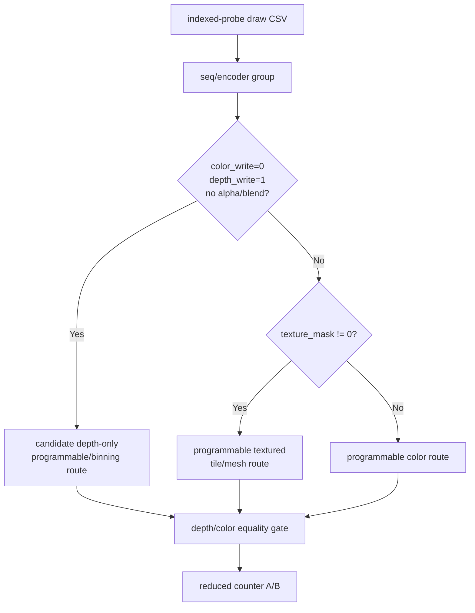
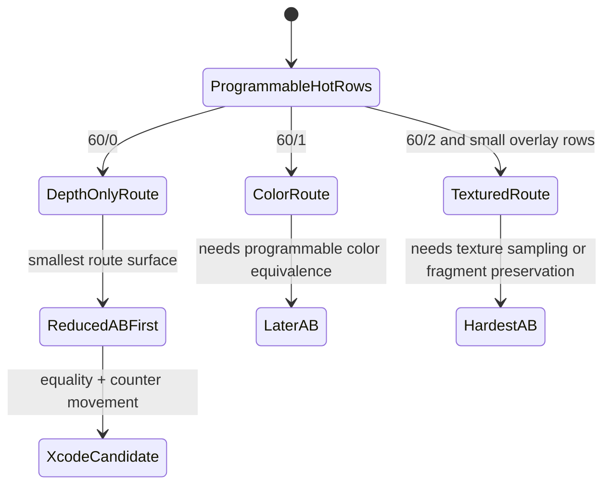

# Programmable Route Feasibility Splits Depth-Only from Textured Hot Rows

**Question / hypothesis.** [hidden-backend-storage-shape.24](hidden-backend-storage-shape.24.md) shows the current
Tile-FFP route cannot cover GT1 hot rows without a programmable/textured route.
Are all hot rows equally hard, or is there a smaller reduced A/B route that can
be tried first?

**Method.**

1. Add `analyze_programmable_route_feasibility.py`.
2. Consume the same-run `3dmark05-perf-indexed-probe-draws.csv`.
3. Group by `seq/encoder` and split primitives into:
   - depth-only candidate (`color_write=0`, depth write on, no alpha blend/test),
   - programmable textured,
   - programmable non-textured color.
4. Report unique VS/PS/PSO counts and texture-mask distribution per row.

**Result.**

Frame60 top-3 programmable route split:

| Row | Verdict | primitives | Depth-only | Textured | Color | Shader shape |
|---|---|---:|---:|---:|---:|---|
| `60/2` | `needs-programmable-textured-route` | `389,376` | `0` | `389,376` (`100%`) | `0` | `14` unique PS; texture masks `0x7f`, `0x3f`, `0x1f` |
| `60/1` | `needs-programmable-color-route` | `228,725` | `0` | `0` | `228,725` (`100%`) | `1` unique PS; texture mask `0x0` |
| `60/0` | `candidate-depth-only-route` | `97,294` | `97,294` (`100%`) | `0` | `0` | `1` unique PS; `color_write=0`, depth-write path |

All frame60 rows:

- `needs-programmable-textured-route`: `7` rows.
- `needs-programmable-color-route`: `1` row.
- `candidate-depth-only-route`: `1` row.

**Verdict.** Accepted as a preflight. The programmable route lane is not one
uniform task. The cheapest meaningful reduced A/B is likely `60/0`
depth-only: it is color-write-off, depth-write-on, no alpha blend/test, and
has one PS shape despite a nonzero texture mask. `60/1` needs a programmable
color route, while `60/2` needs a real textured programmable route and is the
largest but hardest row. The next implementation-oriented step should try a
reduced `60/0` depth-only route/equality gate before attempting a full textured
tile/mesh backend.

**Related.** [hidden-backend-storage](index.md) ·
[hidden-backend-storage-shape.24](hidden-backend-storage-shape.24.md) · [overview-3dmark05-gt1](../overview-3dmark05-gt1.md).
