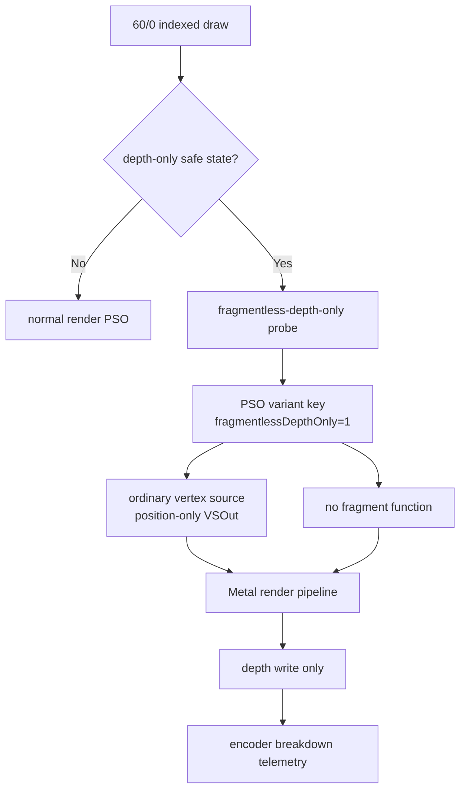
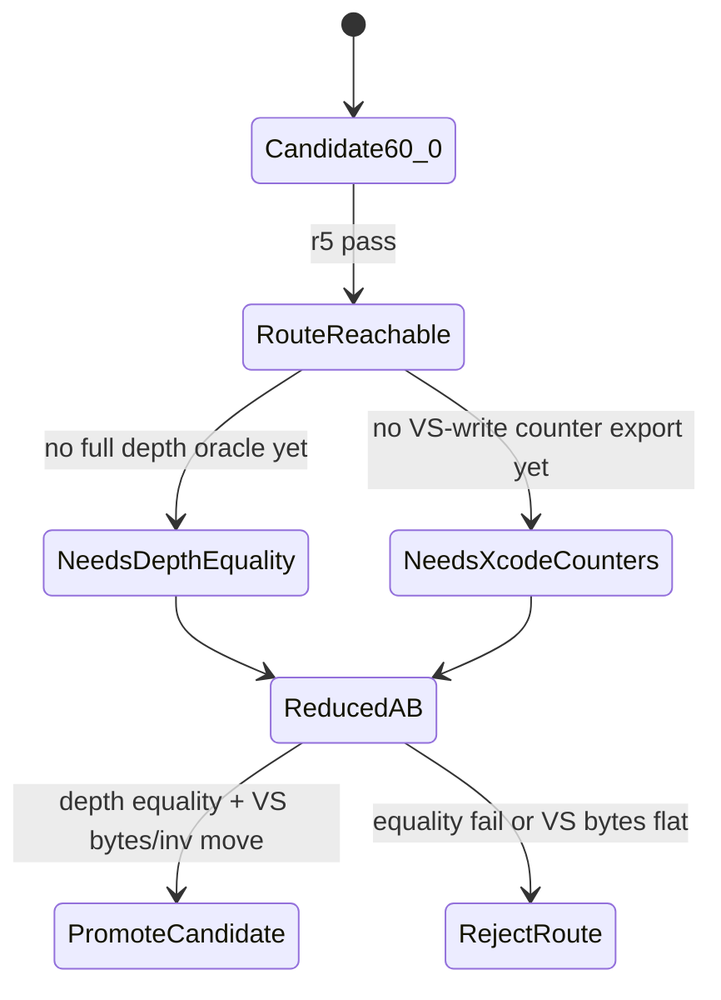

# Fragmentless Depth-Only Route Smoke Reaches the Full 60/0 Pass

**Question / hypothesis.** [[hidden-backend-storage-shape.25]] identifies
`60/0` as the smallest credible backend-route A/B: color writes are disabled,
depth writes are enabled, alpha blend/test are off, and the row is fully
depth-only. Can dxmt9 force a legal Metal render PSO shape that keeps the
ordinary vertex stage but removes the fragment function for this row?

**Method.**

1. Add a diagnostic route gated by `DXMT9_PROBE_FRAGMENTLESS_DEPTH_ONLY`.
2. Limit the state gate to indexed triangle-list draws with:
   - depth/stencil attachment present,
   - depth enabled and depth write enabled,
   - no alpha blend/test, stencil, clip planes, or A2C,
   - solid fill,
   - zero color-write mask on all bound render targets.
3. For accepted draws, bypass the prefetched normal PSO and request a
   fragmentless depth-only shader variant:
   - vertex source is emitted,
   - fragment source/function is omitted,
   - VSOut layout is forced to position-only,
   - the variant key includes `fragmentlessDepthOnly`.
4. Run a row-scoped no-gputrace smoke:

```sh
scripts/tools/run_3dmark05_perf_probe.sh \
  --suffix fragmentless-depth-only-60-0-r5 \
  --frame 60 --no-gputrace --timeout 180 \
  --probe-fragmentless-depth-only-row 60/0
```



**Result.**

The r5 smoke completed normally:

| Field | Value |
|---|---:|
| Run status | `pass` |
| Process elapsed | `126.566s` |
| Presents | `1,680` |
| Encoder lines | `19,954` |
| Indexed probe draw lines | `0` |
| Reject/no-pipeline logs | `0` |

Pipeline-cache decision logging confirmed the requested route was not just an
encoder state-gate counter:

| r5 route-decision log | Count |
|---|---:|
| `fragmentless depth-only probe accepted` | `2` |
| `fragmentless depth-only probe rejected` | `0` |
| `draw skipped: no render pipeline` / `skipped reason=no-pipeline` | `0` |

Only `seq=60, encoder=0` had fragmentless-depth-only hits:

| Row | Draws | Primitives | Vertices | Probe draws | Probe primitives | Probe vertices | VSOut key |
|---|---:|---:|---:|---:|---:|---:|---|
| `60/0` | `42` | `97,294` | `291,882` | `42` | `97,294` | `291,882` | `0x0` |

The earlier class-filtered smoke hit only the `large4096,no-alpha-blend`
subset (`5` draws). Dropping the class filter shows the state gate covers the
entire `60/0` depth-only pass. Route-aware attribution now reports the
position-only layout key (`0x0`) instead of the normal full layout (`0xfff`).
The r5 row also reports `texture_mask_or=0x7f` but
`fragment_texture_binding_samples=0`, `depth_func_lessequal_draws=42`,
`alpha_test_enabled_draws=0`, `alpha_blend_enabled_draws=0`,
`scissor_enabled_draws=0`, and `clip_plane_enabled_draws=0`.

## Current-head repeat

`app-d3d9-3dmark05-fragmentless-depth-only-60-0-current-smoke-r1` repeated the
same row-scoped route after the alpha/effect telemetry work, with
`--encoder-breakdown-seq 60 --measure-index-reuse` added:

```sh
scripts/tools/run_3dmark05_perf_probe.sh \
  --suffix fragmentless-depth-only-60-0-current-smoke-r1 \
  --frame 60 --timeout 180 --no-gputrace \
  --encoder-breakdown-seq 60 --measure-index-reuse \
  --probe-fragmentless-depth-only-row 60/0
```

The repeat passed and preserved the important shape:

| Row | Draws | Primitives | Vertices | Probe draws | Probe primitives | Probe vertices | Alpha/effect overlap |
|---|---:|---:|---:|---:|---:|---:|---|
| `60/0` | `42` | `97,294` | `291,882` | `42` | `97,294` | `291,882` | `0` alpha-blend, `0` screen, `0` alpha-composite |
| `60/2` | `187` | `389,376` | `1,168,128` | `0` | `0` | `0` | `145` alpha-blend, `103` screen, `42` alpha-composite |
| `60/8` | `5` | `26` | `78` | `0` | `0` | `0` | `4` alpha-composite, `4` textured/small |

The pipeline cache logged `2` fragmentless-depth-only accepts and no
no-pipeline skips. This repeat confirms the `60/0` reduced route remains
isolated from the alpha/effect rows: it is still a depth-only backend-shape
candidate, not a rifle-bloom or alpha-material fix.



**Verdict.** Accepted as a runtime route smoke, not as a performance win. The
experiment proves the first reduced backend-route precondition: dxmt9 can
isolate the current `60/0` depth-only row and compile/run it through a
fragmentless, position-only render pipeline without reject or no-pipeline
errors. It does **not** yet prove visual/depth equivalence or that the Apple
hidden VS/tiler/parameter storage denominator moved. The r5 run was visually
reported as sharper because subtle texture-over haze/blur and bloom-like
coverage appeared to disappear. Because `60/0` writes no color, that
observation would most likely mean a changed depth prepass result or a changed
downstream depth-dependent coverage/postprocess, not a direct color write by
this route. Time-based
`actual.png` screenshots are different animation frames (`r5` shows
`Frame 1014`, the `v0.0.1` visual anchor shows `Frame 351`), so they are useful
only as broad triage. The next proof requires same-input/depth/color equality
and an Xcode `.gputrace` counter export for the same row. If Xcode still reports
flat `VS Buffer Device Memory Bytes Written` per invocation, the fragmentless
route joins live-VSOut and stream/IB staging as another rejected denominator
mechanism.

**Meaning for the goal.** This is why the ongoing experiment matters: it turns
the broad "M1 hardware should be faster" concern into a controlled yes/no test
of one legal below-visible backend shape. It is intentionally scoped to `60/0`;
it cannot explain or fix the larger `60/2` textured row, and it should not be
promoted into `perf` until equality and Xcode counter movement both pass.

**Related.** [[hidden-backend-storage]] ·
[[hidden-backend-storage-shape.25]] · [[overview-3dmark05-gt1]].
