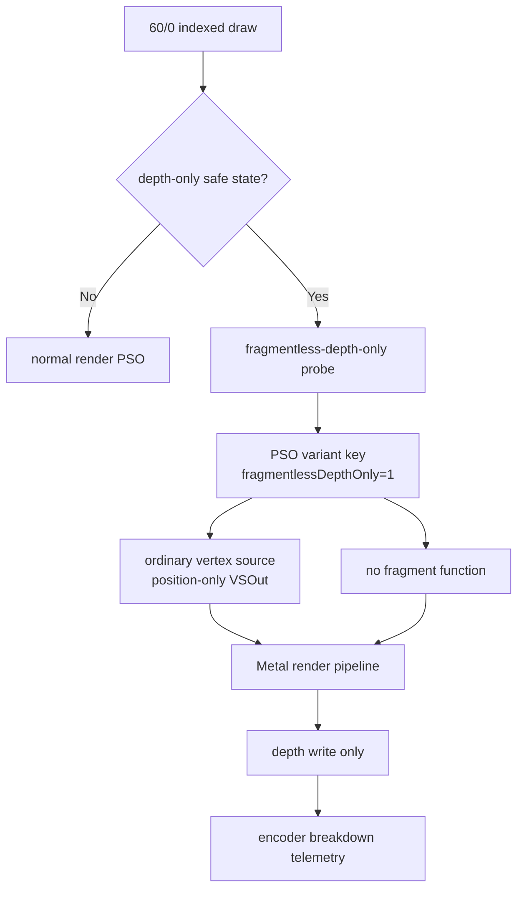
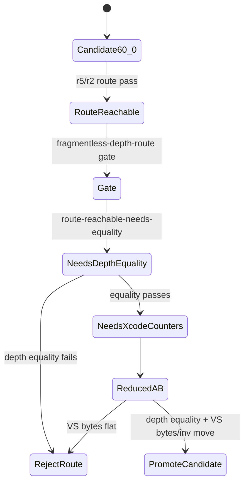

# Fragmentless Depth-Only Route Smoke Reaches the Full 60/0 Pass

**Question / hypothesis.** [hidden-backend-storage-shape.25](hidden-backend-storage-shape.25.md) identifies
`60/0` as the smallest credible backend-route A/B: color writes are disabled,
depth writes are enabled, alpha blend/test are off, and the row is fully
depth-only. Can dxmt9 force a legal Metal render PSO shape that keeps the
ordinary vertex stage but removes the fragment function for this row?

**Method.**

1. Add a diagnostic route gated by `DXMT9_PROBE_FRAGMENTLESS_DEPTH_ONLY`.
2. Limit the state gate to indexed triangle-list draws with:
   - depth/stencil attachment present,
   - depth enabled and depth write enabled,
   - no alpha blend/test, stencil, clip planes, or A2C,
   - solid fill,
   - zero color-write mask on all bound render targets.
3. For accepted draws, bypass the prefetched normal PSO and request a
   fragmentless depth-only shader variant:
   - vertex source is emitted,
   - fragment source/function is omitted,
   - VSOut layout is forced to position-only,
   - the variant key includes `fragmentlessDepthOnly`.
4. Run a row-scoped no-gputrace smoke:

```sh
scripts/tools/run_3dmark05_perf_probe.sh \
  --suffix fragmentless-depth-only-60-0-r5 \
  --frame 60 --no-gputrace --timeout 180 \
  --probe-fragmentless-depth-only-row 60/0
```



**Result.**

The r5 smoke completed normally:

| Field | Value |
|---|---:|
| Run status | `pass` |
| Process elapsed | `126.566s` |
| Presents | `1,680` |
| Encoder lines | `19,954` |
| Indexed probe draw lines | `0` |
| Reject/no-pipeline logs | `0` |

Pipeline-cache decision logging confirmed the requested route was not just an
encoder state-gate counter:

| r5 route-decision log | Count |
|---|---:|
| `fragmentless depth-only probe accepted` | `2` |
| `fragmentless depth-only probe rejected` | `0` |
| `draw skipped: no render pipeline` / `skipped reason=no-pipeline` | `0` |

Only `seq=60, encoder=0` had fragmentless-depth-only hits:

| Row | Draws | Primitives | Vertices | Probe draws | Probe primitives | Probe vertices | VSOut key |
|---|---:|---:|---:|---:|---:|---:|---|
| `60/0` | `42` | `97,294` | `291,882` | `42` | `97,294` | `291,882` | `0x0` |

The earlier class-filtered smoke hit only the `large4096,no-alpha-blend`
subset (`5` draws). Dropping the class filter shows the state gate covers the
entire `60/0` depth-only pass. Route-aware attribution now reports the
position-only layout key (`0x0`) instead of the normal full layout (`0xfff`).
The r5 row also reports `texture_mask_or=0x7f` but
`fragment_texture_binding_samples=0`, `depth_func_lessequal_draws=42`,
`alpha_test_enabled_draws=0`, `alpha_blend_enabled_draws=0`,
`scissor_enabled_draws=0`, and `clip_plane_enabled_draws=0`.

## Current-head repeat

`app-d3d9-3dmark05-fragmentless-depth-only-60-0-current-smoke-r1` repeated the
same row-scoped route after the alpha/effect telemetry work, with
`--encoder-breakdown-seq 60 --measure-index-reuse` added:

```sh
scripts/tools/run_3dmark05_perf_probe.sh \
  --suffix fragmentless-depth-only-60-0-current-smoke-r1 \
  --frame 60 --timeout 180 --no-gputrace \
  --encoder-breakdown-seq 60 --measure-index-reuse \
  --probe-fragmentless-depth-only-row 60/0
```

The repeat passed and preserved the important shape:

| Row | Draws | Primitives | Vertices | Probe draws | Probe primitives | Probe vertices | Alpha/effect overlap |
|---|---:|---:|---:|---:|---:|---:|---|
| `60/0` | `42` | `97,294` | `291,882` | `42` | `97,294` | `291,882` | `0` alpha-blend, `0` screen, `0` alpha-composite |
| `60/2` | `187` | `389,376` | `1,168,128` | `0` | `0` | `0` | `145` alpha-blend, `103` screen, `42` alpha-composite |
| `60/8` | `5` | `26` | `78` | `0` | `0` | `0` | `4` alpha-composite, `4` textured/small |

The pipeline cache logged `2` fragmentless-depth-only accepts and no
no-pipeline skips. This repeat confirms the `60/0` reduced route remains
isolated from the alpha/effect rows: it is still a depth-only backend-shape
candidate, not a rifle-bloom or alpha-material fix.

After cleanup removed the old current-smoke output directory, the same
current-head preflight was regenerated as
`app-d3d9-3dmark05-fragmentless-depth-only-60-0-current-smoke-r2`:

```sh
scripts/tools/run_3dmark05_perf_probe.sh \
  --suffix fragmentless-depth-only-60-0-current-smoke-r2 \
  --frame 60 --timeout 180 --no-gputrace \
  --encoder-breakdown-seq 60 --measure-index-reuse \
  --probe-fragmentless-depth-only-row 60/0
```

The app hit the final-frame watchdog and exited `124`, but this was a wrapper
timeout with complete postprocess artifacts, not a manual kill. The summary was
synthesized from `dxmt9.log`, reached `present_encoded=1680`, and reports
`draw_skipped_no_pipeline=0`, `gpu_command_buffer_errors=0`, and the same
route-decision split (`2` accepts, `0` rejects, `0` no-pipeline logs). The row
gate output is now explicit:

- `traces/app-d3d9-3dmark05-fragmentless-depth-only-60-0-current-smoke-r2/analysis/fragmentless-depth-route-gate.md`
- `traces/app-d3d9-3dmark05-fragmentless-depth-only-60-0-current-smoke-r2/analysis/fragmentless-depth-route-gate.csv`

| Gate | Current r2 value |
|---|---:|
| Overall verdict | `route-reachable-needs-equality` |
| Xcode/gputrace readiness | `blocked-needs-equality` |
| Route status | `passed-route` |
| Draw / primitive / vertex coverage | `100.000000%` / `100.000000%` / `100.000000%` |
| Target draws / primitives / vertices | `42` / `97,294` / `291,882` |
| Probe draws / primitives / vertices | `42` / `97,294` / `291,882` |
| VSOut layout | `0x0` |
| Equality status | `missing-equality` |
| Counter status | `missing-counters` |

This makes the promotion rule machine-readable: the route is reachable, but it
is **not** ready for another GT1 Xcode/gputrace spend until a same-input
depth/color equality artifact exists. Once equality passes, the next Xcode
counter export must compare baseline and treatment `60/0` and reject the route
if `VS Buffer Device Memory Bytes Written / VS Invocations` stays flat.

## Same-input equality gate

`app-d3d9-3dmark05-fragmentless-depth-only-60-0-equality-baseline-r1` and
`app-d3d9-3dmark05-fragmentless-depth-only-60-0-equality-treatment-r1` repeated
frame 60 with the same capture and attachment sidecars, then compared the final
frame, `60/0` pass-end color, and `60/0` pass-end depth:

- `traces/app-d3d9-3dmark05-fragmentless-depth-only-60-0-equality-compare-r1/analysis/frame60-capture-equality.csv`
- `traces/app-d3d9-3dmark05-fragmentless-depth-only-60-0-equality-compare-r1/analysis/frame60-enc0-color-equality.csv`
- `traces/app-d3d9-3dmark05-fragmentless-depth-only-60-0-equality-compare-r1/analysis/frame60-enc0-depth-equality.csv`
- `traces/app-d3d9-3dmark05-fragmentless-depth-only-60-0-equality-compare-r1/analysis/fragmentless-depth-route-gate-with-equality.md`

The route still reaches the full row, but equality fails:

| Artifact | Result |
|---|---:|
| Gate verdict | `blocked-equality-fail` |
| Xcode/gputrace readiness | `blocked-equality` |
| Final frame color | `170,328 / 786,432` changed pixels (`21.658325%`), max delta `252`, SSIM `0.998977` |
| `60/0` pass-end color | `0 / 3,145,728` changed bytes, metadata compatible |
| `60/0` pass-end depth | `1,252,096 / 3,145,728` changed bytes (`39.803060%`), max delta `255`, metadata compatible `D24X8` |

The color sidecar result is important: this row writes no color, and the
fragmentless path does not directly change the `60/0` color attachment. The
depth sidecar does change materially, so the downstream final-frame difference
is consistent with a changed depth prepass or depth-dependent coverage/post
path. This is not safe to send to Xcode counters as a performance candidate.
The next work, if this route remains interesting, is to explain why the
fragmentless/position-only path changes depth before measuring hidden backend
bytes.



**Verdict.** Accepted as a runtime route smoke, rejected as a performance
promotion candidate. The experiment proves the first reduced backend-route
precondition: dxmt9 can isolate the current `60/0` depth-only row and
compile/run it through a fragmentless, position-only render pipeline without
reject or no-pipeline errors. The same-input equality gate then proves this
particular shortcut is not semantically equivalent: `60/0` color is exact, but
`60/0` depth changes and the final frame changes. The route should not receive
another GT1 Xcode/gputrace counter spend until the depth difference is explained
and fixed. If a corrected route later passes equality, the Xcode counter gate
still has to show `VS Buffer Device Memory Bytes Written / VS Invocations`
movement before the backend-denominator claim can be promoted.

**Meaning for the goal.** This is why the ongoing experiment matters: it turns
the broad "M1 hardware should be faster" concern into a controlled yes/no test
of one legal below-visible backend shape. The current answer for this route is
"reachable but wrong depth." It is intentionally scoped to `60/0`; it cannot
explain or fix the larger `60/2` textured row, and it should not be promoted
into `perf` until equality and Xcode counter movement both pass.

**Related.** [hidden-backend-storage](index.md) ·
[hidden-backend-storage-shape.25](hidden-backend-storage-shape.25.md) · [overview-3dmark05-gt1](../overview-3dmark05-gt1.md).
