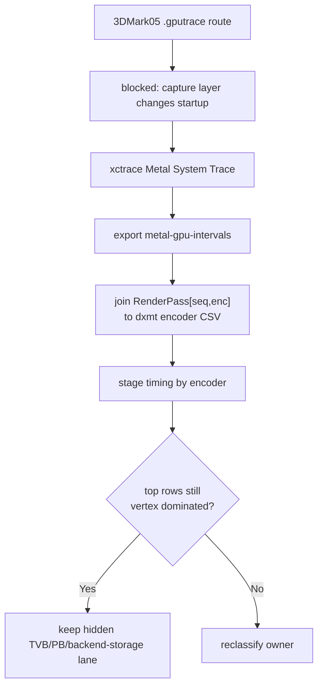

# Metal System Trace Keeps the Post-Compact Bottleneck Vertex-Stage Dominated

**Question / hypothesis.** After the draw-state submission compaction work, did
the residual 3DMark05 GT1 bottleneck move away from the hidden
vertex/backend-storage lane, or is the top GPU shape still dominated by large
indexed vertex-stage work?

**Method.**

1. Use `xctrace Metal System Trace` instead of `.gputrace` replay counters,
   because [baselines-gputrace-capture.01](../baselines/baselines-gputrace-capture.01.md) shows capture-layer-inserted
   3DMark05 startup is an invalid evidence path.
2. Export `metal-gpu-intervals`.
3. Join Instruments encoder labels back to dxmt attribution rows with
   `scripts/tools/summarize_xctrace_metal_intervals.py`.
4. Extend that sidecar with primitive-class labels and normalized
   `xctrace_vertex_ms_per_mvertex` / `xctrace_stage_ms_per_mvertex` columns so
   row shape can be compared without relying only on raw totals.
5. Emit aggregate tables by primitive class and render-pass end reason.
6. Add optional `--indexed-probe-draws` route verdict joins. The current
   `phase43` and `post-compact-state` artifacts have header-only
   `3dmark05-perf-indexed-probe-draws.csv` files, so this pass records the
   route verdict as unavailable rather than inventing a depth-only/textured
   answer.
7. For new captures, use `scripts/tools/run_3dmark05_system_trace_sidecar.sh`
   so the probe wrapper dry-run gates locked sessions before `xctrace` starts,
   requires RenderPass-labelled xctrace rows and high dxmt encoder join
   coverage, and pass `--measure-index-reuse` to populate the draw telemetry
   required by route verdict joins. Current wrappers add
   `--require-indexed-probe-routes` when indexed telemetry is requested, so a
   route-selection run fails if the probe CSV is header-only or does not join
   the captured encoder rows.
8. Compare the current-head `phase43` sidecar with the post compact-state
   sidecar. Treat absolute totals as capture-window evidence only, not as a
   strict A/B, because the two traces cover different scene phases and seq
   ranges.

**Result.**

| Run | Joined rows | Seq range | Stage sum | Vertex | Fragment | Vertex share | Top row |
|---|---:|---|---:|---:|---:|---:|---|
| `phase43-xctrace-system-r1` | `3590/3590` | `1394..1593` | `9303.143ms` | `8495.658ms` | `807.485ms` | `91.32%` | `1547/11`, `21.459ms`, `1,859,712` vertices |
| `post-compact-state-r1` | `2482/2482` | `1154..1389` | `6346.966ms` | `5701.647ms` | `645.319ms` | `89.83%` | `1155/1`, `20.002ms`, `1,149,930` vertices |

The post-compact top rows are still large indexed render encoders ending on
`rt_change`. The top 12 rows are `15.927..20.002ms`; each has roughly
`1.03M..1.15M` vertices and only `0.507..0.646ms` fragment time except one
`0.882ms` fragment row. The regenerated sidecar reports top-30
`opaque-depth-indexed=30` and vertex cost
`mean=13.856`, `p50=13.433`, `p95=16.037`, `p99=16.799` ms per million
submitted vertices. This is not just a top-30 artifact: the full post-compact
System Trace aggregate puts `68.25%` of stage time in `opaque-depth-indexed`
rows (`4331.797ms`, `93.05%` vertex share) and another `30.00%` in
`alpha-blend-indexed` rows (`1904.276ms`, `85.34%` vertex share). By end
reason, `rt_change` owns `79.52%` of stage time (`5046.931ms`, `92.10%`
vertex share), with `clear` at `19.95%` and `present` at `0.53%`.
The route verdict column is intentionally `route-unavailable` for these two
sidecars because their indexed probe draw CSVs contain only headers. The next
System Trace sidecar that is meant to select a backend route must be paired
with indexed draw telemetry, then rerun this summarizer with
`--indexed-probe-draws --require-indexed-probe-routes`. Use
`run_3dmark05_system_trace_sidecar.sh -- --no-gputrace --measure-index-reuse`
for that follow-up so a locked desktop cannot produce another empty
all-processes trace or another silent `route-unavailable` sample.

The matching run-level counters remain clean for correctness/perf triage:

| Counter | `phase43` | `post-compact-state-r1` | Delta |
|---|---:|---:|---:|
| `present_encoded` | `1740` | `1740` | `0` |
| `draw_calls` | `1,280,570` | `1,267,231` | `-1.04%` |
| `render_pass_begin` | `20,423` | `20,225` | `-0.97%` |
| `render_split_rt_change` | `13,634` | `13,610` | `-0.18%` |
| `render_pass_tile_preservation_bytes` | `218,580,377,600` | `216,510,742,528` | `-0.95%` |
| `gpu_command_buffer_time_ms` | `5707.556` | `5298.726` | `-7.16%` |
| `gpu_command_buffer_errors` | `0` | `0` | `0` |
| `commit_chunk_queue_draw_submission_cpu_ms` | `8087.916` | `8219.521` | `+1.63%` |
| `d3d9_snapshot_draw_submission_cpu_ms` | `6570.182` | `6670.192` | `+1.52%` |

The CPU compaction comparison against the resource-mark baseline is still a CPU
state-width win, but it did not create a new GPU-facing mechanism: the separate
post-compact comparison reports tile preservation `-4.40%` and GPU command
buffer time `-3.11%` while `encode_draw_cpu_ms` and `submit_draw_cpu_ms`
increase slightly. That is not strong enough to claim a GPU denominator fix.

**Limitations.**

- This is not Xcode replay-counter proof. It does not expose `VS Buffer Device
  Memory Bytes Written`, primitive-block counters, tiler utilization, or buffer
  write limiter columns.
- The two System Trace captures cover different seq ranges. Compare shape and
  ownership, not absolute total time.
- The `phase43` top rows are alpha-blend large indexed rows, while the
  `post-compact` top rows are opaque depth-write large indexed rows. That
  phase difference reinforces the need for row-scoped/reduced A/B before
  promoting any mechanism.
- Depth-only/textured/color route verdicts are not available for these existing
  System Trace artifacts because the indexed probe draw CSVs are header-only.
  A route-selection run must include indexed draw telemetry and require a route
  join before this sidecar can choose the reduced backend route.

**Verdict.** Accepted as sidecar evidence. The usable trace path confirms the
post-compact residual is still vertex-stage dominated and concentrated in large
indexed, RT-changing render encoders, primarily opaque-depth indexed rows in
this capture window. Keep the next GPU work in the hidden TVB /
primitive-binning / backend-route lane, and keep CPU submit/snapshot compaction
in the no-gputrace counter lane. Do not spend another 3DMark05 `.gputrace`
attempt until a capture route avoids capture-layer startup mutation or an
attach-after-normal-start path is proven.
