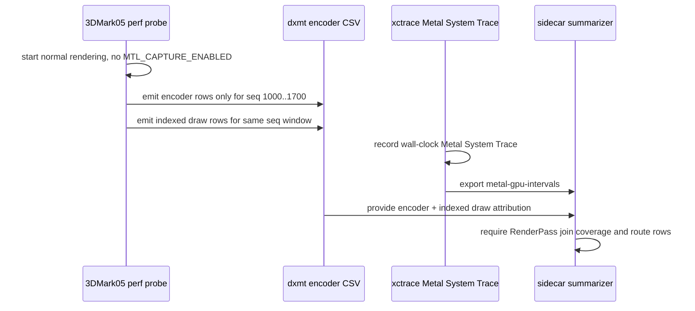

# Seq-Range System Trace Sidecar Adds Route Verdicts Without Capture-Layer Startup Mutation

**Question / hypothesis.** Can the 3DMark05 GT1 perf workflow get a usable
Metal timing trace with per-encoder route attribution while `.gputrace` capture
is blocked by capture-layer startup mutation?

**Method.**

1. Use the normal-rendering no-gputrace path, not `MTL_CAPTURE_ENABLED=1`.
2. Run `scripts/tools/run_3dmark05_system_trace_sidecar.sh` with
   `--measure-index-reuse`, `--frame-sampling`, and
   `--encoder-breakdown-seq-range 1000:1700`.
3. Record a 25s `xcrun xctrace record --template 'Metal System Trace'
   --all-processes` sidecar after a 75s delay.
4. Export `metal-gpu-intervals` and join back to dxmt
   `RenderPass[seq=...,enc=...]` labels.
5. Join the same run's indexed draw telemetry so the summary can classify rows
   as depth-only, programmable color, programmable textured, or mixed route
   candidates.

**Important tooling correction.** The first seq-range attempt looked like a
runtime regression because it drew only about one frame every several seconds.
That was not a GT1 renderer result. The installed Wine unix provider was stale:
`install_heroic_wine.sh` rebuilt PE postprocess artifacts, but did not build
`build-x86_64-builtin/src/winemetal/unix/winemetal.so` before copying it into
the Wine root. The stale provider did not contain the new
`DXMT9_PERF_ENCODER_BREAKDOWN_SEQ_MIN/MAX` filter, so encoder and
indexed-probe rows started at `seq=2` and the log grew hundreds of MiB. The
install script now builds the unix provider target before copying it; the
accepted run below proves the range filter reached the active `winemetal.so`.

**Result.**

| Metric | Value |
|---|---:|
| Joined xctrace rows | `215/215` |
| Captured xctrace seq range | `1005..1024` |
| Indexed probe rows | `29,549` |
| Indexed probe seq range | `1000..1035` |
| Indexed probe rows outside requested range | `0` |
| Stage sum | `650.195ms` |
| Vertex stage | `577.770ms` |
| Fragment stage | `72.425ms` |
| Vertex share | `88.86%` |
| Frame-sampled FPS p50 / p95 | `18.6955` / `26.18575` |

The route verdicts are no longer `route-unavailable`:

| Route group | Rows | Stage share | Vertex share | Draws | Vertices |
|---|---:|---:|---:|---:|---:|
| `needs-programmable-color-route` | `51` | `45.65%` | `95.95%` | `6,073` | `28,654,965` |
| `needs-programmable-textured-route` | `144` | `40.49%` | `81.06%` | `6,381` | `26,688,369` |
| `mixed-programmable-route` | `17` | `12.02%` | `87.19%` | `2,716` | `10,421,448` |
| `candidate-depth-only-route` | `3` | `1.85%` | `95.59%` | `69` | `771,030` |

By primitive class, the run is still large-indexed and vertex dominated:

| Primitive class | Rows | Stage share | Vertex share | Draws | Vertices |
|---|---:|---:|---:|---:|---:|
| `opaque-depth-indexed` | `71` | `59.51%` | `94.17%` | `8,858` | `39,847,443` |
| `alpha-blend-indexed` | `42` | `36.52%` | `82.78%` | `6,210` | `26,058,132` |
| `other-primitive` | `102` | `3.97%` | `65.22%` | `171` | `630,237` |

The top row is `1023/11`, an alpha-blend indexed textured route:
`15.656ms` stage time, `15.100ms` vertex, `0.556ms` fragment, `539` draws,
`615,253` triangles, and `1,845,759` submitted vertices. The next rows mix
opaque-depth programmable-color and alpha-blend programmable-textured work, but
the common owner remains large indexed vertex-stage work.

The independent programmable-route feasibility pass on the same indexed draw
CSV reports overall verdict `needs-programmable-textured-route`: `281` rows are
dominated by programmable textured draws. Its largest rows are `/11`, `/4`, and
`/2` textured rows, all with `100%` textured primitives and many unique pixel
shader variants. The repeated color-only rows are simpler (`unique PS = 1`) and
are the better reduced route prototype, but they are not the largest residual
route class in this sidecar.

**Interpretation.**

- This is the first accepted System Trace sidecar in this chain with route
  verdicts attached to the same captured encoder rows.
- The route split changes the next backend-route priority: the captured window
  is dominated by programmable color and programmable textured routes, while
  pure depth-only work is only `1.85%` of stage time in this sidecar.
- The depth-only fragmentless route remains useful as a reduced semantic route
  test, but it is not enough to explain or remove the current residual by
  itself. The hard path is a programmable color/textured backend route or
  another mechanism that reduces VS invocations / hidden TVB pressure without
  breaking final color.
- This sidecar remains timing/label evidence, not an Xcode replay-counter
  replacement. It cannot report `VS Buffer Device Memory Bytes Written`, TVB/PB
  bytes, primitive blocks, or limiter columns.

**Verdict.** Accepted as sidecar evidence. The normal-rendering System Trace
path is now usable for route-attributed timing while 3DMark05 `.gputrace`
capture is blocked. The current residual is still vertex-stage dominated and
large-indexed, but the route evidence says the next GPU-facing implementation
work should not focus only on depth-only rows: it must account for programmable
color and textured rows as the larger owners.
