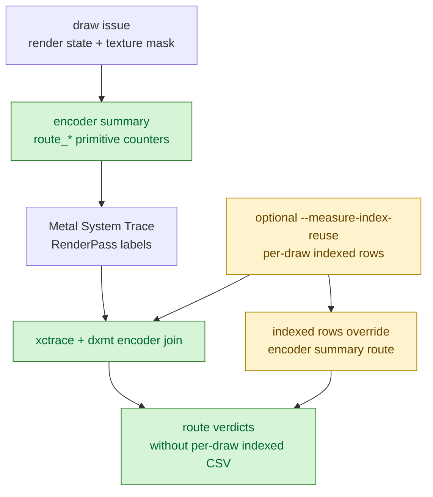

# Encoder-Summary Route Counters Remove Indexed Per-Draw Requirement From Sidecars

**Question / hypothesis.** The accepted seq-range System Trace sidecar
([[hidden-backend-storage-shape.28]]) proved route-attributed timing, but it
needed indexed per-draw telemetry. That can make a sidecar log large enough to
distort runtime FPS tails. Can route verdicts be produced from one encoder
summary row instead?

**Implementation.** `DXMT9_PERF_ENCODER_BREAKDOWN=1` now emits route-level
aggregate counters directly on `[dxmt9-perf-encoder]` rows:

- `route_depth_only_*` for depth-write, color-write-off, no alpha-blend/test
  draws.
- `route_programmable_textured_*` for non-depth-only draws with texture
  bindings.
- `route_programmable_color_*` for the remaining non-depth-only draws.
- `route_alpha_blend_primitives` and `route_alpha_test_primitives` so the
  existing route verdict classifier can still detect order-dependent fragment
  shapes.

`summarize_xctrace_metal_intervals.py` now loads these encoder-summary route
fields and emits route verdicts without `3dmark05-perf-indexed-probe-draws.csv`
draw rows. Indexed probe rows still override the summary when present, so the
existing detailed route evidence remains compatible. The sidecar wrapper now
requires a generic route verdict (`--require-route-verdicts`) instead of
requiring indexed probe rows.

**Verification.**

- `test_summarize_xctrace_metal_intervals.py` covers both paths:
  encoder-summary route verdicts without indexed CSV, and indexed-probe rows
  overriding the summary.
- `test_3dmark05_probe_scripts.py -k system_trace_sidecar` verifies the sidecar
  dry-run prints `--require-route-verdicts`.
- `meson compile -C build-arm64-nowine` compiles the new encoder counters and
  `fprintf` fields.
- Re-running the existing no-indexed route sidecar summary for
  `app-d3d9-3dmark05-systemtrace-route-summary-r1-20260613` now passes
  `--require-route-verdicts` with `route_source=encoder-summary` on
  `1633/1633` joined rows. The perf run itself is `status: pass`, with
  `5352` encoder rows, `0` indexed probe draw lines, and a header-only
  `3dmark05-perf-indexed-probe-draws.csv`.

Observed sidecar timing split:

| Route verdict | Rows | Stage time | Stage share | Vertex share |
|---|---:|---:|---:|---:|
| `needs-programmable-color-route` | `197` | `2730.848ms` | `57.04%` | `96.11%` |
| `needs-programmable-textured-route` | `1259` | `1398.804ms` | `29.22%` | `86.92%` |
| `mixed-programmable-route` | `157` | `581.645ms` | `12.15%` | `83.96%` |
| `candidate-depth-only-route` | `20` | `76.541ms` | `1.60%` | `93.19%` |

The full joined window remains vertex dominated: `4787.837ms` stage time,
`4400.226ms` vertex (`91.90%`) and `387.611ms` fragment (`8.10%`).
Artifact size also confirms the intended overhead reduction: the regenerated
run keeps `dxmt9.log` at `62MiB`, the indexed probe CSV at `4KiB`, and the
encoder CSV at `5.6MiB`, instead of requiring tens of thousands of indexed
per-draw rows for route selection.

**Verdict.** Accepted as tooling/instrumentation. This is not a performance
optimization by itself and does not change the hidden backend-storage owner.
It reduces the measurement cost of the next System Trace route sidecar: route
selection no longer needs indexed per-draw logging unless exact draw selectors
or index-cache metrics are required. This directly addresses the FPS-tail
caveat captured in [[baselines-frame60.04]]. The no-indexed sidecar gate is now
verified: route verdict coverage comes from `route_source=encoder-summary`, not
from indexed probe telemetry.

**Next gate.** Use this route-summary sidecar as the default timing fallback
while `.gputrace` capture remains blocked. The next performance experiment
should spend effort on a route implementation/equality/counter A/B, not on
restoring indexed route telemetry. The route split says the dominant remaining
timing work is programmable color/textured, while depth-only is a small
reduced-route proving ground.
