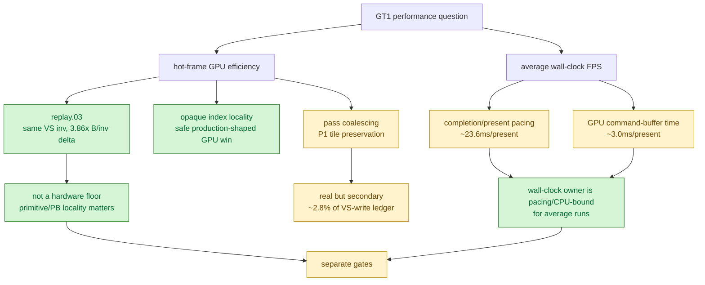

# GPU Efficiency Ceiling Is Separate From Wall-Clock FPS Ownership

**Question / hypothesis.** Does the current evidence mean the M1 GPU is at its
hardware floor for 3DMark05 GT1, or is the wall-clock FPS limit simply not the
same question as the hot-frame GPU efficiency limit?

**Result.** These are two separate questions with different answers.

| Question | Answer | Load-bearing evidence |
|---|---|---|
| Is the hidden VS/TVB write bucket already at the GPU floor? | No. Primitive order/locality can collapse bytes per invocation without materially changing invocation count. | mini-replay-bisection-replay.03 |
| Is pass coalescing the proof of that `~3x` hidden-write headroom? | No. Pass coalescing is a P1 tile-preservation lever, not the P0 TVB/PB denominator proof. | render-pass-store-coalesce.04 |
| Does reducing GPU hot-frame cost necessarily move average wall-clock FPS? | No. Current no-gputrace runs spend much more wall-clock time in completion/present pacing than in GPU command-buffer execution. | state-churn-encode-encode-phase.42, [present-pacing](../present-pacing/index.md) |

The strongest "not a GPU floor" proof is the 113-draw mini-replay control:

| Case | VS invocations | VS B / invocation | Reading |
|---|---:|---:|---|
| 113-draw replay, original order | `668,929` | `1710.0` | Reproduces the hot-row memory-pressure class. |
| sorted-row control | `667,944` | `442.6` | Similar invocation count, far lower hidden write density. |

The invocation count changes by only `-0.15%`, while hidden write density drops
`3.86x`. That makes primitive/PB locality a real backend-efficiency lever and
rejects the claim that the measured hot-row VS-write density is an M1 hardware
floor.

This does **not** make GPU locality a guaranteed average-FPS lever. Current
run-level counters show a different wall-clock owner. In the phase-42
no-gputrace scout, `gpu_command_buffer_time_ms` is about `5.45s` over `1800`
presents (`~3.0ms/present`), while `completion_wait_ms` is about `42.5s`
(`~23.6ms/present`). Those counters should not be read as a literal GPU busy
percentage, because completion waits include present/completion token pacing,
driver scheduling, and CPU submit cadence. They do prove the narrower claim:
average wall-clock FPS is not explained by GPU execution time alone.

**Decision rule.**

- Use Xcode/gputrace counter captures to answer **hot-frame GPU efficiency**
  questions: `VS Buffer Device Memory Bytes Written`, VS invocations, GPU time,
  and route-specific timing.
- Use no-gputrace counters and System Trace sidecars to answer **wall-clock FPS**
  questions: completion/present waits, encode CPU, queue submission cadence, and
  frame-sampling shape.
- Do not reject primitive/PB locality work because average FPS is pacing-bound;
  it still answers whether the GPU hot-frame path is efficient.
- Do not promote primitive/PB locality as a broad FPS fix unless the same run
  also moves completion/present pacing or removes enough CPU/submit latency to
  expose the GPU path.

**Verdict.** Accepted as a gate. The phrase "GPU best possible" is rejected in
two independent senses: the hot-row GPU path has demonstrated hidden-write
density headroom, and the average run is not GPU-execution-bound. The next work
must keep those axes separate: GPU locality/equality/counter A/B for the hot
frame, and CPU/pacing attribution for average FPS.

**Related.** [hidden-backend-storage](index.md) · mini-replay-bisection-replay.03 ·
render-pass-store-coalesce.04 · [index-cache-locality](../index-cache-locality/index.md) ·
[present-pacing](../present-pacing/index.md) · [overview-3dmark05-gt1](../overview-3dmark05-gt1.md)
