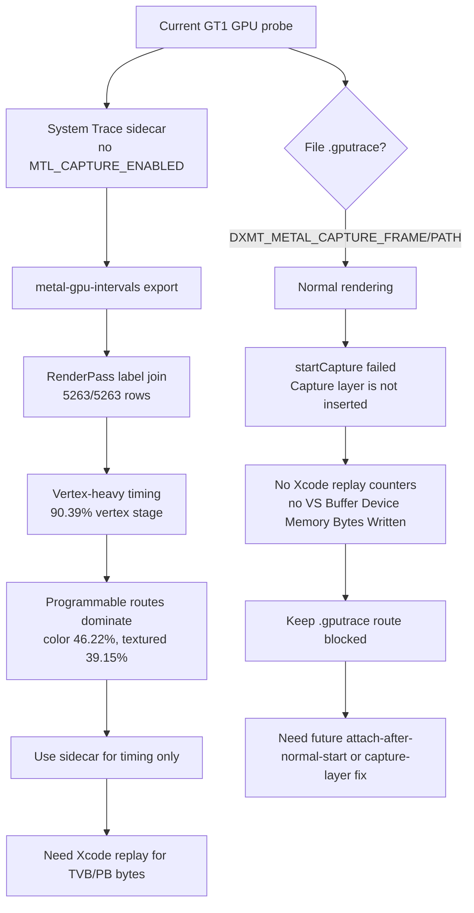

# Current System Trace Refresh Reconfirms Vertex-Heavy Programmable Routes While Gputrace Remains Layer-Blocked

> **Outdated — every artifact this leaf cites in `source:` is gone from disk.** The numbers below cannot be re-derived or re-checked. Kept as history; do not cite it as current evidence.

**Question / hypothesis.** After the latest CPU/profile cleanup work, can the
current tree produce a usable 3DMark05 GT1 `.gputrace`, or must GPU timing still
use the Metal System Trace sidecar path?

**Gputrace result.** The supervised file-capture run rendered normally but did
not write `frame120.gputrace`:

```sh
bash scripts/tools/run_3dmark05_perf_probe.sh \
  --suffix gputrace-current-refresh-r1-20260615 \
  --frame 120 --timeout 420
```

The run itself reached GT1 and wrote a normal screenshot with visible bloom,
particles, rifle/machine-gun effects, and HUD. The capture failed at the
expected precondition:

| Field | Value |
|---|---|
| Run id | `app-d3d9-3dmark05-gputrace-current-refresh-r1-20260615` |
| App status | `pass` |
| Capture path | `traces/app-d3d9-3dmark05-gputrace-current-refresh-r1-20260615/frame120.gputrace` |
| Capture output | missing |
| Log error | `MTLCaptureError error_code=1`, `Capture layer is not inserted` |
| Destination | `gpuTraceDocument` / `destination=2` |
| Destination supported | `0` |

This is a capture-layer failure, not renderer failure. It matches the existing
capture workflow gate: file `.gputrace` capture still needs an inserted Apple
capture layer, while the known 3DMark05 capture-layer insertion routes either
fail the same precondition or black-screen before draw/present.

**System Trace fallback.** The normal-rendering sidecar path succeeds:

```sh
bash scripts/tools/run_3dmark05_system_trace_sidecar.sh \
  --record-delay-sec 75 --time-limit-sec 25 --summary-top 10 -- \
  --suffix systemtrace-current-refresh-r1-20260615 \
  --frame 120 --no-gputrace --timeout 120
```

Artifacts:

- `traces/app-d3d9-3dmark05-systemtrace-current-refresh-r1-20260615/metal-system.trace`
- `traces/app-d3d9-3dmark05-systemtrace-current-refresh-r1-20260615/analysis/metal-gpu-intervals.xml`
- `traces/app-d3d9-3dmark05-systemtrace-current-refresh-r1-20260615/analysis/xctrace-metal-gpu-intervals-summary.md`
- `experiments/output/app-d3d9-3dmark05-systemtrace-current-refresh-r1-20260615/3dmark05-perf-encoders.csv`

The sidecar joins every captured RenderPass row back to dxmt labels:

| Metric | Value |
|---|---:|
| Joined encoder rows | `5263/5263` |
| Captured seq range | `1213..1591` |
| Stage sum | `13556.053ms` |
| Vertex stage | `12253.523ms` |
| Fragment stage | `1302.530ms` |
| Vertex share | `90.39%` |
| Top-10 vertex ms/Mvertex p50 / p95 | `10.688` / `14.752` |

Aggregate timing stays large-indexed and vertex-heavy:

| Primitive class | Rows | Stage share | Vertex share | Vertex ms/Mvert |
|---|---:|---:|---:|---:|
| `opaque-depth-indexed` | `2222` | `60.85%` | `92.07%` | `9.121` |
| `alpha-blend-indexed` | `970` | `32.90%` | `88.93%` | `6.803` |
| `other-primitive` | `2071` | `6.25%` | `81.71%` | `39.171` |

Route verdicts again say the hot timing is programmable, not depth-only:

| Route verdict | Rows | Stage share | Vertex share | Draws | Vertices |
|---|---:|---:|---:|---:|---:|
| `needs-programmable-color-route` | `1843` | `46.22%` | `93.07%` | `136716` | `597393465` |
| `needs-programmable-textured-route` | `3041` | `39.15%` | `87.78%` | `150895` | `600728334` |
| `mixed-programmable-route` | `379` | `14.63%` | `88.91%` | `58201` | `235243857` |

Top encoders are `/11` large alpha-blend indexed textured rows and `/1`
opaque-depth indexed programmable-color rows. Rank 1 (`1579/11`) reports
`19.310ms` stage time, `18.950ms` vertex, `0.360ms` fragment, `429` draws,
`592357` triangles, and `1777071` submitted vertices.



**Interpretation.**

- The current branch still cannot produce a valid 3DMark05 file `.gputrace`
  through the normal wrapper path because the real Wine child lacks an inserted
  Metal capture layer.
- The current branch can still produce high-coverage Metal timing through
  `xctrace` without changing the visual path.
- The sidecar result is consistent with the accepted hidden backend-storage
  model: the captured work is overwhelmingly vertex-stage and large-indexed.
- This sidecar does not expose `VS Buffer Device Memory Bytes Written`,
  TVB/PB bytes, primitive blocks, or Xcode limiter columns. It cannot replace a
  real Xcode replay export for hidden-write density proof.
- The route priority remains programmable color/textured. A depth-only route is
  still useful as a reduced semantic proving ground, but it is not the dominant
  current timing owner.

**Verdict.** Accepted as a current sidecar refresh and capture-workflow
negative. Continue using System Trace sidecars for route-attributed timing while
`.gputrace` is blocked. Do not treat this as a new GPU-counter proof; the next
Xcode-level proof still requires a real `.gputrace` replay/export or a new
capture-layer route that preserves normal 3DMark05 rendering.

**Related.** [hidden-backend-storage-shape.28](hidden-backend-storage-shape.28.md) ·
[hidden-backend-storage-shape.29](hidden-backend-storage-shape.29.md) · [hidden-backend-storage-shape.30](hidden-backend-storage-shape.30.md) ·
[baselines-gputrace-capture.01](../baselines/baselines-gputrace-capture.01.md) · [hidden-backend-storage](index.md).
