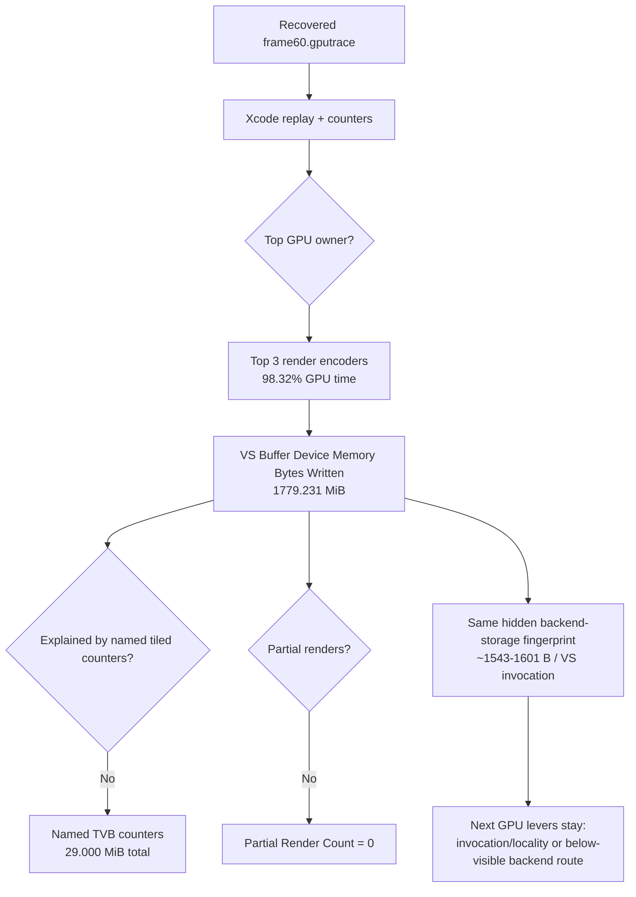

# Recovered Capture Layer Reconfirms Frame60 Hidden VS Write Dominance

**Question / hypothesis.** Once a real Xcode `.gputrace` route is available
again, does frame60 still show the hidden vertex/tiler backend-storage
fingerprint, or did the recent visual/capture work move the dominant GPU owner?

**Method.** Use the recovered `frame60.gputrace` from
[baselines-gputrace-capture.02](../baselines/baselines-gputrace-capture.02.md), export Xcode performance data, wait for draw
counters to finish, export encoder counters, then reduce the wide Xcode CSV to
`frame60-counters-summary.csv`.

**Result.**

| Metric | Value |
|---|---:|
| Xcode GPU time | `37.475ms` |
| Render encoders | `10` |
| Top-three GPU time | `36.844ms` |
| Top-three share | `98.32%` |
| Top-three VS invocations | `1,178,794` |
| Top-three primitives | `715,395` |
| Top-three VS buffer device write | `1779.231 MiB` |
| Top-three device write | `1828.149 MiB` |
| Top-three partial render count | `0` |

| Rank | Encoder | GPU ms | VS invocations | VS buffer written | Bytes / VS invocation | Device written |
|---:|---|---:|---:|---:|---:|---:|
| 1 | `60/2` | `19.610` | `642,211` | `981.149 MiB` | `1602.0 B` | `1001.115 MiB` |
| 2 | `60/1` | `11.439` | `383,688` | `573.085 MiB` | `1566.2 B` | `595.837 MiB` |
| 3 | `60/0` | `5.795` | `152,895` | `224.997 MiB` | `1543.1 B` | `231.197 MiB` |

The named Xcode `Tiled Vertex Buffer Bytes` counters remain much smaller than
the device-write bucket:

| Encoder | `Tiled Vertex Buffer Bytes` | `Tiled Vertex Buffer Primitive Blocks Bytes` |
|---|---:|---:|
| `60/2` | `12.625 MiB` | `11.875 MiB` |
| `60/1` | `1.750 MiB` | `1.250 MiB` |
| `60/0` | `0.875 MiB` | `0.625 MiB` |

This repeats the earlier finding that Xcode's named tiled-buffer counters do
not explain the large `VS Buffer Device Memory Bytes Written` bucket.

**Interpretation.**

- The capture-layer recovery changes the measurement route status: Xcode
  replay counters are available again.
- It does not change the GPU owner. The current frame60 Xcode proof still says
  the expensive hot-frame path is top-three render encoders dominated by hidden
  VS/device buffer writes.
- This frame does not support a partial-render/PB-overflow explanation: the top
  rows report `Partial Render Count = 0`.
- The current bytes per VS invocation (`~1543-1601 B`) is in the same order as
  earlier frame60/frame120 evidence and remains far above source-visible VSOut
  width. Visible-output trimming and stream/IB handle identity remain rejected
  as owners until a new reduced A/B route moves this denominator.

**Verdict.** Accepted as the current Xcode replay refresh. The next GPU-facing
optimization gate should not be another visible VSOut or stream/IB identity
probe. It should either reduce VS invocations with a correctness oracle, or
produce a reduced same-input backend-route A/B that moves bytes per invocation.
Average-FPS work remains a separate pacing/CPU lane.

**Related.** [hidden-backend-storage-shape.31](hidden-backend-storage-shape.31.md) ·
[baselines-gputrace-capture.02](../baselines/baselines-gputrace-capture.02.md) · [hidden-backend-storage](index.md) ·
[present-pacing](../present-pacing/index.md).
