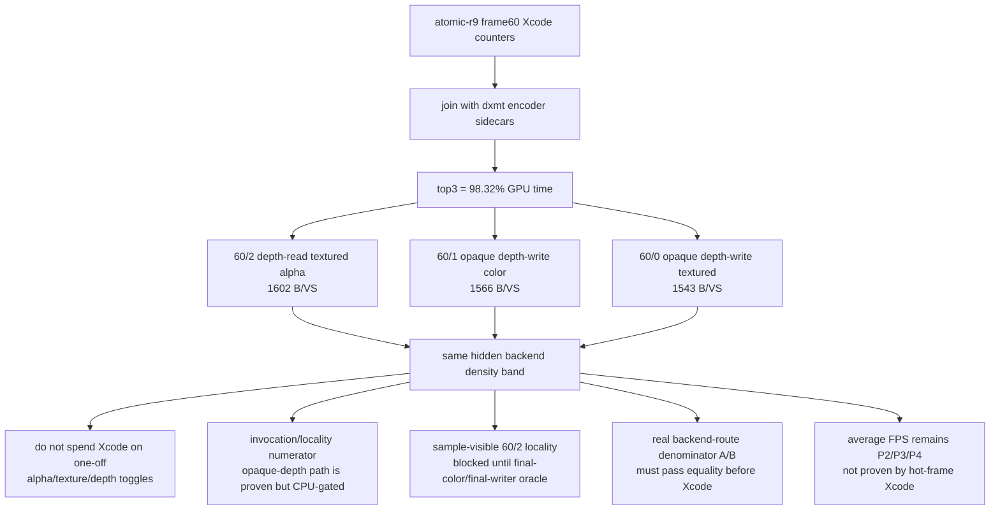

# Current Xcode/DXMT Attribution Narrows The Next Backend Gate

**Question / hypothesis.** After the capture-layer fix, does joining Xcode
encoder counters to dxmt9 encoder attribution point at a narrower next GPU
experiment than the previous broad "hidden backend storage" bucket?

**Method.** Run the existing finalizer against the recovered
`capture-layer-atomic-r9` Xcode counter export and join it with dxmt9 encoder
and stream sidecars:

```sh
bash scripts/tools/finalize_3dmark05_perf_probe.sh \
  --suffix capture-layer-atomic-r9 \
  --frame 60 \
  --top 5 \
  --hot-gpu-share 95.0 \
  --require-xcode-counter-coverage \
  --require-dxmt-join-coverage \
  --require-top-pso-attribution \
  --allow-partial-stable-frame-proof
```

The coverage gates pass for the top-three hot rows.

**Joined result.**

| Row | Class | GPU ms | VS buffer write | B / VS invocation | Primitives | State notes |
|---|---|---:|---:|---:|---:|---|
| `60/2` | depth-read textured alpha | `19.610` | `981.149 MiB` | `1602.0` | `389,376` | `187` programmable textured draws, `145` alpha-blend draws, no depth writes |
| `60/1` | opaque depth-write color | `11.439` | `573.085 MiB` | `1566.2` | `228,725` | `156` programmable draws, no texture, no alpha blend, depth writes on |
| `60/0` | opaque depth-write textured | `5.795` | `224.997 MiB` | `1543.1` | `97,294` | `42` programmable textured draws, no alpha blend, depth writes on |

Top-three aggregate:

| Metric | Value |
|---|---:|
| GPU time | `36.844 ms` |
| GPU share | `98.32%` |
| VS buffer write | `1779.231 MiB` |
| Hidden backend write estimate | `1749.929 MiB` |
| VS buffer / expected VSOut | `8.6x` |
| VS buffer / named tiled-buffer counters | `61.4x` |
| VS buffer / stream0 input max | `36.2x` |
| dxmt CPU writer / Xcode buffer write | `0.000x` |
| Partial render count | `0` |

`capture-layer-redebug-current-r1` reconfirms the same shape on the current
worktree: total GPU `38.092ms`, top-three GPU `37.457ms` / `98.33%`, top-three
VS buffer write `1779.275 MiB`, hidden backend estimate `1749.973 MiB`,
`VS buffer / expected VSOut = 8.6x`, `VS buffer / named tiled-buffer counters =
61.4x`, and dxmt CPU writer bytes only `0.302 MiB`. The fresh run therefore
keeps the next gate unchanged.

`capture-layer-redbg-r1` repeats that conclusion after the capture-layer
wrapper was re-debugged end to end: total GPU `37.709ms`, top-three GPU
`37.115ms` / `98.42%`, top-three VS buffer write `1779.160 MiB`, hidden backend
estimate `1749.858 MiB`, and the same `8.6x` VS-buffer-to-expected-VSOut ratio.

`capture-layer-wrapper-live-r1` proves the preferred top-level wrapper path
(`run_3dmark05_perf_probe.sh --with-wine-capture-layer`) without changing the
owner: total GPU `37.492ms`, top-three GPU `36.892ms` / `98.40%`, top-three VS
buffer write `1779.246 MiB`, hidden backend estimate `1750.007 MiB`, dxmt CPU
writer bytes `0.302 MiB`, and partial render count `0`. The three hot rows stay
in the same density band: `60/2` `1602.0 B/VS`, `60/1` `1566.2 B/VS`, and
`60/0` `1543.0 B/VS`.

The important shape is not just that `60/2` is huge. `60/2`, `60/1`, and
`60/0` have different fragment/texture/blend/depth classes, but all land in the
same `~1543-1602 B / VS invocation` band. That weakens single-state explanations
such as "alpha blend alone", "texture sampling alone", or "depth-write off
alone" as the hidden denominator owner. The common factor is large indexed
programmable geometry going through the current vertex/tiler backend path.



**Decision.**

- Use `capture-layer-wrapper-live-r1` as the current integrated-wrapper Xcode
  counter refresh for hidden-backend-storage work. Keep
  `capture-layer-atomic-r9` as the first recovered-route proof and
  `capture-layer-redbg-r1` as the lower-level wrapper re-debug refresh.
- Do not spend the next Xcode capture on visible `VSOut`, stream/IB handle
  identity, partial-render/PB overflow, or a single render-state toggle. The
  current capture either rejects those outright (`partial render = 0`, CPU
  writer bytes negligible) or shows that different state classes share the same
  density band.
- The next GPU-facing capture budget needs one of three preconditions:
  - an invocation/locality candidate with a correctness oracle and enough
    expected movement to clear the top-row gate;
  - a final-color/final-writer oracle that makes sample-visible `60/2` locality
    safe; or
  - a real backend-route denominator A/B, not a visible-output-width shortcut,
    with equality proven before Xcode.
- Average-FPS work stays in the P2/P3/P4 lane. This capture is a hot-frame
  counter proof; it does not change the low-overhead conclusion that normal GT1
  FPS is still under-pipelined and CPU/present-cadence constrained.

**Verdict.** Accepted as the post-capture-recovery next-gate triage. The fastest
path to a production-shaped win is still to make the already-proven opaque-depth
index-locality path cheaper on CPU or better gated. The larger `60/2` ceiling is
real, but it remains blocked by final-color/final-writer proof or a new
non-reorder backend route.

**Related.** [[hidden-backend-storage-shape.32]] ·
[[index-cache-locality]] · [[present-pacing]] · [[state-churn-encode]].
