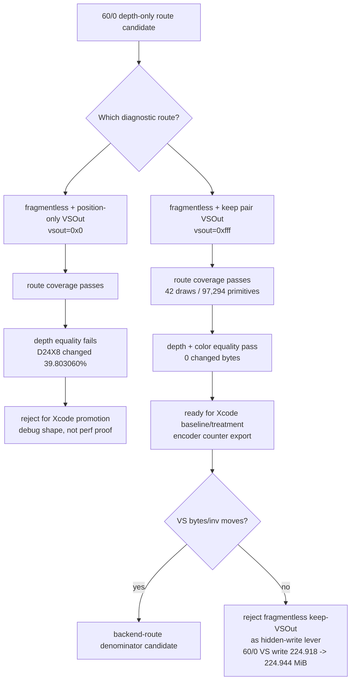

# Fragmentless Depth-Only Keep-VSOut Route Passes Equality but Fails Xcode Counter Gate

**Question / hypothesis.** [hidden-backend-storage-shape.26](hidden-backend-storage-shape.26.md) proved the
`60/0` fragmentless depth-only route is reachable, but its first form changed
two variables at once: it removed the fragment function and also forced a
position-only `VSOut` layout (`0x0`). Was the depth equality failure caused by
fragmentless routing itself, or by the position-only `VSOut` shape?

**Method.** Add a diagnostic sub-mode,
`DXMT9_PROBE_FRAGMENTLESS_DEPTH_ONLY_KEEP_VSOUT=1`, and wrapper flag
`--probe-fragmentless-depth-only-keep-vsout`. The route is only active when
`DXMT9_PROBE_FRAGMENTLESS_DEPTH_ONLY` already selects the target row. In that
sub-mode, the pipeline cache still omits the fragment function for the
depth-only route, but it keeps the ordinary pair-local `VSOut` layout instead
of replacing it with `positionOnlyVSOutLayout()`.

The shader-source debug key and encoder telemetry include the sub-mode, so
route labels report the actual layout used by the PSO. The expected route log
is `reason=accepted-keep-vsout vsout=0xfff`.

```sh
bash scripts/tools/run_3dmark05_perf_probe.sh \
  --suffix fragmentless-depth-only-60-0-keep-vsout-r1 \
  --frame 60 \
  --timeout 120 \
  --no-gputrace \
  --encoder-breakdown-seq 60 \
  --probe-fragmentless-depth-only-row 60/0 \
  --probe-fragmentless-depth-only-keep-vsout \
  --wait-unlocked-sec 1 \
  --wait-unlocked-interval-sec 1
```

Then repeat same-input baseline/treatment runs with pass-end depth and color
attachment dumps for `seq=60, enc=0`, and compare them with
`compare_attachment_dumps.py`.

**Route result.**

| Metric | Value |
|---|---:|
| Target row | `60/0` |
| Route verdict before equality | `route-reachable-needs-equality` |
| Draw coverage | `100.000000%` |
| Primitive coverage | `100.000000%` |
| Vertex coverage | `100.000000%` |
| Target/probe draws | `42` / `42` |
| Target/probe primitives | `97,294` / `97,294` |
| Target/probe vertices | `291,882` / `291,882` |
| VSOut layout | `0xfff` |
| `present_encoded` | `1,827` |
| `draw_skipped_no_pipeline` | `0` |
| `gpu_command_buffer_errors` | `0` |
| accept/reject/no-pipeline logs | `2` / `0` / `0` |

The important change from [hidden-backend-storage-shape.26](hidden-backend-storage-shape.26.md) is the layout:
the fragmentless route is reached while preserving `0xfff`, not by collapsing
the shader interface to position-only `0x0`.

**Same-input equality.**

| Area | Format | Bytes | Changed bytes | Changed pct | Max delta | Metadata |
|---|---|---:|---:|---:|---:|---|
| `frame60-enc0-depth` | `D24X8` | `3,145,728` | `0` | `0.000000%` | `0` | `compatible` |
| `frame60-enc0-color` | `X8R8G8B8` | `3,145,728` | `0` | `0.000000%` | `0` | `compatible` |

The equality-aware gate now reports:

| Gate | Status |
|---|---|
| Overall verdict | `route-equal-ready-for-xcode` |
| Xcode/gputrace readiness | `ready-for-xcode-counters` |
| Route coverage | `100%` draw / primitive / vertex |
| Same-input equality | `passed-equality` |
| Xcode counters | `missing-counters` |

**Xcode counter gate.** The capture-layer file route is working again for this
candidate: `frame60.gputrace` opens in Xcode, exports an embedded performance
bundle, and exports encoder counters after draw-counter profiling completes.
The resulting CSV has the expected `10` encoder rows plus header and joins to
dxmt encoder sidecars.

The performance gate rejects the candidate as a hidden-write denominator lever.
The target row is unchanged within noise:

| Metric | Baseline `capture-layer-redbg-r1` | Fragmentless keep-VSOut | Delta |
|---|---:|---:|---:|
| Total GPU time | `37.709 ms` | `37.687 ms` | `-0.022 ms` |
| Top-3 GPU time | `37.115 ms` | `37.070 ms` | `-0.044 ms` |
| Top-3 VS buffer write | `1779.160 MiB` | `1779.121 MiB` | `-0.039 MiB` |
| Top-3 hidden backend estimate | `1749.858 MiB` | `1749.694 MiB` | `-0.164 MiB` |
| Target `60/0` GPU time | `5.474 ms` | `5.496 ms` | `+0.022 ms` |
| Target `60/0` VS buffer write | `224.918 MiB` | `224.944 MiB` | `+0.026 MiB` |
| Target `60/0` VS invocations | `152,895` | `152,895` | `0` |
| Target `60/0` VS bytes/invocation | `1542.521 B` | `1542.702 B` | `+0.181 B` |

The finalizer failure is intentional and useful:

```text
requirement failed: target_vs_buffer_write_mib did not decrease (224.918 -> 224.944)
```

This proves that removing the fragment function while preserving the same
pair-local vertex output contract does not move the big `60/0` VS write bucket.
The depth-only fragment stage was not the hidden backend owner.



**Decision.**

- The old failed route was not a clean test of "fragmentless depth-only" because
  it also changed the vertex output contract to position-only.
- The keep-VSOut sub-mode isolates fragment-function removal while preserving
  the ordinary `0xfff` vertex output shape. It passes pass-end depth and color
  equality for `60/0`.
- This was a valid reduced backend-route Xcode candidate for `60/0`, but the
  Xcode counter gate is now complete and negative.
- `VS Buffer Device Memory Bytes Written` and bytes/invocation stay flat, so
  fragmentless keep-VSOut is rejected as a denominator lever. The useful result
  is narrower: the fragment-function-presence bit is not the hidden-write owner
  for `60/0`.
- The harder `60/1` color and `60/2` textured routes still need a different
  below-visible backend mechanism or an invocation/locality reducer. This result
  argues against spending more Xcode budget on fragmentless variants alone.

**Verdict.** Accepted as equality proof, and rejected as a performance lever.
The capture layer is usable again: it produced `frame60.gputrace`, embedded
performance data, and encoder counter CSV for this run. The `60/0`
fragmentless keep-VSOut route does not reduce hidden backend VS writes.

**Related.** [hidden-backend-storage-shape.26](hidden-backend-storage-shape.26.md) ·
[hidden-backend-storage-shape.33](hidden-backend-storage-shape.33.md) · [overview-3dmark05-gt1](../overview-3dmark05-gt1.md).
