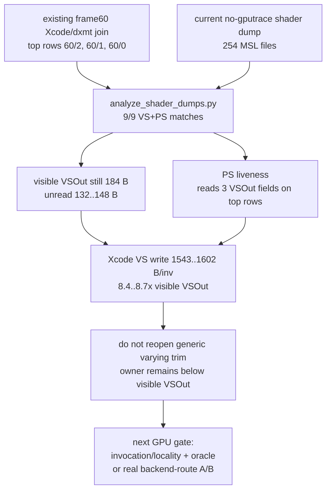

# Current Shader Dump Join Keeps the Hidden Owner Below Visible VSOut

**Question / hypothesis.** After the current Xcode/dxmt join in
hidden-backend-storage-shape.33, can a current shader dump attach MSL source
and PS varying liveness to the top frame60 Xcode rows strongly enough to reopen
visible `VSOut` trimming as the next GPU lever?

**Method.** Run a normal no-gputrace shader-dump scout at frame60, then join
the dumped MSL sources to the existing
`capture-layer-current-post-compact-r1` Xcode/dxmt joined CSV.

```sh
bash scripts/tools/run_3dmark05_perf_probe.sh \
  --suffix h226-shaderdump-frame60-current-r1 \
  --frame 60 \
  --no-gputrace \
  --dump-shaders \
  --encoder-breakdown-seq 60 \
  --timeout 120 \
  --keep-frontmost

python3 scripts/tools/analyze_shader_dumps.py \
  traces/app-d3d9-3dmark05-capture-layer-current-post-compact-r1/analysis/frame60-xcode-dxmt-joined-summary.csv \
  --shader-dir traces/app-d3d9-3dmark05-h226-shaderdump-frame60-current-r1/analysis/shaders/msl \
  --output traces/app-d3d9-3dmark05-h226-shaderdump-frame60-current-r1/analysis/frame60-current-post-compact-xcode-shader-dump-report.md \
  --csv-output traces/app-d3d9-3dmark05-h226-shaderdump-frame60-current-r1/analysis/frame60-current-post-compact-xcode-shader-dump-summary.csv \
  --top 10
```

The run is a liveness-attribution refresh, not an FPS A/B. It completed without
pipeline or Metal-command-buffer error counters.

| Metric | Value |
|---|---:|
| Run status | `pass` |
| Timed out | `false` |
| Shader files under `analysis/shaders/msl` | `254` |
| Indexed shader dumps | `98` |
| Top rows analyzed | `10` |
| Matched VS / PS rows | `9 / 9` |
| `present_encoded` | `1,795` |
| `draw_skipped_no_pipeline` | `0` |
| `gpu_command_buffer_errors` | `0` |
| `commit_chunk_replay_cpu_ms_per_present` | `8.357` |
| `d3d9_snapshot_draw_submission_cpu_ms_per_present` | `3.215` |
| `encode_chunk_cpu_ms_per_present` | `11.218` |
| `submit_draw_run_batch_queue_lock_cpu_ms` | `34.565` total |

**Top-row liveness.**

| Row | GPU ms | VS write MiB | VS B/inv | MSL VSOut B | VS write / MSL VSOut | PS read fields | Unread VSOut | Note |
|---|---:|---:|---:|---:|---:|---|---:|---|
| `60/2` | `18.988` | `981.191` | `1602.048` | `184` | `8.707x` | `fogFactor,position,texcoord0` | `148 B` / `80.4%` | VS hash has `2` dumped candidates |
| `60/1` | `11.002` | `573.084` | `1566.175` | `184` | `8.512x` | `fogFactor,position,texcoord0` | `148 B` / `80.4%` | unique VS/PS dump |
| `60/0` | `5.306` | `224.955` | `1542.772` | `184` | `8.385x` | `color,fogFactor,secondaryColor` | `132 B` / `71.7%` | unique VS/PS dump |

The visible liveness opportunity is real in the source: top rows carry many
unread fields. It still does not explain the measured bucket. The hot rows write
`1543..1602 B` per VS invocation while the source-visible `VSOut` layout is
`184 B`, so the measured density stays `8.4..8.7x` larger than the visible
stage-out struct. That matches the previous `live-vsout`, position-only, and
fragmentless keep-VSOut Xcode rejections: source-visible output width is not the
first-order hidden-write denominator.



**Decision.**

- Keep the shader-dump join as current attribution evidence for the recovered
  Xcode capture route.
- Do not promote another broad `DXMT9_TRIM_UNUSED_VARYINGS` or generic
  visible-`VSOut` Xcode experiment. PS liveness must remain pair-specific, but
  the existing counter gates already reject visible output width as the owner.
- Treat rank `60/2` source details carefully because the VS hash has two dumped
  candidates. The row-level density and liveness conclusion is still valid; do
  not make source-line-specific claims from that row without an exact source
  hash capture.
- The next GPU-facing candidate still needs one of: an invocation/locality
  reducer with a final-color/final-writer oracle, a below-visible backend route
  that passes equality and reduced counter gates, or a reduced synthetic A/B
  that changes hidden bytes per invocation before GT1 Xcode spend.

**Verdict.** Accepted as a current attribution refresh. The run confirms useful
PS liveness data is available, but it does not reopen visible varying width as
the first-order performance lever. Hidden backend storage remains below the
source-visible `VSOut` contract.

**Related.** hidden-backend-storage-shape.33 ·
hidden-backend-storage-shape.34 · [vsout-layout](../vsout-layout/index.md) ·
[overview-3dmark05-gt1](../overview-3dmark05-gt1.md).
