# Index-Cache Locality — the only accepted production GPU win

> Part of the 3DMark05 GT1 GPU-bottleneck investigation. Root map: [[overview-3dmark05-gt1]].

## Scope & question

This domain owns the **one accepted production optimization** of the whole GT1
investigation: a cached, semantic-safe post-transform index-cache reorder that
lowers VS invocations — and therefore the hidden TVB / parameter-buffer write
bucket — for **opaque depth-writing triangle lists**. It covers the production
flag `DXMT9_OPTIMIZE_OPAQUE_DEPTH_INDEX_CACHE=1` (+ `_MIN_GAIN_PCT`), the
explicit-tolerance-only screen-blend variant `DXMT9_OPTIMIZE_SCREEN_BLEND_INDEX_CACHE`,
min-gain threshold tuning, the no-mutate identity scouts that fed candidate
selection, the CPU-cost optimization of the cache path, and the remaining `50/2`
bottleneck triage. The mechanism behind why this works is proven separately by
[[tvb-mechanism-proof]]: TVB write ≈ `VS invocations × per-vertex VSOut bytes`.

## Hypotheses & verdicts

| # | Hypothesis | Verdict | Evidence |
|---|-----------|---------|----------|
| H1 | Hot indexed rows carry large reducible post-transform LRU32 locality (ceiling) | accepted (model) | [[index-cache-locality-opaque.01]] |
| H2 | A cached LRU32 reorder for **opaque depth-writing** triangles reduces Xcode VS invocations, VS write, and GPU time on target rows | **accepted (production WIN)** | [[index-cache-locality-opaque.07]], [[index-cache-locality-opaque.03]] |
| H3 | The opt-in is correctly scoped (opaque rows only; 50/2 untouched) and is not a no-op on the current tree | accepted | [[index-cache-locality-opaque.02]], [[index-cache-locality-opaque.04]] |
| H4 | The CPU side-effect can be cut and attributed without changing candidate selection (dense adjacency, LRU32-only, source-resolve split; remaining build owner is candidate selection volume) | accepted | [[index-cache-locality-cpucost.03]], [[index-cache-locality-cpucost.05]], [[index-cache-locality-cpucost.06]], [[index-cache-locality-cpucost.08]], [[index-cache-locality-cpucost.09]], [[index-cache-locality-cpucost.10]] |
| H5 | A faster lookup structure or simpler pool lookup scan reduces lookup CPU | rejected | [[index-cache-locality-cpucost.02]], [[index-cache-locality-cpucost.07]] |
| H6 | The screen-blend index-cache reduces 50/2 VS invocations / write | accepted only under explicit **exact/`lsb1`** semantic policy; broad depth-read remains rejected | [[index-cache-locality-screenblend.04]], [[index-cache-locality-screenblend.03]] |
| H7 | Lowering min-gain `10→0` improves Xcode counters | rejected (weaker avg gain, no hardware movement) | [[index-cache-locality-mingain.01]] |
| H8 | Texture/fragment material is the first-order owner of the residual `50/2` cost | rejected; owner stays hidden vertex-stage storage | [[index-cache-locality-triage.01]] |
| H9 | A simple fixed candidate frontier cap cuts candidate-select CPU | rejected; cap 32/64 reduces slots but not select CPU | [[index-cache-locality-cpucost.11]] |
| H10 | A heap-backed lazy priority frontier cuts candidate-select CPU while preserving quality | rejected; scored work falls but CPU and miss32 regress | [[index-cache-locality-cpucost.12]] |
| H11 | A cached-vertex-count bucketed selector cuts candidate-select CPU | rejected; scored work falls but bucket maintenance regresses CPU | [[index-cache-locality-cpucost.13]] |
| H12 | A unique-count upper-bound pre-gate avoids building impossible candidates | rejected; rejects 76 candidates but candidate CPU regresses | [[index-cache-locality-cpucost.14]] |
| H13 | A missing persistent rejected verdict is the remaining opaque-depth CPU blocker | rejected; already implemented and amortizing | [[index-cache-locality-cpucost.15]] |
| H14 | A missing draw-shape prefilter before reordered-index-cache lookup is the remaining CPU blocker | rejected; non-scope draws are already gated before lookup | [[index-cache-locality-cpucost.16]] |
| H15 | Strict no-duplicate LRU simulation inside the candidate builder improves candidate quality or CPU enough to change the default | rejected; candidate miss32 worsens by `+46`, CPU gain is too small/noisy | [[index-cache-locality-cpucost.17]] |
| H16 | Who owns the residual `50/2` (`~1.49–1.58 GiB` hidden) GPU cost | **OPEN** | [[index-cache-locality-triage.01]] |

## Verification methods

- **`DXMT9_OPTIMIZE_OPAQUE_DEPTH_INDEX_CACHE=1` + `_MIN_GAIN_PCT=10`** — the
  production opt-in (wrapper `--optimize-opaque-depth-index-cache
  --optimize-opaque-depth-index-cache-min-gain-pct 10`). Submits cached LRU32
  reordered IBs only for opaque depth-writing triangle lists clearing the gain gate.
- **`DXMT9_OPTIMIZE_SCREEN_BLEND_INDEX_CACHE` + `_MIN_GAIN_PCT`** —
  explicit-tolerance-only variant for strict screen-blend rows; destination-dependent
  and allowed only when the run carries an exact/`lsb1` semantic-image policy.
- **`--require-opaque-depth-index-cache-proof`** — production preset: stable-frame
  gates, target cache-opt/effective LRU32 decrease, positive target reordered-cache
  hits, target VS write/invocation decrease. Used instead of the diagnostic
  generic-LRU gate because production cached-prelookup leaves generic telemetry zeroed.
- **`--require-screen-blend-cache-proof` / `--require-target-index-cache-opt-miss32-decrease`,
  `--require-target-reordered-index-cache-hits`, `--require-target-vs-invocations-decrease`** —
  the screen-blend / target-row mechanism gates.
- **LRU32 telemetry** — `indexed_cache_opt_candidate_*_miss32`,
  `candidate_miss_delta32` (production uses miss32; miss16/64 are `0` in fast-measure).
- **Reordered-cache hit counters** — `reordered_index_cache_{lookups,hits,rejected_hits,created}`,
  `runtime_applied_draws` prove the path is active and conservatively scoped.
- **No-mutate identity scout** — `DXMT9_MEASURE_INDEX_REUSE=1` +
  `--measure-index-cache-opt-candidate` emit per-draw identity / candidate ceiling
  without mutating order, feeding candidate selection.
- **Diagnostic candidate-builder variants** —
  `--index-cache-candidate-frontier-cap`,
  `--index-cache-candidate-lazy-frontier`,
  `--index-cache-candidate-bucketed-select`,
  `--index-cache-candidate-strict-lru`, and
  `--index-cache-candidate-upper-bound-gate` are hypotheses, not default
  changes. Judge them first with no-gputrace CPU/miss32 counters, then require
  same-input image proof or a stable visual gate; `v0.0.1` PNG diffs are useful
  for broad corruption triage but not raw pixel-percent correctness gates.

## Experiment dependency graph

```mermaid
flowchart TD
  Identity1["index-cache-locality-identity.01\nno-mutate draw identity\n664 rows (tooling)"]
  Identity2["index-cache-locality-identity.02\ngputrace-backed scout\nhidden 2236.981MiB"]
  Preflight["index-cache-locality-opaque.01\ncandidate ceiling\ntop3 LRU32 -24.39%"]
  OptNo["index-cache-locality-opaque.02 / .04\nopaque opt-in no-gputrace\n102 applied, 50/2 untouched"]
  OptXcode["index-cache-locality-opaque.03\nXcode replay\ntarget GPU -8.33%, global +0.84%"]
  Smoke["index-cache-locality-opaque.05\nnon-diag smoke\nGPU -0.16%, CPU +25.37%"]
  Cpu1["index-cache-locality-cpucost.01\nCPU split: index_setup owner"]
  Cpu2["index-cache-locality-cpucost.02\nlookup fast-path REJECTED"]
  Cpu3["index-cache-locality-cpucost.03\ndense adjacency -58.87%"]
  Cpu4["index-cache-locality-cpucost.04\nsetup scope correction"]
  Cpu5["index-cache-locality-cpucost.05\nprefix repair + CPU gap refresh\nsource resolve flat"]
  Cpu6["index-cache-locality-cpucost.06\nno-encoder default-policy smoke\nCPU +215.6ms"]
  Cpu7["index-cache-locality-cpucost.07\npool lookup single-scan REJECTED\nlookup +3.4ms"]
  Cpu8["index-cache-locality-cpucost.08\ncandidate build split\nselect 75.4%, adjacency 19.1%"]
  Cpu9["index-cache-locality-cpucost.09\ncache-position table\nselect -7.1ms, total CPU flat"]
  Cpu10["index-cache-locality-cpucost.10\nselect volume\n302k calls, 2.06M scored"]
  Cpu11["index-cache-locality-cpucost.11\nfrontier cap REJECTED\nslots -20.3%, select +5.0%"]
  Cpu12["index-cache-locality-cpucost.12\nlazy heap REJECTED\nscored -81%, select +21%"]
  Cpu13["index-cache-locality-cpucost.13\nbucketed select REJECTED\nscored -72.6%, select +32.5%"]
  Cpu14["index-cache-locality-cpucost.14\nupper-bound gate REJECTED\n76 skipped, candidate CPU +8.5%"]
  Cpu15["index-cache-locality-cpucost.15\npersistent rejected verdict refresh\n401k rejected hits / 143 misses"]
  Cpu16["index-cache-locality-cpucost.16\ndraw-shape prefilter audit\nnon-scope already skipped"]
  Cpu17["index-cache-locality-cpucost.17\nstrict LRU diagnostic REJECTED\nmiss32 +46, total CPU +36.9ms"]
  FastGate["index-cache-locality-opaque.06\nfast-measure smoke\nGPU -0.58%, setup +309ms"]
  Proof["index-cache-locality-opaque.07\nFAST-MEASURE PROOF\nGPU -9.50%, target VS inv -14.12%\nmechanism via [[tvb-mechanism-proof]]"]
  SbScout["index-cache-locality-screenblend.02\n50/2 scout: 66 hits"]
  SbXcode["index-cache-locality-screenblend.03\n50/2 GPU -4.64%\nmechanism proof"]
  SbGate["index-cache-locality-screenblend.04\ncombined GPU -11.89%\nexplicit lsb1 only"]
  SbOrder["index-cache-locality-screenblend.01\nindex-order opt -3.35% GPU\nVS write unchanged"]
  MinGain["index-cache-locality-mingain.01\nmin-gain 0 REJECTED\nglobal GPU +0.04%"]
  Triage["index-cache-locality-triage.01\n50/2 owner OPEN\ntexture not owner"]

  Identity1 --> Identity2
  Identity2 -->|"candidate input"| Preflight
  Preflight -->|"ceiling for"| OptNo
  OptNo --> OptXcode
  OptXcode --> Smoke
  Smoke -->|"CPU cost"| Cpu1
  Cpu1 --> Cpu2
  Cpu2 -->|"real owner"| Cpu3
  Cpu3 --> Cpu4
  Cpu4 --> Cpu5
  Cpu5 --> Cpu6
  Cpu6 --> Cpu7
  Cpu7 --> Cpu8
  Cpu8 --> Cpu9
  Cpu9 --> Cpu10
  Cpu10 --> Cpu11
  Cpu11 --> Cpu12
  Cpu12 --> Cpu13
  Cpu13 --> Cpu14
  Cpu14 --> Cpu15
  Cpu15 --> Cpu16
  Cpu16 --> Cpu17
  Cpu3 --> FastGate
  FastGate --> Proof
  OptXcode -->|"50/2 left"| SbScout
  SbScout --> SbXcode
  SbXcode --> SbGate
  SbGate --> Triage
  SbOrder -.->|"earlier order-only attempt"| SbScout
  Proof -->|"threshold tuning"| MinGain
  Triage -->|"owner still open"| OpenOwner["residual 50/2\nhidden vertex/tiler storage"]

  classDef accepted fill:#d6f5d6,stroke:#2b7a2b,color:#063
  classDef rejected fill:#f8d7da,stroke:#a33,color:#600
  classDef open fill:#fff3cd,stroke:#a80,color:#640
  class Preflight,OptNo,OptXcode,Smoke,Cpu1,Cpu3,Cpu4,Cpu5,Cpu6,Cpu8,Cpu9,Cpu10,FastGate,Proof,Identity1,Identity2 accepted
  class Cpu2,Cpu7,Cpu11,Cpu12,Cpu13,Cpu14,Cpu15,Cpu16,Cpu17,MinGain rejected
  class SbScout,SbXcode,SbGate,SbOrder,Triage,OpenOwner open
```



## Results synthesis

**Settled.** This domain is the payoff of the whole GT1 investigation. After
almost every other hypothesis was rejected as "not the first-order owner," the
single safe, real GPU win is **reducing VS invocations via post-transform index
locality on opaque depth-writing triangles**. The chain is closed: the no-mutate
identity scouts ([[index-cache-locality-identity.01]], [[index-cache-locality-identity.02]])
exposed per-draw shape and the candidate ceiling
([[index-cache-locality-opaque.01]], top-3 LRU32 `-24.39%`); the opt-in proved
correctly scoped to opaque rows with `50/2` untouched
([[index-cache-locality-opaque.02]], [[index-cache-locality-opaque.04]]); and the
fast-measure Xcode proof ([[index-cache-locality-opaque.07]]) PASSED every strong
gate — top GPU `-9.50%`, target rows `50/0+50/1` GPU `-18.39%`, VS invocations
`536,583→460,839` (`-14.12%`), VS write `-16.79%`, with attribution showing the
**primary mover is invocation count, not bytes per invocation**. That is exactly
the prediction of [[tvb-mechanism-proof]]. The CPU side-effect was understood and
cut (dense adjacency / LRU32-only, candidate CPU `-58.87%` in
[[index-cache-locality-cpucost.03]]), while the lookup-structure rewrite and the
min-gain-0 relaxation were both rejected as non-improvements.

**Open.** Two things remain. (1) The opt-in stays **opt-in**, not a shared `perf`
default, because index setup still adds meaningful candidate/lookup + draw-path CPU
cost; the narrow source-resolve counter showed base IB resolve is not the owner
([[index-cache-locality-cpucost.04]], refreshed in
[[index-cache-locality-cpucost.05]] after repairing the direct-prefix wrapper;
bounded without diagnostic rows in [[index-cache-locality-cpucost.06]] at
`encode_draw_cpu_ms +215.588ms`, with source-resolve still flat).
The first follow-up implementation attempt, simplifying the pool lookup scan,
was rejected because it did not reduce the explicit lookup bucket
([[index-cache-locality-cpucost.07]]). The next attribution split
([[index-cache-locality-cpucost.08]]) shows the remaining candidate-build owner
is not source index read/write:
`encode_draw_index_cache_candidate_select_cpu_ms=99.187ms` is `75.4%` of
`encode_draw_index_cache_candidate_build_cpu_ms`, while adjacency is `19.1%`.
The follow-up cache-position table ([[index-cache-locality-cpucost.09]]) cut the
select bucket to `92.121ms` without changing miss32/created counts, but total
`encode_draw_cpu_ms` stayed flat. The remaining CPU problem is now candidate
rescoring volume, not raw cache-position lookup: [[index-cache-locality-cpucost.10]]
measured `302,538` select calls and `2,061,493` scored candidates with no skipped
stale slots. A hard frontier cap was then rejected in
[[index-cache-locality-cpucost.11]]: cap 32 cut scored slots by `20.33%`, but
`encode_draw_index_cache_candidate_select_cpu_ms` still increased
`91.635ms→96.232ms`, proving that bounding the worst-case vector width is not
enough. The first heap-backed lazy frontier was also rejected in
[[index-cache-locality-cpucost.12]]: it cut scored work by `80.97%`, but
`candidate_select_cpu_ms` regressed `91.635ms→111.247ms` and candidate LRU32
misses worsened `418,033→434,791`. A viable follow-up needs a cheaper
domain-specific frontier or candidate construction change, not a generic heap.
The next attempt, a cached-vertex-count bucketed selector
([[index-cache-locality-cpucost.13]]), kept quality neutral and cut scored work
by `72.61%`, but still regressed select CPU `91.635ms→121.378ms` because
`190,647` bucket moves replaced the scan work. That closes the generic active-
frontier family for now: the next CPU path must reduce candidate calls or avoid
building low-value candidates, not maintain a smarter candidate container. The
first such pre-gate attempt ([[index-cache-locality-cpucost.14]]) used the
theoretical bound `candidate_miss32 >= unique` to skip impossible candidates.
It did reject `76` candidates and preserved the accepted cache set
(`reordered_index_cache_created=67`), but unique-count work moved
`encode_draw_index_cache_original_measure_cpu_ms` `15.146ms→24.301ms` and total
candidate CPU `152.117ms→165.050ms`, so this form is also rejected. A
post-visualfix refresh then checked the persistent verdict idea directly:
[[index-cache-locality-cpucost.15]] shows rejected verdict caching is already
implemented and active (`401,681` rejected hits against `143` cold misses).
The follow-up code audit ([[index-cache-locality-cpucost.16]]) then rejects a
missing broad draw-shape prefilter as the next blocker: non-scope draws are
already gated before `findReorderedIndexBuffer()`, so the `687,387` lookups are
eligible-key decisions, not unrelated draw traffic. The next local builder
diagnostic ([[index-cache-locality-cpucost.17]]) normalized the simulated LRU
miss path to the same no-duplicate update used by the LRU32 measurement helper,
but that also failed as a default-change reason: candidate miss32 worsened
`418,033→418,079`, the candidate CPU delta was only `-5.082ms`, and total
`encode_draw_cpu_ms` regressed `+36.930ms` in the no-gputrace run. Future CPU
work therefore needs either a cheaper cold-miss candidate construction path, a
narrower eligible-subclass exclusion proven by telemetry, or more semantic-safe
GPU payoff, not another per-candidate measurement pass, not basic rejected-key
caching, not a broad "avoid non-eligible draws" gate, and not local LRU
miss-path normalization.
(2) The dominant remaining frame owner is row
`50/2` — depth-read, screen-blend/standard-alpha/blend-off, textured, large indexed
geometry — whose `~1.49–1.58 GiB` cost is hidden vertex/tiler/parameter storage, not
texture/fragment ([[index-cache-locality-triage.01]]). The screen-blend cache *can*
reduce it ([[index-cache-locality-screenblend.03]], `50/2` GPU `-4.64%`) but is
allowed only as an **explicit exact/`lsb1`** artifact
([[index-cache-locality-screenblend.04]]): the combined opaque+screen-blend run
improves top GPU `-11.89%`, but broad depth-read promotion is blocked by a
runtime-indistinguishable final-color hazard. Until a real final-color/final-writer
oracle or a non-reorder backend mechanism exists, `50/2` is the open frontier.

## How to run
Every experiment here is a 3DMark05 GT1 run via the standard wrapper. The
production opt-in is the opaque-depth index-cache path; capture a `.gputrace` with
it enabled, then finalize with the production proof preset:

```sh
bash scripts/tools/run_3dmark05_perf_probe.sh --suffix idx-cache --frame 60 \
  --optimize-opaque-depth-index-cache --optimize-opaque-depth-index-cache-min-gain-pct 10 \
  --timeout 420
# screen-blend (explicit exact/lsb1 policy only): --optimize-screen-blend-index-cache \
#   --optimize-screen-blend-index-cache-min-gain-pct 10
# no-mutate identity scout: --measure-index-reuse --measure-index-cache-opt-candidate --no-gputrace

# After Xcode exports encoder counters:
bash scripts/tools/finalize_3dmark05_perf_probe.sh --suffix idx-cache --frame 60 \
  --baseline-joined traces/<baseline>/analysis/frame60-xcode-dxmt-joined-summary.csv \
  --require-opaque-depth-index-cache-proof
```

The exact per-experiment flags live in each leaf's `**Method.**` field. See
`agents/rules/environment_variables.rules.md` for env-var meanings and
`agents/rules/metal_debugging.rules.md` for the full workflow.

## Cross-references
- [[tvb-mechanism-proof]] — proves *why* fewer VS invocations reduce GPU time; this domain is the production application of that mechanism.
- [[hidden-backend-storage]] — supplies the TVB/parameter-storage cost model and the residual `50/2` hidden-write bucket this domain cannot yet reach.
- [[primitive-reorder-diagnostics]] — the reverse-triangle / min-index / cache-aware reorder scouts that motivated a *cached, gated* reorder instead of naive order changes; `sort-min-index` was rejected here.
- [[index-reuse-measurement]] — the `DXMT9_MEASURE_INDEX_REUSE` / LRU32 cache-miss telemetry the candidate gate is built on.
- [[mini-replay-bisection]] — consumes the no-mutate identity rows; the real-input replay path needed to settle the open `50/2` semantic-tolerance question.
- [[overview-3dmark05-gt1]] — root priority DAG and synthesis (this is the accepted win it points to).
