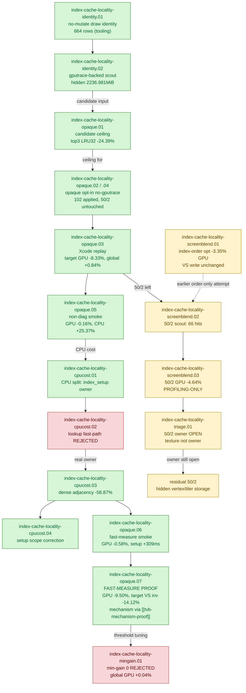

# Index-Cache Locality — the only accepted production GPU win

> Part of the 3DMark05 GT1 GPU-bottleneck investigation. Root map: [[overview]].

## Scope & question

This domain owns the **one accepted production optimization** of the whole GT1
investigation: a cached, semantic-safe post-transform index-cache reorder that
lowers VS invocations — and therefore the hidden TVB / parameter-buffer write
bucket — for **opaque depth-writing triangle lists**. It covers the production
flag `DXMT9_OPTIMIZE_OPAQUE_DEPTH_INDEX_CACHE=1` (+ `_MIN_GAIN_PCT`), the
profiling-only screen-blend variant `DXMT9_OPTIMIZE_SCREEN_BLEND_INDEX_CACHE`,
min-gain threshold tuning, the no-mutate identity scouts that fed candidate
selection, the CPU-cost optimization of the cache path, and the remaining `50/2`
bottleneck triage. The mechanism behind why this works is proven separately by
[[tvb-mechanism-proof]]: TVB write ≈ `VS invocations × per-vertex VSOut bytes`.

## Hypotheses & verdicts

| # | Hypothesis | Verdict | Evidence |
|---|-----------|---------|----------|
| H1 | Hot indexed rows carry large reducible post-transform LRU32 locality (ceiling) | accepted (model) | [[index-cache-locality-opaque.01]] |
| H2 | A cached LRU32 reorder for **opaque depth-writing** triangles reduces Xcode VS invocations, VS write, and GPU time on target rows | **accepted (production WIN)** | [[index-cache-locality-opaque.07]], [[index-cache-locality-opaque.03]] |
| H3 | The opt-in is correctly scoped (opaque rows only; 50/2 untouched) and is not a no-op on the current tree | accepted | [[index-cache-locality-opaque.02]], [[index-cache-locality-opaque.04]] |
| H4 | The CPU side-effect can be cut without changing candidate selection (dense adjacency, LRU32-only) | accepted | [[index-cache-locality-cpucost.03]] |
| H5 | A faster lookup structure (hash/last-hit) reduces lookup CPU | rejected | [[index-cache-locality-cpucost.02]] |
| H6 | The screen-blend index-cache reduces 50/2 VS invocations / write | accepted as **profiling-only** (no image proof; destination-dependent) | [[index-cache-locality-screenblend.03]] |
| H7 | Lowering min-gain `10→0` improves Xcode counters | rejected (weaker avg gain, no hardware movement) | [[index-cache-locality-mingain.01]] |
| H8 | Texture/fragment material is the first-order owner of the residual `50/2` cost | rejected; owner stays hidden vertex-stage storage | [[index-cache-locality-triage.01]] |
| H9 | Who owns the residual `50/2` (`~1.49–1.58 GiB` hidden) GPU cost | **OPEN** | [[index-cache-locality-triage.01]] |

## Verification methods

- **`DXMT9_OPTIMIZE_OPAQUE_DEPTH_INDEX_CACHE=1` + `_MIN_GAIN_PCT=10`** — the
  production opt-in (wrapper `--optimize-opaque-depth-index-cache
  --optimize-opaque-depth-index-cache-min-gain-pct 10`). Submits cached LRU32
  reordered IBs only for opaque depth-writing triangle lists clearing the gain gate.
- **`DXMT9_OPTIMIZE_SCREEN_BLEND_INDEX_CACHE` + `_MIN_GAIN_PCT`** — profiling-only
  variant for strict screen-blend rows; destination-dependent, not production-safe.
- **`--require-opaque-depth-index-cache-proof`** — production preset: stable-frame
  gates, target cache-opt/effective LRU32 decrease, positive target reordered-cache
  hits, target VS write/invocation decrease. Used instead of the diagnostic
  generic-LRU gate because production cached-prelookup leaves generic telemetry zeroed.
- **`--require-screen-blend-cache-proof` / `--require-target-index-cache-opt-miss32-decrease`,
  `--require-target-reordered-index-cache-hits`, `--require-target-vs-invocations-decrease`** —
  the screen-blend / target-row mechanism gates.
- **LRU32 telemetry** — `indexed_cache_opt_candidate_*_miss32`,
  `candidate_miss_delta32` (production uses miss32; miss16/64 are `0` in fast-measure).
- **Reordered-cache hit counters** — `reordered_index_cache_{lookups,hits,rejected_hits,created}`,
  `runtime_applied_draws` prove the path is active and conservatively scoped.
- **No-mutate identity scout** — `DXMT9_MEASURE_INDEX_REUSE=1` +
  `--measure-index-cache-opt-candidate` emit per-draw identity / candidate ceiling
  without mutating order, feeding candidate selection.

## Experiment dependency graph

## Results synthesis

**Settled.** This domain is the payoff of the whole GT1 investigation. After
almost every other hypothesis was rejected as "not the first-order owner," the
single safe, real GPU win is **reducing VS invocations via post-transform index
locality on opaque depth-writing triangles**. The chain is closed: the no-mutate
identity scouts ([[index-cache-locality-identity.01]], [[index-cache-locality-identity.02]])
exposed per-draw shape and the candidate ceiling
([[index-cache-locality-opaque.01]], top-3 LRU32 `-24.39%`); the opt-in proved
correctly scoped to opaque rows with `50/2` untouched
([[index-cache-locality-opaque.02]], [[index-cache-locality-opaque.04]]); and the
fast-measure Xcode proof ([[index-cache-locality-opaque.07]]) PASSED every strong
gate — top GPU `-9.50%`, target rows `50/0+50/1` GPU `-18.39%`, VS invocations
`536,583→460,839` (`-14.12%`), VS write `-16.79%`, with attribution showing the
**primary mover is invocation count, not bytes per invocation**. That is exactly
the prediction of [[tvb-mechanism-proof]]. The CPU side-effect was understood and
cut (dense adjacency / LRU32-only, candidate CPU `-58.87%` in
[[index-cache-locality-cpucost.03]]), while the lookup-structure rewrite and the
min-gain-0 relaxation were both rejected as non-improvements.

**Open.** Two things remain. (1) The opt-in stays **opt-in**, not a shared `perf`
default, because index setup still adds `~309ms` CPU over a full run
([[index-cache-locality-opaque.06]]). (2) The dominant remaining frame owner is row
`50/2` — depth-read, screen-blend/standard-alpha/blend-off, textured, large indexed
geometry — whose `~1.49–1.58 GiB` cost is hidden vertex/tiler/parameter storage, not
texture/fragment ([[index-cache-locality-triage.01]]). The screen-blend cache *can*
reduce it ([[index-cache-locality-screenblend.03]], `50/2` GPU `-4.64%`) but is
**profiling-only**: its output is destination-dependent and remains blocked on a
final-color / semantic-tolerance oracle. Until that oracle exists, `50/2` is the open
frontier.

## Cross-references
- [[tvb-mechanism-proof]] — proves *why* fewer VS invocations reduce GPU time; this domain is the production application of that mechanism.
- [[hidden-backend-storage]] — supplies the TVB/parameter-storage cost model and the residual `50/2` hidden-write bucket this domain cannot yet reach.
- [[primitive-reorder-diagnostics]] — the reverse-triangle / min-index / cache-aware reorder scouts that motivated a *cached, gated* reorder instead of naive order changes; `sort-min-index` was rejected here.
- [[index-reuse-measurement]] — the `DXMT9_MEASURE_INDEX_REUSE` / LRU32 cache-miss telemetry the candidate gate is built on.
- [[mini-replay-bisection]] — consumes the no-mutate identity rows; the real-input replay path needed to settle the open `50/2` semantic-tolerance question.
- [[overview]] — root priority DAG and synthesis (this is the accepted win it points to).
