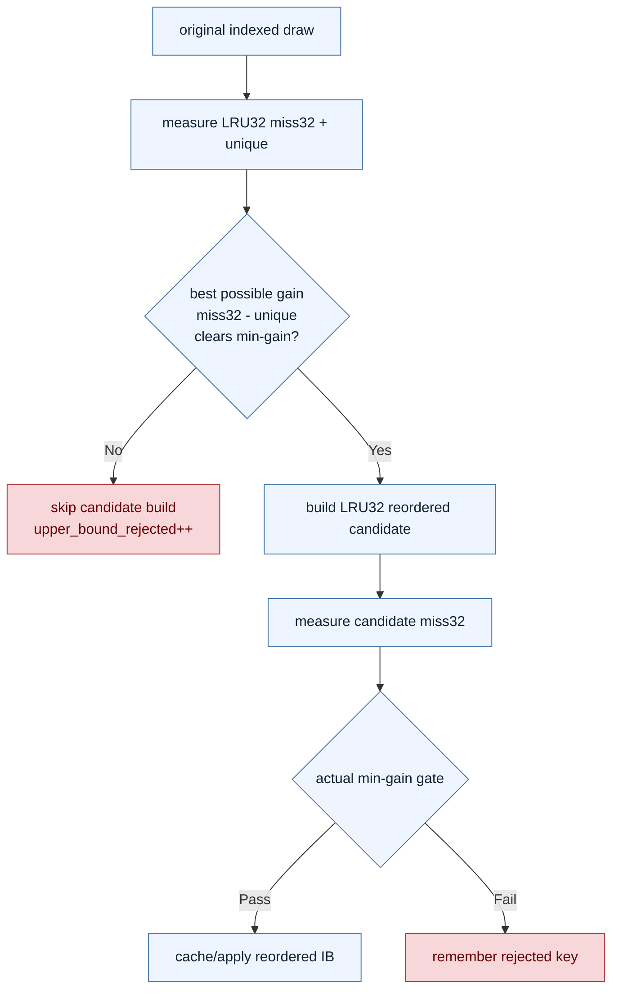

# Candidate Upper-Bound Pre-Gate Rejection

**Question / hypothesis.** [[index-cache-locality-cpucost.13]] closed the
generic active-frontier/container family: cap, lazy heap, and cached-count
buckets all cut different forms of selection work but regressed CPU. Can we
avoid building low-value candidates instead? For any candidate, LRU32 miss count
cannot go below the source draw's unique index count. If
`(original_miss32 - unique) / original_miss32` cannot clear the active min-gain
threshold, candidate construction is provably wasted.

**Implementation.** Added diagnostic-only
`DXMT9_INDEX_CACHE_CANDIDATE_UPPER_BOUND_GATE=1` and wrapper option
`--index-cache-candidate-upper-bound-gate`. The path measures original LRU32
misses plus unique index count, then skips candidate construction when even the
theoretical best miss32 (`unique`) cannot satisfy the configured `_MIN_GAIN_PCT`.
It reports the skip count through
`encode_draw_index_cache_candidate_upper_bound_rejected`.

This should be semantically safe because it only rejects candidates that cannot
pass the same min-gain gate even in the best possible ordering. The risk is CPU:
the original measurement path now pays unique-count work before it knows whether
a candidate will be useful.

**Run.**

```sh
bash scripts/tools/run_3dmark05_perf_probe.sh \
  --suffix defaultgate-noenc-opaque-depth-upperbound-r1 \
  --frame 50 --no-gputrace --no-encoder-breakdown --timeout 180 --top 5 \
  --optimize-opaque-depth-index-cache \
  --optimize-opaque-depth-index-cache-min-gain-pct 10 \
  --index-cache-candidate-upper-bound-gate
```

The app reached `present_encoded=1440`, but the wrapper did not finish writing
`result.json` before the run was manually cleaned up after the final-frame hang.
The summary is therefore `partial-log`, synthesized from the final
`[dxmt9-perf]` line in `dxmt9.log`.

**Result.** The pre-gate did skip candidates and preserved the created-cache
set, but CPU regressed:

| Metric | selectvolume-r1 | upperbound-r1 | Delta |
|---|---:|---:|---:|
| `present_encoded` | `1,440` | `1,440` | `0` |
| `encode_draw_index_cache_candidate_upper_bound_rejected` | `0/missing` | `76` | `+76` |
| `indexed_cache_opt_candidate_draws` | `125` | `67` | `-46.40%` |
| `indexed_cache_opt_candidate_skipped` | `18` | `76` | `+322.22%` |
| `reordered_index_cache_created` | `67` | `67` | `0` |
| `reordered_index_cache_created_bytes` | `1,386,168` | `1,386,168` | `0` |
| `encode_draw_index_cache_original_measure_cpu_ms` | `15.146` | `24.301` | `+60.45%` |
| `encode_draw_index_cache_candidate_build_cpu_ms` | `124.083` | `130.685` | `+5.32%` |
| `encode_draw_index_cache_candidate_select_cpu_ms` | `91.635` | `107.200` | `+16.99%` |
| `encode_draw_index_cache_candidate_cpu_ms` | `152.117` | `165.050` | `+8.50%` |
| `encode_draw_index_setup_cpu_ms` | `746.219` | `768.491` | `+2.98%` |
| `encode_draw_cpu_ms` | `16,527.955` | `16,391.895` | `-0.82%` |

The broad `encode_draw_cpu_ms` delta is run-noisy and not enough to override
the direct candidate bucket regression. The mechanism counter says the option
worked (`76` impossible candidates skipped, same `67` cache entries created),
but unique measurement plus changed remaining candidate workload cost more than
the avoided construction.



**Verdict.** Rejected as a CPU optimization. The upper-bound pre-gate is useful
diagnostically because it proves there are low-value candidates to skip without
changing the accepted cache set. It is not a promotion candidate in this form:
the extra unique-count pass increased original-measure CPU and the total
candidate CPU bucket.

The next CPU attempt should not add per-candidate measurement work on the hot
path. Better directions are a cheaper persistent per-source-IB candidate verdict,
a draw-shape prefilter that avoids reading index data, or a production cache
policy that records rejected keys earlier and amortizes the gate across repeated
draws.

**Related.** [[index-cache-locality]] · prev:
[[index-cache-locality-cpucost.13]] · [[index-cache-locality-cpucost.10]].
