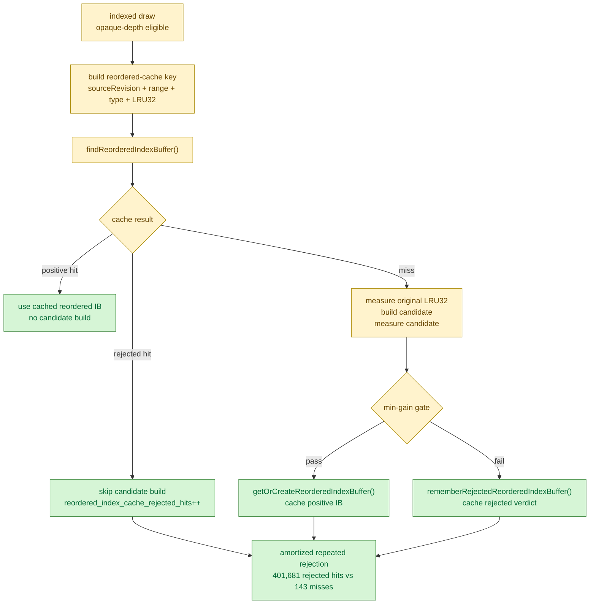

# Persistent Rejected Verdict Refresh

**Question / hypothesis.** [index-cache-locality-cpucost.14](index-cache-locality-cpucost.14.md) ended by
suggesting a cheaper persistent per-source-IB candidate verdict or earlier
rejected-key recording. Is that still a missing optimization in the current
post-visualfix tree?

**Code inspection.** The persistent rejected verdict already exists:

- `Pool::findReorderedIndexBuffer()` returns cache hits for either a real
  reordered IB or a rejected entry with the same source revision / start /
  count / type / order / cache-size key.
- `Pool::rememberRejectedReorderedIndexBuffer()` stores rejected entries in the
  per-source `reorderedIndexCache` and keeps them across draws until content
  revision / completed-sequence eviction.
- `dxmt9_draw_encoder.mm` treats `cacheOptPrelookupRejected` as a terminal
  prelookup result, so the candidate build path is skipped for repeated
  rejected keys.

**Run.** Re-ran current HEAD after the visual/cbuf identity fixes with the
production opaque-depth opt-in, no `.gputrace`, and no encoder breakdown:

```sh
bash scripts/tools/run_3dmark05_perf_probe.sh \
  --suffix post-visualfix-opaque-depth-noenc-r1 \
  --frame 60 --no-gputrace --no-encoder-breakdown --timeout 180 --top 5 \
  --optimize-opaque-depth-index-cache \
  --optimize-opaque-depth-index-cache-min-gain-pct 10
```

The wrapper watchdog timeout-finalized the run after the final-frame hang. The
summary is `partial-log`, synthesized from the final `[dxmt9-perf]` line, with
`present_encoded=1680`.

**Result.** The rejected verdict is heavily amortized already:

| Metric | Value |
|---|---:|
| `present_encoded` | `1,680` |
| `draw_calls` | `1,235,871` |
| `reordered_index_cache_lookups` | `687,387` |
| `reordered_index_cache_hits` | `285,563` |
| `reordered_index_cache_rejected_hits` | `401,681` |
| `reordered_index_cache_misses` | `143` |
| `reordered_index_cache_created` | `67` |
| `indexed_cache_opt_candidate_draws` | `125` |
| `indexed_cache_opt_candidate_skipped` | `18` |
| `indexed_cache_opt_candidate_original_miss32` | `530,289` |
| `indexed_cache_opt_candidate_miss32` | `418,033` |
| `encode_draw_index_cache_lookup_cpu_ms` | `125.334ms` |
| `encode_draw_index_cache_candidate_cpu_ms` | `194.675ms` |
| `encode_draw_index_cache_candidate_build_cpu_ms` | `166.314ms` |
| `encode_draw_index_cache_candidate_select_cpu_ms` | `133.329ms` |
| `encode_draw_index_cache_apply_cpu_ms` | `2.810ms` |

The comparison against the post-visualfix frame60 baseline is useful for shape,
not CPU apples-to-apples, because the baseline capture includes Xcode/encoder
breakdown instrumentation while this scout does not. Run-level counters still
show the opt-in is not a free global win: tile preservation changed
`-1,414.051 MiB` (`-0.70%`), while `gpu_command_buffer_time_ms` changed
`+108.85ms` (`+2.15%`) and `completion_wait_ms` changed `+603.392ms`
(`+1.77%`).



**Verdict.** Accepted as attribution, rejected as a new optimization direction.
The missing piece is not persistent rejected-key caching; it is already present
and accounts for `401,681` rejected hits against only `143` cold misses. The
remaining CPU work is either:

- reduce or avoid the cold miss candidate path without another per-candidate
  measurement pass;
- avoid the lookup entirely for draw shapes that cannot enter the production
  scope;
- increase semantic-safe GPU payoff so the existing `~320ms` total lookup +
  candidate CPU cost has a clear whole-run win.

Until that changes, opaque-depth index-cache locality remains a proven opt-in
GPU mechanism, not a default `perf` profile behavior.

**Related.** [index-cache-locality](../index-cache-locality.md) · prev:
[index-cache-locality-cpucost.14](index-cache-locality-cpucost.14.md) · [index-cache-locality-cpucost.10](index-cache-locality-cpucost.10.md).
