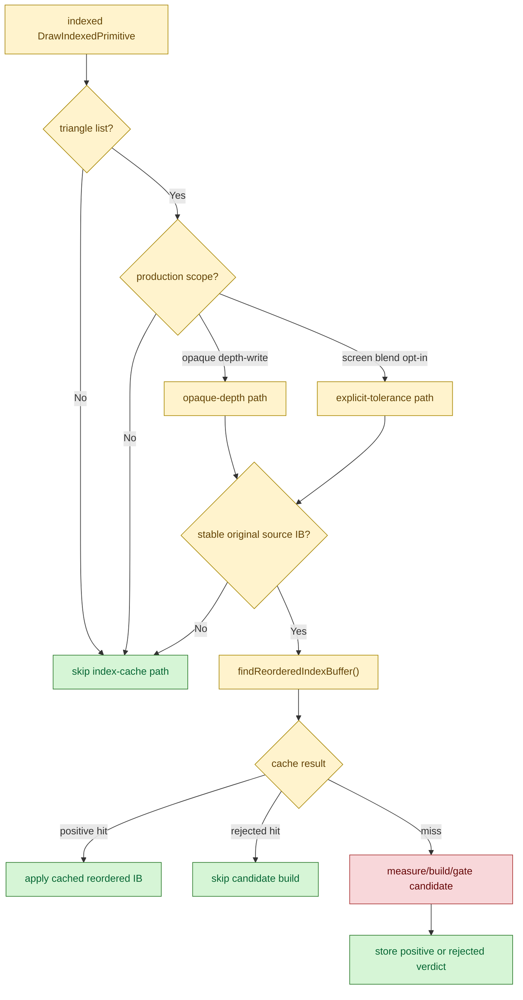

# Draw-Shape Prefilter Audit

**Question / hypothesis.** After [[index-cache-locality-cpucost.15]] rejected
"missing persistent rejected verdict" as the remaining CPU blocker, is there
still an obvious draw-shape prefilter missing before the reordered-index-cache
lookup/candidate path?

**Code audit.** The cheap shape gates already sit before the prelookup and
candidate build path:

- `optimizeOpaqueDepthIndexCacheScopeMatches` requires
  `DXMT9_OPTIMIZE_OPAQUE_DEPTH_INDEX_CACHE`, triangle-list topology, and
  `shouldOptimizeOpaqueDepthIndexOrder(...)`.
- `optimizeScreenBlendIndexCacheScopeMatches` separately requires
  `DXMT9_OPTIMIZE_SCREEN_BLEND_INDEX_CACHE`, triangle-list topology, and
  `shouldOptimizeScreenBlendIndexOrder(...)`.
- `stableOriginalIndexBufferForCandidate` rejects user-index and transient
  cases before building a reordered-cache key.
- `cacheOptPrelookupEligible` is true only for those production scope matches
  plus stable source IB. Non-scope draws never call
  `findReorderedIndexBuffer()`.
- Repeated negative decisions are terminal at prelookup:
  `cacheOptPrelookupRejected` suppresses the candidate build path, and
  `rememberRejectedReorderedIndexBuffer()` stores the rejected verdict by
  source revision / start / count / type / order / cache-size key.

That means the current `reordered_index_cache_lookups` bucket is not broad
noise from unrelated draw shapes. It is the accepted/rejected decision stream
for shapes that already passed the production scope and stable-IB predicates.

**Prior lookup evidence.** Two earlier lookup-structure attempts were already
rejected:

- [[index-cache-locality-cpucost.02]] measured the original vector lookup at
  about `0.18us` per cached decision; `unordered_map` and last-hit variants
  regressed or stayed flat.
- [[index-cache-locality-cpucost.07]] tried a single-scan hot path; explicit
  `encode_draw_index_cache_lookup_cpu_ms` regressed `99.368 -> 102.799ms`.

The post-visualfix refresh then showed why the lookup still appears in bulk:
`687,387` lookups contained `285,563` positive hits, `401,681` rejected hits,
and only `143` misses. The cache is doing real amortization; the remaining cost
is repeated eligible-key decisions plus cold-miss candidate construction, not
unfiltered non-eligible draw traffic.

**Verdict.** Rejected as a missing optimization. A simple draw-shape prefilter
is already present before lookup/candidate work. Future CPU work should not
spend time on another broad "avoid unrelated draws" gate unless new telemetry
proves a specific eligible subclass can be safely excluded without losing
positive hits. The remaining plausible CPU paths are narrower:

- reduce the cold-miss candidate construction path itself;
- make the lookup/accounting path cheaper without repeating the rejected
  `unordered_map`, last-hit, or single-scan forms; or
- increase semantic-safe GPU payoff so the existing eligible-decision stream
  is worth paying in the default profile.

**Related.** [[index-cache-locality]] · prev:
[[index-cache-locality-cpucost.15]] · [[index-cache-locality-cpucost.02]] ·
[[index-cache-locality-cpucost.07]].
