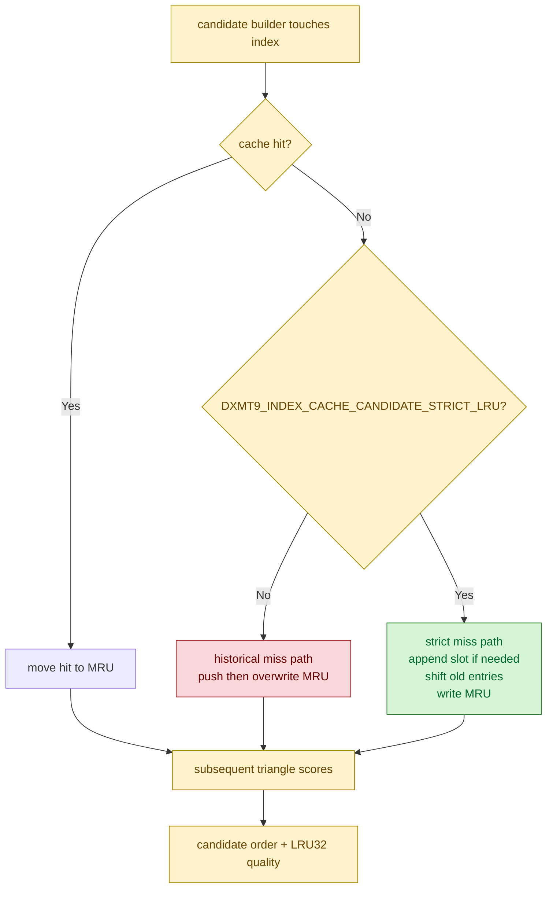

# Strict LRU Candidate Builder Diagnostic

**Question / hypothesis.** The candidate builder's simulated post-transform
cache used a historical miss path that could duplicate the inserted index while
the cache was still warming. Would switching that diagnostic path to the same
no-duplicate LRU update as the LRU32 measurement helper reduce candidate CPU or
improve candidate quality enough to matter?

**Implementation.** Added a default-off diagnostic flag,
`DXMT9_INDEX_CACHE_CANDIDATE_STRICT_LRU`, exposed by
`run_3dmark05_perf_probe.sh --index-cache-candidate-strict-lru`. The production
default remains unchanged. With the flag set, the builder shifts the simulated
cache on miss exactly like `measureIndexCacheMiss32ForDraw()`; without it, the
old builder path is preserved for A/B.



**Run.**

```sh
bash scripts/tools/run_3dmark05_perf_probe.sh \
  --suffix post-visualfix-opaque-depth-strict-lru-noenc-r1 \
  --frame 60 --no-gputrace --no-encoder-breakdown --timeout 180 --top 5 \
  --optimize-opaque-depth-index-cache \
  --optimize-opaque-depth-index-cache-min-gain-pct 10 \
  --index-cache-candidate-strict-lru
```

The wrapper timeout-finalized the run with status `124` after writing
postprocess artifacts. The final log still reached `present_encoded=1680`, so
run-level counters are comparable to [[index-cache-locality-cpucost.15]].

**Result.** Strict LRU changes the candidate ordering but does not produce a
useful win:

| Metric | Baseline | Strict LRU | Delta |
|---|---:|---:|---:|
| `present_encoded` | `1,680` | `1,680` | `0` |
| `draw_calls` | `1,235,871` | `1,237,509` | `+1,638` |
| `indexed_cache_opt_candidate_draws` | `125` | `125` | `0` |
| `indexed_cache_opt_candidate_original_miss32` | `530,289` | `530,289` | `0` |
| `indexed_cache_opt_candidate_miss32` | `418,033` | `418,079` | `+46` |
| `encode_draw_index_cache_candidate_cpu_ms` | `194.675ms` | `189.593ms` | `-5.082ms` |
| `encode_draw_index_cache_candidate_build_cpu_ms` | `166.314ms` | `161.429ms` | `-4.885ms` |
| `encode_draw_index_cache_candidate_select_cpu_ms` | `133.329ms` | `128.776ms` | `-4.553ms` |
| `encode_draw_index_cache_candidate_select_slots` | `2,061,493` | `2,052,322` | `-9,171` |
| `encode_draw_index_cache_candidate_select_candidates_max` | `157` | `126` | `-31` |
| `reordered_index_cache_misses` | `143` | `143` | `0` |
| `reordered_index_cache_created` | `67` | `67` | `0` |
| `encode_draw_cpu_ms` | `17,312.634ms` | `17,349.564ms` | `+36.930ms` |
| `gpu_command_buffer_time_ms` | `5,173.834ms` | `5,014.845ms` | `-158.989ms` |

The apparent `gpu_command_buffer_time_ms -3.07%` is a no-gputrace partial-log
signal and is not accepted as GPU proof. The important scoped counters are
negative or too small: candidate quality regresses by `+46` LRU32 misses, the
candidate CPU reduction is only `~5ms`, and total encode-draw CPU regresses by
`+36.930ms`.

**Visual smoke.** `actual.png` is a normal visible GT1 frame by inspection
(robot, flare, background, and HUD are present). PNG diff against the
post-visualfix opaque-depth noenc run reports high changed-pixel percentages
because the two captures are not the same animation frame (`SSIM 0.973072`
full, `0.964753` crop-bottom-96). Diff against the `v0.0.1` visual anchor is
larger for the same reason. Treat these diffs as broad corruption triage only;
promotion would still require a same-input image proof or a stable visual gate.

**Verdict.** Rejected as a CPU optimization and kept as diagnostic-only. The
strict LRU path is a cleaner model of the measurement helper, but this run does
not show enough CPU improvement or candidate-quality improvement to justify
changing the default builder. Future index-cache CPU work should focus on
cheaper cold-miss candidate construction or narrower eligible-subclass proof,
not local LRU miss-path normalization.

**Related.** [[index-cache-locality]] · prev:
[[index-cache-locality-cpucost.16]] · [[baselines-visual-capture.02]].
