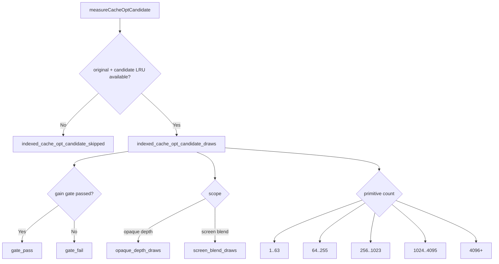

# Candidate Gate Shape Counters

**Question / hypothesis.** The opaque-depth reordered-index path is the only
accepted production GPU win, but it still cannot become a default because the
non-diagnostic smoke pays extra CPU in index setup / candidate construction.
The previous rejected CPU probes narrowed the owner to candidate cold-miss work,
but the run summaries did not show whether the waste is concentrated in failed
gate candidates, a specific render class, or a primitive-size band. Can the next
no-gputrace scout expose that shape without changing selection?

**Implementation.** Added zero-allocation integer counters emitted only after a
candidate has both original and reordered LRU measurements:

| Counter | Meaning |
|---|---|
| `indexed_cache_opt_candidate_gate_pass` | Candidate passed the min-gain gate |
| `indexed_cache_opt_candidate_gate_fail` | Candidate was measured but rejected by the min-gain gate |
| `indexed_cache_opt_candidate_opaque_depth_draws` | Candidate came from the opaque-depth production scope |
| `indexed_cache_opt_candidate_screen_blend_draws` | Candidate came from the screen-blend diagnostic scope |
| `indexed_cache_opt_candidate_primitive_bucket_*` | Candidate primitive-count distribution using the same buckets as encoder draw-size telemetry |

The same fields are available in the cumulative run counters, per-encoder dxmt
breakdown rows, Xcode/dxmt joined summaries, and
`summarize_index_cache_runtime.py` output.



**Scout.**

```sh
bash scripts/tools/run_3dmark05_perf_probe.sh \
  --suffix opaque-depth-gate-shape-r1 \
  --frame 60 --no-gputrace --timeout 120 --top 5 \
  --optimize-opaque-depth-index-cache \
  --optimize-opaque-depth-index-cache-min-gain-pct 10
```

Then summarize the encoder CSV with:

```sh
python3 scripts/tools/summarize_index_cache_runtime.py \
  --run gate-shape=experiments/output/app-d3d9-3dmark05-opaque-depth-gate-shape-r1/3dmark05-perf-encoders.csv \
  --output traces/app-d3d9-3dmark05-opaque-depth-gate-shape-r1/analysis/index-cache-runtime.md \
  --csv-output traces/app-d3d9-3dmark05-opaque-depth-gate-shape-r1/analysis/index-cache-runtime.csv
```

**Result.** `opaque-depth-gate-shape-r1` was a no-gputrace run with
`present_encoded=1800` and `status=pass` (`timed_out=true` is the wrapper's
expected final-frame watchdog kill). The frame-60 encoder breakdown reports:

| Scope | Value |
|---|---:|
| Reordered-cache lookups | `198` |
| Runtime applied / skipped | `102 / 96` |
| Cache hits / rejected hits / misses / created | `102 / 96 / 0 / 0` |
| Candidate draws / bytes | `102 / 1,531,278` |
| Candidate gate pass / fail | `102 / 0` |
| Opaque-depth / screen-blend candidates | `102 / 0` |
| Candidate LRU32 original -> effective | `460,019 -> 333,936` |
| Candidate LRU32 delta | `-126,083` (`-27.41%`) |
| Primitive buckets | `64..255=7`, `256..1023=19`, `1024..4095=64`, `4096+=12` |

Run-level cumulative counters show the broader CPU shape:

| Counter | Value |
|---|---:|
| `indexed_cache_opt_candidate_draws` | `227` |
| `indexed_cache_opt_candidate_gate_pass / fail` | `169 / 58` |
| `indexed_cache_opt_candidate_opaque_depth_draws` | `227` |
| `indexed_cache_opt_candidate_primitive_bucket_1_63` | `11` |
| `indexed_cache_opt_candidate_primitive_bucket_64_255` | `24` |
| `indexed_cache_opt_candidate_primitive_bucket_256_1023` | `45` |
| `indexed_cache_opt_candidate_primitive_bucket_1024_4095` | `117` |
| `indexed_cache_opt_candidate_primitive_bucket_4096_plus` | `30` |
| `encode_draw_index_setup_cpu_ms` | `1,303.474` |
| `encode_draw_index_cache_candidate_cpu_ms` | `470.160` |
| `encode_draw_index_cache_candidate_build_cpu_ms` | `312.914` |
| `encode_draw_index_cache_candidate_select_cpu_ms` | `255.479` |
| `encode_draw_index_cache_candidate_measure_cpu_ms` | `73.234` |
| `encode_draw_index_cache_lookup_cpu_ms` | `125.030` |
| `encode_draw_index_cache_apply_cpu_ms` | `6.056` |

For context only, comparing against the nearby no-opt
`capture-layer-file-r18-20260615` run gives index setup
`0.1955 -> 0.7242 ms/present`; the candidate builder plus cache lookup add
`0.3307 ms/present`. That comparison is not a clean FPS A/B because the runs
have different capture/debug context and present counts, but it sizes the
remaining CPU tax.

**Interpretation gate.**

- Frame 60 is not wasting CPU on failed min-gain candidates: every measured
  candidate passes, and all candidates are in the opaque-depth scope. A simple
  "skip gate-fail candidates earlier" fix will not help the hot Xcode target
  rows.
- The hot frame is dominated by valid mid/large candidates (`64` of `102` in
  `1024..4095`, `12` in `4096+`). The blocker is the cost of building valid
  candidates, then amortizing cached hits, not diagnostic scope leakage.
- Whole-run gate fails still exist (`58 / 227`) and are mostly outside the
  frame-60 hot encoder scope. They are a secondary pre-gate opportunity, not the
  next Xcode proof lever.
- `reordered_index_cache_hits=307,467` and `rejected_hits=433,508` at run level
  prove the persistent verdict/cache path is active; the next default-promotion
  CPU work should reduce cold candidate construction and per-draw lookup/setup
  overhead rather than adding another measured candidate pass.

**Status.** Evidence accepted. The opaque-depth GPU win remains real and active,
but the production opt-in still should not become the shared `perf` default
until the `~0.33 ms/present` candidate+lookup tax and the broader
`encode_draw_index_setup_cpu_ms` increase are reduced or amortized.

**Related.** [index-cache-locality](index.md) · prev:
index-cache-locality-cpucost.17.
