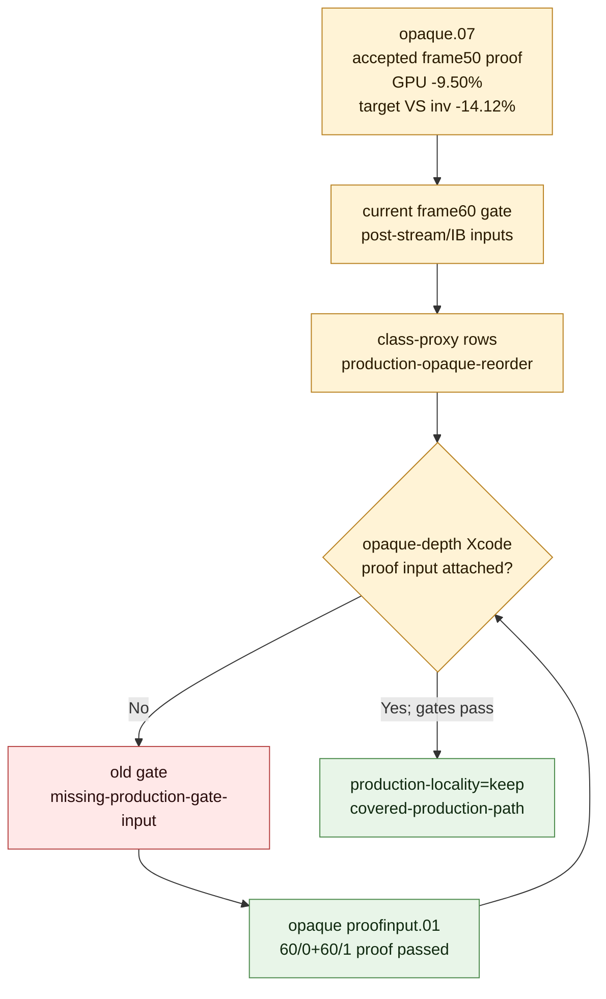

# Refreshed Gate Covers Opaque-Depth Proof Input

**Question / hypothesis.** Does the latest frame60 class-proxy queue prove that
the opaque-depth production path should be promoted for the newly ranked rows,
or does it only show candidate ceiling until the production proof input is
attached?

**Method.** Re-read the post-stream/IB gate report and next-experiment queue,
then regenerate the VS scaling input with the refreshed opaque proof run
`post-streamib-frame60-opaque-proof-r1` included. The historical
index-cache-locality-opaque.07 proof remains accepted: the fast-measure
frame50 run passed `--require-opaque-depth-index-cache-proof`. The refreshed
frame60 proof is recorded in index-cache-locality-proofinput.01.

**Result.** The earlier `frame60-current-perf-gates.csv` emitted
`production-locality=missing-production-gate-input` because the VS scaling set
did not include an opaque-depth production proof run. After adding the refreshed
opaque proof input, the current gate now emits `production-locality=keep`:
`post-streamib-frame60-opaque-proof-r1` improves top GPU `-3.31%` and VS
invocations `-6.43%`. The next-experiment queue correspondingly marks the
opaque-depth rows as `covered-production-path`.

**Verdict.** The input scope gap is closed for opaque-depth locality. Keep the
production-shaped opaque opt-in as the accepted GPU win, and do not spend
another trace on threshold-only opaque retests. The remaining unresolved proof
input is screen-blend movement plus same-input exact/`lsb1` semantic image
evidence.

**Related.** [index-cache-locality](index.md) · prev:
index-cache-locality-opaque.07 · index-cache-locality-proofinput.01 ·
[index-cache-locality-screenblend.05](index-cache-locality-screenblend.05.md) ·
[overview-3dmark05-gt1](../overview-3dmark05-gt1.md).
