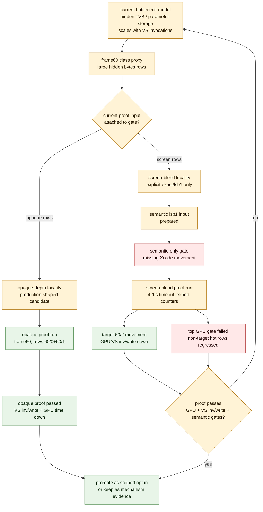

# Current Experiment Purpose And Proof-Input Recipes

> **Outdated — every artifact this leaf cites in `source:` is gone from disk.** The numbers below cannot be re-derived or re-checked. Kept as history; do not cite it as current evidence.

**Question / hypothesis.** What does the current continued experiment buy us,
given that the main bottleneck is already believed to be hidden Apple
vertex/tiler/parameter storage rather than ordinary CPU state churn?

**Method.** Re-read the current frame60 gate, run dry-run probe recipes for the
two remaining semantic-safe locality paths, clear the trace-space guard, then
execute the opaque-depth proof capture and Xcode counter export. The
screen-blend path now has both same-input semantic image input and a full
gputrace/Xcode counter proof attempt. That attempt confirms target-row movement
on `60/2`, but fails the aggregate top-GPU gate.



**Result.** The experiment is not trying random perf flags. It is testing
whether a candidate can reduce the actual owner bucket, `VS invocations -> hidden
vertex/backend writes -> GPU time`, without losing visual/semantic correctness.
The opaque-depth track now has attached current-frame proof. The screen-blend
track has same-input semantic proof input and current Xcode movement on `60/2`,
but the full proof fails because the top-hot GPU aggregate does not decrease.
Follow-up row telemetry shows the cache path only applied to `60/2`; `60/0+60/1`
were unchanged in VS invocations/write/draw/geometry and moved only in GPU time.

| Track | Current gate | Meaning |
|---|---|---|
| Opaque-depth locality | current Xcode movement proof passed for target rows `60/0`, `60/1` | Production-shaped path is active and reduces the owner bucket on the refreshed frame60 rows. |
| Screen-blend locality | full proof failed: target `60/2` improves, top GPU aggregate regresses | Current rank-1 same-input `lsb1` proof passes and target `60/2` lowers VS invocations/write. Reordered-cache counters are target-only; non-target hot-row GPU-time drift prevents promotion. |

The opaque proof run id is
`app-d3d9-3dmark05-post-streamib-frame60-opaque-proof-r1`. It timed out at the
wrapper limit because 3DMark05 can hang near the final frame, so `result.json`
was absent. Finalize timeout-ended Xcode proofs with
`--allow-partial-stable-frame-proof`; without that flag the stable-frame preset
intentionally requires `result.json`. The equivalent Xcode counter and
target-row gates, excluding only that `result.json` requirement, passed.

Opaque proof summary:

| Metric | Before | After | Delta |
|---|---:|---:|---:|
| Top-3 GPU time | `33.614 ms` | `32.501 ms` | `-3.31%` |
| Top-3 VS buffer write | `1,627.332 MiB` | `1,518.993 MiB` | `-6.66%` |
| Top-3 hidden backend write estimate | `1,597.755 MiB` | `1,490.229 MiB` | `-6.73%` |
| Target rows `60/0+60/1` GPU time | `13.800 ms` | `12.331 ms` | `-10.64%` |
| Target rows VS buffer write | `646.173 MiB` | `537.842 MiB` | `-16.77%` |
| Target rows VS invocations | `536,583` | `460,839` | `-14.12%` |
| Target rows draw calls / vertices / triangles | unchanged | unchanged | `0.00%` |

Runtime cache-path proof:

| Metric | Value |
|---|---:|
| Reordered-cache lookups / hits / rejected hits | `198 / 102 / 96` |
| Applied / skipped draws | `102 / 96` |
| Candidate draws / bytes | `337 / 4,231,398` |
| Candidate original LRU32 -> effective LRU32 | `1,258,631 -> 951,612` |
| Candidate LRU32 delta | `-307,019 (-24.39%)` |

The dry-runs still record exact capture recipes under the current gate analysis
directory:

- `opaque-proof-dry-run.txt` creates run id
  `app-d3d9-3dmark05-post-streamib-frame60-opaque-proof-r1` and finalizes with
  `--require-opaque-depth-index-cache-proof`, target rows `60/0` and `60/1`,
  target VS write/invocation decrease, reordered-cache hits, and stable-frame
  checks.
- `screenblend-proof-dry-run.txt` creates run id
  `app-d3d9-3dmark05-post-streamib-frame60-screenblend-proof-r1` and finalizes
  with `--require-screen-blend-cache-proof`, target row `60/2`, semantic policy
  `lsb1`, the current mini-replay before/after PPM paths,
  `--require-semantic-image-proof`, and `--allow-partial-stable-frame-proof`
  for timeout-finalized captures.

Current screen-blend full proof attempt:

| Metric | Value |
|---|---:|
| Top-3 GPU time | `32.984 ms -> 33.302 ms` (`+0.97%`) |
| Top-3 VS buffer write | `1,627.332 MiB -> 1,520.951 MiB` (`-6.54%`) |
| Target row `60/2` GPU time | `19.184 ms -> 18.503 ms` (`-3.55%`) |
| Target row `60/2` VS buffer write | `981.159 MiB -> 874.767 MiB` (`-10.84%`) |
| Target row `60/2` VS invocations | `642,001 -> 572,933` (`-10.76%`) |
| Non-target hot rows `60/0+60/1` GPU time | `13.800 ms -> 14.800 ms` (`+7.25%`) |
| Reordered-cache lookups on `60/0+60/1` | `0` |
| Runtime lookups / hits / rejected hits | `103 / 66 / 37` |
| Applied / skipped draws | `66 / 37` |
| Candidate LRU32 delta | `-307,019 (-24.39%)` |
| `lsb1` changed pixels | `33 / 786,432`, max delta `1`, SSIM `1.000000` |
| Finalizer gate | failed: `top_gpu_ms did not decrease (32.984 -> 33.302)` |

The mini-replay still has `texture_input_count=0`, so this is same-input
tolerance evidence for the current screen-blend window, not a complete
real-texture production proof. The Xcode proof attempt is stronger than the old
semantic-only gate because target-row movement is now measured, but the proof is
not promotable because the aggregate GPU gate failed.

The initial dry-runs stopped at the launch guard because available space was
below the wrapper's `2048 MiB` minimum. The cleanup report was non-destructive;
large raw logs in `experiments/output/app-d3d9-3dmark05-tile-ffp-coverage-r1`
were then gzip-compressed after writing a sha256 manifest, which gave enough
space for the opaque proof capture and Xcode counter export.

**Run recipes.**

Opaque-depth proof reproduction:

```sh
bash scripts/tools/run_3dmark05_perf_probe.sh \
  --suffix post-streamib-frame60-opaque-proof-r1 \
  --frame 60 \
  --baseline-joined traces/app-d3d9-3dmark05-post-visualfix-frame60-baseline-r1/analysis/frame60-xcode-dxmt-joined-summary.csv \
  --target-row-key 60/0 \
  --target-row-key 60/1 \
  --optimize-opaque-depth-index-cache \
  --optimize-opaque-depth-index-cache-min-gain-pct 10 \
  --require-opaque-depth-index-cache-proof \
  --allow-partial-stable-frame-proof \
  --timeout 420
```

Screen-blend proof reproduction. This exact proof was run and demoted by the
aggregate top-GPU gate; keep it as a replay recipe and negative promotion gate.

```sh
bash scripts/tools/run_3dmark05_perf_probe.sh \
  --suffix post-streamib-frame60-screenblend-proof-r1 \
  --frame 60 \
  --baseline-joined traces/app-d3d9-3dmark05-post-visualfix-frame60-baseline-r1/analysis/frame60-xcode-dxmt-joined-summary.csv \
  --target-row-key 60/2 \
  --optimize-screen-blend-index-cache \
  --optimize-screen-blend-index-cache-min-gain-pct 10 \
  --semantic-image-policy lsb1 \
  --semantic-image-before traces/app-d3d9-3dmark05-post-streamib-frame60-60-2-screenblend-rank1-geometry-r1/analysis/mini-replay-screenblend-rank1/original/original.ppm \
  --semantic-image-after traces/app-d3d9-3dmark05-post-streamib-frame60-60-2-screenblend-rank1-geometry-r1/analysis/mini-replay-screenblend-rank1/cache-opt-lru32/cache-opt-lru32.ppm \
  --semantic-image-min-active-pct 1 \
  --require-screen-blend-cache-proof \
  --allow-partial-stable-frame-proof \
  --timeout 420
```

After Xcode opens the `.gputrace`, export with embedded performance data, open
Show Performance -> Counters, wait for counter profiling to finish, wait at
least `60s` after the counters table appears, then export encoder counters into
the same run's `analysis/` directory before finalizing.

**Verdict.** The current experiment is aligned with the performance goal and has
now produced both a current-frame opaque-depth proof and a screen-blend
demotion proof. It matters because it separates the mechanisms: opaque-depth is
a promotable opt-in path, while screen-blend confirms the same invocation/write
chain only on target `60/2` and fails full-frame/top-hot GPU promotion because
unchanged non-target rows drift in replay timing. Residual `60/2` remains the
largest owner, but the next useful work is no longer "get any Xcode movement";
it is either a broader semantic-safe target set or a non-reorder backend
denominator change. Both proof runs are timeout-finalized partial catalogue
runs rather than clean `result.json` passes.

**Related.** [index-cache-locality](index.md) · [index-cache-locality-opaque.08](index-cache-locality-opaque.08.md) ·
[index-cache-locality-screenblend.05](index-cache-locality-screenblend.05.md) · [index-cache-locality-screenblend.06](index-cache-locality-screenblend.06.md)
· [index-cache-locality-screenblend.07](index-cache-locality-screenblend.07.md) · [index-cache-locality-screenblend.08](index-cache-locality-screenblend.08.md)
· [overview-3dmark05-gt1](../overview-3dmark05-gt1.md).
