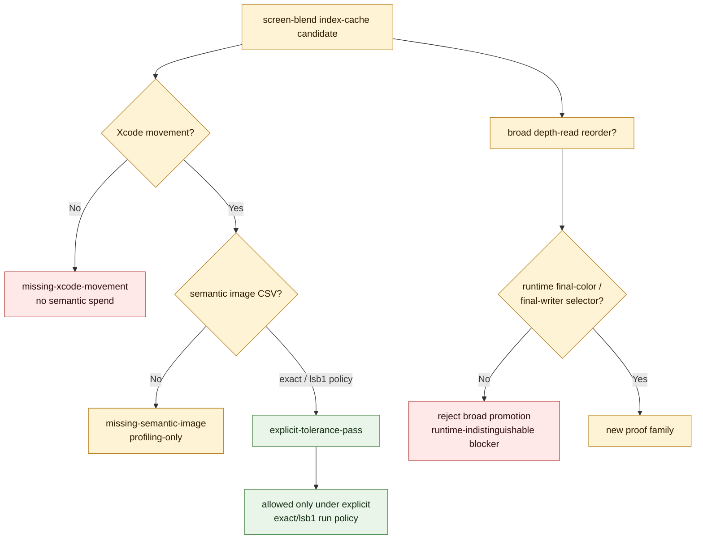

# Explicit LSB1 Screen-Blend Gate

**Question / hypothesis.** Can the `50/2` screen-blend index-cache path move the
same hidden TVB / parameter-buffer limiter as opaque-depth locality, and can it
be promoted beyond "profiling-only" without generalizing unsafe depth-read
reorder?

**Method.** Compared the current frame50 baseline against the combined
opaque-depth + screen-blend index-cache run and fed the Xcode scaling,
semantic-image, primitive-conflict, runtime-selector, and class-proxy CSVs into
`summarize_3dmark05_perf_gates.py`. The screen-blend path must clear movement
gates first, then carry an explicit semantic-image policy (`exact` or `lsb1`).
Broad depth-read reorder is judged separately with final-color/final-writer
evidence.

**Result.** Combined opaque + screen-blend locality is the strongest measured
stable GPU path in the current corpus: top GPU `-11.89%`, VS write `-13.20%`,
and VS invocations `-12.29%`. Attribution stays invocation-dominant:
`-214.760MiB` VS-write delta decomposes to `-198.917MiB` from invocation count
and only `-15.843MiB` from bytes/invocation. The screen-blend semantic image
gate passes only as an explicit `lsb1` tolerance artifact: `739 / 786,432`
pixels differ, max delta `1`, SSIM `1.000000`.

The same gate report rejects broader depth-read promotion. Visible exact-pass
movement exists (`-8,446` LRU32), but there is also a visible final-color hazard
(`-1,407` LRU32). Runtime-visible state, geometry, shader, and VS/PS constant
hash fields cannot split the known pass/fail group; visible exact draws
`3,5,6,7` and fail draw `4` share all `43` runtime-visible fields. The only
separators are trace-local `vsconsts_hash` and draw-local
`runtime.uniform_payload_hash`, which are overfit debug keys, not production
selectors.

**Verdict.** Accepted only under explicit semantic policy. Opaque-depth locality
remains the production-safe path. Screen-blend locality may be used as an
explicit exact/`lsb1` opt-in or proof artifact, but it must not be generalized
to broad depth-read reorder. The next Xcode budget should target either a real
final-color/final-writer oracle, or a new non-reorder backend mechanism that
preflights meaningful bytes/invocation or hidden-backend proxy movement before
capture.

**Related.** [index-cache-locality](../index-cache-locality.md) · prev: [index-cache-locality-screenblend.03](index-cache-locality-screenblend.03.md)
· [tvb-mechanism-proof](../tvb-mechanism-proof.md) · [primitive-reorder-diagnostics](../primitive-reorder-diagnostics.md) ·
[mini-replay-bisection](../mini-replay-bisection.md) · [hidden-backend-storage](../hidden-backend-storage.md).
