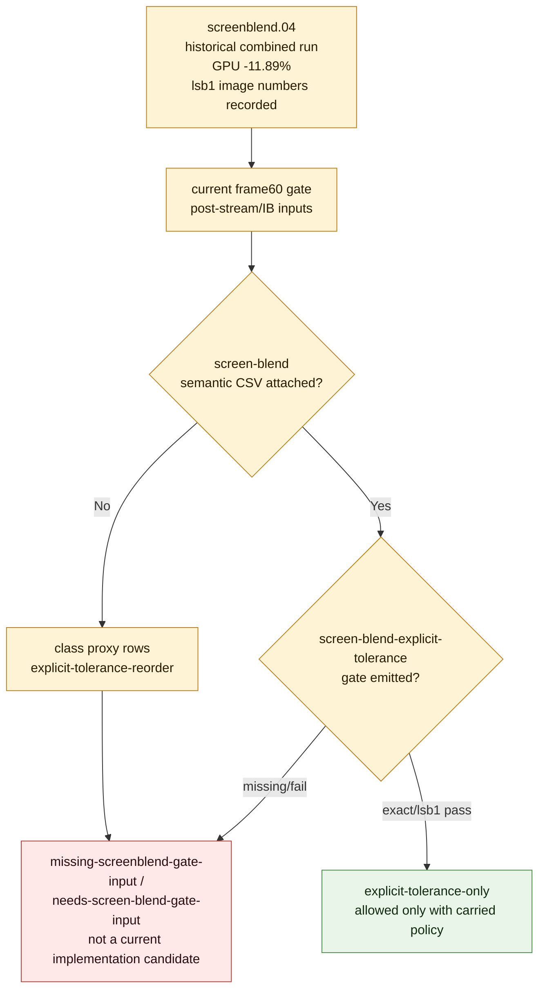

# Current Gate Requires Reattached Screen-Blend Proof

**Question / hypothesis.** Does the latest frame60 gate still carry enough
evidence to treat screen-blend index locality as an accepted explicit
`exact`/`lsb1` path?

**Method.** Re-read the current post-stream/IB gate report and next-experiment
queue. The current gate was built from frame60 backend/semantic artifacts and
does not include `--screen-blend-semantic-csv`. The historical
[index-cache-locality-screenblend.04](index-cache-locality-screenblend.04.md) result records the `739 / 786,432`
`lsb1` image tolerance, but the current trace tree does not expose that image
comparison CSV as a gate input.

**Result.** The refreshed `frame60-current-perf-gates.csv` now emits
`screen-blend-explicit-tolerance=missing-screenblend-gate-input`: there are
`8` class-proxy screen-blend rows, but the current VS scaling inputs expose no
screen-blend movement candidate and no semantic image CSV was provided.
`frame60-current-next-experiment-queue.csv` correspondingly marks those rows as
`needs-screen-blend-gate-input`. That is the correct conservative status for
the current evidence set: proxy size and historical movement are not enough
without same-input Xcode movement and semantic image proof attached to the
automated gate.

**Verdict.** Demote screen-blend locality from "currently accepted" to
"historical explicit-tolerance proof, current gate missing movement/proof input." It
remains useful as a mechanism ceiling and as a proof artifact, but it must not
be treated as a production/default candidate or as a current Xcode-spend target
until the exact/`lsb1` image CSV is reattached or regenerated in the same gate
run.

**Related.** [index-cache-locality](../index-cache-locality.md) · prev:
[index-cache-locality-screenblend.04](index-cache-locality-screenblend.04.md) · next:
[index-cache-locality-screenblend.06](index-cache-locality-screenblend.06.md) · [index-cache-locality-proofinput.01](index-cache-locality-proofinput.01.md) ·
[overview-3dmark05-gt1](../overview-3dmark05-gt1.md) ·
[hidden-backend-storage](../hidden-backend-storage.md).
