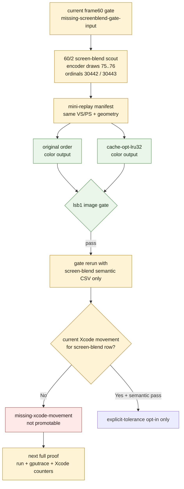

# Current Screen-Blend Semantic Input Prepared

**Question / hypothesis.** Can the current frame60 screen-blend proof gap be
narrowed from "missing all gate input" to "semantic input exists, Xcode movement
is still missing"?

**Method.** Dump a current `60/2` screen-blend geometry slice, build a
same-input mini-replay manifest for encoder draws `75..76`, replay original
order and `cache-opt-lru32`, compare the two color outputs under the explicit
`lsb1` image policy, then rerun the current gate with only that semantic CSV
attached. The geometry scout timed out under the wrapper watchdog, but it wrote
the needed shader and geometry artifacts before exit.

**Result.** The same-input mini-replay semantic input now exists for the current
screen-blend rank-1 window:

| Item | Value |
|---|---:|
| Row / encoder draws | `60/2`, draws `75..76` |
| Draw ordinals | `30442`, `30443` |
| VS / PS | `0xdee2a2c1e0557a9a` / `0x2f2090e9c1402459` |
| Replay LRU32 | `52,865 -> 38,272` |
| Replay LRU32 delta | `-14,593 (-27.60%)` |
| Changed pixels | `33 / 786,432` |
| Changed percent | `0.004196%` |
| Active percent before / after | `1.128387% / 1.128387%` |
| Max delta | `1` |
| Mean absolute delta | `0.000014` |
| RMS delta | `0.003740` |
| SSIM | `1.000000` |

The diagnostic gate rerun with the semantic CSV attached changes the blocker:
`screen-blend-explicit-tolerance` is now `missing-xcode-movement`, with evidence
`0 geometry-stable screen-blend candidates clear GPU/invocation gates`. That is
better than the previous `missing-screenblend-gate-input`, but it is still not
a promotion gate.

**Caveat.** This mini-replay has `texture_input_count=0`; it uses the replay's
deterministic default/white texture path, not dumped real texture sidecars. It
is therefore valid as same-input screen-blend order/tolerance evidence for this
window, but not as a complete real-texture production proof. The full proof
still needs current Xcode movement from a `gputrace` run, and a stricter
real-texture semantic replay remains useful if the next gate requires it.

**Verdict.** Screen-blend locality is still an explicit-tolerance mechanism
candidate, not a production/default optimization. The current experiment did
make progress: semantic input is prepared and passes `lsb1`; the remaining
blocker is specifically stable Xcode movement on the current screen-blend row.

**Related.** [index-cache-locality](../index-cache-locality.md) · prev:
[index-cache-locality-screenblend.05](index-cache-locality-screenblend.05.md) · [index-cache-locality-proofinput.01](index-cache-locality-proofinput.01.md)
· [overview-3dmark05-gt1](../overview-3dmark05-gt1.md).
