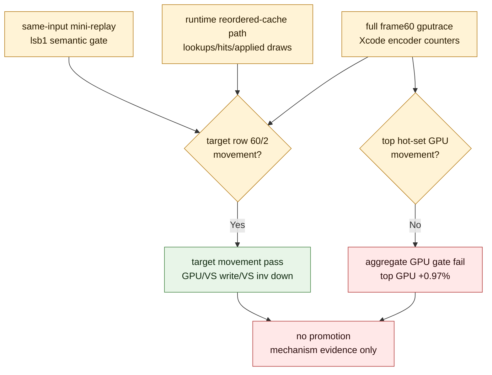

# Current Screen-Blend Full Proof Demoted By Aggregate GPU Gate

> **Outdated — every artifact this leaf cites in `source:` is gone from disk.** The numbers below cannot be re-derived or re-checked. Kept as history; do not cite it as current evidence.

**Question / hypothesis.** Does the current `60/2` screen-blend index-cache
path now clear the full proof gate once it has both same-input `lsb1` semantic
input and Xcode encoder counters?

**Method.** Run frame60 with `DXMT9_OPTIMIZE_SCREEN_BLEND_INDEX_CACHE` through
`run_3dmark05_perf_probe.sh`, capture `frame60.gputrace`, export Xcode embedded
performance data, wait for Counters profiling, export encoder counters, then
finalize against the post-visualfix frame60 baseline with:

- `--require-screen-blend-cache-proof`
- `--require-semantic-image-proof`
- `--require-top-gpu-decrease`
- `--require-target-vs-buffer-write-decrease`
- `--require-target-vs-invocations-decrease`
- `--target-row-key 60/2`
- `--allow-partial-stable-frame-proof`

The run timed out under the wrapper watchdog near the final frame, so it was
finalized as a partial stable-frame proof using the emitted log, gputrace, and
Xcode counters.

**Result.** The finalizer failed the proof. The important correction is that the
previous blocker was too broad: current target-row Xcode movement is present,
but the whole hot-set gate is not stable-positive.

| Metric | Before | After | Delta |
|---|---:|---:|---:|
| Total GPU time | `33.614 ms` | `33.933 ms` | `+0.95%` |
| Top-3 GPU time | `32.984 ms` | `33.302 ms` | `+0.97%` |
| Top-3 VS buffer write | `1,627.332 MiB` | `1,520.951 MiB` | `-6.54%` |
| Top hidden backend write estimate | `1,597.755 MiB` | `1,493.999 MiB` | `-6.49%` |
| Target row `60/2` GPU time | `19.184 ms` | `18.503 ms` | `-3.55%` |
| Target row `60/2` VS buffer write | `981.159 MiB` | `874.767 MiB` | `-10.84%` |
| Target row `60/2` VS invocations | `642,001` | `572,933` | `-10.76%` |
| Non-target hot rows `60/0+60/1` GPU time | `13.800 ms` | `14.800 ms` | `+7.25%` |

The target-row VS-write attribution is clean: row `60/2` reduces VS write by
`-106.391 MiB`, with `-105.505 MiB` attributed to invocation-count reduction and
only `-0.886 MiB` attributed to bytes-per-invocation.

Runtime cache-path evidence:

| Metric | Value |
|---|---:|
| Lookups / hits / rejected hits | `103 / 66 / 37` |
| Applied / skipped draws | `66 / 37` |
| Candidate draws / bytes | `337 / 4,231,398` |
| Candidate original LRU32 -> effective LRU32 | `1,258,631 -> 951,612` |
| Candidate LRU32 delta | `-307,019 (-24.39%)` |
| Probe rows / eligible / applied / rejected | `395 / 66 / 66 / 329` |

Semantic image gate:

| Metric | Value |
|---|---:|
| Policy | `lsb1` |
| Changed pixels | `33 / 786,432` |
| Changed percent | `0.004196%` |
| Active percent before / after | `1.128387% / 1.128387%` |
| Max delta / SSIM | `1 / 1.000000` |

**Interpretation.** This is a partial mechanism confirmation, not an
implementation promotion:

- The numerator lever is real on the target row: reordering lowers VS
  invocations, which lowers hidden vertex/backend writes.
- The full-frame/top-hot GPU result is not positive in this capture; non-target
  rows with unchanged VS invocations absorbed or exceeded the target-row GPU
  win.
- Because the proof requires top GPU decrease, the current screen-blend path
  remains explicit-tolerance mechanism evidence only.
- The residual problem is no longer "missing Xcode movement" but "target
  movement does not produce a stable full-frame/top-hot GPU win."

**Verdict.** Do not promote `DXMT9_OPTIMIZE_SCREEN_BLEND_INDEX_CACHE` beyond an
explicit diagnostic/tolerance artifact. The evidence is still useful: it
confirms that `60/2` can reduce hidden backend writes through VS-invocation
reduction, but the full proof failed and the next useful work is either a
broader semantic-safe target set or a non-reorder backend denominator change.

**Related.** [index-cache-locality](index.md) · prev:
[index-cache-locality-screenblend.06](index-cache-locality-screenblend.06.md) · [index-cache-locality-proofinput.01](index-cache-locality-proofinput.01.md)
· next: [index-cache-locality-screenblend.08](index-cache-locality-screenblend.08.md) · [overview-3dmark05-gt1](../overview-3dmark05-gt1.md).
