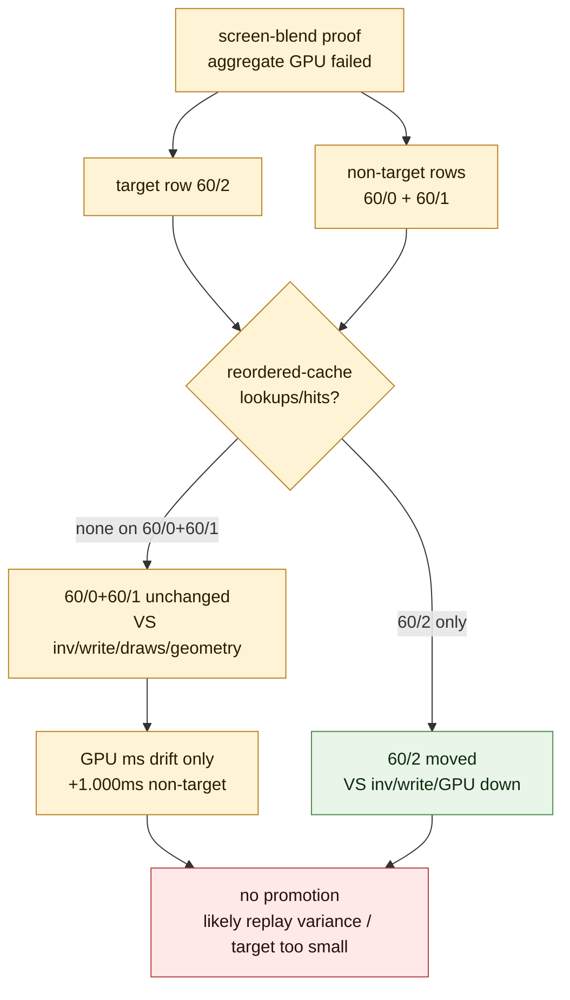

# Target Movement Versus Non-Target Replay Variance

**Question / hypothesis.** Did the current screen-blend proof fail because the
optimization mutated or destabilized non-target rows `60/0` and `60/1`, or
because a target-row win was not large enough to survive replay/GPU-time
variance in unchanged hot rows?

**Method.** Compare existing frame60 Xcode joined-summary CSVs without spending
another gputrace:

- post-visualfix baseline
- stream/IB staged `60/2` Xcode proof
- scoped `60/0` trim-varyings Xcode proof
- opaque-depth proof
- screen-blend proof

Rows `60/0`, `60/1`, and `60/2` are compared by `gpu_ms`,
`vs_invocations`, `vs_buffer_write_mib`, draw calls, vertices, and triangle
estimate. The screen-blend proof's reordered-cache counters are then checked
per row.

**Result.** The screen-blend path applies only to `60/2` in this proof:

| Row | Reordered-cache lookups | Hits | Rejected hits |
|---|---:|---:|---:|
| `60/2` | `103` | `66` | `37` |
| `60/1` | `0` | `0` | `0` |
| `60/0` | `0` | `0` | `0` |

Row-level Xcode/DXMT deltas against the post-visualfix baseline:

| Run | Row | GPU delta | VS inv delta | VS write delta | Draw / vertex / tri shape |
|---|---:|---:|---:|---:|---|
| stream/IB staged | `60/0` | `-0.247 ms` | `0` | `+0.003 MiB` | unchanged |
| stream/IB staged | `60/1` | `+0.193 ms` | `0` | `-0.008 MiB` | unchanged |
| stream/IB staged | `60/2` | `+0.093 ms` | `0` | `+0.008 MiB` | unchanged |
| scoped trim-varyings | `60/0` | `-0.053 ms` | `0` | `+0.042 MiB` | unchanged |
| scoped trim-varyings | `60/1` | `+0.660 ms` | `0` | `-0.003 MiB` | unchanged |
| scoped trim-varyings | `60/2` | `-0.270 ms` | `0` | `-0.001 MiB` | unchanged |
| opaque proof | `60/0` | `-1.160 ms` | `-27,087` | `-40.702 MiB` | unchanged |
| opaque proof | `60/1` | `-0.308 ms` | `-48,657` | `-67.630 MiB` | unchanged |
| opaque proof | `60/2` | `+0.377 ms` | `0` | `-0.008 MiB` | unchanged |
| screen-blend proof | `60/0` | `+0.525 ms` | `0` | `+0.017 MiB` | unchanged |
| screen-blend proof | `60/1` | `+0.475 ms` | `0` | `-0.006 MiB` | unchanged |
| screen-blend proof | `60/2` | `-0.682 ms` | `-69,068` | `-106.391 MiB` | unchanged |

Hot-row aggregate deltas for `60/0..2`:

| Run | GPU delta | VS inv delta | VS write delta |
|---|---:|---:|---:|
| stream/IB staged | `+0.039 ms` | `0` | `+0.003 MiB` |
| scoped trim-varyings | `+0.337 ms` | `0` | `+0.038 MiB` |
| opaque proof | `-1.092 ms` | `-75,744` | `-108.339 MiB` |
| screen-blend proof | `+0.319 ms` | `-69,068` | `-106.381 MiB` |

**Interpretation.**

- Screen-blend did not apply reordered-cache buffers to `60/0` or `60/1` in
  this proof. The non-target rows have no reordered-cache lookups/hits.
- The non-target rows keep the same VS invocations, VS write, draw count,
  vertex count, and triangle estimate. Their regression is GPU-time-only.
- Existing Xcode proofs already show GPU-time movement on rows whose counters
  and geometry are unchanged. The screen-blend non-target drift is larger than
  the small stream/IB run but within the same failure mode: unchanged row shape,
  changed replay timing.
- The screen-blend target win is real but too small in this capture to survive
  non-target replay drift under a strict top-GPU-decrease promotion gate.

**Verdict.** Treat the failed screen-blend proof as a negative promotion gate,
not as evidence that screen-blend reordering directly harms opaque rows. The
current artifact proves target `60/2` numerator movement but still cannot justify
a production/default path. Future work should not spend another screen-blend
gputrace unless it either broadens the semantic-safe target set, supplies a
real final-color/final-writer selector, or changes the hidden backend
denominator rather than relying on a single target-row win.

**Related.** [index-cache-locality](../index-cache-locality.md) · prev:
[index-cache-locality-screenblend.07](index-cache-locality-screenblend.07.md) · [index-cache-locality-proofinput.01](index-cache-locality-proofinput.01.md)
· [overview-3dmark05-gt1](../overview-3dmark05-gt1.md).
