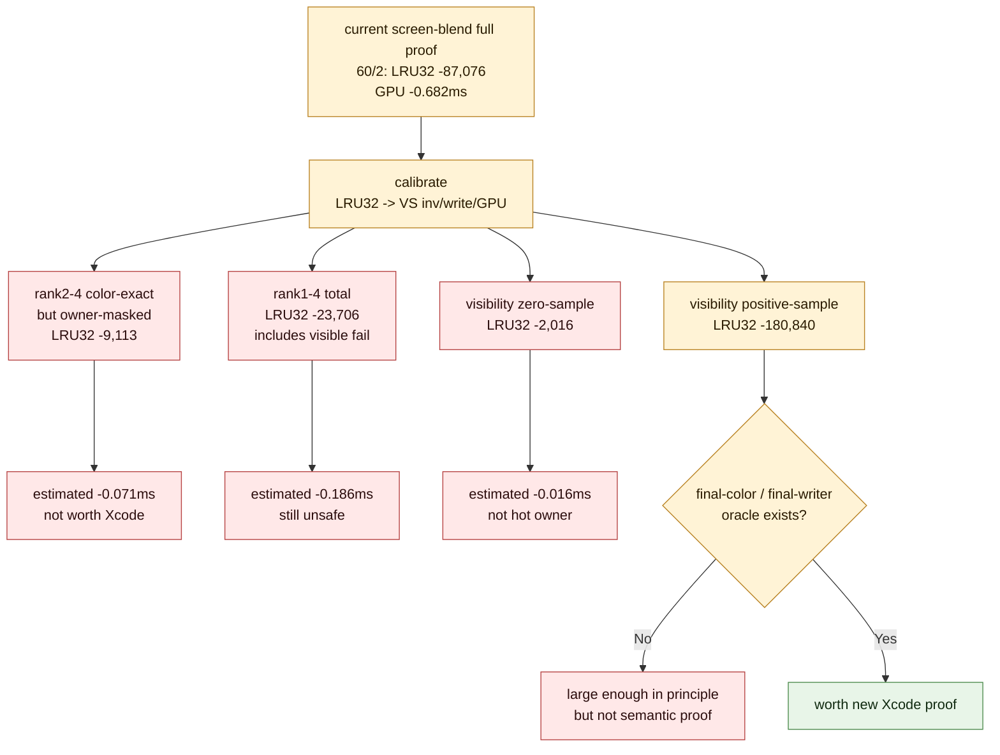

# Semantic Ceiling Versus Xcode Spend

**Question / hypothesis.** After the current screen-blend proof showed real
target-row movement but failed the aggregate top-GPU gate, does the existing
semantic-safe locality frontier justify another screen-blend/depth-read Xcode
capture?

**Method.** Calibrate the current screen-blend target-row effect and project
the already-proved mini-replay / visibility buckets onto the same scale.

The calibration source is the current full proof on target row `60/2`:

| Quantity | Value |
|---|---:|
| Runtime applied LRU32 delta | `-87,076` |
| Target `60/2` GPU delta | `-0.682 ms` |
| Target `60/2` VS invocation delta | `-69,068` |
| Target `60/2` VS write delta | `-106.391 MiB` |
| Current top-GPU failure to flip | `+0.319 ms` |
| Non-target hot-row drift observed in the proof | `+1.000 ms` |

This gives two useful spend thresholds:

- about `-40,729` additional LRU32 delta would merely flip the current
  `+0.319 ms` aggregate failure;
- about `-127,677` LRU32 delta would cover the observed `60/0+60/1`
  non-target drift by itself.

**Result.**

| Bucket | Semantic class | LRU32 delta | Estimated GPU delta | Estimated VS inv delta | Color px | Owner px |
|---|---|---:|---:|---:|---:|---:|
| rank 1 | visible final-writer hazard | `-14,593` | `-0.114 ms` | `-11,575` | `2` | `7` |
| rank 2 | color-exact owner-masked | `-5,937` | `-0.046 ms` | `-4,709` | `0` | `809` |
| rank 3 | color-exact owner-masked | `-2,452` | `-0.019 ms` | `-1,945` | `0` | `52` |
| rank 4 | color-exact owner-masked | `-724` | `-0.006 ms` | `-574` | `0` | `17` |
| rank 2-4 aggregate | color-exact but owner-masked | `-9,113` | `-0.071 ms` | `-7,228` | `0` | `878` |
| rank 1-4 aggregate | includes visible fail | `-23,706` | `-0.186 ms` | `-18,803` | `2` | `885` |
| visibility zero-sample rows | no-sample triage only | `-2,016` | `-0.016 ms` | `-1,599` | n/a | n/a |
| visibility positive-sample rows | needs final-color proof | `-180,840` | `-1.416 ms` | `-143,441` | n/a | n/a |

**Interpretation.**

The existing color-exact lower-ranked windows are not enough to justify a new
locality Xcode capture. Ranks 2-4 together are only `-9,113` LRU32 delta,
roughly `22.37%` of the extra locality needed to flip the current top-GPU gate
and only `7.14%` of the locality needed to cover the observed non-target replay
drift. They are also owner-masked, not owner-stable, so they remain below the
production semantic proof level.

The zero-sample visibility rows are too small to matter (`-2,016` LRU32,
estimated `-0.016 ms`). The sample-visible rows are the opposite: they are large
enough in principle (`-180,840` LRU32, estimated `-1.416 ms`), but sample-visible
is explicitly not a final-color proof. This is the useful fork: another Xcode
spend is justified only after the sample-visible bucket becomes semantic-safe.

**Verdict.** Do not spend another gputrace/Xcode counter pass on the current
screen-blend or scoped depth-read locality path by itself. The next locality
capture needs one of:

- a final-color/final-writer oracle that proves enough sample-visible rows safe;
- a runtime-visible selector that excludes the rank-1 visible hazard while
  keeping at least `~41k` additional LRU32 delta, preferably `~128k` for drift
  margin;
- or a non-reorder backend-denominator mechanism that changes bytes per
  invocation instead of relying on more primitive-order movement.

**Related.** [index-cache-locality](index.md) · prev:
[index-cache-locality-screenblend.08](index-cache-locality-screenblend.08.md) ·
[mini-replay-bisection-texture.10](../mini-replay-bisection/mini-replay-bisection-texture.10.md) · [overview-3dmark05-gt1](../overview-3dmark05-gt1.md).
