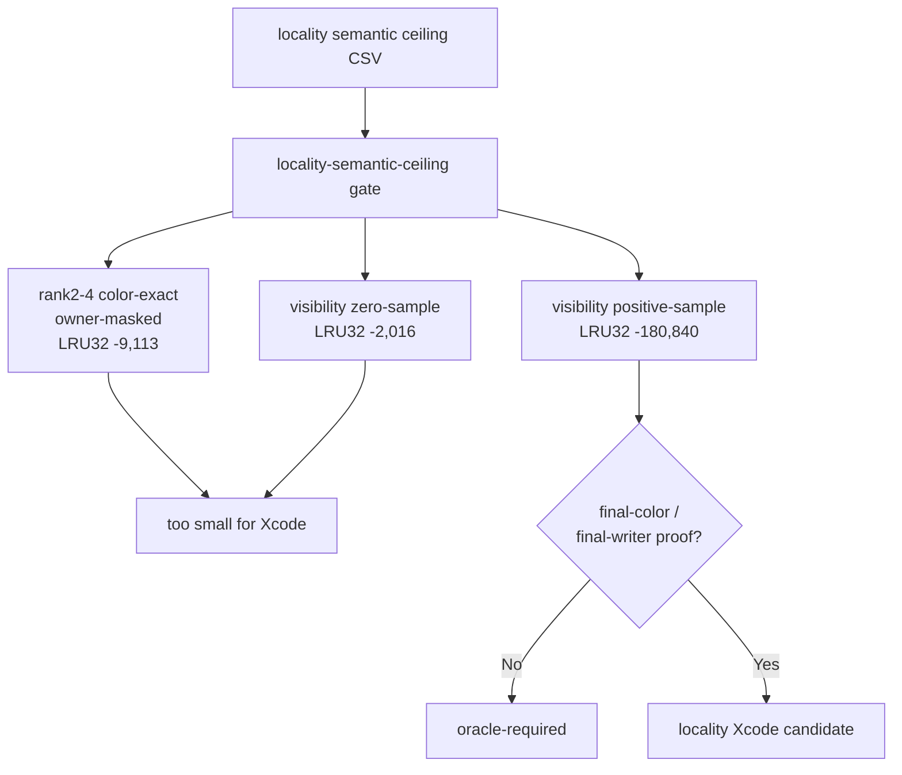
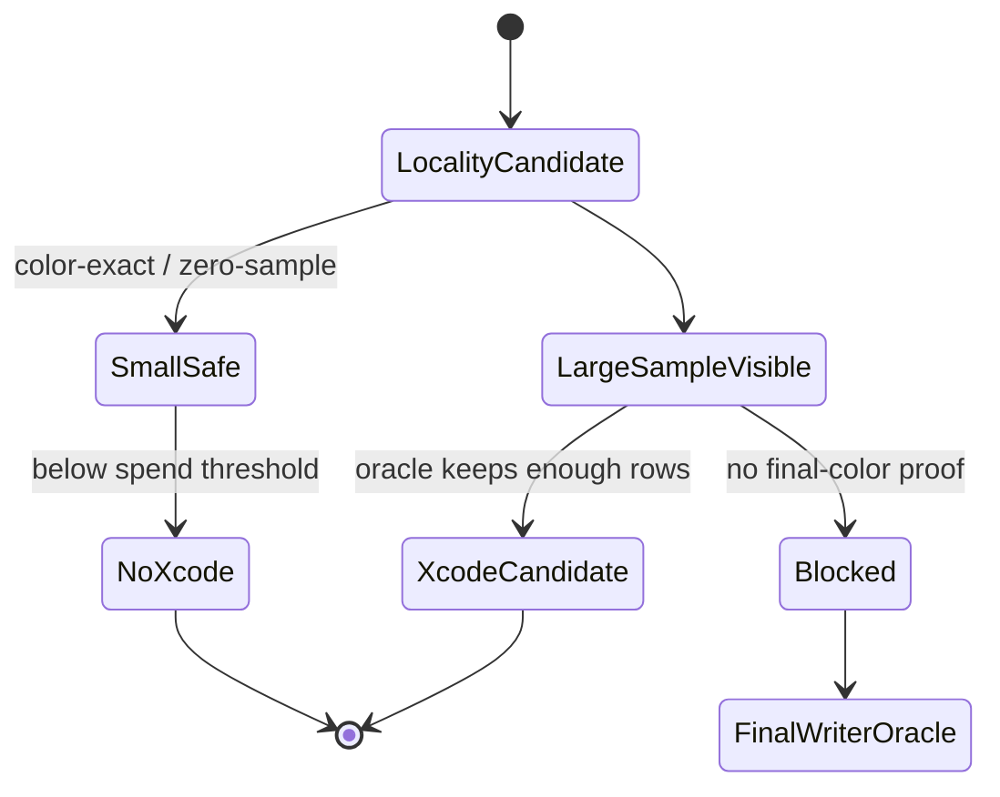

# Semantic Ceiling Is Now an Automated Gate

**Question / hypothesis.** [index-cache-locality-screenblend.09](index-cache-locality-screenblend.09.md) manually
calibrated which semantic locality buckets are large enough to justify another
Xcode capture. Can the current perf gate consume that CSV so the next experiment
queue does not keep re-scheduling small color-exact or zero-sample locality
paths?

**Method.**

1. Add `--locality-semantic-ceiling-csv` to
   `scripts/tools/summarize_3dmark05_perf_gates.py`.
2. Read the calibrated `frame60-locality-semantic-ceiling.csv`.
3. Emit `locality-semantic-ceiling=oracle-required` when:
   - color-exact owner-masked rows are below the Xcode spend threshold;
   - zero-sample visibility rows are below the hotpath threshold; and
   - sample-visible rows are large enough in principle but still lack
     final-color/final-writer proof.
4. Feed that verdict into the implementation-track and next-experiment queues.

**Result.**

| Gate | Verdict | Evidence |
|---|---|---|
| `locality-semantic-ceiling` | `oracle-required` | color-exact owner-masked LRU32 `-9,113`, GPU `-0.071ms`, flip `22.37%`; zero-sample LRU32 `-2,016`, flip `4.95%`; all scoped LRU32 `-23,706`, flip `58.20%`; sample-visible LRU32 `-180,840`, GPU `-1.416ms`, flip `444.01%` |
| `final-color-occlusion-predicate` | `blocked-semantic-proof-gap` | the implementation queue now says color-exact/zero-sample locality is too small, and sample-visible locality needs final-color/final-writer proof before it is worth a capture |
| `overall` | `semantic-safe-locality-only` | current locality proof needs either a final-color/final-writer oracle that keeps enough sample-visible rows or a non-reorder backend mechanism |

The next experiment queue now says the same thing for the high-proxy `60/2`
depth-read and standard-alpha rows: primitive reorder still needs
final-color/final-writer proof, the current color-exact/zero-sample locality is
too small for Xcode, sample-visible rows need an oracle, the current
backend-shape family is rejected, and current PSO per-draw motion is not
isolated.

**Verdict.** Accepted as a gate/tooling improvement. The key practical result is
not that sample-visible locality is uninteresting; it is large enough in
principle. The problem is that the currently safe-looking buckets are too small,
while the only large bucket is not yet semantic-safe. The next locality Xcode
capture should therefore wait for a real final-color/final-writer oracle, not
just another rank-window mini-replay or visibility-positive scout.

**Related.** [index-cache-locality](../index-cache-locality.md) ·
[index-cache-locality-screenblend.09](index-cache-locality-screenblend.09.md) ·
[mini-replay-bisection-texture.11](../mini-replay-bisection/mini-replay-bisection-texture.11.md) ·
[hidden-backend-storage-shape.19](../hidden-backend-storage/hidden-backend-storage-shape.19.md) · [overview-3dmark05-gt1](../overview-3dmark05-gt1.md).
