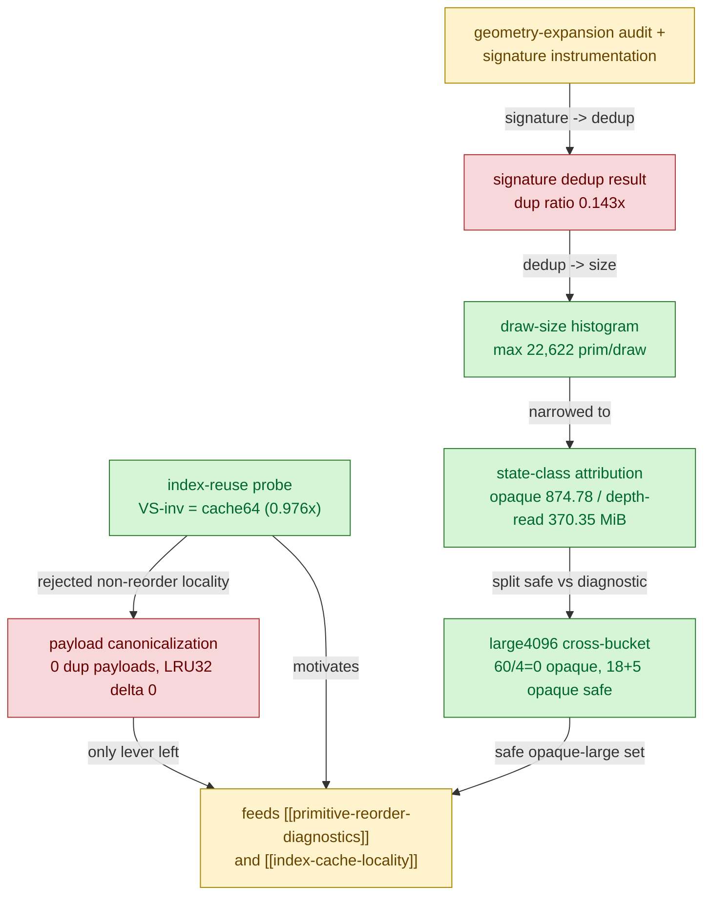

# Index-Reuse Measurement — instrumentation that established VS-inv = post-transform cache-miss

> Part of the 3DMark05 GT1 GPU-bottleneck investigation. Root map: [[overview-3dmark05-gt1]].

## Scope & question

This domain owns the **measurement / instrumentation** that characterized the
*shape* of the hot indexed geometry without changing rendering: how Xcode
`VS Invocations` relates to submitted references vs draw-local unique vertices vs
finite post-transform vertex-cache misses; whether the ~1.6 GiB VS-buffer-write
bucket is caused by tiny-draw replay or redundant geometry replay; and how the
hot indexed triangle-list traffic splits by backend-relevant state class. Its
job was mostly to **rule out** cheap explanations (geometry expansion, dedup,
tiny draws, payload canonicalization) and to **pinpoint** the one correlation
that made a lever exist: VS invocations track the post-transform cache-miss
estimate, not raw references.

## Hypotheses & verdicts

| # | Hypothesis | Verdict | Evidence |
|---|-----------|---------|----------|
| H1 | VS invocations follow raw indexed references (`0.549x`) | rejected | [[index-reuse-measurement-reuse.01]] |
| H2 | VS invocations follow draw-local unique vertices exactly | rejected (`1.18x` gap = finite cache) | [[index-reuse-measurement-reuse.01]] |
| H3 | VS invocations ≈ finite 64-entry post-transform cache misses (`0.976x`) | **accepted** | [[index-reuse-measurement-reuse.01]] |
| H4 | Order-preserving payload canonicalization can cut VS invocations | rejected (0 duplicate payloads, LRU32 delta 0) | [[index-reuse-measurement-reuse.02]] |
| H5 | dxmt indexed-expansion is inflating GT1 geometry | rejected (`draw_expanded_indexed=0`) | [[index-reuse-measurement-geometry.01]] |
| H6 | Redundant replay of the same geometry shape owns the bucket | rejected (dup ratio `0.143x`) | [[index-reuse-measurement-geometry.02]] |
| H7 | Bucket is driven by many tiny repeated draws | rejected; real large indexed pressure (`22,622` prim/draw) | [[index-reuse-measurement-geometry.03]] |
| H8 | Hot frame is one homogeneous material class | rejected; splits opaque-dw / depth-read-textured / mixed | [[index-reuse-measurement-classattr.01]] |
| H9 | The positive `60/4` large-draw signal is production-safe | rejected; `60/4` large4096 is 0 opaque / all depth-read | [[index-reuse-measurement-classattr.02]] |

## Verification methods

- **`DXMT9_MEASURE_INDEX_REUSE=1`** (wrapper `--measure-index-reuse`) — diagnostic
  scan of indexed draw buffers: raw references, draw-local unique estimate, and
  LRU 16/32/64-entry cache-miss estimates. Proves VS invocations track cache64
  (`0.976x`), not references (`0.549x`).
- **`DXMT9_MEASURE_INDEX_CACHE_OPT_CANDIDATE`** — builds a cache-aware LRU32
  reordered candidate (no submission) and reports original-vs-candidate cache-miss
  estimates; the lever validation that follows from H3.
- **`DXMT9_PERF_ENCODER_BREAKDOWN=1` geometry signature counters** —
  `draw_geometry_signature_{samples,unique,duplicates,consecutive_duplicates}`;
  proves the bucket is not redundant-shape replay (H6).
- **Encoder breakdown draw-size buckets** — `draw_primitive_*` / `draw_vertex_*`
  min/max + bucketed counts; proves large-draw (not tiny-draw) pressure (H7).
- **Encoder breakdown state-class counters** — non-exclusive opaque-depth-write /
  depth-read / alpha-blend / scissor / textured / large4096 (and `large4096 ×
  state` cross buckets); splits the hot frame into targetable material classes
  (H8, H9). All behavior-neutral instrumentation, validated by finalizer coverage
  + 5% drift gates.

## Experiment dependency graph

## Results synthesis

**Settled.** The central result is that **Xcode `VS Invocations` track the
post-transform finite vertex-cache-miss estimate** (`VS-inv/cache64 ≈ 0.976x`),
not raw indexed references (`0.549x`) and not raw draw-local unique vertices
(`~1.18x` gap, which is itself finite-cache locality). This is *why* index-cache
locality became the promising lever in [[index-cache-locality]]: reducing
post-transform cache misses is the only measured way to reduce VS invocations
without changing geometry semantics. The domain also conclusively *ruled out*
the cheap explanations — dxmt geometry expansion (`draw_expanded_indexed=0`),
redundant geometry-shape replay (dup ratio `0.143x`), tiny-draw replay (hot rows
reach `22,622` prim / `67,866` vert per draw), and order-preserving payload
canonicalization (0 mergeable payloads, LRU32 delta 0). State-class attribution
then split the hot frame into an opaque depth-write class (`60/3 + 60/1`,
`874.78MiB`), a depth-read/textured/alpha class (`60/4`, `370.35MiB`), and a
mixed row (`60/0`, `227.67MiB`), and the large4096 cross-bucket isolated the
`23` production-safe opaque-large draws from the visibility-sensitive `60/4`
target.

**Still open within this domain.** Nothing about the **write width** is resolved
here: even after normalizing by unique vertices or cache misses, the bucket stays
`~836–879B`/invocation versus the visible `184B` `VSOut`. That residual is owned
by [[hidden-backend-storage]], not by this measurement domain. Whether the safe
opaque-large set actually moves the hidden write under a correctness-preserving
reorder is handed to [[index-cache-locality]] / [[primitive-reorder-diagnostics]]
for Xcode proof.

## Cross-references

- [[primitive-reorder-diagnostics]] — consumes the state classes and large4096
  splits; reverse-triangle probes that produced the first positive signal.
- [[index-cache-locality]] — the accepted production lever motivated by the
  VS-inv ≈ cache-miss correlation and the safe opaque-large candidate set.
- [[hidden-backend-storage]] — owns the unexplained per-invocation write width
  that this domain measured but did not explain.
- [[vsout-layout]] — refuted as the width owner here: the bucket is far wider
  than the visible `184B` `VSOut`.
- [[overview-3dmark05-gt1]] — root priority DAG and synthesis.
