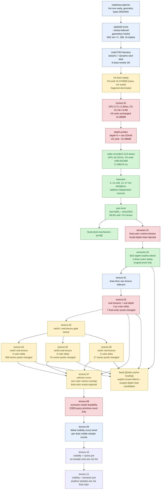

# Mini-Replay Bisection — the apparatus that isolated per-draw vertex-stage write amplification

> Part of the 3DMark05 GT1 GPU-bottleneck investigation. Root map: [[overview-3dmark05-gt1]].

## Scope & question

This domain owns the **methodology**: build a standalone, row-local mini-replay
harness that consumes real captured index/stream/cbuf/depth payloads plus dumped
shaders, reproduce the original hot-encoder `VS Buffer Device Memory Bytes Written`
pressure at encoder scale outside Wine/D3D9, then bisect it down to individual
shader-pair / draw windows. It answers: *which concrete inputs reproduce the GT1
hidden vertex-stage write bucket, and at what granularity is it owned?* This is
the apparatus that made [[tvb-mechanism-proof]] possible and that backs the
[[index-cache-locality]] win.

## Hypotheses & verdicts

| # | Hypothesis | Verdict | Evidence |
|---|-----------|---------|----------|
| H1 | Hot-row attribution / shaders / draw identity are ready; only geometry bytes are missing | tooling (gap found) | [[mini-replay-bisection-harness.01]] |
| H2 | Runtime can dump replayable index/stream/cbuf bytes for a hot window without mutating state | tooling | [[mini-replay-bisection-payload.01]] |
| H3 | Runner can replay a multi-PSO slice with stream1 + dynamic cbuf slots | tooling | [[mini-replay-bisection-harness.02]] |
| H4 | Captured payloads alone reproduce the original ~1 GiB VS-write scale/shape | inconclusive (class yes, scale no) | [[mini-replay-bisection-replay.01]] |
| H5 | Fragment overdraw (missing per-draw scissor) is the gap | rejected (real fix, but VS write unmoved) | [[mini-replay-bisection-replay.02]] |
| H6 | Depth attachment content (clear scalar or real D24X8) owns the amplification | rejected | [[mini-replay-bisection-depth.01]] |
| H7 | The wider encoder2 (113-draw) sequence reproduces vertex-stage dominance | accepted | [[mini-replay-bisection-replay.03]] |
| H8 | The pressure is a single late draw/state transition | rejected (additive, independent windows) | [[mini-replay-bisection-bisect.01]] |
| H9 | The cost is per-draw geometry/shader-pair amplification, not alpha/scissor | accepted | [[mini-replay-bisection-pair.01]] |
| H10 | Broad depth-read reorder can be made production-shaped with current runtime selectors | rejected | [[mini-replay-bisection-semantic.01]] |
| H11 | A selected `60/2 depth-read + no-alpha-blend` cache-opt window can preserve same-input final color | accepted (scoped) | [[mini-replay-bisection-semantic.02]] |
| H12 | Draw-time texture sidecars can remove the current white-texture replay caveat | tooling | [[mini-replay-bisection-texture.01]] |
| H13 | The same selected window remains exact after real texture inputs are supplied | rejected (tiny delta, final-writer hazard) | [[mini-replay-bisection-texture.02]] |
| H14 | Lower-ranked same-shape windows can decide whether rank 1 was an isolated hazard or the whole reorder class is unsafe | accepted: rank 1 is visible-fail; ranks 2-4 are color-exact owner-masked | [[mini-replay-bisection-texture.03]], [[mini-replay-bisection-texture.04]], [[mini-replay-bisection-texture.05]], [[mini-replay-bisection-texture.06]] |
| H15 | The rank-2 same-shape window remains exact with real depth and textures | accepted for color only; owner-masked | [[mini-replay-bisection-texture.04]] |
| H16 | The rank-3 same-shape window remains exact with real depth and textures | accepted for color only; owner-masked | [[mini-replay-bisection-texture.05]] |
| H17 | The rank-4 same-shape window remains exact with real depth and textures | accepted for color only; owner-masked | [[mini-replay-bisection-texture.06]] |
| H18 | Primitive-conflict metrics can split rank-1 visible failure from rank2-4 exact owner-masked passes | rejected; only final-color metrics separate | [[mini-replay-bisection-texture.07]] |
| H19 | Existing D3D9 occlusion query or winemetal visibility plumbing can supply the missing runtime oracle as-is | rejected as production oracle; diagnostic scout added separately | [[mini-replay-bisection-texture.08]] |
| H20 | A diagnostic Metal visibility scout can supply per-Metal-draw sample-visible counts after GPU completion | implemented diagnostic; not final-color proof; old rank-1 `36..37` is sample-visible | [[mini-replay-bisection-texture.09]] |
| H21 | No-sample visibility rows are the hidden-backend hot locality owner | rejected; zero rows are small and only `-2,016` of `-182,856` LRU32 delta | [[mini-replay-bisection-texture.10]] |
| H22 | Positive Metal visibility samples can be used as the scoped depth-read final-color oracle | rejected; rank2 has `39,835` samples but `0` final-color pixels, and rank1/rank3 are both sample-positive but fail/pass diverge | [[mini-replay-bisection-texture.11]] |

## Verification methods

- **`plan_3dmark05_mini_replay.py`** — joins joined-summary + shader-dump +
  indexed probe CSVs into a readiness table; `--geometry-dir` validates payload
  triplets. Proves what inputs exist before a replay.
- **`--dump-indexed-geometry` / `--dump-indexed-geometry-cbufs`** (probe wrapper)
  — implies `DXMT9_MEASURE_INDEX_REUSE=1`, does not mutate primitive order,
  writes `.index.bin` / `.stream0.bin` / `.streamN.bin` / `.vsconsts.bin` /
  `.psconsts.bin` / `.ffpvs.bin` / `.ffpps.bin` + `.meta` under
  `analysis/geometry/`. Shader filters `--dump-indexed-geometry-vs/-ps` select a
  shader pair (row-local draw windows are not robust cross-run selectors).
- **`DXMT9_DUMP_DEPTH_ATTACHMENT_HANDLE` / `_PATH`** (wrapper
  `--dump-depth-attachment-handle/-seq/-enc/-path`) — blits a live GPU-side
  depth/stencil target to a readback buffer with `.json` metadata, capturing
  D24X8 that the old BMP `DXMT_DUMP_GPU_TEXTURE_*` upload hook cannot.
- **`DXMT9_DUMP_DRAW_TEXTURE_HANDLES` / `_DIR`** (wrapper
  `--dump-draw-texture-handles/-seq/-enc/-dir`) — blits live shader-read
  texture views to raw sidecars under `analysis/textures/`, preserving
  per-level/per-slice `formatRowPitch` / `formatByteSize` metadata for
  compressed, luminance, float, sRGB, and cube inputs. This is the input path
  for removing the current mini-replay `whiteTexture` fallback.
- **`run_3dmark05_mini_replay.py`** — rewrites dumped MSL off `buffer(30)` argbuf
  into standalone cbuf slots, scans bindings to pick free slots, compiles an
  Obj-C++ Metal app, binds real payloads, multi-PSO, per-draw scissor,
  `--depth-clear`, `--depth-input`, `--texture-input-dir`,
  `--primitive-order`, `--draw-order`, `--color-output` PPM readback,
  `--capture-path`.
- **`run_3dmark05_semantic_replay_gate.py`** — standardized candidate gate that
  runs original/candidate color replays, primitive-id replays, exact/`lsb1`
  image comparison, canonical original-triangle owner comparison, and optional
  GT1 primitive-conflict analysis. This is the repeatable path for future
  payload windows before spending production Xcode budget.
- **`build_3dmark05_mini_replay_manifest.py` texture summary** — after a fresh
  geometry capture, `summary.texture_capture_handles_arg` and
  `summary.texture_capture_flags` provide the exact
  `--dump-draw-texture-handles/-seq/-enc` flags for the matching texture
  sidecar run. This keeps rank2+ gates out of manual `.meta` scraping.
- **`--encoder-draw-indices`** (manifest builder) — captures non-contiguous
  encoder-local draws (e.g. a shader pair `[14,15,18,19,21]`) without widening the
  geometry gate.
- **Software LRU cache estimate vs Xcode counters** — the runner's LRU16/32/64
  miss estimate is cross-checked against Xcode `VS Invocations` /
  `VS Buffer Device Memory Bytes Written` so reorder candidates are accepted only
  when software misses and Xcode counters drop together.

## Experiment dependency graph



## Results synthesis

Settled: a standalone mini-replay reproduces the **class** of GT1 VS-write traffic
from captured payloads, but the **scale and shape** require the wider encoder2
sequence. The 3-draw / 16-draw slices stayed at ~32 MiB and fragment-dominated;
fixing per-draw scissor and supplying real D24X8 depth corrected fragment work but
left VS buffer write fixed at ~31.98 MiB — cleanly **ruling out fragment overdraw
and depth content as artifacts/owners**. The full 113-draw encoder2 replay finally
matched the hot row (18.115 ms, 1090.901 MiB, 1710 B/VS inv vs original 20.327 ms,
981.171 MiB, 1602.5 B/VS inv). Bisection showed the pressure is **additive across
independent draw windows** (not a single transition), and pair-local captures
localized 99.8% of the first hot window to two shader pairs / large indexed draws
with per-draw additivity within 0.44% — i.e. **per-draw vertex-stage write
amplification keyed by geometry × shader pair**, with named tiled counters far
below the VS-write bucket. An actual-read VSOut liveness trim moved VS write only
-0.01%, so visible varying width is not the owner ([[vsout-layout]]).

This is the apparatus that **isolated the per-draw vertex-stage write
amplification** and so enabled the [[tvb-mechanism-proof]] (geometry-locked
original-vs-`cache-opt-lru32` replays) and the accepted
[[index-cache-locality]] production win. **Firmware-TVB caveat:** small standalone
replays can legitimately report `0 MiB` for `VS Buffer Device Memory Bytes Written`
because the firmware Parameter Buffer never spills at that scale (the `0..13`
prefix is the local example) — this is why scale, not just class, had to be
reproduced before the mechanism could be proven; see [[tvb-mechanism-proof]].

The same apparatus now also supplies the negative semantic proof for broad
depth-read reorder. [[mini-replay-bisection-semantic.01]] shows that useful
visible exact movement and a real final-color hazard share the same current
runtime-visible state/geometry/shader fields. That keeps `50/2` screen-blend in
the explicit exact/`lsb1` bucket and blocks broad depth-read promotion until a
real final-color/final-writer policy exists; Metal visibility can only triage
no-sample cases unless paired with that policy. The
post-visualfix follow-up [[mini-replay-bisection-semantic.02]] adds a narrower
positive result:
a selected `60/2 depth-read + no-alpha-blend` two-draw window is exact under the
standalone same-input replay while cutting LRU32 misses by `-14,593` (`-27.6%`).
The captured D24X8 depth input stayed exact, so depth content is not the caveat
for this selected window. The real-texture follow-up then supplied the selected
window's actual `R32F` / `L8` / `L16` / `DXT1` / `DXT5` / cube inputs and
rejected exact promotion: only `2 / 786,432` pixels changed, but max delta `5`
fails both exact and `lsb1`. A canonical primitive-id replay showed `7` pixels
with a changed original-triangle final writer, so this is a
depth-read/depth-write-off order hazard rather than same-primitive texture
noise. Ranks 2-4 then kept final color exact with real textures while still
changing canonical primitive ownership (`809`, `52`, and `17` pixels). The
locality ceiling remains real, but the current runtime selector is not
production-safe; color-only exactness and owner-stable exactness are separate
proof levels. The primitive-conflict selector scout
([[mini-replay-bisection-texture.07]]) then checked whether owner-count,
both-cover, depth, UV, or projected-texcoord metrics can split rank 1 from
ranks 2-4; all non-color ranges overlap. The only separating signal is final
color itself, so this reorder line now requires final-color/final-writer proof
before production promotion; the later visibility/cache join rejects current
no-sample rows as the hot owner.
[[mini-replay-bisection-texture.08]] then audits the obvious runtime reuse path
and rejects it for the current
implementation: dxmt9's D3D9 occlusion query resolves submitted primitive count,
not framebuffer visibility, while the winemetal visibility buffer/mode ABI is
present but not wired into dxmt9 draw encoding or any delayed feedback loop.
[[mini-replay-bisection-texture.09]] follows by wiring that missing diagnostic
path: selected render encoders can now allocate a shared Metal visibility buffer,
toggle `Counting` around each actual Metal draw, and append per-draw
`visible_samples` after GPU completion. This is still not a final-color gate:
zero counts are useful no-sample evidence, but positive counts need
final-color/final-writer or semantic replay proof before any production reorder.
The first `60/2` scout lowers the old rank-1 hypothesis because draw window
`36..37` is positive-positive and all `large4096` buckets are sample-visible.
[[mini-replay-bisection-texture.10]] joins the scout with cache-candidate
measurement and closes the no-sample hotpath variant: zero rows account for only
`7,344` primitives and `-2,016` LRU32 delta, while sample-visible rows carry
`382,032` primitives and `-180,840` LRU32 delta.
[[mini-replay-bisection-texture.11]] then joins those sample counts back to the
ranked final-color semantic payloads. It rejects positive visibility as the
missing oracle: rank2 is sample-positive (`39,835` samples) but has no final
color, while rank1 and rank3 are both sample-positive but split into visible
fail versus visible exact-pass. This turns the current experiment into a proof
gate rather than an optimization: it stops further locality Xcode spend unless a
real final-color/final-writer predicate or a non-reorder backend mechanism
appears.

## How to run
Every experiment here is a 3DMark05 GT1 run. The pipeline is three stages: dump
the raw indexed geometry from a frame, build a row-local manifest, then replay it
standalone with the order/depth variant under test:

```sh
# 1. Dump raw index + stream0 (+ cbufs) payloads from the hot encoder:
bash scripts/tools/run_3dmark05_perf_probe.sh --suffix dump --frame 60 --no-gputrace \
  --encoder-breakdown-seq 60 --dump-indexed-geometry --dump-indexed-geometry-cbufs \
  --dump-indexed-geometry-max-draws 16 --timeout 180

# 2. Build the mini-replay manifest from the reduced artifacts:
python3 scripts/tools/build_3dmark05_mini_replay_manifest.py \
  --geometry-dir traces/<run>/analysis/geometry --probe-draws <probe-draws.csv> \
  --shader-summary <shader-dump-summary.csv> --encoder-draw-indices 71,72,73 \
  --output traces/<run>/analysis/mini-replay-manifest.json

# 2b. If the replay needs real textures, use the manifest-generated flags:
jq -r '.summary.texture_capture_flags | @sh' \
  traces/<run>/analysis/mini-replay-manifest.json

# 3. Replay standalone with the order/depth variant + capture for Xcode counters:
python3 scripts/tools/run_3dmark05_mini_replay.py traces/<run>/analysis/mini-replay-manifest.json \
  --output-dir traces/<run>/mini --compile --run --primitive-order original \
  --depth-input traces/<run>/analysis/frame60-2-depth.bin \
  --capture-path traces/<run>/mini/mini.gputrace

# Optional: capture draw-time texture sidecars for the selected 60/2 window:
bash scripts/tools/run_3dmark05_perf_probe.sh \
  --suffix post-visualfix-frame60-60-2-textureinput-r1 \
  --frame 60 --encoder-breakdown-seq 60 --no-gputrace --timeout 120 --top 5 \
  --dump-draw-texture-handles \
    0x20000010000008d,0x200000100000072,0x200000100000001,0x200000100000074,0x200000100000007,0x200000100000003,0x200000100000070,0x20000010000007e,0x200000100000071 \
  --dump-draw-texture-seq 60 --dump-draw-texture-enc 2

# Optional: replay the same window with captured depth + real texture sidecars:
python3 scripts/tools/run_3dmark05_mini_replay.py traces/<run>/analysis/mini-replay-manifest.json \
  --output-dir traces/<run>/mini-real-texture --compile --run \
  --primitive-order cache-opt-lru32 \
  --depth-input traces/<depth-run>/analysis/frame60-depth.bin \
  --texture-input-dir traces/<texture-run>/analysis/textures \
  --color-output traces/<run>/mini-real-texture/cache-opt.ppm
```

The exact per-experiment flags (draw windows, `--primitive-order` choices,
`--depth-clear`) live in each leaf's `**Method.**` field. See
`agents/rules/environment_variables.rules.md` for env-var meanings and
`agents/rules/metal_debugging.rules.md` for the full workflow.

## Cross-references

- [[tvb-mechanism-proof]] — the accepted mechanism this apparatus enabled; PB-spill / 0 MiB caveat.
- [[index-cache-locality]] — the production win validated by geometry-locked mini-replays.
- [[hidden-backend-storage]] — the TVB model the replays measure (named tiled << VS write).
- [[primitive-reorder-diagnostics]] — sort-min-index / cache-opt order knobs tested under geometry-locked replay.
- [[vsout-layout]] — pair-liveness VSOut trim rejected (-0.01%) inside the hot window.
- [[render-pass-store]] — depth re-entry / attachment content rejected as owner.
- [[mini-replay-bisection-semantic.01]] — final-color/runtime blocker for broad depth-read reorder.
- [[mini-replay-bisection-semantic.02]] — scoped `60/2` depth-read/no-blend exact replay candidate.
- [[mini-replay-bisection-texture.08]] — current occlusion/visibility path is not the missing runtime oracle.
- [[mini-replay-bisection-texture.09]] — diagnostic Metal visibility scout wiring.
- [[mini-replay-bisection-texture.10]] — visibility scout + cache join rejects no-sample rows as the hot locality owner.
- [[mini-replay-bisection-texture.11]] — visibility-positive semantic join rejects positive samples as the final-color oracle.
- [[mini-replay-bisection-texture.01]] — draw-time raw texture sidecar input for real-texture replay.
- [[mini-replay-bisection-texture.02]] — real-texture replay rejects exact/`lsb1` promotion for the selected `60/2` window.
- [[mini-replay-bisection-texture.03]] — ranked real-texture semantic gate queue after rank 1 rejects.
- [[mini-replay-bisection-texture.04]] — rank-2 real-texture gate is color-exact but owner-masked.
- [[mini-replay-bisection-texture.05]] — rank-3 real-texture gate is also color-exact but owner-masked.
- [[mini-replay-bisection-texture.06]] — rank-4 real-texture gate completes the queued set as color-exact owner-masked.
- [[mini-replay-bisection-texture.07]] — primitive-conflict selector scout rejects simple non-color thresholds.
- [[overview-3dmark05-gt1]] — root map and priority DAG.
