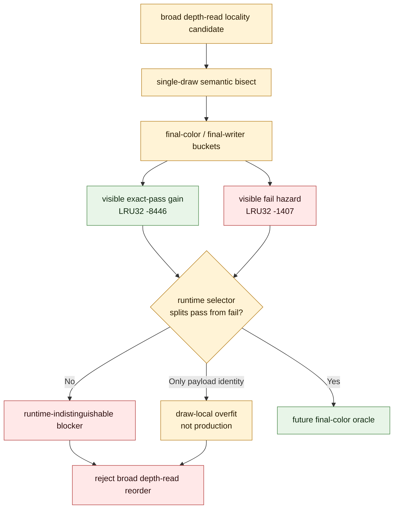

# Final-Color Runtime Blocker

**Question / hypothesis.** Can broad non-opaque depth-read index reorder be made
production-shaped by a runtime selector that keeps visible exact-pass locality
gain while excluding the known final-color failure?

**Method.** Joined the row `50/2` depth-read/no-blend mini-replay semantic
bisect results with runtime indexed-probe telemetry. The analyzer emitted a
bounded runtime selector sweep, final-color queue, final-writer oracle buckets,
and an all-runtime-visible-fields blocker check. Runtime fields included state,
geometry, shader, runtime VS/PS constant hashes, and full uniform payload hash.

**Result.** The useful movement and the correctness hazard coexist. The semantic
queue has visible exact-pass movement (`-8,446` LRU32) but also visible-fail
movement (`-1,407` LRU32). The final-writer oracle identifies draw `4` as a real
color hazard: primitive order changes final color (`15` primitive-owner pixels,
`3` color pixels). Owner changes alone are not enough to reject, because draws
`2,3,5,6,7` keep `-7,035` LRU32 of owner-change/color-stable movement.

The runtime selector sweep fails to produce a production predicate. Best
runtime-shaped selector `state.index_count` keeps only `33.36%` of visible
exact gain (`-2,818` LRU32) and still leaves a blocked group. More importantly,
visible exact-pass draws `3,5,6,7` and fail draw `4` are identical across all
`43` runtime-visible state/geometry/shader/constant fields currently available.
The only separators are trace-local `vsconsts_hash` and draw-local
`runtime.uniform_payload_hash`; both are proof/debug keys, not predictive
production selectors.

**Verdict.** Rejected for broad promotion. This does not reject post-transform
locality as a mechanism; it rejects broad depth-read reorder without a real
final-color/final-writer or occlusion oracle. Do not implement a
uniform-payload-identity selector, and do not spend another Xcode capture on
this broad reorder family until the selector proof changes.

**Related.** [mini-replay-bisection](index.md) · [index-cache-locality-screenblend.04](../index-cache-locality/index-cache-locality-screenblend.04.md)
· [primitive-reorder-diagnostics](../primitive-reorder-diagnostics/index.md) · [index-cache-locality](../index-cache-locality/index.md) ·
[tvb-mechanism-proof](../tvb-mechanism-proof/index.md).
