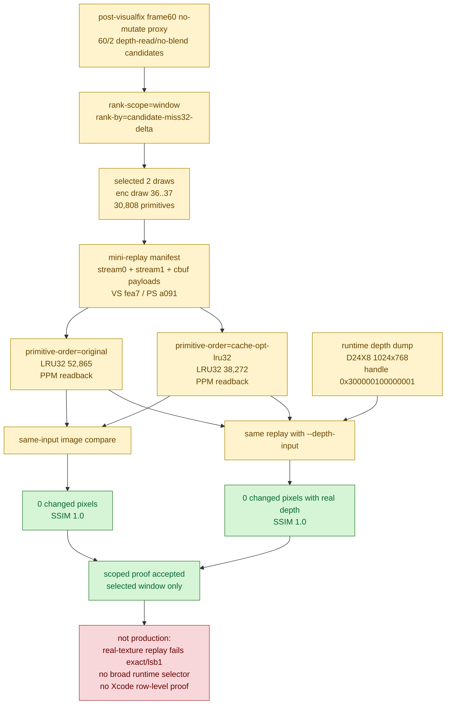

# Scoped 60/2 Depth-Read No-Blend Cache-Opt Replay

**Question / hypothesis.** [[hidden-backend-storage-shape.04]] ranked several
residual `60/2` depth-read classes with real `candidate_miss32_delta` but mixed
semantic risk. Is there at least one selected `depth-read + no-alpha-blend +
textured` window where `cache-opt-lru32` keeps final color exact under the
same mini-replay input?

**Method.**

1. Selected the best current `60/2` window by `candidate-miss32-delta` with
   window-scope ranking:

   ```sh
   python3 scripts/tools/select_3dmark05_payload_window.py \
     --probe-draws experiments/output/app-d3d9-3dmark05-post-visualfix-frame60-60-2-depthread-payload-r1/3dmark05-perf-indexed-probe-draws.csv \
     --row 60/2 --class-filter depth-read,no-alpha-blend,textured \
     --rank-by candidate-miss32-delta --rank-scope window --rank 1 --max-draws 2 \
     --output traces/app-d3d9-3dmark05-post-visualfix-frame60-60-2-depthread-payload-r1/analysis/frame60-payload-window-60-2-depth-read-no-blend-candidate32.json
   ```

2. Reused the payload dump for the selected shader pair:
   VS `0xfea7cbe15a691f97`, PS `0xa0910f28e1ccfd71`,
   `encoder_draw_index=36..37`, draw ordinals `30572,30573`.
3. Built the mini-replay manifest from the dumped index/stream0/stream1/cbuf
   payloads:

   ```sh
   python3 scripts/tools/build_3dmark05_mini_replay_manifest.py \
     --shader-summary traces/app-d3d9-3dmark05-post-visualfix-frame60-baseline-r1/analysis/frame60-shader-dump-summary.csv \
     --shader-msl-dir traces/app-d3d9-3dmark05-post-visualfix-frame60-baseline-r1/analysis/shaders/msl \
     --probe-draws experiments/output/app-d3d9-3dmark05-post-visualfix-frame60-60-2-depthread-payload-r1/3dmark05-perf-indexed-probe-draws.csv \
     --geometry-dir traces/app-d3d9-3dmark05-post-visualfix-frame60-60-2-depthread-payload-r1/analysis/geometry \
     --payload-selection traces/app-d3d9-3dmark05-post-visualfix-frame60-60-2-depthread-payload-r1/analysis/frame60-payload-window-60-2-depth-read-no-blend-candidate32.json \
     --output traces/app-d3d9-3dmark05-post-visualfix-frame60-60-2-depthread-payload-r1/analysis/frame60-mini-replay-60-2-depth-read-no-blend-manifest.json
   ```

4. Replayed original and `cache-opt-lru32` order with PPM readback:

   ```sh
   python3 scripts/tools/run_3dmark05_mini_replay.py \
     traces/app-d3d9-3dmark05-post-visualfix-frame60-60-2-depthread-payload-r1/analysis/frame60-mini-replay-60-2-depth-read-no-blend-manifest.json \
     --output-dir traces/app-d3d9-3dmark05-post-visualfix-frame60-60-2-depthread-payload-r1/analysis/mini-replay-depth-read-no-blend/original \
     --compile --run --repeat 1 --primitive-order original \
     --color-output traces/app-d3d9-3dmark05-post-visualfix-frame60-60-2-depthread-payload-r1/analysis/mini-replay-depth-read-no-blend/original/original.ppm

   python3 scripts/tools/run_3dmark05_mini_replay.py \
     traces/app-d3d9-3dmark05-post-visualfix-frame60-60-2-depthread-payload-r1/analysis/frame60-mini-replay-60-2-depth-read-no-blend-manifest.json \
     --output-dir traces/app-d3d9-3dmark05-post-visualfix-frame60-60-2-depthread-payload-r1/analysis/mini-replay-depth-read-no-blend/cache-opt-lru32 \
     --compile --run --repeat 1 --primitive-order cache-opt-lru32 \
     --color-output traces/app-d3d9-3dmark05-post-visualfix-frame60-60-2-depthread-payload-r1/analysis/mini-replay-depth-read-no-blend/cache-opt-lru32/cache-opt-lru32.ppm
   ```

5. Compared both readbacks with `compare_experiment_images.py`.
6. Strengthened the proof with the real `60/2` depth attachment handle from the
   payload metadata (`0x300000100000001`):

   ```sh
   bash scripts/tools/run_3dmark05_perf_probe.sh \
     --suffix post-visualfix-frame60-60-2-depthinput-r1 \
     --frame 60 --encoder-breakdown-seq 60 \
     --no-gputrace --timeout 120 --top 5 \
     --dump-depth-attachment-handle 0x300000100000001 \
     --dump-depth-attachment-seq 60 \
     --dump-depth-attachment-enc 2
   ```

   The wrapper timeout-finalized with status `124`, but wrote
   `frame60-depth.bin` plus JSON metadata:
   D24X8, `1024x768`, row bytes `4096`, byte count `3,145,728`.
7. Replayed the same original/cache-opt pair with
   `--depth-input traces/app-d3d9-3dmark05-post-visualfix-frame60-60-2-depthinput-r1/analysis/frame60-depth.bin`
   and compared with exact gates (`max_changed_pct=0`, `max_delta=0`).

**Result.**

The selected window is large enough to be a useful local probe:

| Field | Value |
|---|---:|
| Draws | `2` |
| Primitives | `30,808` |
| Original LRU32 misses | `52,865` |
| Payload selector candidate LRU32 misses | `38,268` |
| Payload selector candidate LRU32 delta | `-14,597` (`-27.6%`) |
| Mini-replay `cache-opt-lru32` LRU32 misses | `38,272` |
| Mini-replay `cache-opt-lru32` LRU32 delta | `-14,593` (`-27.604%`) |
| Mini-replay LRU64 delta | `-11,196` (`-22.923%`) |

The same-input image comparison is exact:

| Metric | Value |
|---|---:|
| Resolution | `1024x768` |
| Changed pixels | `0 / 786,432` |
| Changed % | `0.000000%` |
| Active pixels | `40,193` (`5.110804%`) |
| Max delta | `0` |
| SSIM | `1.000000` |

The real-depth replay is also exact:

| Metric | Value |
|---|---:|
| Depth input | D24X8 `1024x768`, `3,145,728B` |
| Changed pixels | `0 / 786,432` |
| Changed % | `0.000000%` |
| Active pixels | `132` (`0.016785%`) |
| Max delta | `0` |
| SSIM | `1.000000` |

Important scope limit: this proof binds a 1x1 white texture for all sampled
texture slots. The depth-clear caveat is resolved for this window by the D24X8
input replay, but the follow-up real-texture replay
([[mini-replay-bisection-texture.02]]) changes `2` pixels with max delta `5`,
and its canonical primitive-id diagnostic shows `7` final-writer pixels
changed.
The useful interpretation is therefore narrower: this selected window has a
real post-transform locality ceiling and no observed final-color movement under
white-texture replay with both clear-depth and captured-depth inputs, but it is
not a production-safe exact texture correctness proof.



**Verdict.** Accepted as a scoped semantic proof. This reopens a narrow
depth-read/no-blend path that [[mini-replay-bisection-semantic.01]] did not
allow as a broad runtime rule. [[mini-replay-bisection-texture.02]] rejects
promotion for this selected window once real textures are supplied. Future
promotion still requires at least one of:

- a final-color/final-writer or occlusion oracle for the changed pixels;
- a stricter runtime-visible selector that excludes the real-texture hazard;
- or a non-reorder backend mechanism that lowers hidden vertex-stage writes
  without primitive reorder.

**Related.** [[mini-replay-bisection]] ·
[[mini-replay-bisection-semantic.01]] ·
[[mini-replay-bisection-texture.02]] ·
[[hidden-backend-storage-shape.04]] · [[index-cache-locality]].
