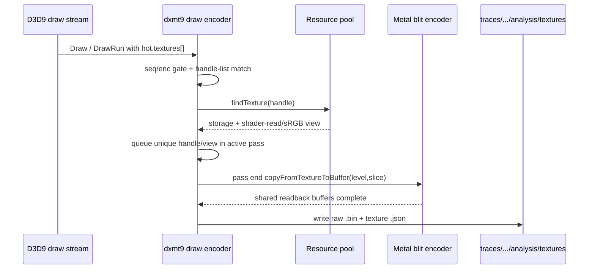

# Draw-Time Texture Sidecar Dump Path

**Question / gap.** [mini-replay-bisection-semantic.02](mini-replay-bisection-semantic.02.md) proved the selected
`60/2 depth-read + no-alpha-blend` window with clear depth and real D24X8 depth,
but the mini-replay still binds 1x1 white textures for all sampled slots. Can we
capture the actual draw-time shader-read texture payloads without using Xcode UI
or upload-time BMP hooks?

**Tooling added.**

- `DXMT9_DUMP_DRAW_TEXTURE_HANDLES`: comma/space separated texture handle list.
- `DXMT9_DUMP_DRAW_TEXTURE_SEQ` / `DXMT9_DUMP_DRAW_TEXTURE_ENC`: optional pass
  gates, matching the depth sidecar convention.
- `DXMT9_DUMP_DRAW_TEXTURE_DIR`: output directory. The wrapper default is
  `traces/<run-id>/analysis/textures`.
- Wrapper flags:
  `--dump-draw-texture-handles`, `--dump-draw-texture-seq`,
  `--dump-draw-texture-enc`, `--dump-draw-texture-dir`.
- Mini-replay flag: `--texture-input-dir`, consuming the sidecar directory and
  binding per-draw fragment textures by handle + sRGB/view identity.

The encoder collects matching handles from the active draw state, resolves the
actual shader-read view (`shaderReadTexture` / `srgbShaderReadTexture` when
applicable), and emits a pass-end blit sidecar. Each texture gets:

- one `texture-*.json` metadata file;
- one raw `texture-*-slice<S>-level<L>.bin` per captured subresource;
- format, texture type, shader stage/slot, sRGB flag, storage/view Metal pixel
  formats, dimensions, row bytes, bytes per image, and byte count metadata.



**Target use for the current window.** The selected two-draw window in
[mini-replay-bisection-semantic.02](mini-replay-bisection-semantic.02.md) samples six texture slots and uses these
handles:

```sh
bash scripts/tools/run_3dmark05_perf_probe.sh \
  --suffix post-visualfix-frame60-60-2-textureinput-r1 \
  --frame 60 --encoder-breakdown-seq 60 \
  --no-gputrace --timeout 120 --top 5 \
  --dump-draw-texture-handles \
    0x20000010000008d,0x200000100000072,0x200000100000001,0x200000100000074,0x200000100000007,0x200000100000003,0x200000100000070,0x20000010000007e,0x200000100000071 \
  --dump-draw-texture-seq 60 \
  --dump-draw-texture-enc 2
```

**Why draw-time, not upload-time.** The existing `DXMT_DUMP_TEXTURE_HANDLE` path
is an upload/sync BMP hook and only handles a narrow 32-bit color subset. The
selected window includes `R32F`, `L8`, `L16`, `DXT1`, `DXT5`, and cube/X8
shader-read cases. The sidecar path therefore captures raw GPU texture contents
with `formatRowPitch` / `formatByteSize` metadata instead of forcing a BMP
interpretation.

**Validation run.** The target command above completed with `status: pass` and
wrote sidecars under:

`traces/app-d3d9-3dmark05-post-visualfix-frame60-60-2-textureinput-r1/analysis/textures`

| Handle | Format | Type | Size | Levels | Subresources | Bytes |
|---|---|---:|---:|---:|---:|---:|
| `0x20000010000008d` | `R32F` | `2D` | `2048x2048` | `1` | `1` | `16,777,216` |
| `0x200000100000001` | `L8` | `2D` | `1x1` | `1` | `1` | `1` |
| `0x200000100000003` | `L16` | `2D` | `1024x128` | `1` | `1` | `262,144` |
| `0x200000100000007` | `X8R8G8B8` | `Cube` | `128x128` | `8` | `48` | `524,280` |
| `0x200000100000070` | `DXT1` | `2D` | `2048x2048` | `12` | `12` | `2,796,216` |
| `0x200000100000071` | `DXT5` | `2D` | `1024x1024` | `11` | `11` | `1,398,128` |
| `0x200000100000072` | `DXT1` | `2D` | `1024x1024` | `11` | `11` | `699,064` |
| `0x200000100000074` | `DXT5` | `2D` | `1024x1024` | `11` | `11` | `1,398,128` |
| `0x20000010000007e` | `DXT1` | `2D` | `1024x1024` | `11` | `11` | `699,064` |

The directory contains `9` texture JSON files and `107` raw `.bin` files; every
metadata `byteCount` matches the corresponding file size. The `stage` embedded
in a sidecar name is the first observed slot for that handle/view in the gated
pass, so the replay loader should treat handle + sRGB/view identity as the
resource key and bind it to each draw's manifest stage.

**Current scope.** This is tooling, not the final semantic proof. The next step
was to use the sidecars in a real-texture semantic replay. That follow-up is
[mini-replay-bisection-texture.02](mini-replay-bisection-texture.02.md). The sidecar path itself is accepted as
the reusable capture/input apparatus.

**Related.** [mini-replay-bisection](index.md) ·
[mini-replay-bisection-semantic.02](mini-replay-bisection-semantic.02.md) ·
[mini-replay-bisection-texture.02](mini-replay-bisection-texture.02.md) · [index-cache-locality](../index-cache-locality/index.md).
