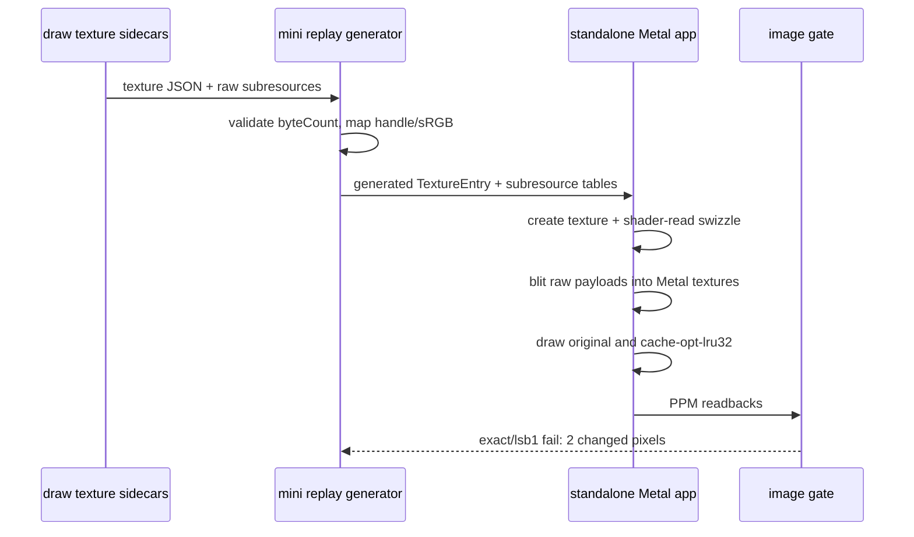
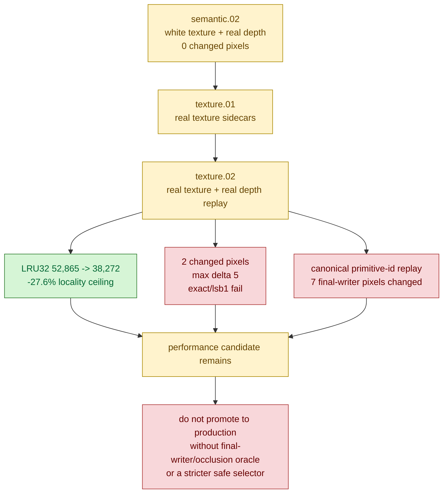

# Real-Texture Replay Rejects Exact 60/2 Cache-Opt Proof

**Question / hypothesis.** [[mini-replay-bisection-semantic.02]] was exact for
the selected `60/2 depth-read + no-alpha-blend` two-draw window with both clear
depth and captured D24X8 depth, but it still used `whiteTexture`. If the replay
binds the captured draw-time texture inputs from [[mini-replay-bisection-texture.01]],
does `cache-opt-lru32` still preserve exact final color?

**Method.**

1. Extended `run_3dmark05_mini_replay.py` with `--texture-input-dir`.
   The runner loads `texture-*.json`, validates each raw subresource
   `byteCount`, creates Metal textures for `R32F`, `L8`, `L16`, `X8R8G8B8`,
   `DXT1`, `DXT5`, and cube inputs, uploads them through a blit encoder, and
   binds fragment texture slots per draw from the manifest.
2. Matched sidecars to draw texture records by normalized handle and sRGB/view
   identity. Where the manifest does not carry an explicit sRGB sampler flag,
   linear view is the default and sRGB is only a fallback.
3. Recreated D3D9 shader-read channel semantics where the replay texture needs
   a view swizzle: `X8*` alpha reads as one, `R32F` maps red with alpha one, and
   luminance `L8/L16` replicates red to RGB with alpha one.
4. Replayed the same original and `cache-opt-lru32` pair with both
   `--depth-input` and `--texture-input-dir`, then compared readback PPMs with
   `exact` and `lsb1` gates.
5. Replayed the same pair with `--force-fragment-primitive-id`, then
   canonicalized reordered primitive IDs back to original triangle identity with
   `analyze_primitive_id_replay.py` to decide whether the color delta is
   same-primitive texture noise or a changed final writer.
6. Ran `analyze_mini_replay_primitive_conflicts.py` on the canonical owner
   changes to inspect depth/UV relationships for the conflicting triangles.
7. Added `run_3dmark05_semantic_replay_gate.py` so future payload windows can
   run the same color compare, primitive-id replay, canonical owner compare, and
   optional primitive-conflict analysis from one command. Re-running this
   selected window with the gate produces verdict
   `fail-final-writer-hazard`.

```sh
python3 scripts/tools/run_3dmark05_semantic_replay_gate.py \
  traces/app-d3d9-3dmark05-post-visualfix-frame60-60-2-depthread-payload-r1/analysis/frame60-mini-replay-60-2-depth-read-no-blend-manifest.json \
  --output-dir traces/app-d3d9-3dmark05-post-visualfix-frame60-60-2-textureinput-r1/analysis/mini-replay-depth-read-no-blend/semantic-gate-real-texture-r1 \
  --depth-input traces/app-d3d9-3dmark05-post-visualfix-frame60-60-2-depthinput-r1/analysis/frame60-depth.bin \
  --texture-input-dir traces/app-d3d9-3dmark05-post-visualfix-frame60-60-2-textureinput-r1/analysis/textures \
  --primitive-order cache-opt-lru32 \
  --primitive-draw-indices 1 \
  --conflict-analysis
```



**Result.** The real texture inputs are present and the locality improvement is
unchanged:

| Field | Value |
|---|---:|
| Texture sidecars consumed | `9` |
| Fragment texture slots | `0..5` |
| Draws | `2` |
| Primitives | `30,808` |
| Original LRU32 misses | `52,865` |
| `cache-opt-lru32` misses | `38,272` |
| LRU32 delta | `-14,593` (`-27.604%`) |

However, final color is no longer exact:

| Metric | Value |
|---|---:|
| Resolution | `1024x768` |
| Changed pixels | `2 / 786,432` |
| Changed % | `0.000254%` |
| Active pixels | `131` (`0.016658%`) |
| Max delta | `5` |
| Mean abs delta | `0.000007` |
| RMS delta | `0.005167` |
| SSIM | `0.999999` |
| `exact` gate | failed |
| `lsb1` gate | failed (`max_delta 5 > 1`) |

**Writer diagnostic.** The selected draws have `alpha_blend=0`, but they also
have `depth_enabled=1`, `depth_write=0`, and `depth_func=4`. With depth writes
disabled, every triangle that passes the existing depth buffer can still become
the final color writer, so primitive order remains semantically relevant.

The raw `--force-fragment-primitive-id` image comparison reports `132` changed
pixels, but raw Metal `primitive_id` is the post-reorder ordinal. After mapping
the cache-opt output back to original triangle identity, the replay confirms a
small final-writer hazard, not same-primitive texture sampling noise:

| Metric | Value |
|---|---:|
| Canonical primitive identity changed pixels | `7 / 786,432` |
| Canonical primitive identity bbox | `579,295-612,363` |
| Color-changed pixels inside owner changes | `2` |
| Both conflicting triangles cover pixel | `0 / 7` |
| Max abs depth delta | `3.468370143` |
| Max UV0 delta | `544.169300418` |

At the two real-texture changed pixels, the final primitive writer changes:

| Pixel | Real-texture original -> cache | Primitive id original -> cache |
|---|---|---|
| `(607,295)` | `(11,13,11) -> (12,14,13)` | original triangle `19845 -> 8589` |
| `(612,318)` | `(5,6,6) -> (9,11,10)` | original triangle `18663 -> 17575` |

**Interpretation.** This rejects the previous exact proof once the missing
texture inputs are supplied. The result is visually tiny, but it is not a
production-safe exact semantic proof and it is not even within the current
`lsb1` tolerance policy. The important performance signal remains: this window
has a real `-27.6%` post-transform locality ceiling. The correctness signal is
equally important: primitive reorder can change the final writer in
depth-read/depth-write-off draws even when alpha blending is off. White textures
masked that writer change; real texture input exposed it.



**Verdict.** Rejected as an exact proof. Keep the tooling and the locality
ceiling, but treat this selected depth-read/no-blend window as blocked for
production reorder until one of these exists:

- a final-color/final-writer or occlusion oracle that proves the two changed
  pixels are not user-visible output for the full pass;
- a stricter runtime-visible selector that excludes this hazard while retaining
  enough LRU32/VS-invocation gain;
- or a non-reorder backend mechanism that lowers the hidden vertex-stage write
  denominator without changing primitive order.

**Related.** [[mini-replay-bisection]] ·
[[mini-replay-bisection-texture.01]] · [[mini-replay-bisection-texture.03]] ·
[[mini-replay-bisection-semantic.02]] · [[index-cache-locality]].
