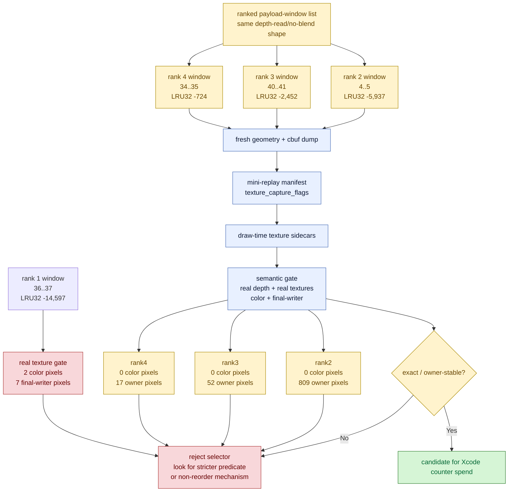

# Ranked Real-Texture Semantic Gate Queue

**Question / hypothesis.** [mini-replay-bisection-texture.02](mini-replay-bisection-texture.02.md) rejects the
rank-1 `60/2 depth-read + no-alpha-blend + textured` window as a production
primitive-reorder proof because real textures expose a tiny final-writer hazard.
Does that end the reorder line, or are there lower-ranked same-shape windows
whose locality gain survives a real-depth/real-texture semantic gate?

**Current evidence boundary.** The ranked probe list had four available
same-shape shader-state groups. All four have now run through the real-depth /
real-texture semantic gate. Rank 1 is a visible final-color failure; ranks 2-4
are final-color exact but still change canonical primitive ownership.

| Rank | Encoder draws | Draw ordinals | Window tris | Window LRU32 delta | Status |
|---:|---|---|---:|---:|---|
| 1 | `36..37` | `30572,30573` | `30,808` | `14,597` | rejected by real-texture final-writer gate |
| 2 | `4..5` | `30540,30541` in source probe; `30538,30539` in captured run | `9,538` | `5,937` | completed: color-exact, owner-masked [mini-replay-bisection-texture.04](mini-replay-bisection-texture.04.md) |
| 3 | `40..41` | `30576,30577` in source probe; `30747,30748` in captured run | `5,771` | `2,452` | completed: color-exact, owner-masked [mini-replay-bisection-texture.05](mini-replay-bisection-texture.05.md) |
| 4 | `34..35` | `30570,30571` | `2,273` | `724` | completed: color-exact, owner-masked [mini-replay-bisection-texture.06](mini-replay-bisection-texture.06.md) |

Rank 2 is still important even though its best two-draw window has a smaller
delta than rank 1: the full shader-state group has `33` draws and a larger
group-level candidate LRU32 delta (`25,295`). If rank 2 passes a narrow gate, it
becomes the next place to test whether a wider same-shader group can be made
safe. If it fails in the same way as rank 1, the evidence pushes primitive
reorder behind non-reorder backend-shape work.



**Rank-2 capture plan.**

```sh
python3 scripts/tools/select_3dmark05_payload_window.py \
  --probe-draws experiments/output/app-d3d9-3dmark05-post-visualfix-frame60-60-2-depthread-payload-r1/3dmark05-perf-indexed-probe-draws.csv \
  --row 60/2 \
  --class-filter depth-read,no-alpha-blend,textured \
  --rank-by candidate-miss32-delta \
  --rank-scope window \
  --max-draws 2 \
  --rank 2 \
  --output traces/app-d3d9-3dmark05-post-visualfix-frame60-60-2-rank2/analysis/frame60-payload-window-60-2-depth-read-no-blend-rank2.json

bash scripts/tools/run_3dmark05_perf_probe.sh \
  --suffix post-visualfix-frame60-60-2-rank2-geometry-r1 \
  --frame 60 --encoder-breakdown-seq 60 --no-gputrace --timeout 120 --top 5 \
  --dump-indexed-geometry --dump-indexed-geometry-cbufs \
  --dump-indexed-geometry-max-draws 2 \
  --probe-reverse-indexed-triangles-row 60/2 \
  --probe-reverse-indexed-triangles-classes depth-read,no-alpha-blend,textured \
  --probe-indexed-triangle-encoder-draw-min 4 \
  --probe-indexed-triangle-encoder-draw-max 5

python3 scripts/tools/build_3dmark05_mini_replay_manifest.py \
  --geometry-dir traces/app-d3d9-3dmark05-post-visualfix-frame60-60-2-rank2-geometry-r1/analysis/geometry \
  --probe-draws experiments/output/app-d3d9-3dmark05-post-visualfix-frame60-60-2-rank2-geometry-r1/3dmark05-perf-indexed-probe-draws.csv \
  --shader-summary traces/app-d3d9-3dmark05-post-visualfix-frame60-baseline-r1/analysis/frame60-shader-dump-summary.csv \
  --shader-msl-dir traces/app-d3d9-3dmark05-post-visualfix-frame60-baseline-r1/analysis/shaders/msl \
  --payload-selection traces/app-d3d9-3dmark05-post-visualfix-frame60-60-2-rank2/analysis/frame60-payload-window-60-2-depth-read-no-blend-rank2.json \
  --output traces/app-d3d9-3dmark05-post-visualfix-frame60-60-2-rank2-geometry-r1/analysis/frame60-mini-replay-60-2-depth-read-no-blend-rank2-manifest.json

jq -r '.summary.texture_capture_flags | @sh' \
  traces/app-d3d9-3dmark05-post-visualfix-frame60-60-2-rank2-geometry-r1/analysis/frame60-mini-replay-60-2-depth-read-no-blend-rank2-manifest.json
```

The manifest builder now emits `summary.texture_capture_handles_arg` and
`summary.texture_capture_flags`; use those flags in the follow-up texture
sidecar run instead of manually scraping `.meta` files.

```sh
python3 scripts/tools/run_3dmark05_semantic_replay_gate.py \
  traces/app-d3d9-3dmark05-post-visualfix-frame60-60-2-rank2-geometry-r1/analysis/frame60-mini-replay-60-2-depth-read-no-blend-rank2-manifest.json \
  --output-dir traces/app-d3d9-3dmark05-post-visualfix-frame60-60-2-rank2-texture-r1/analysis/mini-replay-depth-read-no-blend/semantic-gate-real-texture-r1 \
  --depth-input traces/app-d3d9-3dmark05-post-visualfix-frame60-60-2-depthinput-r1/analysis/frame60-depth.bin \
  --texture-input-dir traces/app-d3d9-3dmark05-post-visualfix-frame60-60-2-rank2-texture-r1/analysis/textures \
  --primitive-order cache-opt-lru32 \
  --conflict-analysis
```

**Interpretation.** The experiment was not trying to prove that rank 1 was
"almost acceptable"; it was deciding whether the hidden variable is the
specific rank-1 geometry/texture/depth interaction or the whole
depth-read/depth-write-off primitive-reorder class. The result splits those
claims: rank 1 is visibly unsafe, while ranks 2-4 are color-exact but
owner-masked. That keeps a stricter runtime selector or occlusion/final-color
oracle alive, but lowers the priority of broad primitive reorder and pushes the
performance plan toward semantics-safe mechanisms: backend-shape reduction,
render-pass/store traffic, stream/IB churn, and argbuf/cbuf encode traffic.

**Status update.** Rank 2 is recorded in
[mini-replay-bisection-texture.04](mini-replay-bisection-texture.04.md) and rank 3 is recorded in
[mini-replay-bisection-texture.05](mini-replay-bisection-texture.05.md). Rank 4 is recorded in
[mini-replay-bisection-texture.06](mini-replay-bisection-texture.06.md). Ranks 2-4 all pass exact final-color
comparison with real textures but still change canonical primitive ownership.
The follow-up selector scout is recorded in
[mini-replay-bisection-texture.07](mini-replay-bisection-texture.07.md); it rejects simple non-color thresholds as
a way to split the visible rank-1 failure from rank2-4 exact passes.

**Related.** [mini-replay-bisection](index.md) ·
[mini-replay-bisection-texture.02](mini-replay-bisection-texture.02.md) ·
[mini-replay-bisection-texture.04](mini-replay-bisection-texture.04.md) ·
[mini-replay-bisection-texture.05](mini-replay-bisection-texture.05.md) ·
[mini-replay-bisection-texture.06](mini-replay-bisection-texture.06.md) ·
[mini-replay-bisection-texture.07](mini-replay-bisection-texture.07.md) · [index-cache-locality](../index-cache-locality/index.md) ·
[overview-3dmark05-gt1](../overview-3dmark05-gt1.md).
