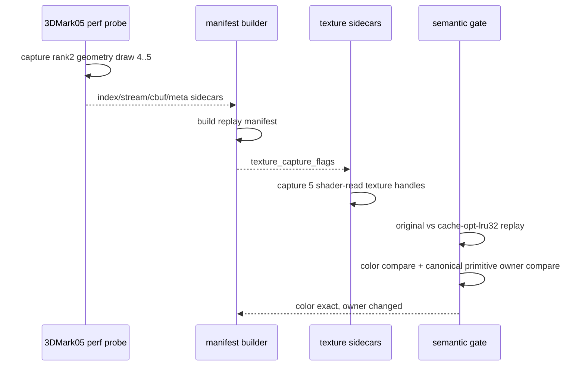
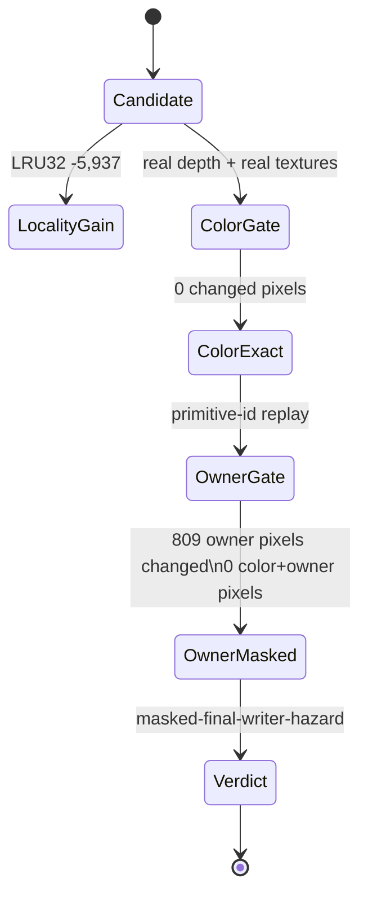

# Rank-2 Real-Texture Gate Is Color-Exact but Owner-Masked

**Question / hypothesis.** Rank 1 proved that a large
`60/2 depth-read + no-alpha-blend + textured` locality win can expose visible
real-texture color movement. Does the next-ranked same-shape window fail the
same way, or can it keep final color exact?

**Method.**

1. Captured rank-2 geometry/cbuf sidecars through
   `run_3dmark05_perf_probe.sh` with `--timeout 120`, no gputrace, and the rank-2
   VS/PS hash filters. The wrapper hit its final-frame watchdog (`124`) but
   still wrote the postprocess CSVs and geometry sidecars.
2. Built a manifest from the new run's row-local encoder draw range `4..5`.
   The new run's global draw ordinals shifted from the previous selection
   (`30540,30541`) to `30538,30539`, so the manifest intentionally used
   `--row 60/2 --encoder-draw-min 4 --encoder-draw-max 5` instead of the older
   selection JSON's draw-ordinal filter.
3. Used the manifest-generated `summary.texture_capture_flags` to capture five
   draw-time texture sidecars: `0x200000100000003`,
   `0x200000100000057`, `0x200000100000058`, `0x200000100000059`, and
   `0x20000010000008d`.
4. Validated every texture subresource `.bin` size against its JSON `byteCount`.
5. Ran `run_3dmark05_semantic_replay_gate.py` with captured D24X8 depth,
   captured real textures, `cache-opt-lru32`, and primitive-conflict analysis.

**Result.** The rank-2 two-draw window keeps final color exact with real depth
and real textures while preserving the locality gain:

| Metric | Value |
|---|---:|
| Encoder draws | `4..5` |
| Draw ordinals in this run | `30538,30539` |
| Primitives | `9,538` |
| Texture sidecars consumed | `5` |
| Original LRU32 misses | `19,131` |
| `cache-opt-lru32` LRU32 misses | `13,194` |
| LRU32 delta | `-5,937` (`-31.033%`) |
| Changed color pixels | `0 / 786,432` |
| Max color delta | `0` |
| Exact gate | passed |

The primitive-owner diagnostic is not stable, however:

| Draw | Encoder draw | Primitive-owner changed pixels | Color+owner changed pixels | Both cover pixels |
|---:|---:|---:|---:|---:|
| `0` | `4` | `167` | `0` | `6` |
| `1` | `5` | `642` | `0` | `0` |
| Total |  | `809` | `0` | `6` |

The semantic gate verdict is therefore `masked-final-writer-hazard`: the final
color is exact for this window, but `cache-opt-lru32` still changes canonical
primitive ownership at some pixels. In this case the owner movement is masked by
depth/color equivalence, so it does not reproduce rank 1's visible two-pixel
color failure.

**Interpretation.** Rank 2 keeps the reorder direction alive as a color-exact
locality candidate, but it does not prove a production-safe primitive-order
selector. The important split is:

- rank 1: locality gain plus visible color movement, rejected for production;
- rank 2: locality gain plus exact final color, but owner movement remains.

This means the hidden variable is not simply "all depth-read/no-blend reorder
breaks color." It is more likely a geometry/depth/texture interaction inside the
same state class. The next useful reorder proof needs either:

- a stricter runtime-visible selector that separates rank-2-like color-exact
  windows from rank-1-like visible failures;
- a final-color/final-writer or occlusion oracle strong enough to prove masked
  owner movement is harmless over a wider pass;
- or a shift away from primitive reorder toward semantics-safe backend-shape
  mechanisms.

**Related.** [mini-replay-bisection](../mini-replay-bisection.md) ·
[mini-replay-bisection-texture.02](mini-replay-bisection-texture.02.md) ·
[mini-replay-bisection-texture.03](mini-replay-bisection-texture.03.md) · [index-cache-locality](../index-cache-locality.md).
