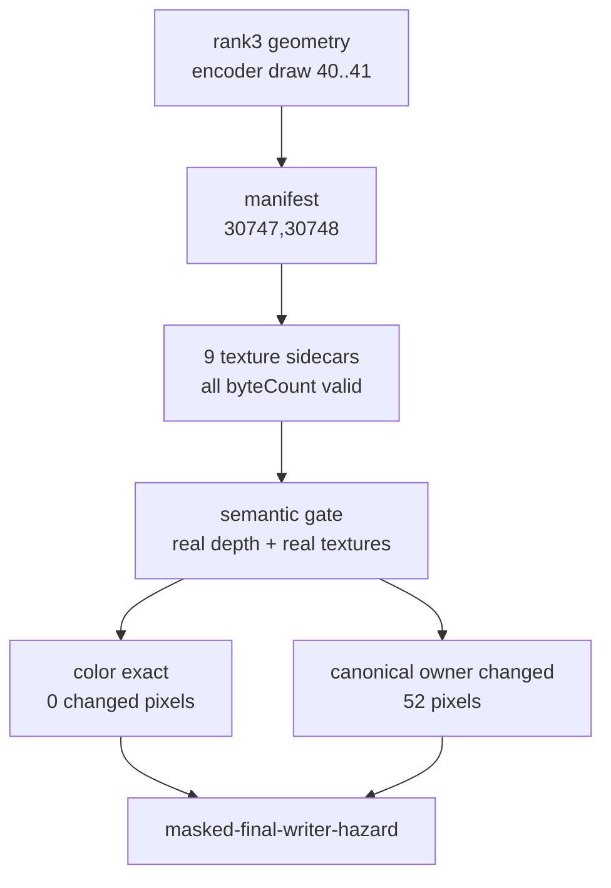
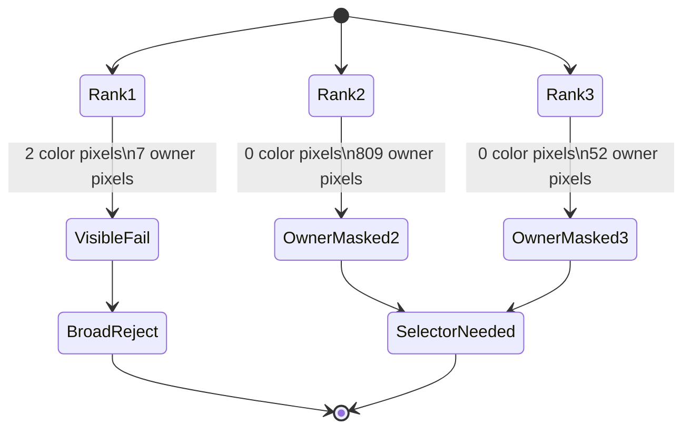

# Rank-3 Real-Texture Gate Is Also Color-Exact Owner-Masked

**Question / hypothesis.** Rank 2 kept final color exact but still changed
canonical primitive ownership. Does the next same-shape window repeat that
masked pattern, or does it expose another visible final-color failure like rank
1?

**Method.**

1. Captured rank-3 geometry/cbuf sidecars with `--timeout 120`, no gputrace,
   and rank-3 VS/PS filters. The wrapper hit the expected final-frame watchdog
   (`124`) but wrote postprocess CSVs and geometry sidecars.
2. Built the manifest from the new run's row-local encoder draw range `40..41`.
   Global draw ordinals shifted from the source selection (`30576,30577`) to
   `30747,30748`, so the manifest used the current run's row-local draw range.
3. Captured the manifest-generated nine texture sidecars and validated every
   JSON subresource `byteCount` against its `.bin`.
4. Ran the standard semantic gate with captured D24X8 depth, captured real
   textures, `cache-opt-lru32`, primitive-id replay, and primitive-conflict
   analysis.

**Result.** Rank 3 is exact at final color while preserving a smaller but still
real locality gain:

| Metric | Value |
|---|---:|
| Encoder draws | `40..41` |
| Draw ordinals in this run | `30747,30748` |
| Primitives | `5,771` |
| Texture sidecars consumed | `9` |
| Original LRU32 misses | `11,398` |
| `cache-opt-lru32` LRU32 misses | `8,946` |
| LRU32 delta | `-2,452` (`-21.513%`) |
| Changed color pixels | `0 / 786,432` |
| Active color pixels | `131 / 786,432` |
| Max color delta | `0` |
| Exact gate | passed |

The primitive-owner diagnostic remains non-zero:

| Draw | Encoder draw | Primitive-owner changed pixels | Color+owner changed pixels | Conflict both-cover pixels |
|---:|---:|---:|---:|---:|
| `0` | `40` | `46` | `0` | `0` |
| `1` | `41` | `6` | `0` | `0` |
| Total |  | `52` | `0` | `0` |

The gate verdict is therefore `masked-final-writer-hazard`, matching rank 2's
shape but with fewer owner-changed pixels.

**Interpretation.** Rank 3 strengthens the current split: the same
`depth-read + no-alpha-blend + textured` state class contains at least one
visible final-color failure and at least two color-exact owner-masked windows.
That argues against a broad state-only selector, but it also means the rank-1
failure is not universal. Rank 4 later repeated this color-exact owner-masked
shape with an even smaller owner movement ([mini-replay-bisection-texture.06](mini-replay-bisection-texture.06.md)).
The next useful reorder work is not another broad promotion; it is either:

- derive a runtime-visible selector that excludes rank 1 while keeping rank 2/3;
- or design a final-color/occlusion oracle that proves owner movement is masked
  over a wider replay/pass.

**Related.** [mini-replay-bisection](index.md) ·
[mini-replay-bisection-texture.02](mini-replay-bisection-texture.02.md) ·
[mini-replay-bisection-texture.03](mini-replay-bisection-texture.03.md) ·
[mini-replay-bisection-texture.04](mini-replay-bisection-texture.04.md) ·
[mini-replay-bisection-texture.06](mini-replay-bisection-texture.06.md) · [index-cache-locality](../index-cache-locality/index.md).
