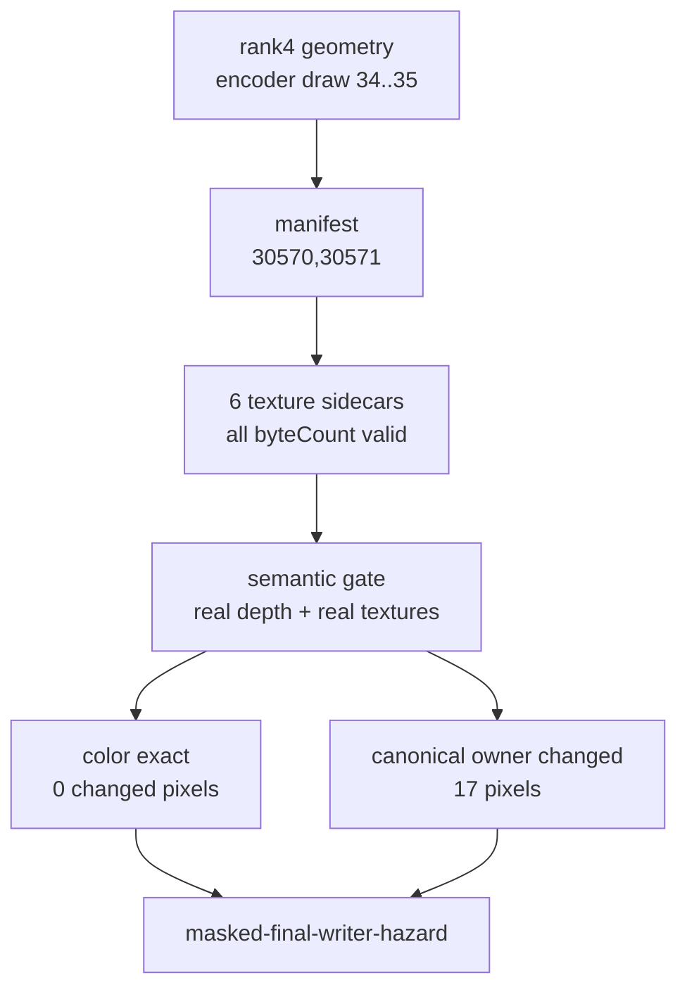
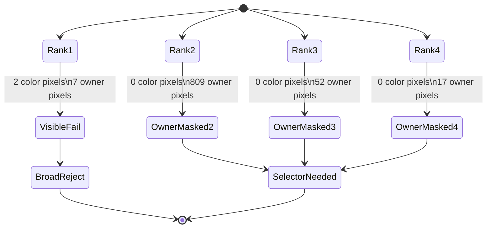

# Rank-4 Real-Texture Gate Is Color-Exact Owner-Masked

**Question / hypothesis.** Ranks 2 and 3 kept final color exact with real
textures while changing canonical primitive ownership. Does the last queued
same-shape window stay in that owner-masked bucket, or does it expose another
visible color failure like rank 1?

**Method.**

1. Captured rank-4 geometry/cbuf sidecars with `--timeout 120`, no gputrace,
   and the rank-4 VS/PS hash filters. The wrapper hit the expected final-frame
   watchdog (`124`) but still wrote postprocess CSVs and geometry sidecars.
2. Built the manifest from encoder draw range `34..35`. This capture retained
   the source draw ordinals `30570,30571`.
3. Captured the manifest-generated six texture sidecars:
   `0x200000100000003`, `0x200000100000007`, `0x20000010000007b`,
   `0x20000010000007c`, `0x20000010000007d`, and `0x20000010000008d`.
4. Validated every texture JSON subresource `byteCount` against its `.bin`.
5. Ran the standard semantic gate with captured D24X8 depth, captured real
   textures, `cache-opt-lru32`, primitive-id replay, and primitive-conflict
   analysis.

**Result.** Rank 4 is also exact at final color. Its locality gain is smaller
than ranks 1-3, but it remains a real cache-locality movement:

| Metric | Value |
|---|---:|
| Encoder draws | `34..35` |
| Draw ordinals in this run | `30570,30571` |
| Primitives | `2,273` |
| Texture sidecars consumed | `6` |
| Original LRU32 misses | `4,237` |
| `cache-opt-lru32` LRU32 misses | `3,513` |
| LRU32 delta | `-724` (`-17.087%`) |
| Changed color pixels | `0 / 786,432` |
| Active color pixels | `24 / 786,432` |
| Max color delta | `0` |
| Exact gate | passed |

The primitive-owner diagnostic remains non-zero:

| Draw | Encoder draw | Primitive-owner changed pixels | Color+owner changed pixels | Conflict pixels | Both cover pixels |
|---:|---:|---:|---:|---:|---:|
| `0` | `34` | `11` | `0` | `11` | `0` |
| `1` | `35` | `6` | `0` | `3` | `0` |
| Total |  | `17` | `0` | `14` | `0` |

The semantic gate verdict is therefore `masked-final-writer-hazard`. Rank 4
does not reproduce rank 1's visible two-pixel color failure, but it also does
not prove owner-stable primitive reorder.

**Interpretation.** Rank 4 completes the queued same-class probe set and
sharpens the current conclusion:

- `depth-read + no-alpha-blend + textured` is not universally color-unsafe;
- it is also not owner-stable under the current `cache-opt-lru32` reorder;
- color-only gates and full primitive-owner gates must be treated as separate
  proof levels.

That answers why this experiment matters to the GT1 goal. It does not directly
remove the bottleneck, but it prevents us from promoting an unsafe broad
reorder and identifies the remaining productive paths: a stricter selector that
excludes rank 1, a final-color/occlusion oracle that proves owner movement is
masked, or a non-reorder backend-shape mechanism. The immediate selector scout
is recorded in [mini-replay-bisection-texture.07](mini-replay-bisection-texture.07.md).

**Related.** [mini-replay-bisection](../mini-replay-bisection.md) ·
[mini-replay-bisection-texture.02](mini-replay-bisection-texture.02.md) ·
[mini-replay-bisection-texture.03](mini-replay-bisection-texture.03.md) ·
[mini-replay-bisection-texture.04](mini-replay-bisection-texture.04.md) ·
[mini-replay-bisection-texture.05](mini-replay-bisection-texture.05.md) ·
[mini-replay-bisection-texture.07](mini-replay-bisection-texture.07.md) · [index-cache-locality](../index-cache-locality.md).
