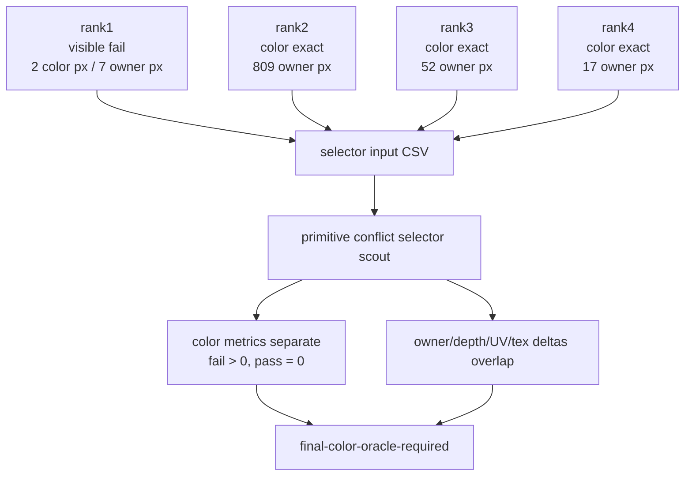
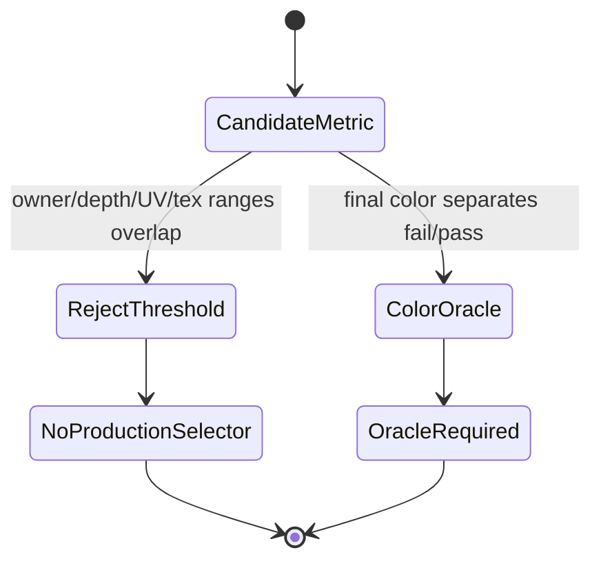

# Primitive Conflict Selector Scout Requires Final-Color Oracle

**Question / hypothesis.** Rank 1 is a visible real-texture failure while ranks
2-4 are color-exact owner-masked. Can a simple runtime-shaped
primitive-conflict metric separate the failure from the exact passes, or does
this line require a real final-color/final-writer oracle?

**Method.**

1. Built an aggregate conflict CSV with rank 1 as `semantic_status=fail` and
   ranks 2-4 as `semantic_status=pass`.
2. Included the seven per-draw primitive-conflict summaries already produced by
   the real-depth/real-texture gates: rank 1 draw `37`, rank 2 draws `4..5`,
   rank 3 draws `40..41`, and rank 4 draws `34..35`.
3. Ran `summarize_primitive_conflict_selectors.py` to test whether
   owner-pixel count, depth delta, UV delta, projected texcoord delta, or
   derived texture vectors separate fail/pass rows.
4. Extended `run_3dmark05_semantic_replay_gate.py` so future gate summaries
   include aggregate primitive-conflict counters directly.

**Result.** The selector scout reports
`Decision: final-color-oracle-required`. Only final-color metrics separate the
rank-1 failure from the exact-pass rows:

| Metric | Fail range | Pass range | Verdict |
|---|---:|---:|---|
| Owner pixels | `7..7` | `3..641` | overlap |
| Color changed pixels | `2..2` | `0..0` | fail-only positive |
| Max color delta | `5..5` | `0..0` | fail-only positive |
| Max abs depth delta | `3.468370143..3.468370143` | `0.014965644..201.571306286` | overlap |
| Max UV0 delta | `544.169300418..544.169300418` | `1.056792801..26497.059168837` | overlap |
| Max projected tex7 delta | `55542.26265169..55542.26265169` | `0.176353175..298899.707343886` | overlap |
| Max tex1 delta | `1009.833477236..1009.833477236` | `66.890478667..74622.539944111` | overlap |
| Max tex6 delta | `1098.265092905..1098.265092905` | `59.328414517..39057.644257621` | overlap |

**Interpretation.** This is the practical answer to what the ongoing
real-texture rank experiment contributes to the GT1 goal. It does not merely
show that some windows are color-exact; it rejects the simple selector family
that would have made those windows production-actionable. Owner-count,
both-cover, depth delta, UV delta, and projected-texcoord thresholds all overlap
between the visible failure and exact passes, so they are not a safe runtime
predicate.

The remaining reorder path needs a true final-color/final-writer or occlusion
oracle. Without that oracle, the performance plan should spend the next serious
budget on non-reorder hidden-backend mechanisms rather than another broad
depth-read primitive reorder.

**Related.** [mini-replay-bisection](index.md) ·
[mini-replay-bisection-texture.02](mini-replay-bisection-texture.02.md) ·
[mini-replay-bisection-texture.04](mini-replay-bisection-texture.04.md) ·
[mini-replay-bisection-texture.05](mini-replay-bisection-texture.05.md) ·
[mini-replay-bisection-texture.06](mini-replay-bisection-texture.06.md) · [index-cache-locality](../index-cache-locality/index.md).
