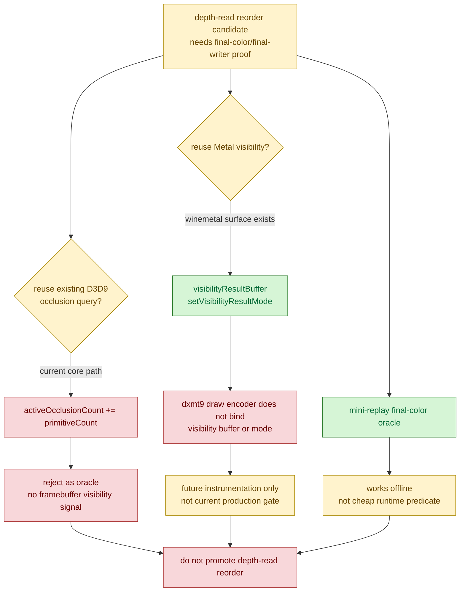
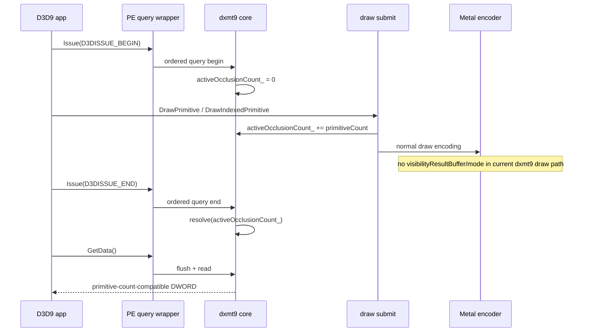
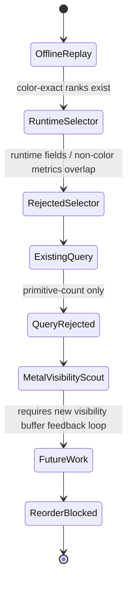

# Occlusion Oracle Feasibility Gate

**Question / hypothesis.** The primitive-conflict scout says the remaining
depth-read locality path needs final-color/final-writer or occlusion data. Can
the existing D3D9 occlusion query path or winemetal visibility API be reused as
a cheap production oracle for scoped `60/2` reorder?

**Method.**

1. Audited the PE query wrapper. `IDirect3DQuery9::Issue()` is ordered through
   the chunk recorder or a flush+bridge fallback; `GetData()` flushes before
   reading the core query.
2. Audited core query resolution. `Device::issueQuery(begin)` resets
   `activeOcclusionCount_` to `0`; draw submission increments it by submitted
   `primitiveCount`; `Device::issueQuery(end)` resolves that counter.
3. Checked tests. The native lifecycle test expects an occlusion result of `2`
   for `drawPrimitive(TriangleList, 2)`, proving the current core path is a
   primitive-submission compatibility counter, not a framebuffer visibility
   sample counter.
4. Audited winemetal visibility plumbing. `WMTRenderPassInfo` carries
   `visibility_buffer`, and `RenderCommandEncoder::setVisibilityResultMode()`
   exists, but the dxmt9 draw encoder does not bind a visibility buffer or issue
   visibility-mode commands for normal GT1 draw encoding.

**Result.** The existing occlusion query path is not the required oracle. It is
useful for current app/query compatibility tests, but its resolved value is
derived from submitted primitive count. It does not know whether fragments pass
depth/stencil, whether alpha/blend changes final color, or whether later draws
overwrite a candidate's contribution.

Metal visibility is a plausible future scout, not an available gate. The lower
winemetal ABI already exposes the render-pass visibility buffer and
`setVisibilityResultMode`, so an experiment could be built without inventing a
new Metal primitive. However, production use would need a new feedback design:
visibility-buffer allocation, per-candidate offsets, mode toggles around the
candidate draws, readback or delayed-frame feedback, and a conservative policy
for count-positive draws. A zero count could prove "no samples passed at this
point"; it still would not prove broader final-color equivalence for every
count-positive, blended, or later-overwritten case.

**Interpretation.** This narrows the meaning of the continuing experiment. The
mini-replay ranks have found real locality gain, but the current implementation
does not have a cheap runtime signal that can separate rank-1 visible failure
from rank2-4 owner-masked exact passes. Existing D3D9 occlusion query state
cannot be repurposed for that signal. The remaining production choices are:

- use the diagnostic Metal visibility scout added in
  [[mini-replay-bisection-texture.09]] only for no-sample triage, then add
  final-color/final-writer proof for count-positive rows;
- find a stricter runtime-visible selector that does not depend on final color;
- stop spending reorder/Xcode budget here and return to non-reorder backend
  mechanisms.

**Related.** [[mini-replay-bisection]] ·
[[mini-replay-bisection-texture.07]] · [[index-cache-locality]] ·
[[hidden-backend-storage]].
