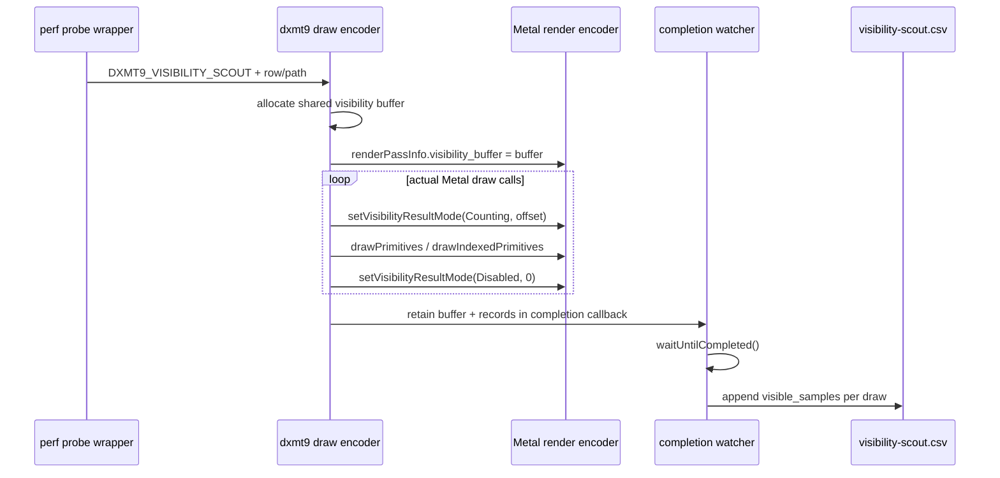
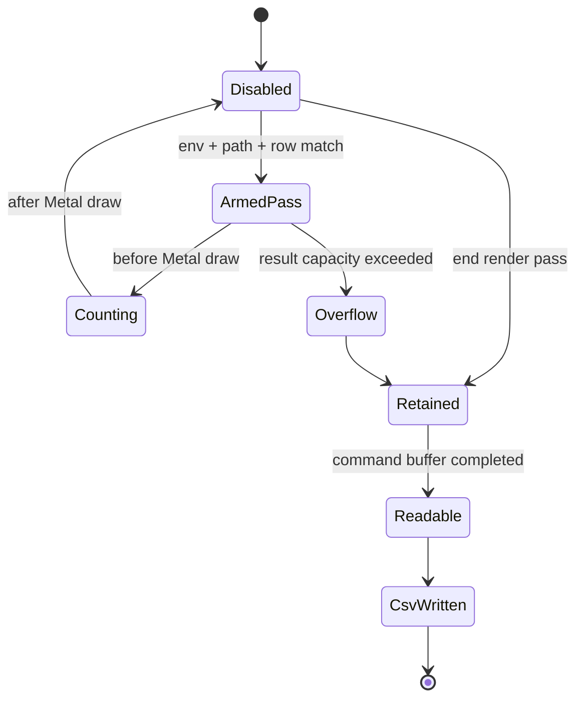
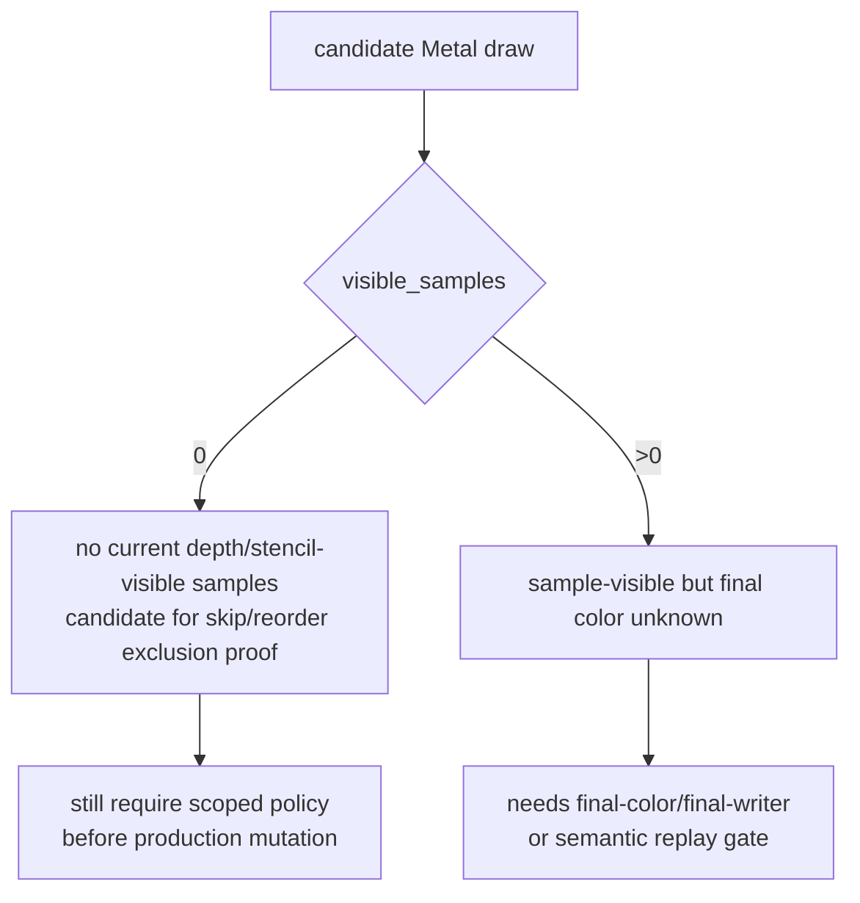

# Metal Visibility Scout Wiring

**Question / hypothesis.** The existing D3D9 occlusion query is primitive-count
compatible and cannot serve as a final-color oracle. Can dxmt9 now collect a
real Metal visibility signal cheaply enough to separate no-sample candidates
from depth-read reorder hazards?

**Implementation.**

- `DXMT9_VISIBILITY_SCOUT=1` enables a diagnostic-only scout when
  `DXMT9_VISIBILITY_SCOUT_PATH` is set.
- `DXMT9_VISIBILITY_SCOUT_ROW=SEQ/ENC` and
  `DXMT9_VISIBILITY_SCOUT_ROWS=...` restrict the scout to selected render
  encoders.
- `beginRenderPass()` now accepts a visibility buffer and wires it into
  `WMTRenderPassInfo.visibility_buffer`.
- The draw encoder toggles `setVisibilityResultMode(Counting, offset)` around
  each actual Metal draw call and disables it immediately after the draw.
- The shared visibility buffer is retained until the queue completion watcher
  has waited for GPU completion; only then does the callback append CSV rows.
- `scripts/tools/run_3dmark05_perf_probe.sh --visibility-scout-row 60/2`
  writes the default CSV to
  `traces/<run-id>/analysis/frame<N>-visibility-scout.csv`.
- `scripts/tools/summarize_visibility_scout.py` reduces that CSV into row-local
  state buckets and optional `metal_draw_index` windows, with optional
  `--probe-draws` cache-miss join data. The 3DMark05 perf wrapper now runs this
  postprocess automatically when `--visibility-scout*` is enabled.





**Interpretation boundary.** `visible_samples == 0` is a conservative
``no samples passed depth/stencil at this point'' signal for that Metal draw.
It is stronger than the current D3D9 query path and useful for ruling out
no-sample work in selected hot encoders. `visible_samples > 0` is not a
final-color proof: alpha test/blend, color write masks, shader output, and later
draws may still make the final framebuffer identical or different. Therefore the
scout can help prioritize or reject candidates, but production reorder still
needs a final-color/final-writer policy for count-positive rows.



**Smoke result.** After rebuilding the x86_64 builtin runtime used by the
3DMark05 wrapper, a no-gputrace smoke was run with:

```bash
scripts/tools/run_3dmark05_perf_probe.sh \
  --suffix visibility-scout-60-2-r2 \
  --no-gputrace \
  --visibility-scout-row 60/2 \
  --timeout 180
```

The app still hit the known final-frame watchdog (`status 124` after `225s`),
but postprocess artifacts and the ignored visibility CSV were written. The
selected row had `187` Metal draw rows: `25` had `visible_samples == 0`, and
`162` had positive samples (`max=373880`). This proves the scout is wired and
that `60/2` is mixed: the whole row cannot be treated as no-sample, but specific
draws can now be separated before another Xcode counter spend.

The first summarizer pass also lowers the old rank-1 locality hypothesis. The
blocked `metal_draw_index` window `36..37` is positive-positive
(`398 + 8884` visible samples), so it is not a no-sample reorder candidate. All
`large4096=yes` buckets in row `60/2` are also sample-visible; the zero rows are
small-primitive buckets. The generated `No-Sample Draws` table ranks those zero
rows and the first entries are `596`-primitive / `1788`-element draws, not the
large hidden-backend owners. This keeps Metal visibility useful as a no-sample
triage tool, but it does not unblock the scoped depth-read locality path without
final-color/final-writer proof.

```bash
python3 scripts/tools/summarize_visibility_scout.py \
  traces/app-d3d9-3dmark05-visibility-scout-60-2-r2/analysis/frame60-visibility-scout.csv \
  --row 60/2 \
  --draw-indices 36..37 \
  --output traces/app-d3d9-3dmark05-visibility-scout-60-2-r2/analysis/frame60-visibility-scout-summary.md \
  --csv-output traces/app-d3d9-3dmark05-visibility-scout-60-2-r2/analysis/frame60-visibility-scout-summary.csv
```

**Next use.** Run the scout on the blocked depth-read row before another Xcode
counter spend:

```bash
scripts/tools/run_3dmark05_perf_probe.sh \
  --suffix visibility-scout-60-2 \
  --frame 60 \
  --visibility-scout-row 60/2 \
  --timeout 420
```

Then join `frame60-visibility-scout.csv` with the encoder breakdown and Xcode
counter CSV by `seq,encoder,command,draw_ordinal` to check whether the suspected
high-VS-write window is no-sample, sample-visible, or mixed.

**Related.** [[mini-replay-bisection-texture.08]] ·
[[mini-replay-bisection-texture.10]] ·
[[mini-replay-bisection]] · [[index-cache-locality]] ·
[[hidden-backend-storage]].
