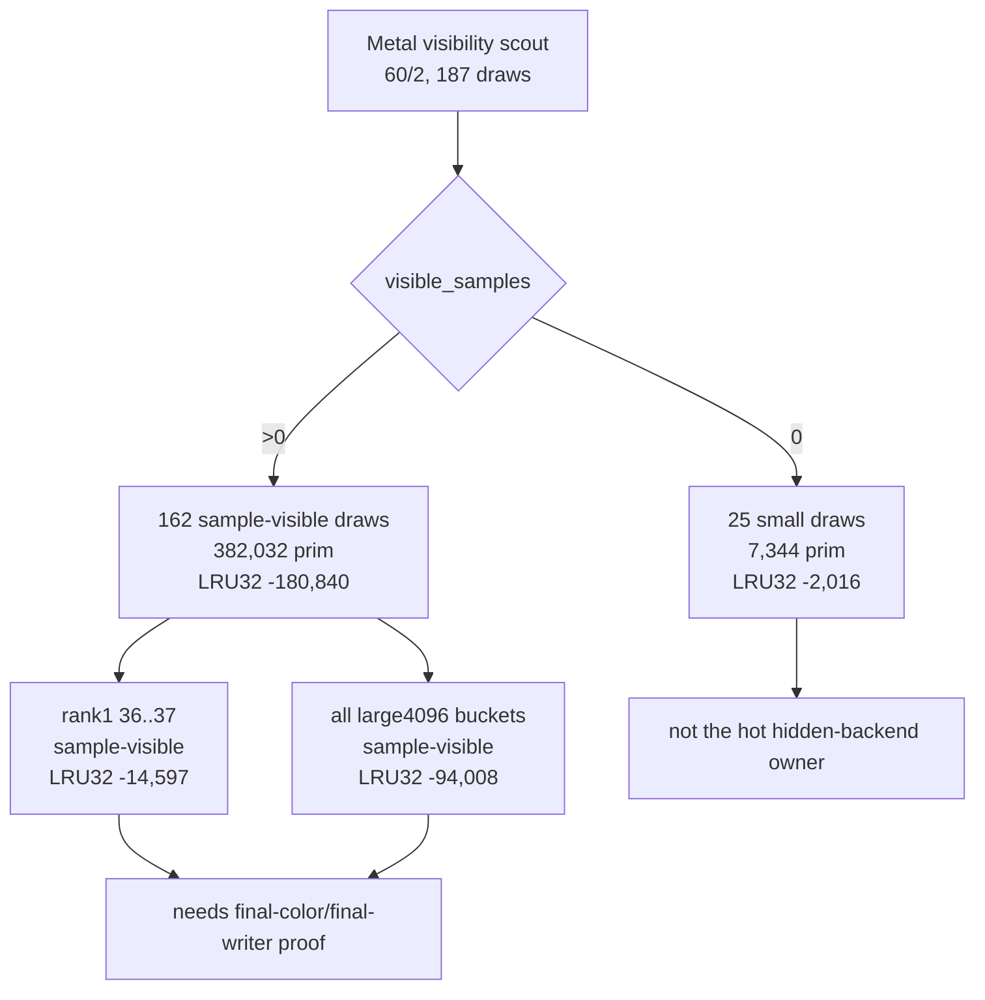

# Visibility Scout Cache Join

**Question / hypothesis.** The Metal visibility scout can identify no-sample
draws. Are those no-sample draws also the high-LRU32 / high-primitive candidates
that could explain the residual `60/2` hidden-backend storage cost?

**Method.** Run a no-gputrace probe with both visibility counting and cache
candidate measurement enabled:

```bash
bash scripts/tools/run_3dmark05_perf_probe.sh \
  --suffix visibility-scout-60-2-cachejoin-r1 \
  --no-gputrace \
  --visibility-scout-row 60/2 \
  --visibility-scout-draw-indices 36..37 \
  --measure-index-cache-opt-candidate \
  --timeout 180
```

The run hit the known final-frame watchdog (`status 124` after `225s`) but
wrote postprocess artifacts. The wrapper generated
`frame60-visibility-scout-summary.md` automatically and joined
`3dmark05-perf-indexed-probe-draws.csv` into the visibility buckets.

**Result.**

| Bucket | Draws | Source primitives | Visible samples | LRU32 delta |
|---|---:|---:|---:|---:|
| All `60/2` visibility rows | `187` | `389,376` | `3,191,671` | `-182,856` |
| `visible_samples == 0` | `25` | `7,344` | `0` | `-2,016` |
| `visible_samples > 0` | `162` | `382,032` | `3,191,671` | `-180,840` |
| `large4096=yes` | `20` | `206,348` | `1,686,980` | `-94,008` |
| `large4096=no` | `167` | `183,028` | `1,504,691` | `-88,848` |

The old rank-1 window `36..37` remains sample-visible:

| Window | Draws | Zero | Positive | Visible samples | LRU32 delta |
|---|---:|---:|---:|---:|---:|
| `36..37` | `2` | `0` | `2` | `9,232` | `-14,597` |

The no-sample rows are small. The top no-sample entries are repeated
`596`-primitive / `1788`-element draws with only `-160` LRU32 delta each.



**Verdict.** Metal visibility is useful for excluding no-sample work, but the
no-sample rows in current `60/2` do not carry enough primitive volume or cache
gain to explain the GT1 hidden-backend bottleneck. The hot locality gain remains
inside sample-visible rows, so production work still needs:

- final-color/final-writer proof for any depth-read primitive reorder; or
- a primitive-order-preserving backend mechanism that reduces the hidden
  vertex/tiler storage denominator.

**Related.** [mini-replay-bisection-texture.09](mini-replay-bisection-texture.09.md) ·
[overview-3dmark05-gt1](../overview-3dmark05-gt1.md) · [hidden-backend-storage](../hidden-backend-storage/index.md) ·
[index-cache-locality](../index-cache-locality/index.md).
