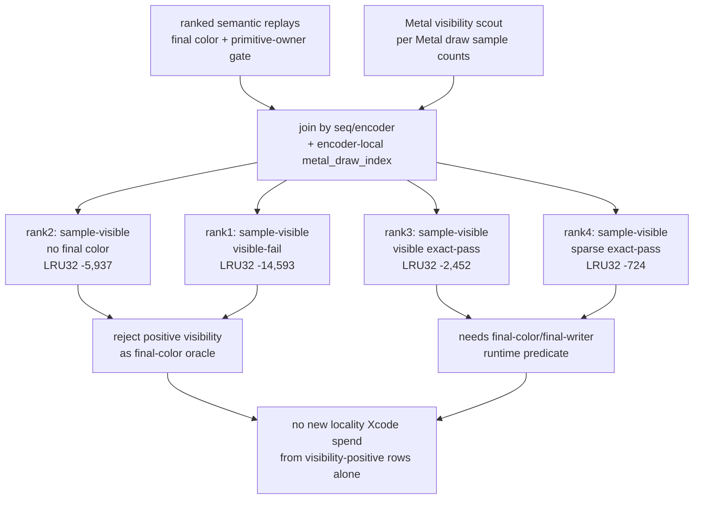

# Visibility Positive Semantic Join

**Question / hypothesis.** The previous visibility/cache join rejected no-sample
rows as the hot locality owner. Can positive Metal visibility samples serve as
the missing runtime oracle for scoped `60/2 depth-read + no-alpha-blend`
primitive reorder candidates?

**Method.** Extend `summarize_semantic_payload_candidates.py` with
`--visibility-csv` and join each ranked semantic replay outcome to the diagnostic
Metal visibility scout by `seq/encoder` plus encoder-local `metal_draw_index`.
Use encoder-local draw indices rather than global draw ordinals because replay
captures can shift global ordinals between runs.

The joined report is:

```bash
python3 scripts/tools/summarize_semantic_payload_candidates.py \
  --candidates traces/app-d3d9-3dmark05-post-visualfix-frame60-60-2-depthread-payload-r1/analysis/frame60-payload-window-60-2-depth-read-no-blend-top8.json \
  --rank-outcome 1=<rank1-color-compare-summary.csv>,<rank1-cache-opt-lru32-summary.json> \
  --rank-outcome 2=<rank2-color-compare-summary.csv>,<rank2-cache-opt-lru32-summary.json> \
  --rank-outcome 3=<rank3-color-compare-summary.csv>,<rank3-cache-opt-lru32-summary.json> \
  --rank-outcome 4=<rank4-color-compare-summary.csv>,<rank4-cache-opt-lru32-summary.json> \
  --visibility-csv traces/app-d3d9-3dmark05-visibility-scout-60-2-cachejoin-r1/analysis/frame60-visibility-scout.csv \
  --output traces/app-d3d9-3dmark05-post-visualfix-frame60-gate-r1/analysis/frame60-depth-read-no-blend-semantic-payload-visibility-summary.md
```

The placeholders above are the four existing semantic gate compare/summary
pairs cited in the generated report. The output contains both final-color replay
verdicts and Metal sample counts.

**Result.**

| Rank | Draws | Semantic verdict | Visibility status | Samples | Active px | Changed px | LRU32 delta |
|---:|---|---|---|---:|---:|---:|---:|
| `1` | `36..37` | `visible-fail` | `sample-visible-visible-fail` | `9,232` | `131` | `2` | `-14,593` |
| `2` | `4..5` | `no-final-color-exact-pass` | `sample-visible-final-color-empty` | `39,835` | `0` | `0` | `-5,937` |
| `3` | `40..41` | `visible-exact-pass` | `sample-visible-visible-exact` | `8,247` | `131` | `0` | `-2,452` |
| `4` | `34..35` | `sparse-exact-pass` | `sample-visible-sparse-exact` | `700` | `24` | `0` | `-724` |

Rank 2 is the decisive negative control: it produces `39,835` visibility
samples, but the final-color replay has `0` active pixels. Positive Metal
visibility therefore proves sample coverage at that point in the render pass,
not final-frame contribution. Rank 1 and rank 3 are also both sample-positive,
but rank 1 is a visible final-writer failure while rank 3 is a visible exact
pass. Positive visibility cannot split correctness blockers from useful
payloads.



**Verdict.** Metal visibility remains useful as no-sample triage, but positive
visibility is not the missing final-color/final-writer oracle. It is neither a
positive proof of final-frame contribution nor a safe reorder selector. The
scoped depth-read locality line can move forward only if one of these appears:

- a runtime final-color/final-writer predicate that excludes rank-1-like
  hazards while preserving enough rank-3-like visible exact payload;
- a broader safe selector with at least the screen-blend ceiling's required
  LRU32 budget; or
- a primitive-order-preserving backend-denominator mechanism.

**Meaning for the GT1 goal.** This experiment does not directly improve FPS.
Its value is budget control: it prevents another low-return Xcode pass on
visibility-positive locality rows and redirects the search toward either a real
final-writer oracle or non-reorder hidden-backend work. The result is now also
consumed by the automated perf gate as
`visibility-positive-oracle=reject-positive-oracle`.

**Related.** [hidden-backend-storage-shape.17](../hidden-backend-storage/hidden-backend-storage-shape.17.md) ·
[mini-replay-bisection-texture.09](mini-replay-bisection-texture.09.md) ·
[mini-replay-bisection-texture.10](mini-replay-bisection-texture.10.md) · [index-cache-locality](../index-cache-locality/index.md) ·
[overview-3dmark05-gt1](../overview-3dmark05-gt1.md).
