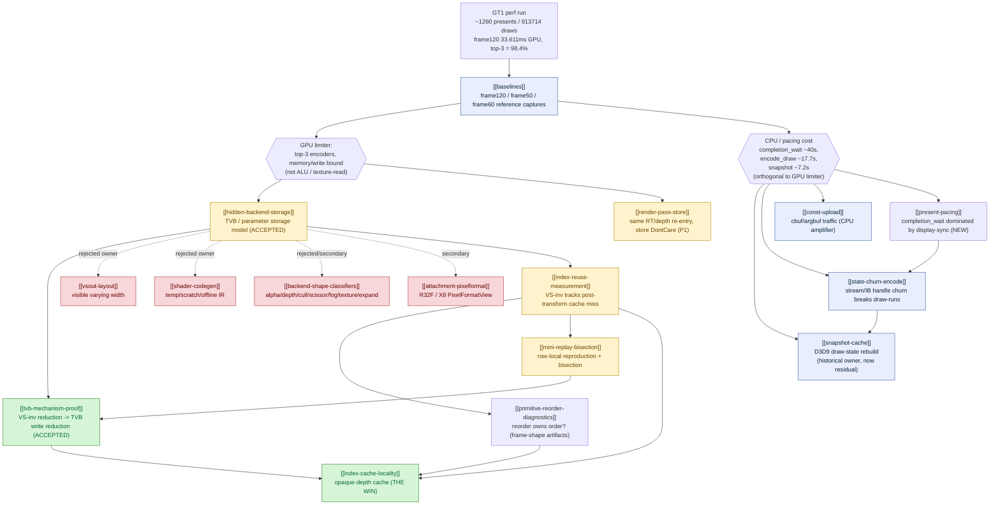
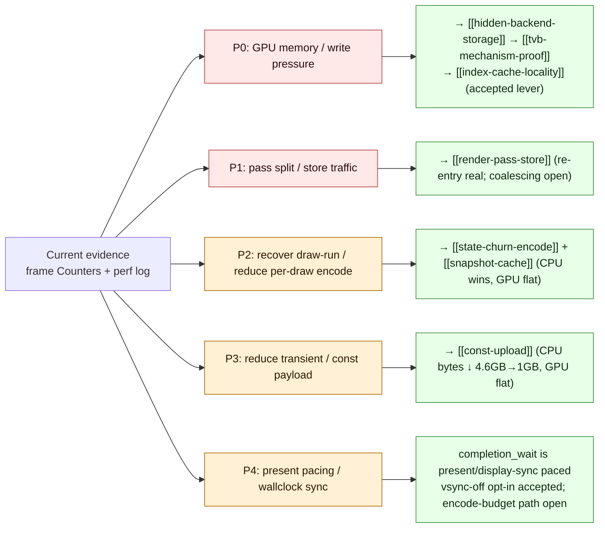
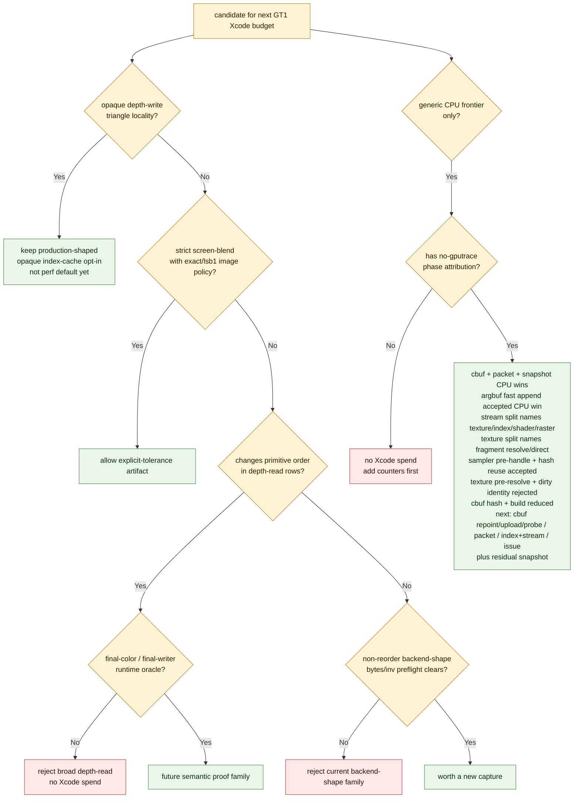

# 3DMark05 GT1 Performance — Investigation Map

> Root node of the `docs/perfomance/` knowledge graph. This is the
> authoritative cross-referenced set of domain overviews and
> one-experiment-per-file leaf nodes. The old append-only
> `specs/perfomance.plan.md` journal has been deleted/retired and must not be
> maintained as a performance source.

## The root question

**Why is 3DMark05 GT1 GPU-bound under dxmt9 (a D3D9→Metal translation
layer on Apple Silicon), and what owns the cost?**

Target: `app-d3d9-3dmark05`, GT1 path under `DXMT_EXPERIMENT_PROFILE=perf`.

## Central finding (read this first)

The top-3 render encoders dominate every captured frame (~98% of GPU
time) and write a large **"VS Buffer Device Memory Bytes Written"**
bucket (~1.6 GiB at frame60, ~1.0–2.2 GiB depending on capture). That
bucket is **not** explained by:

- dxmt CPU-side writers (argbuf/transient/cbuf ≈ 0.4 MiB), nor
- visible MSL `VSOut` width (184 B), nor
- AIR-visible shader scratch (128 B).

It is **hidden Apple GPU vertex-stage / tiler / parameter-buffer (TVB)
backend storage** that scales with **VS invocation count × per-vertex
VSOut bytes**. See [[hidden-backend-storage]] for the model and
[[tvb-mechanism-proof]] for the accepted proof.

**The one accepted production win** is opaque-depth **index-cache
locality** ([[index-cache-locality]]): reordering indices for opaque
depth-writing triangles improves the post-transform vertex cache, which
lowers VS invocations, which linearly lowers TVB write — verified
target-row GPU −18.4%, VS invocations −14.1%, VS write −16.8%.
The current fast-measure implementation passes the strong Xcode proof gates,
but remains an opt-in rather than a shared `perf` default: the non-diagnostic
smoke still adds about `+216ms` of total encode-draw CPU / `+301ms` of
index-setup CPU over a 1440-present run, and the narrow source-resolve counter
shows the owner is cache/candidate/draw-path work rather than base
index-buffer lookup.
The strongest measured stable path combines that production-shaped subset with
screen-blend locality (top GPU −11.89%), but screen-blend is only an explicit
exact/`lsb1` policy artifact, not a broad depth-read rule.

Almost every other hypothesis (visible varying width, shader temps,
render/raster state toggles, primitive reorder, const-upload size,
pixel-format views) was **rejected as "not the first-order owner."**
Several CPU-side reductions are real but orthogonal to the GPU limiter.

## Domain map



## Priority DAG

The remaining work is organized into priority levels. P0/P1 are active
GPU-frame targets; P2/P3 are CPU encode tracks; P4 is wallclock/present pacing,
which is separate from the hidden-backend GPU limiter.



## Current Gate Summary

The latest gate report narrows the next Xcode budget. Residual proxy bytes alone
are not enough to schedule a capture; the candidate must either be an accepted
locality path, carry an explicit semantic policy, or prove a new non-reorder
backend mechanism before replay.

| Track | Status | Evidence | Decision |
|---|---|---|---|
| Opaque-depth index locality | keep as opt-in | Fast-measure proof: top GPU `-9.50%`; target `50/0+50/1` GPU `-18.39%`, VS invocations `-14.12%`, VS write `-16.79%`; CPU smoke still has index setup `+309ms` and source-resolve is flat | Production-shaped path remains the safe GPU win, but not a shared `perf` default until CPU side-effect is lower or a broader runtime gate proves net positive. [[index-cache-locality]] |
| Screen-blend index locality | explicit-tolerance-only | Combined run GPU `-11.89%`; `lsb1` image gate `739/786,432`, max delta `1`, SSIM `1.000000` | Allow only under explicit exact/`lsb1` policy; do not generalize to broad depth-read. [[index-cache-locality-screenblend.04]] |
| Broad depth-read reorder | reject | Visible exact gain exists (`-8446` LRU32), but visible-fail hazard remains (`-1407` LRU32) | Requires final-color/final-writer or occlusion proof before another Xcode spend. [[mini-replay-bisection-semantic.01]] |
| Runtime final-color selector | blocked | Pass draws `3,5,6,7` and fail draw `4` share all `43` runtime-visible fields | Do not use full uniform payload identity as a production selector. [[mini-replay-bisection-semantic.01]] |
| Non-reorder backend mechanism | needs-new-mechanism | Half-VSOut bytes/inv `-1.94%`, but GPU `+3.40%` | New candidate must preflight meaningful bytes/inv or hidden-backend proxy movement. [[hidden-backend-storage-shape.02]] |
| Index-cache CPU reduction | reject current attempts | Fixed cap cuts slots but not CPU; heap lazy frontier cuts scored work `-80.97%` but select CPU regresses `+21.40%`; bucketed select cuts scored work `-72.61%` but select CPU regresses `+32.46%`; unique upper-bound gate rejects `76` candidates but candidate CPU regresses `+8.50%` | Do not spend more Xcode budget on these CPU-only variants. Next CPU work needs a cheaper persistent verdict or draw-shape prefilter before no-gputrace promotion. [[index-cache-locality-cpucost.11]], [[index-cache-locality-cpucost.12]], [[index-cache-locality-cpucost.13]], [[index-cache-locality-cpucost.14]] |
| Current no-gputrace baseline | accepted as counter sample | Watchdog-cleanup scout: 1440 presents; GPU CB `+0.15%`, completion wait `+0.14%`, draws `-0.01%` vs baseline | Use as the current supervised timeout shape; it does not justify new Xcode budget by itself. [[baselines-frame50.04]] |
| Encode CPU attribution | CPU wins accepted, fps proof still open | No-gputrace attribution has narrowed broad encode guesses into named CPU-only children: cbuf identity, packet-cache, snapshot, argbuf-open, sampler, and transient fast-append work all moved CPU but not GPU. Cbuf residual split named binding content hash as a dominant child (`570.070ms`, VS `489.627ms`), then the default path removed that byte scan (`binding_hash=0`) and cut cbuf update `1.216 -> 0.875ms/present`; prefix-preserving cbuf builders then cut cbuf build `0.333815 -> 0.175342ms/present`. | No Xcode spend from these CPU results alone. Continue no-gputrace work on cbuf upload/probe/repoint residual, binding-packet plan/cache, index setup/source resolve, shader-stream diversity, issue cost, and residual snapshot. Do not chase broad D3D9 setter no-op guards, slot-30 bind shadowing, dirty-category identity repoint, FFP stream binding, resource-array binding, vertex texture binding, LOD-bias upload, sampler lookup/rehash skip, texture pre-resolve source matching, raw cbuf `setBuffer`, cbuf upload-plan, observer callbacks, default cbuf content hashing, or live-range-only cbuf prefix zeroing unless cheap instrumentation first proves a new non-zero opportunity. Require visual smoke/same-input image proof for future cbuf/binding semantic changes. [[state-churn-encode-encode-phase.02]], [[state-churn-encode-encode-phase.03]], [[state-churn-encode-encode-phase.04]], [[state-churn-encode-encode-phase.05]], [[state-churn-encode-encode-phase.06]], [[state-churn-encode-encode-phase.07]], [[state-churn-encode-encode-phase.08]], [[state-churn-encode-encode-phase.09]], [[state-churn-encode-encode-phase.10]], [[state-churn-encode-encode-phase.11]], [[state-churn-encode-encode-phase.12]], [[state-churn-encode-encode-phase.13]], [[state-churn-encode-encode-phase.14]], [[state-churn-encode-encode-phase.15]], [[state-churn-encode-encode-phase.16]], [[state-churn-encode-encode-phase.17]], [[state-churn-encode-encode-phase.18]], [[state-churn-encode-encode-phase.19]], [[state-churn-encode-encode-phase.20]], [[snapshot-cache-snapshot.04]], [[snapshot-cache-snapshot.05]], [[snapshot-cache-snapshot.06]], [[snapshot-cache-snapshot.07]], [[snapshot-cache-snapshot.08]], [[snapshot-cache-snapshot.09]] |



## Frame shape

Frame120 (historical bottleneck-shape capture, [[baselines-frame120.01]]):
total **33.611 ms** GPU, top-3 encoders **33.075 ms / 98.4%**; the same
RT/depth pair returns after another pass and accounts for **24.643 ms /
73.3%**. Passes are LLC/MMU/buffer-write limited, **not** ALU- or
texture-read-bound. Run-level: ~14673 passes preserve **167.73 GB** of
tile contents; draw-run submits = **580** against 913714 draws (≈99.94%
fail to batch), broken by const-upload (659938) and stream/IB state
deltas (793059 / 750041).

The current canonical A/B baseline is frame50 normal-source
([[baselines-frame50.01]]): **35.024 ms**, top-3 98.19%, rows 50/2
(56.9%) / 50/1 (24.5%) / 50/0 (16.8%), hidden backend estimate
≈1597.6 MiB. Mid-investigation probes A/B against frame60
([[baselines-frame60.01]]).

## What is settled vs open

**Accepted**
- The GPU limiter is hidden vertex/tiler/parameter (TVB) backend storage,
  scaling with VS invocations × per-vertex VSOut bytes. [[hidden-backend-storage]], [[tvb-mechanism-proof]]
- Opaque-depth index-cache locality is a real, semantic-safe GPU win, but
  stays opt-in until the remaining index-setup CPU side-effect is reduced or
  amortized by a broader runtime gate. [[index-cache-locality]]
- Several CPU reductions are real (dirty-range reset + FFP-VS slice reuse
  cut cbuf traffic 4.6 GB→~1 GB; binding-override cut encode CPU 10–30%) —
  but every one left GPU frame time flat. [[const-upload]], [[state-churn-encode]], [[snapshot-cache]]

**Rejected as first-order GPU owner**
- Visible `VSOut`/varying width, point-size, half-precision varyings. [[vsout-layout]]
- Translated-shader temp/scratch sizing; owner is below AIR. [[shader-codegen]]
- Current primitive-order-preserving backend-shape probes: half-VSOut moves
  bytes/inv only `-1.94%` and regresses GPU, so it fails the non-reorder gate.
  [[hidden-backend-storage]]
- Render/raster state toggles (depth-write, depth-func, cull, scissor) and
  alpha-test; cull moves only the small named-tiled counters (~30 MiB). [[backend-shape-classifiers]]
- Primitive/triangle reorder as a *stable* lever — apparent wins were
  frame-shape/tile-coverage artifacts that did not reproduce on HEAD. [[primitive-reorder-diagnostics]]
- Const-upload payload size, R32F/X8 PixelFormatView suppression. [[const-upload]], [[attachment-pixelformat]]

**Open**
- Which sub-component of the hidden backend dominates (stage-out vs binning
  parameter storage vs compiler spill). [[hidden-backend-storage]]
- Row 50/2 screen-blend locality: useful under explicit exact/`lsb1` semantic
  policy, but broad depth-read reorder is blocked by a runtime-indistinguishable
  final-color hazard. [[index-cache-locality]]
- Dependency-aware pass coalescing for same RT/depth re-entry (P1). [[render-pass-store]]
- Remaining CPU tracks: pacing/completion wait, backend encode, and residual
  snapshot rebuild. After the accepted cbuf identity, packet-cache, and snapshot
  hash work, the latest `snapshot.09` no-gputrace sample is
  `completion_wait_ms=39978.924`, `encode_draw_cpu_ms=17711.215`, and
  `d3d9_snapshot_draw_submission_cpu_ms=7196.881` over `1740` presents. The
  broad bind-cache and broad setter-skip guesses are rejected. The remaining
  no-gputrace work should split or reduce named encode buckets first:
  cbuf upload/probe/repoint residual, binding-packet plan/cache, index setup/source resolve,
  shader-stream binding diversity, and `encode_draw_issue_cpu_ms`-class issue
  cost. The first
  argbuf-open split shows
  slot-30 bind shadowing is not useful (`table_bind_skipped=0`), and transient
  arena fast append has already removed the simple reserve-scan cost
  (`reserve` -51.95%, `encode_draw` -3.87%). Dirty-category identity repoint
  was also rejected (`0` hits over `19,769` candidates). The stream-bind split
  then shows the parent is not one bind class: texture/sampler is largest
  (`1065ms`), followed by index (`670ms`), shader stream (`497ms`), and raster
  (`389ms`), while FFP stream is negligible (`6.845ms`). The texture/sampler
  child further narrows to fragment resolve (`575ms`) and fragment direct bind
  (`317ms`); resource-array, vertex texture, and LOD-bias lanes are zero for
  GT1. Sampler pre-handle skip then avoids `2.108M` skipped sampler lookups and
  cuts texture/sampler parent CPU `-18.84%` in a same-present run; sampler-state
  hash reuse follows with fragment direct `-68ms` and texture/sampler parent
  `-69.6ms` in the default perf profile. Texture pre-resolve source matching is
  rejected and removed from the hot path. The cbuf category split shows raw
  `setBuffer` (`114.568ms`) and transient upload (`276.019ms`) are not the main
  remaining cbuf owners; the residual split then rejects upload-plan
  (`43.287ms`, nested in build) and observer callbacks (`0`) as owners and
  names binding content hash as the dominant cbuf child (`570.070ms`, VS
  `489.627ms`). The content-hash removal then drops the default binding hash
  counter to `0` and cuts cbuf update `1.216 -> 0.875ms/present`, leaving
  build/upload, content-probe/cached-repoint, binding writeback, and residual
  dispatch/timer cost as the next cbuf targets. Prefix-preserving raw cbuf
  builders then reduce build from `0.333815 -> 0.175342ms/present` and cbuf
  update from `0.875284 -> 0.679652ms/present`, with normal visual smoke. The
  failed live-range-only prefix variant produced dark/black geometry, so cbuf
  builders must preserve the old full-builder byte prefix even when usage bounds
  choose the prefix size. Remaining cbuf targets are now cached repoint,
  upload/setBuffer, content probe, and residual timer/dispatch cost.
  Snapshot work is still open, especially residual non-constant payload hashing
  and VS indexed constant fallback, but it is no longer the sole first-order CPU
  owner.
  [[baselines-frame50.04]], [[state-churn-encode-encode-phase.02]],
  [[state-churn-encode-encode-phase.03]], [[state-churn-encode-encode-phase.04]],
  [[state-churn-encode-encode-phase.05]],
  [[state-churn-encode-encode-phase.06]],
  [[state-churn-encode-encode-phase.07]],
  [[state-churn-encode-encode-phase.08]],
  [[state-churn-encode-encode-phase.09]],
  [[state-churn-encode-encode-phase.10]],
  [[state-churn-encode-encode-phase.11]],
  [[state-churn-encode-encode-phase.12]],
  [[state-churn-encode-encode-phase.13]],
  [[state-churn-encode-encode-phase.14]],
  [[state-churn-encode-encode-phase.15]],
  [[state-churn-encode-encode-phase.16]],
  [[state-churn-encode-encode-phase.17]],
  [[state-churn-encode-encode-phase.18]],
  [[state-churn-encode-encode-phase.19]],
  [[state-churn-encode-encode-phase.20]],
  [[snapshot-cache-snapshot.04]],
  [[snapshot-cache-snapshot.05]],
  [[snapshot-cache-snapshot.06]],
  [[snapshot-cache-snapshot.07]],
  [[snapshot-cache-snapshot.08]],
  [[snapshot-cache-snapshot.09]],
  [[snapshot-cache]],
  [[present-pacing]]

## Domain index

| Domain | Role | Headline verdict |
|--------|------|------------------|
| [[baselines]] | frame120 / frame50 / frame60 reference captures | shape stable across regimes |
| [[hidden-backend-storage]] | TVB/parameter storage model, VS-write density, scaling | model ACCEPTED; dominant sub-component OPEN |
| [[tvb-mechanism-proof]] | VS-inv ↓ → TVB write ↓, row-local + full-frame | ACCEPTED (load-bearing) |
| [[index-cache-locality]] | opaque-depth cache, screen-blend, min-gain, CPU cost | opaque-depth WIN; screen-blend explicit exact/`lsb1` only |
| [[index-reuse-measurement]] | index reuse, geometry signature/size, state-class | VS-inv tracks cache-miss estimate |
| [[primitive-reorder-diagnostics]] | reverse/min-index/split reorder probes | order = frame-shape artifact, not stable owner |
| [[mini-replay-bisection]] | row-local replay + encoder bisection | reproduced amplification; enabled the proof |
| [[vsout-layout]] | visible varying width attempts | all REJECTED as owner |
| [[shader-codegen]] | temp/scratch trim, offline Metal IR | REJECTED; owner below AIR |
| [[backend-shape-classifiers]] | alpha/depth/cull/scissor/fog/texture/expand | REJECTED/secondary; indexed path mandatory |
| [[attachment-pixelformat]] | R32F / X8 PixelFormatView suppression | secondary (texture-write), not VS owner |
| [[const-upload]] | cbuf/argbuf class/volatility/dirty-range/sparse | CPU amplifier, GPU unmoved |
| [[state-churn-encode]] | stream/IB churn, draw-run, binding override | CPU wins, GPU flat |
| [[snapshot-cache]] | D3D9 draw-state snapshot rebuild | historical CPU owner; recovered to residual |
| [[render-pass-store]] | RT/depth re-entry, store DontCare, pass-chain | re-entry real; coalescing OPEN |

Related CPU-side counter design doc: [[overview]].

## How to read this graph

- **Domain overview** = `<domain>.md` (e.g. `index-cache-locality.md`). Each
  has a scope, a hypotheses/verdicts table, a mermaid dependency graph, and a
  synthesis.
Layout: the top level of `docs/perfomance/` holds only the root and the
domain overviews; every experiment lives under its domain's subdirectory.

```
docs/perfomance/
  overview.md                          # this file
  <domain>.md                          # 15 domain overviews
  <domain>/<domain>-<subcat>.<NN>.md   # leaf nodes (one experiment each)
```

- **Leaf node** = `<domain>/<domain>-<subcategory>.<NN>.md`, one experiment per
  file, numbered by execution order within its subcategory. Frontmatter carries
  `workload: 3DMark05 GT1`, `status`
  (accepted/rejected/inconclusive/model/tooling), and `source:` provenance. New
  entries should point at the actual `experiments/output/...` result, `traces/...`
  analysis, exported Xcode counters, or other concrete artifact rather than the
  deleted/retired spec journal. Every experiment is a 3DMark05 GT1 run.
- Links use the wiki-link form, e.g. `[[index-cache-locality]]` (basename
  without `.md`, resolved across subdirectories).
  Follow them like a wiki.
