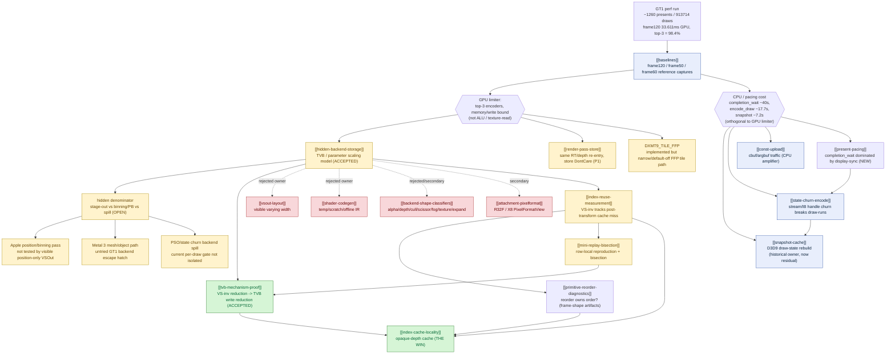
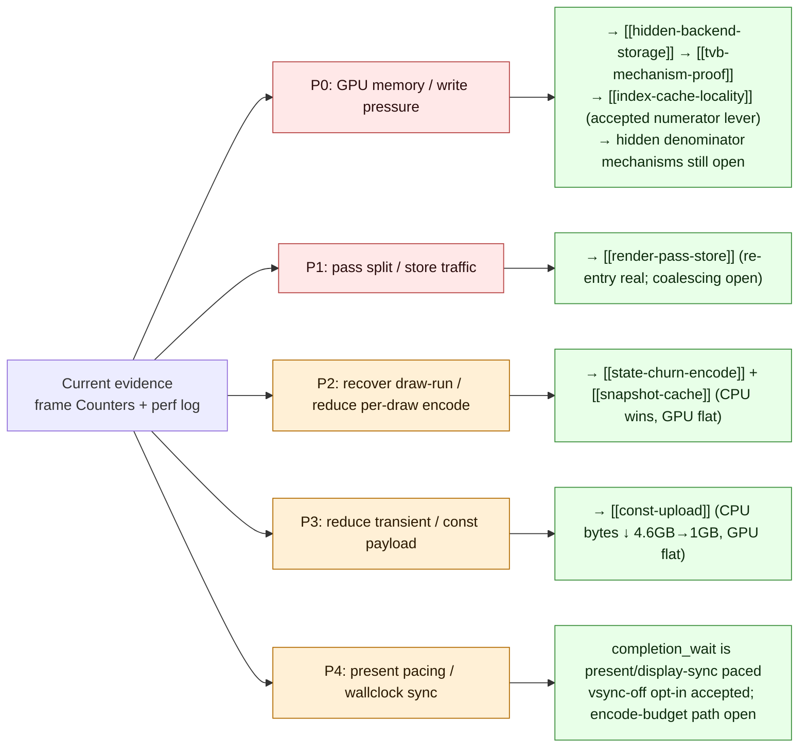
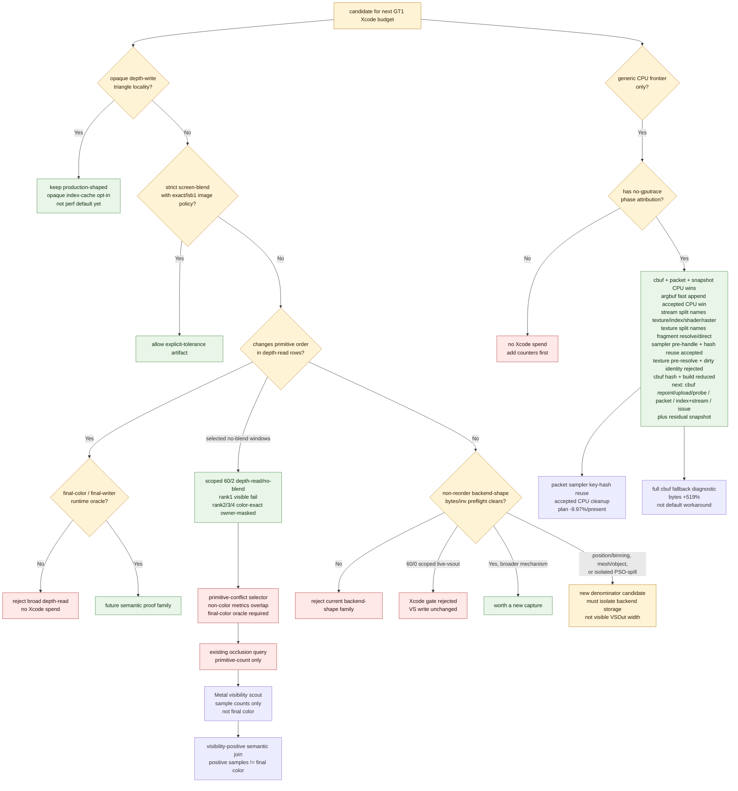

# 3DMark05 GT1 Performance — Investigation Map

> Root node of the `docs/perfomance/` knowledge graph. This is the
> authoritative cross-referenced set of domain overviews and
> one-experiment-per-file leaf nodes. The old append-only
> `specs/perfomance.plan.md` journal has been deleted/retired and must not be
> maintained as a performance source.

## The root question

**Why is 3DMark05 GT1 GPU-bound under dxmt9 (a D3D9→Metal translation
layer on Apple Silicon), and what owns the cost?**

Target: `app-d3d9-3dmark05`, GT1 path under `DXMT_EXPERIMENT_PROFILE=perf`.

## Central finding (read this first)

The top-3 render encoders dominate every captured frame (~98% of GPU
time) and write a large **"VS Buffer Device Memory Bytes Written"**
bucket (~1.6 GiB at frame60, ~1.0–2.2 GiB depending on capture). That
bucket is **not** explained by:

- dxmt CPU-side writers (argbuf/transient/cbuf ≈ 0.4 MiB), nor
- visible MSL `VSOut` width (184 B), nor
- AIR-visible shader scratch (128 B).

The settled part is the **scaling law**: this is hidden Apple GPU
vertex-stage / tiler / parameter-buffer (TVB/PB) backend storage that scales
with **VS invocation count × hidden per-invocation backend storage**. The
numerator is now actionable; the denominator is still open. Visible `VSOut`
width is only a source-visible lower bound, not the measured storage width. See
[[hidden-backend-storage]] for the model and [[tvb-mechanism-proof]] for the
accepted invocation-reduction proof.

That distinction matters for the hardware ceiling. At the current shape,
`~1.6 GiB/frame` of VS writes at `~22 fps` is already about `37 GB/s` before
texture reads, depth/color traffic, tile stores/loads, and CPU/GPU coherence.
On a base M1-class `~68 GB/s` memory system, VS write alone can consume roughly
55% of peak bandwidth, so this can be a true bandwidth limiter. On M1
Pro/Max/Ultra-class memory systems (`~200-400 GB/s`), the same measured byte
rate is less likely to be the whole limiter; the bottleneck class is SKU-
dependent.

**The one accepted production win** is opaque-depth **index-cache
locality** ([[index-cache-locality]]): reordering indices for opaque
depth-writing triangles improves the post-transform vertex cache, which
lowers VS invocations, which linearly lowers TVB write. Historical target rows
proved GPU `-18.4%`, VS invocations `-14.1%`, VS write `-16.8%`; the refreshed
frame60 proof reattaches the same mechanism to current rows `60/0+60/1`
(`-10.64%` target GPU, `-14.12%` VS invocations, `-16.77%` VS write).
The current fast-measure implementation passes the strong Xcode proof gates,
but remains an opt-in rather than a shared `perf` default: the non-diagnostic
smoke still adds about `+216ms` of total encode-draw CPU / `+301ms` of
index-setup CPU over a 1440-present run, and the narrow source-resolve counter
shows the owner is cache/candidate/draw-path work rather than base
index-buffer lookup.
The strongest historical measured path combines that production-shaped subset
with screen-blend locality (top GPU -11.89%), but screen-blend is only an
explicit exact/`lsb1` policy artifact, not a broad depth-read rule. The current
screen-blend proof attempt now has semantic input and target-row Xcode movement,
but it still does not promote: `60/2` improves while the aggregate top-GPU gate
fails. Follow-up row telemetry shows the path only applies to `60/2`; the
`60/0+60/1` regression is GPU-time-only replay variance rather than
reordered-cache mutation on non-target rows.
Rifle muzzle fire is still visually absent. It remains a correctness gate, not a
current explanation for low FPS. The added alpha/effect counters and visibility
scout identify only candidate rows: the `60/8`-style candidates are
submitted/sample-visible but tiny, while the dominant `60/2` row is mostly
sample-visible alpha/textured material work. None of those candidates is proven
to be the missing rifle effect. If a future rifle fix adds a truly missing draw,
current FPS is slightly optimistic; if it fixes submitted-but-wrong state, the
cost is likely already paid. Because previous large white bloom mistakes moved
performance materially, the next proof gate is visual parity / final-color
writer isolation before more paired Xcode performance budget. See
[[backend-shape-classifiers-alpha.04]].

Almost every other hypothesis (visible varying width, shader temps,
render/raster state toggles, primitive reorder, const-upload size,
pixel-format views) was **rejected as "not the first-order owner."**
Several CPU-side reductions are real but orthogonal to the GPU limiter.
The current stream/IB branch is now a useful negative gate, not a GPU-side
denominator win: the preflight shows bounded stream0/stream1/IB tuple
alternation in frame60 hot rows ([[state-churn-encode-stream.05]]), the
row-scoped staging A/B proves `60/2` can be made handle-stable without changing
draw/PSO/argbuf shape ([[state-churn-encode-stream.08]]), and the Xcode
follow-up rejects handle identity as the first-order backend owner
([[state-churn-encode-stream.09]]). Stream/IB handle churn remains relevant for
CPU batching/encode work, but not for the current GT1 hidden-backend GPU
limiter. The follow-up per-draw PSO gate also finds no stream/IB-handle-stable
run where PSO changes independently, so current PSO movement is not an Xcode
counter target either ([[hidden-backend-storage-shape.18]]). The current full
gate now carries that result as `pso-backend-isolation=reject-current`, so
unisolated PSO motion is blocked in the next-experiment queue as well
([[hidden-backend-storage-shape.19]]).

## Domain map



## Priority DAG

The remaining work is organized into priority levels. P0/P1 are active
GPU-frame targets; P2/P3 are CPU encode tracks; P4 is wallclock/present pacing,
which is separate from the hidden-backend GPU limiter.



## Current Gate Summary

The latest gate report narrows the next Xcode budget. Residual proxy bytes alone
are not enough to schedule a capture; the candidate must either be an accepted
locality path, carry an explicit semantic policy, or prove a new non-reorder
backend mechanism before replay. The refreshed gate also closes the stale
`60/0 live-vsout` shader-smoke queue after its matching Xcode rejection
([[hidden-backend-storage-shape.13]]). The current gate also keeps the semantic
blocker explicit without requiring a selector-sweep artifact:
`final-color-proof-gap=blocked-proof-gap` and
`final-color-occlusion-predicate=blocked-semantic-proof-gap`
([[hidden-backend-storage-shape.16]]), and the joined visibility-positive gate
now emits `visibility-positive-oracle=reject-positive-oracle`
([[hidden-backend-storage-shape.17]]). Historical opaque-depth and screen-blend
proofs are kept as mechanism evidence. The refreshed opaque-depth proof now
reattaches Xcode movement to current frame60 rows `60/0+60/1`; screen-blend
now has a current same-input mini-replay `lsb1` semantic input and target-row
Xcode movement, but the full proof is demoted because top GPU does not decrease.
The row-level follow-up shows this is target-only movement plus non-target
replay timing drift, not direct mutation of `60/0+60/1`
([[index-cache-locality-opaque.08]], [[index-cache-locality-screenblend.08]],
[[index-cache-locality-screenblend.07]], [[index-cache-locality-screenblend.06]],
[[index-cache-locality-proofinput.01]]). The per-draw PSO gate now adds the
same budget guard for backend-spill guesses: `60/2` has `47` PSO changes but
`160` handle-tuple changes and `0` PSO-isolated stable-tuple runs, so PSO
remains a future controlled A/B rather than a current Xcode replay
([[hidden-backend-storage-shape.18]]). The automated full gate now records that
as `pso-backend-isolation=reject-current` and adds a `pso-backend-spill =
blocked-current-telemetry` implementation track
([[hidden-backend-storage-shape.19]]). The same full gate now carries the
locality spend threshold as `locality-semantic-ceiling=oracle-required`:
color-exact/zero-sample locality is too small for another Xcode capture, while
sample-visible locality is large enough only if a final-color/final-writer
oracle makes it safe ([[index-cache-locality-screenblend.10]]). The full gate
now also accepts the current real-texture mini-replay summaries directly as
`final-writer-replay-oracle=blocked-final-writer-hazard`: rank1 is a real
final-writer fail, rank2-4 are owner-masked color-exact rows, and owner-safe
LRU32 is `0` ([[hidden-backend-storage-shape.20]]). The backend escape audit is
now attached to the same full gate as
`backend-escape-surface=reduced-ab-required`, so mesh/object bridge-only,
position/binning visible-probe-only, and Tile-FFP no-coverage results also
block direct GT1 Xcode spend ([[hidden-backend-storage-shape.22]]). The reduced
A/B planner then makes the blocker actionable as `blocked-before-reduced-ab`:
mesh/object lacks a dxmt9 route/emitter, position/binning is not a real route
below visible `VSOut`, and Tile-FFP lacks hot-row coverage
([[hidden-backend-storage-shape.23]]). The Tile-FFP expansion split then shows
that this is not a minor FFP selector problem: `60/2` and `60/1` are `100%`
not-FFP fallback, `60/0` is `100%` unsupported-state fallback, and the run-top
rows require a programmable/textured tile or mesh-style route
([[hidden-backend-storage-shape.24]]). The programmable route split then
separates this into a smaller first reduced A/B and harder follow-ups: `60/0`
is a depth-only candidate, `60/1` needs programmable color, and `60/2` needs
the full programmable textured route ([[hidden-backend-storage-shape.25]]).
The first implementation smoke for that branch now reaches the entire `60/0`
depth-only row through a fragmentless, position-only Metal render PSO
(`42` draws / `97,294` primitives / `291,882` vertices, no reject/no-pipeline
logs; r5 also logs `2` accepted / `0` rejected fragmentless PSO variants), but
it is only route reachability until depth/color equality and Xcode counter
movement are attached. A user-observed sharper r5 frame, with subtle
texture-over haze/blur and bloom-like coverage disappearing, keeps semantic
equivalence open rather than promoting the route
([[hidden-backend-storage-shape.26]]).

| Track | Status | Evidence | Decision |
|---|---|---|---|
| Opaque-depth index locality | accepted opt-in; refreshed frame60 proof passed | Fast-measure proof: top GPU `-9.50%`; target `50/0+50/1` GPU `-18.39%`, VS invocations `-14.12%`, VS write `-16.79%`. Current post-stream/IB proof: target `60/0+60/1` GPU `13.800ms→12.331ms` (`-10.64%`), VS invocations `536,583→460,839` (`-14.12%`), VS write `646.173MiB→537.842MiB` (`-16.77%`), top-3 GPU `33.614ms→32.501ms` (`-3.31%`). CPU smoke still has index setup `+309ms` and source-resolve is flat. | Production-shaped path remains the safe GPU win and current proof demonstrates why the ongoing experiment matters. It is still not a shared `perf` default until CPU side-effect is lower or a broader runtime gate proves net positive. [[index-cache-locality-opaque.08]], [[index-cache-locality-proofinput.01]], [[index-cache-locality]] |
| Screen-blend index locality | historical explicit-tolerance proof; current target movement pass, aggregate proof fail | Historical combined run GPU `-11.89%`; `lsb1` image gate `739/786,432`, max delta `1`, SSIM `1.000000`. Current rank-1 mini-replay has LRU32 `52,865->38,272` (`-27.60%`) and `lsb1` image gate `33/786,432`, max delta `1`, SSIM `1.000000`. Full proof target `60/2` improves GPU `-3.55%`, VS invocations `-10.76%`, VS write `-10.84%`, but top GPU fails `+0.97%`; row follow-up shows reordered-cache applied only to `60/2` and non-target rows have GPU-time-only drift. | Keep as mechanism ceiling/proof artifact only. Target-row movement is not enough for promotion; do not generalize to broad depth-read. [[index-cache-locality-screenblend.09]], [[index-cache-locality-screenblend.08]], [[index-cache-locality-screenblend.07]], [[index-cache-locality-screenblend.06]], [[index-cache-locality-proofinput.01]], [[index-cache-locality-screenblend.04]] |
| Screen-blend / depth-read locality ceiling | blocked by semantic proof gap; automated as `oracle-required` | Current screen-blend target movement calibrates `-87,076` LRU32 to `-0.682ms` on `60/2`. Rank2-4 color-exact owner-masked windows sum to only `-9,113` LRU32 (estimated `-0.071ms`), and rank1-4 still include a visible fail while only reaching `-23,706` LRU32 (estimated `-0.186ms`). Zero-sample visibility rows are only `-2,016` LRU32; positive-sample rows are large (`-180,840`, estimated `-1.416ms`) but are not final-color proof. The semantic visibility join makes this concrete: rank2 has `39,835` samples but `0` final-color pixels, and rank1/rank3 are both sample-positive but split fail/pass. The current full gate emits `locality-semantic-ceiling=oracle-required`. | No more locality gputrace/Xcode spend without a final-color/final-writer oracle, a runtime selector that keeps at least `~41k` additional safe LRU32 delta, or a non-reorder backend-denominator mechanism. [[index-cache-locality-screenblend.10]], [[index-cache-locality-screenblend.09]], [[mini-replay-bisection-texture.10]], [[mini-replay-bisection-texture.11]] |
| Broad depth-read reorder | reject | Visible exact gain exists (`-8446` LRU32), but visible-fail hazard remains (`-1407` LRU32) | Requires final-color/final-writer proof; the Metal visibility scout can triage no-sample draws but positive samples are not final-color proof. [[mini-replay-bisection-semantic.01]], [[mini-replay-bisection-texture.08]], [[mini-replay-bisection-texture.09]], [[mini-replay-bisection-texture.11]] |
| Scoped depth-read/no-blend locality | mixed; not production-safe; current replay oracle blocked | Rank 1 keeps replay LRU32 `52,865 -> 38,272` (`-27.6%`) but real-texture replay changes `2 / 786,432` pixels and `7` final-writer pixels; rank 2 keeps final color exact with LRU32 `19,131 -> 13,194` (`-31.0%`) but `809` canonical owner pixels change; rank 3 keeps final color exact with LRU32 `11,398 -> 8,946` (`-21.5%`) but `52` owner pixels change; rank 4 keeps final color exact with LRU32 `4,237 -> 3,513` (`-17.1%`) but `17` owner pixels change; Metal visibility scout shows the old rank-1 `36..37` window is sample-visible, not no-sample; cache join shows zero rows are only `-2,016` of `-182,856` LRU32 delta; semantic visibility join shows all rank1-4 windows are sample-positive, including rank2 with no final color; current automated gate reports `final-color-proof-gap=blocked-proof-gap`, `visibility-positive-oracle=reject-positive-oracle`, and `final-writer-replay-oracle=blocked-final-writer-hazard` with owner-safe LRU32 `0` | Same state class contains both visible failure and color-exact owner-masked windows. The current real-texture replay set is not the oracle; another Xcode locality spend needs a different final-color/final-writer proof that keeps enough sample-visible gain, a stricter runtime-visible selector, or a non-reorder backend mechanism. Metal visibility remains useful for no-sample triage, but current positive rows are not a safe production selector. [[mini-replay-bisection-semantic.02]], [[mini-replay-bisection-texture.02]], [[mini-replay-bisection-texture.04]], [[mini-replay-bisection-texture.05]], [[mini-replay-bisection-texture.06]], [[mini-replay-bisection-texture.07]], [[mini-replay-bisection-texture.08]], [[mini-replay-bisection-texture.09]], [[mini-replay-bisection-texture.10]], [[mini-replay-bisection-texture.11]], [[hidden-backend-storage-shape.16]], [[hidden-backend-storage-shape.17]], [[hidden-backend-storage-shape.20]] |
| Primitive-conflict / occlusion selector | rejected-current | Rank1 fail vs rank2-4 pass scout: owner pixels `7` vs `3..641`, max depth `3.468` vs `0.0149..201.571`, max UV0 `544.169` vs `1.056..26497.059`; only color metrics separate. Existing D3D9 occlusion query resolves primitive count; diagnostic Metal visibility now reports per-draw sample counts but not final color; visibility-positive semantic join proves positive samples do not split final-color-empty, visible-exact, and visible-fail rows | Do not use owner-count/depth/UV/texcoord thresholds, the current D3D9 query path, or positive Metal visibility as a production selector. Use Metal visibility only as no-sample triage unless paired with final-color/final-writer proof. [[mini-replay-bisection-texture.07]], [[mini-replay-bisection-texture.08]], [[mini-replay-bisection-texture.09]], [[mini-replay-bisection-texture.11]] |
| Runtime final-color selector | blocked | Pass draws `3,5,6,7` and fail draw `4` share all `43` runtime-visible fields | Do not use full uniform payload identity as a production selector. [[mini-replay-bisection-semantic.01]] |
| Non-reorder backend mechanism | below-AIR gate only; current escape surface blocked before reduced A/B | Half-VSOut bytes/inv `-1.94%`, but GPU `+3.40%`; scoped `60/0` live-vsout changed expected VSOut `184 B -> 68 B` while Xcode VS buffer stayed flat (`224.947 MiB -> 224.990 MiB`, `1542.722 -> 1543.013 B/VS invocation`); refreshed gate reports backend-shape `reject`, VS-write attribution `backend-rejected`, and `shader-variant-backend-smoke=closed-by-xcode-gate`; strongest remaining state clue is correctness-invalid `large4096+alpha` blend-off (`VS write -52.86%`, B/inv `-43.56%`), but current `60/2` large alpha rows fail static blend-off equivalence (`InvDestColor+One` screen and varying-alpha standard blend); current PSO churn is stream/IB-dominant, the per-draw gate finds `0` PSO-isolated stable-tuple runs, and the full gate emits `pso-backend-isolation=reject-current`; backend escape audit reports `mesh-object=bridge-only-reduced-ab-required`, `position-binning=visible-vsout-probe-only`, and `tile-ffp=rejected-current-coverage`, now carried as `backend-escape-surface=reduced-ab-required`; the reduced A/B plan reports `blocked-before-reduced-ab`; Tile-FFP expansion refines that to `tile-ffp=blocked-hot-row-coverage/needs-programmable-tile-route`; programmable feasibility identifies `60/0` as a depth-only route candidate, while `60/2` remains the hard textured route | Do not spend more Xcode budget on visible-width retries, blend-off-as-fix, current no-sample locality, positive-visibility locality without final-color proof, unisolated PSO churn, stale shader-output smokes, current Tile-FFP widening, or bridge-only backend escape guesses. Next backend-route work should start with a reduced `60/0` depth-only equality/counter A/B before attempting the larger `60/2` textured route. [[hidden-backend-storage-shape.02]], [[hidden-backend-storage-shape.05]], [[hidden-backend-storage-shape.06]], [[hidden-backend-storage-shape.07]], [[hidden-backend-storage-shape.08]], [[hidden-backend-storage-shape.09]], [[hidden-backend-storage-shape.10]], [[hidden-backend-storage-shape.11]], [[hidden-backend-storage-shape.13]], [[hidden-backend-storage-shape.14]], [[hidden-backend-storage-shape.16]], [[hidden-backend-storage-shape.18]], [[hidden-backend-storage-shape.19]], [[hidden-backend-storage-shape.21]], [[hidden-backend-storage-shape.22]], [[hidden-backend-storage-shape.23]], [[hidden-backend-storage-shape.24]], [[hidden-backend-storage-shape.25]], [[mini-replay-bisection-texture.09]], [[mini-replay-bisection-texture.10]], [[mini-replay-bisection-texture.11]] |
| Apple position/binning path | visible-probe-only; real route missing | Existing `DXMT9_PROBE_POSITION_ONLY_VSOUT` only changes the source-visible `VSOut`/fragment diagnostic shape; the backend escape audit finds no separate position/binning route token in dxmt9, and the reduced A/B plan reports `blocked-real-route-missing`. It does not prove that Apple's hidden `[[position]]` binning output or a tile vertex/fragment split was avoided | Do not cite visible position-only VSOut as closure. A future probe must implement/force a real position-only binning/depth/mesh route and measure bytes/invocation in reduced A/B before GT1. [[vsout-layout]], [[hidden-backend-storage]], [[hidden-backend-storage-shape.21]], [[hidden-backend-storage-shape.23]] |
| Metal 3 mesh/object path | bridge-only; blocked before reduced A/B | Mesh/object command replay and PSO descriptors exist below winemetal, but the audit reports dxmt9 route `missing` and shader emitter `missing`; GT1's D3D9 path is not currently routed through a mesh/object backend, and the reduced A/B plan reports `blocked-missing-dxmt9-route` | Track as an exploratory backend escape hatch. The next evidence is not direct GT1 Xcode; it is a dxmt9 route/emitter or out-of-GT1 synthetic/replay A/B that passes equality and counter gates. [[hidden-backend-storage-shape.14]], [[hidden-backend-storage-shape.21]], [[hidden-backend-storage-shape.23]] |
| Tile-FFP path | rejected-current GT1 hot-row lever; programmable route required | `DXMT9_TILE_FFP=off` is still the default, but the current code has the selector, base-colour render PSO, tile PSO, tile constants, and per-draw tile post-pass. The coverage gate reports frame60 `60/0..2` eligible primitives `0`, and the partial run has only `98,469 / 1,900,371,413` eligible primitives (`0.005%`); the reduced A/B plan reports `blocked-hot-row-coverage`. The expansion split shows `60/2` and `60/1` are `100%` not-FFP fallback and `60/0` is `100%` unsupported-state fallback; full gate evidence is now `tile-ffp=blocked-hot-row-coverage/needs-programmable-tile-route`. | Keep current Tile-FFP as a narrow correctness/architecture lever. Do not spend GT1 Xcode budget on it and do not chase selector widening as the fix. A future Tile-FFP-class experiment must first define a programmable/textured tile or mesh-style route, then pass portable-vs-route equality and reduced counter gates. [[hidden-backend-storage-shape.14]], [[hidden-backend-storage-shape.15]], [[hidden-backend-storage-shape.23]], [[hidden-backend-storage-shape.24]] |
| Depth-only programmable route | runtime smoke passed; equality/counter proof open | `60/0` has `97,294` primitives, `100%` depth-only candidate coverage, `color_write=0`, depth write on, no alpha blend/test, and one PS shape. Texture mask is nonzero, but with color writes off and no alpha test the fragment output is not the expected correctness owner. The fragmentless-depth-only smoke covers all `42` row draws / `97,294` primitives / `291,882` vertices, reports position-only VSOut key `0x0`, and logs `2` accepted / `0` rejected fragmentless PSO variants. A user-observed sharper r5 frame, with subtle texture-over haze/blur and bloom-like coverage disappearing, suggests equality still needs a real same-input/depth/color gate | This is the smallest credible backend-route A/B, and route reachability is now proven. Finish depth/color equality and Xcode VS-write bytes/invocation proof before promotion; do not generalize to `60/2`. [[hidden-backend-storage-shape.25]], [[hidden-backend-storage-shape.26]] |
| Programmable textured route | required for largest residual row; hard | `60/2` has `389,376` primitives, `100%` programmable textured coverage, `14` unique PS, texture masks `0x7f`, `0x3f`, `0x1f`; this is the largest row but requires texture sampling or preserving the existing fragment path | Keep as the long path after depth-only/color reduced A/B. It is not a near-term selector tweak. [[hidden-backend-storage-shape.25]] |
| PSO/state churn backend spill | rejected-current Xcode candidate; isolated A/B still open | Current frame60 preflight shows hot rows are stream/IB-dominant: `60/2` has `47` PSO changes, but `271` stream-handle and `160` IB-handle changes; the per-draw join then shows `60/2` has `160` handle-tuple changes, max stable tuple run `6`, and `0` PSO-isolated stable-tuple runs; the automated full gate emits `pso-backend-isolation=reject-current`; `60/1` and `60/0` show the same no-isolated-run pattern | Keep CPU and GPU claims separate. Do not spend Xcode on PSO churn from the current rows; add a PSO-stable/PSO-churn A/B only if geometry, stream/IB bindings, visible state, and invocation count can be isolated. [[state-churn-encode]], [[hidden-backend-storage-shape.11]], [[hidden-backend-storage-shape.18]], [[hidden-backend-storage-shape.19]] |
| Stream/IB backend handle-stable A/B | rejected as first-order GPU owner | Baseline `60/2` is handle-churn-dominant (`stream_handle_changes=271`, `ib_handle_changes=160`, tuple changes `160/187`). Staged `60/2` keeps `187` draws, PSO `48 -> 48`, argbuf table `5056 -> 5056`, cbuf `96424 -> 96424`, and drops stream/IB handle changes to `0`, but adds `7.38 MiB` staged copy and turns the diversity into offset churn. Xcode then shows target GPU `19.184 -> 19.278 ms`, VS write `981.159 -> 981.166 MiB`, and unchanged VS invocations. | Do not spend more Xcode budget on stream/IB handle identity as a GPU-denominator hypothesis. Keep stream/IB work in the CPU/draw-run lane unless a new mechanism also changes VS invocations, primitive/binning shape, or a below-visible-VSOut backend path. [[state-churn-encode-stream.08]], [[state-churn-encode-stream.09]], [[hidden-backend-storage-shape.12]] |
| Index-cache CPU reduction | reject current attempts | Fixed cap cuts slots but not CPU; heap lazy frontier cuts scored work `-80.97%` but select CPU regresses `+21.40%`; bucketed select cuts scored work `-72.61%` but select CPU regresses `+32.46%`; unique upper-bound gate rejects `76` candidates but candidate CPU regresses `+8.50%`; persistent rejected verdicts are already implemented (`401,681` rejected hits / `143` cold misses); non-scope draw-shape prefiltering already happens before lookup; strict LRU builder normalization worsens candidate miss32 by `+46` and total encode CPU by `+36.930ms` | Do not spend more Xcode budget on these CPU-only variants. Next CPU work needs cheaper cold-miss candidate construction, a telemetry-proven eligible-subclass exclusion, or broader semantic-safe GPU payoff before no-gputrace promotion. [[index-cache-locality-cpucost.11]], [[index-cache-locality-cpucost.12]], [[index-cache-locality-cpucost.13]], [[index-cache-locality-cpucost.14]], [[index-cache-locality-cpucost.15]], [[index-cache-locality-cpucost.16]], [[index-cache-locality-cpucost.17]] |
| Current no-gputrace baseline | accepted as counter sample | Watchdog-cleanup scout: 1440 presents; GPU CB `+0.15%`, completion wait `+0.14%`, draws `-0.01%` vs baseline | Use as the current supervised timeout shape; it does not justify new Xcode budget by itself. [[baselines-frame50.04]] |
| Encode CPU attribution | CPU wins accepted, fps proof still open | No-gputrace attribution has narrowed broad encode guesses into named CPU-only children: cbuf identity, packet-cache, snapshot, argbuf-open, sampler, and transient fast-append work all moved CPU but not GPU. Cbuf residual split named binding content hash as a dominant child (`570.070ms`, VS `489.627ms`), then the default path removed that byte scan (`binding_hash=0`) and cut cbuf update `1.216 -> 0.875ms/present`; prefix-preserving cbuf builders then cut cbuf build `0.333815 -> 0.175342ms/present`; binding-packet sampler key-hash reuse cut packet plan `0.666122 -> 0.599724ms/present`. A full-cbuf visual bisection knob rejects full upload as a default workaround (`argbuf_hybrid_bytes_per_encoder` +519.59%, no obvious visual normalization); the later visual fix is per-draw payload component hashes for argbuf cbuf identity, not full cbuf upload. | No Xcode spend from these CPU results alone. Continue no-gputrace work on cbuf upload/probe/repoint residual, binding-packet stronger identity/plan reuse, index setup/source resolve, shader-stream diversity, issue cost, and residual snapshot. Do not chase broad D3D9 setter no-op guards, slot-30 bind shadowing, dirty-category identity repoint, FFP stream binding, resource-array binding, vertex texture binding, LOD-bias upload, sampler lookup/rehash skip, texture pre-resolve source matching, raw cbuf `setBuffer`, cbuf upload-plan, observer callbacks, default cbuf content hashing, live-range-only cbuf prefix zeroing, full VS/PS cbuf fallback, or another sampler `FlatStateSet` rehash removal unless cheap instrumentation first proves a new non-zero opportunity. Require visual smoke/same-input image proof for future cbuf/binding semantic changes. [[state-churn-encode-encode-phase.02]], [[state-churn-encode-encode-phase.03]], [[state-churn-encode-encode-phase.04]], [[state-churn-encode-encode-phase.05]], [[state-churn-encode-encode-phase.06]], [[state-churn-encode-encode-phase.07]], [[state-churn-encode-encode-phase.08]], [[state-churn-encode-encode-phase.09]], [[state-churn-encode-encode-phase.10]], [[state-churn-encode-encode-phase.11]], [[state-churn-encode-encode-phase.12]], [[state-churn-encode-encode-phase.13]], [[state-churn-encode-encode-phase.14]], [[state-churn-encode-encode-phase.15]], [[state-churn-encode-encode-phase.16]], [[state-churn-encode-encode-phase.17]], [[state-churn-encode-encode-phase.18]], [[state-churn-encode-encode-phase.19]], [[state-churn-encode-encode-phase.20]], [[state-churn-encode-encode-phase.21]], [[state-churn-encode-encode-phase.22]], [[state-churn-encode-encode-phase.23]], [[snapshot-cache-snapshot.04]], [[snapshot-cache-snapshot.05]], [[snapshot-cache-snapshot.06]], [[snapshot-cache-snapshot.07]], [[snapshot-cache-snapshot.08]], [[snapshot-cache-snapshot.09]] |



## Frame shape

Frame120 (historical bottleneck-shape capture, [[baselines-frame120.01]]):
total **33.611 ms** GPU, top-3 encoders **33.075 ms / 98.4%**; the same
RT/depth pair returns after another pass and accounts for **24.643 ms /
73.3%**. Passes are LLC/MMU/buffer-write limited, **not** ALU- or
texture-read-bound. Run-level: ~14673 passes preserve **167.73 GB** of
tile contents; draw-run submits = **580** against 913714 draws (≈99.94%
fail to batch), broken by const-upload (659938) and stream/IB state
deltas (793059 / 750041).

The current canonical A/B baseline is frame50 normal-source
([[baselines-frame50.01]]): **35.024 ms**, top-3 98.19%, rows 50/2
(56.9%) / 50/1 (24.5%) / 50/0 (16.8%), hidden backend estimate
≈1597.6 MiB. Mid-investigation probes A/B against frame60
([[baselines-frame60.01]]). The current post-visualfix frame60 refresh
([[baselines-frame60.02]]) keeps the same owner after the latest visual/cbuf
identity path: **33.614 ms**, top-3 **32.984 ms / 98.12%**, VS write
**1627.332 MiB**, hidden backend **1597.755 MiB**. Its no-mutate class proxy
([[hidden-backend-storage-shape.04]]) splits residual `60/2` into depth-read,
screen-blend, and standard-alpha classes with `~111-128 MiB` proxy hidden
backend each and `~25-28%` candidate LRU32 reduction. A scoped follow-up
([[mini-replay-bisection-semantic.02]]) proved one `60/2 depth-read +
no-alpha-blend` two-draw candidate exact under standalone same-input replay
(`0` changed pixels, replay LRU32 `-27.6%`) with clear depth and captured D24X8
depth. The rank-1 real-texture replay ([[mini-replay-bisection-texture.02]])
then supplied the missing sampled inputs and rejected exact promotion:
`2 / 786,432` pixels changed, max delta `5`, so the candidate fails both exact
and `lsb1`. A canonical primitive-id replay shows `7` final-writer pixels
changed, confirming a depth-read/depth-write-off order hazard rather than
same-primitive texture noise. The rank-2 follow-up
([[mini-replay-bisection-texture.04]]) keeps final color exact while cutting
LRU32 `19,131 -> 13,194` (`-31.0%`), but canonical primitive ownership still
changes at `809` pixels. Rank 3 ([[mini-replay-bisection-texture.05]]) repeats
the color-exact owner-masked shape with LRU32 `11,398 -> 8,946` (`-21.5%`) and
`52` owner pixels changed. Rank 4 ([[mini-replay-bisection-texture.06]]) also
keeps final color exact with LRU32 `4,237 -> 3,513` (`-17.1%`) and `17` owner
pixels changed. This keeps a stricter selector or Metal visibility scout path
alive for triage, while ruling out a broad same-state-class promotion. The
primitive-conflict selector
scout ([[mini-replay-bisection-texture.07]]) then checks the cheap threshold
family directly: owner-count, depth, UV, and projected-texcoord ranges all
overlap between the visible rank-1 failure and the rank2-4 exact passes. Only
final-color metrics separate the rows, so a real final-color/final-writer policy
is required before any further reorder promotion; Metal visibility can only
triage no-sample cases unless paired with that policy.
The follow-up occlusion feasibility audit
([[mini-replay-bisection-texture.08]]) rejects the current implementation as
that oracle: D3D9 occlusion query resolution is
primitive-count based. The diagnostic Metal visibility scout
([[mini-replay-bisection-texture.09]]) is now wired into dxmt9 draw encoding and
can export per-Metal-draw sample counts after GPU completion, but its first
`60/2` pass shows the old rank-1 `36..37` window and all `large4096` buckets are
sample-visible. The follow-up cache join ([[mini-replay-bisection-texture.10]])
shows zero-sample rows are small `596`-primitive buckets and account for only
`-2,016` of `-182,856` LRU32 delta. That makes visibility useful for no-sample
triage, not a final-color oracle or the hot hidden-backend owner. The semantic
visibility join ([[mini-replay-bisection-texture.11]]) closes the positive side:
rank2 is sample-positive (`39,835` samples) but has no final color, and rank1
and rank3 are both sample-positive but split visible fail versus visible
exact-pass. The current
post-rank4 perf gate
([[hidden-backend-storage-shape.05]]) folds this into the Xcode spend policy:
depth-read reorder is blocked by oracle requirements, while non-reorder
backend-shape work needs a bytes-per-invocation preflight. The
first offline shader preflight ([[hidden-backend-storage-shape.06]]) says the
top `60/2` and `60/1` rows are not promising visible-VSOut-width retries:
`live-vsout` cuts their IR return to `36 B`, but leaves `128 B` scratch. The
rank3 `60/0` row is the only hot row where `live-vsout` also removes visible
scratch, so it became the narrow primitive-order-preserving smoke candidate.
The scoped Xcode follow-up ([[hidden-backend-storage-shape.08]]) rejects that
candidate as a bottleneck fix: `60/0` expected VSOut falls `184 B -> 68 B`, but
VS buffer write remains `224.947 MiB -> 224.990 MiB` and bytes/invocation
remains `1542.722 -> 1543.013`. This closes visible `VSOut` width as the
non-reorder denominator lever. [[hidden-backend-storage-shape.09]] makes the next
budget rule explicit: no more visible-width Xcode retries; spend only on a legal
below-AIR state/parameter-shape hypothesis, final-color/final-writer proof for
sample-visible locality, or a real backend escape path. The
automated gate refresh ([[hidden-backend-storage-shape.13]]) then closes the
stale `live-vsout` shader-smoke queue as `closed-by-xcode-gate`, so the
automation no longer schedules another visible-output smoke after the matching
Xcode rejection. The follow-up alpha static-equivalence gate
([[hidden-backend-storage-shape.10]]) rejects the naive legal shortcut:
current `60/2` large alpha rows are `15` draws / `154,761` primitives split
across screen and standard-alpha blend classes, and none can disable blending
with static color equivalence. The PSO/state churn preflight
([[hidden-backend-storage-shape.11]]) then rejects the current hot rows as an
isolated Xcode candidate: `60/2` has `47` PSO changes, but the same row has
`271` stream-handle changes and `160` IB-handle changes, so current evidence
points at stream/IB and geometry locality before PSO/backend spill. The
stream/IB preflight ([[state-churn-encode-stream.04]]) confirms that this
state-motion signal is handle-dominant (`60/2` combined handle changes/draw
`2.305`, binding tuple changes `160/187`, stream1 extra changes `111`) and not
offset/stride noise. The row-scoped staging A/B
([[state-churn-encode-stream.08]]) keeps the geometry and high-level encoder
shape fixed while dropping `60/2` stream/IB handle changes to `0`; it does not
yet prove a win because it adds explicit copy traffic and leaves offset churn.

Bandwidth framing: frame60's `1627.332 MiB` VS write is already the dominant
single visible counter in the GPU ledger. At `~22 fps`, that is roughly
`37 GB/s` of VS write traffic alone. The base-M1 implication is different from
M1 Pro/Max/Ultra: the former can saturate once read/sampling/depth/color/store
traffic is included, while the latter needs a narrower backend or CPU/pacing
explanation for the same scene shape.

## What is settled vs open

**Accepted**
- The GPU limiter is hidden vertex/tiler/parameter (TVB) backend storage,
  scaling with VS invocations × hidden per-invocation backend storage. The
  invocation numerator is proved actionable; the actual per-invocation storage
  denominator remains open. [[hidden-backend-storage]], [[tvb-mechanism-proof]]
- Opaque-depth index-cache locality is a real, semantic-safe GPU win, but
  stays opt-in until the remaining index-setup CPU side-effect is reduced or
  amortized by a broader runtime gate. [[index-cache-locality]]
- Several CPU reductions are real (dirty-range reset + FFP-VS slice reuse
  cut cbuf traffic 4.6 GB→~1 GB; binding-override cut encode CPU 10–30%) —
  but every one left GPU frame time flat. [[const-upload]], [[state-churn-encode]], [[snapshot-cache]]

**Rejected as first-order GPU owner**
- Visible `VSOut`/varying width, point-size, half-precision varyings. [[vsout-layout]]
- Translated-shader temp/scratch sizing; owner is below AIR. [[shader-codegen]]
- Current primitive-order-preserving backend-shape probes: half-VSOut moves
  bytes/inv only `-1.94%` and regresses GPU, so it fails the non-reorder gate.
  Offline `live-vsout` also left `60/2`/`60/1` scratch unchanged, and the
  scoped `60/0` Xcode counter gate then rejected the remaining visible-width
  candidate outright. [[hidden-backend-storage]]
- Render/raster state toggles (depth-write, depth-func, cull, scissor) and
  alpha-test; cull moves only the small named-tiled counters (~30 MiB). Large
  alpha blend-off remains a diagnostic backend-state clue, not a legal fix:
  current screen/standard-alpha rows fail static blend-off equivalence.
  [[backend-shape-classifiers]], [[hidden-backend-storage-shape.10]]
- Current PSO/state churn as an Xcode candidate. The hot rows are
  stream/IB-dominant rather than isolated PSO churn, and the per-draw join
  finds no stable stream/IB tuple run where PSO changes independently. PSO /
  backend spill still needs a deliberately controlled A/B before expensive
  counters. [[hidden-backend-storage-shape.11]],
  [[hidden-backend-storage-shape.18]], [[hidden-backend-storage-shape.19]]
- Current stream/IB churn as a production claim. The hot rows are true handle
  churn, and the row-scoped staging A/B proves handle identity can be
  controlled. The Xcode follow-up then rejects handle identity as the
  first-order owner: `60/2` stream/IB handles go to zero while GPU time and VS
  buffer writes stay flat. [[state-churn-encode-stream.04]],
  [[state-churn-encode-stream.08]], [[state-churn-encode-stream.09]]
- Primitive/triangle reorder as a *stable* lever — apparent wins were
  frame-shape/tile-coverage artifacts that did not reproduce on HEAD. [[primitive-reorder-diagnostics]]
- Const-upload payload size, R32F/X8 PixelFormatView suppression. [[const-upload]], [[attachment-pixelformat]]

**Open**
- Which sub-component of the hidden backend dominates (stage-out vs binning
  parameter storage vs compiler spill). [[hidden-backend-storage]]
- Whether a correctness-preserving alpha/backend-state A/B exists after the
  static blend-off gate. The known `large4096+alpha` clue is strong but still
  diagnostic-only. Rifle muzzle fire is still visually absent; its performance
  impact is narrowed because the observed tiny effect candidates are not a
  dominant limiter, while the hot alpha row still needs final-color/final-writer
  proof. Current FPS should remain diagnostic, not final, until visual parity is
  restored or the rifle effect is proven tiny/already-submitted.
  [[hidden-backend-storage-shape.10]],
  [[backend-shape-classifiers-alpha.04]]
- Whether an actual Apple position-only/binning path can avoid hidden
  `[[position]]`/parameter storage. The existing position-only VSOut probe is a
  correctness-invalid visible-output diagnostic, not proof that this backend
  path was enabled or impossible. [[vsout-layout]], [[shader-codegen]]
- Whether Metal 3 mesh/object shaders can move GT1-style FFP/fixed-function
  geometry off the current vertex/tiler storage path. This has not been tried.
- Tile-FFP as a current GT1 FPS lever. The two-stage base-colour draw + tile
  post-pass code exists, but the coverage gate shows zero eligible primitives
  in frame60 hot rows and only `0.005%` eligible primitive share in the partial
  run. It remains a narrow correctness/architecture lever, not a measured GT1
  performance path. [[hidden-backend-storage-shape.15]]
- Whether a deliberately isolated PSO/state-churn A/B changes hidden backend
  layout/spill storage. The current rows do not isolate it: stream/IB handle
  churn dominates PSO changes in the hot encoders, and per-draw stable tuple
  runs contain no independent PSO changes. The present data rejects another
  PSO-churn Xcode spend but does not close the mechanism forever.
  [[hidden-backend-storage-shape.11]], [[hidden-backend-storage-shape.18]],
  [[hidden-backend-storage-shape.19]]
- Whether enough sample-visible locality can be made final-color/final-writer
  safe. The automated ceiling gate now rejects current color-exact/zero-sample
  buckets as too small for another Xcode capture, while leaving the large
  sample-visible bucket open only behind an oracle.
  [[index-cache-locality-screenblend.10]]
- Residual row `50/2` / refreshed `60/2` locality: useful under explicit
  exact/`lsb1` semantic policy for screen-blend, with current rank-1 semantic
  input and target-row Xcode movement prepared but aggregate top-GPU proof
  failed; row follow-up shows the failure is not non-target reordered-cache
  mutation. Class proxy now shows depth-read/screen/alpha `60/2` classes all
  have real `~25-28%` LRU32 ceilings;
  selected depth-read/no-blend two-draw windows have real `-27.6%`, `-31.0%`,
  `-21.5%`, and `-17.1%` LRU32 miss reductions. Rank 1 rejects exact/`lsb1`
  promotion after real textures, while ranks 2-4 are color-exact but
  owner-masked. A primitive-conflict selector scout rejects simple non-color
  thresholds, and the existing D3D9 occlusion query path is primitive-count only.
  dxmt9 now has a diagnostic Metal visibility scout for per-draw sample counts;
  zero counts can triage no-sample work, but positive counts still do not prove
  final color. The `60/2` cache join shows current zero rows are too small to
  own the hot LRU/hidden-backend traffic, and the current semantic ceiling
  projection shows rank2-4 exact-color windows are too small to justify another
  Xcode pass by themselves (`-9,113` LRU32, estimated `-0.071ms`). The path
  remains blocked by final-color/final-writer proof, a stricter runtime-visible
  selector that separates visible failures from masked windows, or a
  non-reorder backend mechanism.
  [[index-cache-locality]], [[hidden-backend-storage-shape.04]],
  [[mini-replay-bisection-semantic.02]], [[mini-replay-bisection-texture.02]],
  [[mini-replay-bisection-texture.04]], [[mini-replay-bisection-texture.05]],
  [[mini-replay-bisection-texture.08]], [[mini-replay-bisection-texture.09]],
  [[mini-replay-bisection-texture.10]]
- Dependency-aware pass coalescing for same RT/depth re-entry (P1). [[render-pass-store]]
- Remaining CPU tracks: pacing/completion wait, backend encode, and residual
  snapshot rebuild. After the accepted cbuf identity, packet-cache, and snapshot
  hash work, the latest `snapshot.09` no-gputrace sample is
  `completion_wait_ms=39978.924`, `encode_draw_cpu_ms=17711.215`, and
  `d3d9_snapshot_draw_submission_cpu_ms=7196.881` over `1740` presents. The
  broad bind-cache and broad setter-skip guesses are rejected. The remaining
  no-gputrace work should split or reduce named encode buckets first:
  cbuf upload/probe/repoint residual, binding-packet plan/cache, index setup/source resolve,
  shader-stream binding diversity, and `encode_draw_issue_cpu_ms`-class issue
  cost. The first
  argbuf-open split shows
  slot-30 bind shadowing is not useful (`table_bind_skipped=0`), and transient
  arena fast append has already removed the simple reserve-scan cost
  (`reserve` -51.95%, `encode_draw` -3.87%). Dirty-category identity repoint
  was also rejected (`0` hits over `19,769` candidates). The stream-bind split
  then shows the parent is not one bind class: texture/sampler is largest
  (`1065ms`), followed by index (`670ms`), shader stream (`497ms`), and raster
  (`389ms`), while FFP stream is negligible (`6.845ms`). The texture/sampler
  child further narrows to fragment resolve (`575ms`) and fragment direct bind
  (`317ms`); resource-array, vertex texture, and LOD-bias lanes are zero for
  GT1. Sampler pre-handle skip then avoids `2.108M` skipped sampler lookups and
  cuts texture/sampler parent CPU `-18.84%` in a same-present run; sampler-state
  hash reuse follows with fragment direct `-68ms` and texture/sampler parent
  `-69.6ms` in the default perf profile. Texture pre-resolve source matching is
  rejected and removed from the hot path. The cbuf category split shows raw
  `setBuffer` (`114.568ms`) and transient upload (`276.019ms`) are not the main
  remaining cbuf owners; the residual split then rejects upload-plan
  (`43.287ms`, nested in build) and observer callbacks (`0`) as owners and
  names binding content hash as the dominant cbuf child (`570.070ms`, VS
  `489.627ms`). The content-hash removal then drops the default binding hash
  counter to `0` and cuts cbuf update `1.216 -> 0.875ms/present`, leaving
  build/upload, content-probe/cached-repoint, binding writeback, and residual
  dispatch/timer cost as the next cbuf targets. Prefix-preserving raw cbuf
  builders then reduce build from `0.333815 -> 0.175342ms/present` and cbuf
  update from `0.875284 -> 0.679652ms/present`, with normal visual smoke. The
  failed live-range-only prefix variant produced dark/black geometry, so cbuf
  builders must preserve the old full-builder byte prefix even when usage bounds
  choose the prefix size. A later full-cbuf diagnostic forced full VS/PS cbuf
  uploads and raised cbuf/transient traffic by about `+519%` without an obvious
  visual fix, so full upload is not a default workaround; same-input mini-replay
  remains the required visual proof path. The accepted visual fix is instead to
  keep VS/PS component hashes inside each per-draw `DrawUniformPayload` and use
  those hashes for argbuf cbuf identity, because draw submission batches can
  carry a current payload while base `hot` still has the first draw's constant
  hashes. Remaining cbuf targets are now cached repoint, upload/setBuffer,
  content probe, and residual timer/dispatch cost.
  Snapshot work is still open, especially residual non-constant payload hashing
  and VS indexed constant fallback, but it is no longer the sole first-order CPU
  owner.
  [[baselines-frame50.04]], [[state-churn-encode-encode-phase.02]],
  [[state-churn-encode-encode-phase.03]], [[state-churn-encode-encode-phase.04]],
  [[state-churn-encode-encode-phase.05]],
  [[state-churn-encode-encode-phase.06]],
  [[state-churn-encode-encode-phase.07]],
  [[state-churn-encode-encode-phase.08]],
  [[state-churn-encode-encode-phase.09]],
  [[state-churn-encode-encode-phase.10]],
  [[state-churn-encode-encode-phase.11]],
  [[state-churn-encode-encode-phase.12]],
  [[state-churn-encode-encode-phase.13]],
  [[state-churn-encode-encode-phase.14]],
  [[state-churn-encode-encode-phase.15]],
  [[state-churn-encode-encode-phase.16]],
  [[state-churn-encode-encode-phase.17]],
  [[state-churn-encode-encode-phase.18]],
  [[state-churn-encode-encode-phase.19]],
  [[state-churn-encode-encode-phase.20]],
  [[state-churn-encode-encode-phase.21]],
  [[state-churn-encode-encode-phase.22]],
  [[state-churn-encode-encode-phase.23]],
  [[snapshot-cache-snapshot.04]],
  [[snapshot-cache-snapshot.05]],
  [[snapshot-cache-snapshot.06]],
  [[snapshot-cache-snapshot.07]],
  [[snapshot-cache-snapshot.08]],
  [[snapshot-cache-snapshot.09]],
  [[snapshot-cache]],
  [[present-pacing]]

## Domain index

| Domain | Role | Headline verdict |
|--------|------|------------------|
| [[baselines]] | frame120 / frame50 / frame60 reference captures | shape stable across regimes |
| [[hidden-backend-storage]] | TVB/parameter storage model, VS-write density, scaling | model ACCEPTED; dominant sub-component OPEN; visible `VSOut` gate rejected in [[hidden-backend-storage-shape.08]], stale live-vsout smoke closed in [[hidden-backend-storage-shape.13]], backend escape feasibility triaged in [[hidden-backend-storage-shape.14]], Tile-FFP hot-row coverage rejected in [[hidden-backend-storage-shape.15]], stream/IB handle identity rejected in [[state-churn-encode-stream.09]] |
| [[tvb-mechanism-proof]] | VS-inv ↓ → TVB write ↓, row-local + full-frame | ACCEPTED (load-bearing) |
| [[index-cache-locality]] | opaque-depth cache, screen-blend, min-gain, CPU cost | opaque-depth WIN with refreshed frame60 proof; screen-blend target movement passes but aggregate top-GPU proof fails by non-target timing drift |
| [[index-reuse-measurement]] | index reuse, geometry signature/size, state-class | VS-inv tracks cache-miss estimate |
| [[primitive-reorder-diagnostics]] | reverse/min-index/split reorder probes | order = frame-shape artifact, not stable owner |
| [[mini-replay-bisection]] | row-local replay + encoder bisection | reproduced amplification; enabled the proof |
| [[vsout-layout]] | visible varying width attempts | all REJECTED as owner |
| [[shader-codegen]] | temp/scratch trim, offline Metal IR | REJECTED; owner below AIR |
| [[backend-shape-classifiers]] | alpha/depth/cull/scissor/fog/texture/expand | REJECTED/secondary; indexed path mandatory |
| [[attachment-pixelformat]] | R32F / X8 PixelFormatView suppression | secondary (texture-write), not VS owner |
| [[const-upload]] | cbuf/argbuf class/volatility/dirty-range/sparse | CPU amplifier, GPU unmoved |
| [[state-churn-encode]] | stream/IB churn, draw-run, binding override | CPU wins, GPU flat; stream/IB handle-stable A/B accepted as diagnostic in [[state-churn-encode-stream.08]], Xcode rejected handle identity in [[state-churn-encode-stream.09]] |
| [[snapshot-cache]] | D3D9 draw-state snapshot rebuild | historical CPU owner; recovered to residual |
| [[render-pass-store]] | RT/depth re-entry, store DontCare, pass-chain | re-entry real; coalescing OPEN |

Related CPU-side counter design doc: [[overview]].

## How to read this graph

- **Domain overview** = `<domain>.md` (e.g. `index-cache-locality.md`). Each
  has a scope, a hypotheses/verdicts table, a mermaid dependency graph, and a
  synthesis.
Layout: the top level of `docs/perfomance/` holds only the root and the
domain overviews; every experiment lives under its domain's subdirectory.

```
docs/perfomance/
  overview.md                          # this file
  <domain>.md                          # 15 domain overviews
  <domain>/<domain>-<subcat>.<NN>.md   # leaf nodes (one experiment each)
```

- **Leaf node** = `<domain>/<domain>-<subcategory>.<NN>.md`, one experiment per
  file, numbered by execution order within its subcategory. Frontmatter carries
  `workload: 3DMark05 GT1`, `status`
  (accepted/rejected/inconclusive/model/tooling), and `source:` provenance. New
  entries should point at the actual `experiments/output/...` result, `traces/...`
  analysis, exported Xcode counters, or other concrete artifact rather than the
  deleted/retired spec journal. Every experiment is a 3DMark05 GT1 run.
- Links use the wiki-link form, e.g. `[[index-cache-locality]]` (basename
  without `.md`, resolved across subdirectories).
  Follow them like a wiki.
