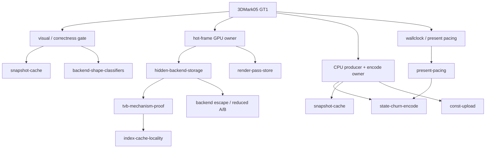

# 3DMark05 GT1 Performance — Investigation Map

> Root node for the `docs/perfomance/` 3DMark05 GT1 knowledge graph.
> Keep this file as the cross-domain readout: whole-experiment axes,
> current gates, and where to find domain-owned detail.
>
> Root navigation: [index](index.md). Shared log: [log](log.md).
> Historical detail that used to live here was migrated into domain `log.md`
> files on 2026-07-08.

## Root Question

**Why is 3DMark05 GT1 slow under dxmt9, and which owner class should the next
experiment target?**

Target workload: `app-d3d9-3dmark05`, GT1 path under
`DXMT_EXPERIMENT_PROFILE=perf`.

The investigation currently separates three concerns that used to be easy to
mix together:

| Axis | Current readout | Detail owner |
|---|---|---|
| Hot-frame GPU cost | Top render encoders are dominated by hidden Apple vertex/tiler/parameter-buffer storage, not dxmt CPU upload bytes or visible `VSOut` width. | [hidden-backend-storage](hidden-backend-storage/overview.md), [tvb-mechanism-proof](tvb-mechanism-proof/overview.md) |
| Proven GPU lever | Reducing VS invocations through semantic-safe opaque-depth index-cache locality moves the hidden-write bucket and passes the refreshed promotion proof, but the default/profile vehicle still depends on runtime cost and integration gates. | [index-cache-locality](index-cache-locality/overview.md) |
| Wallclock / FPS cost | CPU producer, replay, queue-submission, snapshot, encode, and present-completion pacing are separate from the hot-frame GPU owner. H197 removes the unix-side readonly managed-buffer lock storm but is explicitly not an FPS promotion. | [present-pacing](present-pacing/overview.md), [state-churn-encode](state-churn-encode/overview.md), [snapshot-cache](snapshot-cache/overview.md) |
| Correctness gate | Visual parity is a promotion gate, not a proof of a hardware wall. Weapon/muzzle/bloom reports require same-frame or draw-local final-writer proof before redirecting the performance plan. | [snapshot-cache](snapshot-cache/overview.md), [backend-shape-classifiers](backend-shape-classifiers/overview.md) |
| Pass/store and backend-shape alternatives | Render-pass store traffic, Tile-FFP, mesh/object, programmable tile routes, PSO/state shape, and visible-width probes remain either rejected-current or reduced-A/B prerequisites. | [render-pass-store](render-pass-store/overview.md), [hidden-backend-storage](hidden-backend-storage/overview.md), [vsout-layout](vsout-layout/overview.md), [shader-codegen](shader-codegen/overview.md) |

## Current Whole-Experiment View

The strongest global conclusion is that **one number cannot explain the run**.
A GT1 candidate must say which axis it moves:

- **GPU-frame axis:** move the hidden backend storage bucket with a proof that
  VS invocations, VS buffer writes, and GPU time move together.
- **Average-FPS axis:** move producer/replay/encode/present-pacing counters in
  a no-gputrace run without increasing command-buffer, render-pass, or tile
  preservation cost.
- **Correctness axis:** preserve the `v0.0.3` visual gate, then use final-writer
  or same-frame evidence for object-specific reports before promoting FPS or
  Xcode-counter deltas.

The accepted GPU mechanism is narrow but real: opaque-depth index-cache locality
reduces post-transform cache misses, VS invocations, hidden VS writes, and target
GPU time. The accepted producer cleanup is also real but different: the PE
readonly managed-buffer cache collapses bridge-visible lock/mutex work and
shadow traffic, while the measured FPS sample remains throughput-neutral. Keep
those conclusions separate.

## Promotion Gates

| Gate | Required evidence | Where details live |
|---|---|---|
| Visual safety | Normal GT1 output under the current `v0.0.3` visual gate; object-specific reports need same-window or draw-local proof. | [snapshot-cache](snapshot-cache/overview.md), [backend-shape-classifiers](backend-shape-classifiers/overview.md) |
| Runtime no-gputrace | Clean run with no fatal/assert/GPU/queue errors, stable frame sampling, and movement in the owning no-gputrace counters. | [present-pacing](present-pacing/overview.md), [state-churn-encode](state-churn-encode/overview.md), [baselines](baselines/overview.md) |
| Xcode / `.gputrace` | Only spend capture budget after the candidate has a semantic or reduced-A/B reason to move hidden backend storage. | [hidden-backend-storage](hidden-backend-storage/overview.md), [index-cache-locality](index-cache-locality/overview.md) |
| Promotion/default decision | Runtime win, correctness proof, and non-regressing locality/pass/tile shape must all agree. | Domain overview plus the concrete leaf documents cited there. |

## Investigation Axes



## Domain Map

| Domain | Owns | Current root perspective |
|---|---|---|
| [baselines](baselines/index.md) | reference captures and frame anchors | Use for canonical frame/run shape, not as a mutable experiment journal. |
| [hidden-backend-storage](hidden-backend-storage/index.md) | hidden VS/TVB/parameter-buffer attribution | Central GPU explanation; detailed gate history and rejected backend-shape paths live in its overview/log. |
| [tvb-mechanism-proof](tvb-mechanism-proof/index.md) | proof that VS-invocation reduction moves TVB writes | Load-bearing mechanism proof behind index-cache locality. |
| [index-cache-locality](index-cache-locality/index.md) | opaque-depth and screen-blend locality | Only accepted production-shaped GPU win; screen-blend remains policy/oracle-bound. |
| [index-reuse-measurement](index-reuse-measurement/index.md) | cache-miss and geometry reuse measurement | Supports locality attribution and candidate ranking. |
| [primitive-reorder-diagnostics](primitive-reorder-diagnostics/index.md) | reverse/min-index/split reorder probes | Keeps frame-shape artifacts out of promotion claims. |
| [mini-replay-bisection](mini-replay-bisection/index.md) | row-local replay and final-writer bisection | Supplies correctness/oracle evidence before Xcode spend. |
| [vsout-layout](vsout-layout/index.md) | visible varying / `VSOut` layout probes | Rejected as first-order hidden-write owner; keep as evidence, not next budget. |
| [shader-codegen](shader-codegen/index.md) | MSL/AIR/temp/scratch probes | Rejected above-AIR explanations; owner is below source-visible shader shape. |
| [backend-shape-classifiers](backend-shape-classifiers/index.md) | alpha/depth/cull/scissor/fog/texture classifiers | Mostly rejected or secondary; still relevant to visual/perf coupling. |
| [attachment-pixelformat](attachment-pixelformat/index.md) | R32F/X8 attachment format probes | Secondary texture/write path, not the central VS owner. |
| [const-upload](const-upload/index.md) | cbuf/argbuf upload and constant traffic | CPU amplifier; accepted cleanups do not by themselves prove GPU/FPS promotion. |
| [state-churn-encode](state-churn-encode/index.md) | replay, draw-run, PSO/bind/state encode cost | Large CPU track; many local wins are FPS-flat until P4/replay overlap moves. |
| [snapshot-cache](snapshot-cache/index.md) | D3D9 snapshot rebuild and visual-gate history | CPU track plus current visual gate owner for reported correctness artifacts. |
| [render-pass-store](render-pass-store/index.md) | pass re-entry, load/store, tile preservation | P1 locality/pass-shape track; must not regress while chasing overlap. |
| [present-pacing](present-pacing/index.md) | completion wait, producer cadence, bridge/lock attribution | Average-FPS/pacing owner; H197 is mechanism-confirmed but not FPS promotion. |

## Reading Rules

- Start with this file for the global axis and gate discipline.
- Use each domain [index](index.md) page as the landing point; read its
  `overview.md` for current conclusion and `log.md` for older rolled-up detail.
- Leaf documents remain one experiment per file and carry the concrete artifact
  provenance in YAML `source:`.
- Do not add long experiment verdict tables here. Move detailed synthesis into
  the domain that owns the evidence, then link that domain overview from this
  root map.

## Layout

```text
docs/perfomance/
  index.md                             # root entry point
  overview.md                          # general dxmt9 performance model
  overview-3dmark05-gt1.md             # this cross-domain GT1 map
  log.md                               # shared root maintenance log
  <domain>/index.md                    # domain landing
  <domain>/overview.md                 # current compact conclusion
  <domain>/log.md                      # older rolled-up detail
  <domain>/<domain>-<subcat>.<NN>.md   # leaf nodes, one experiment each
```
