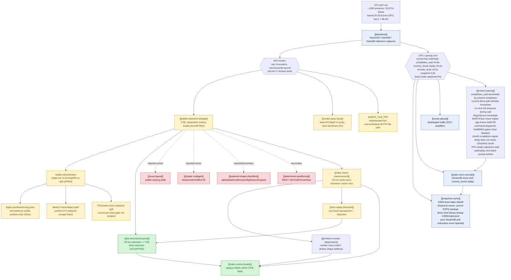
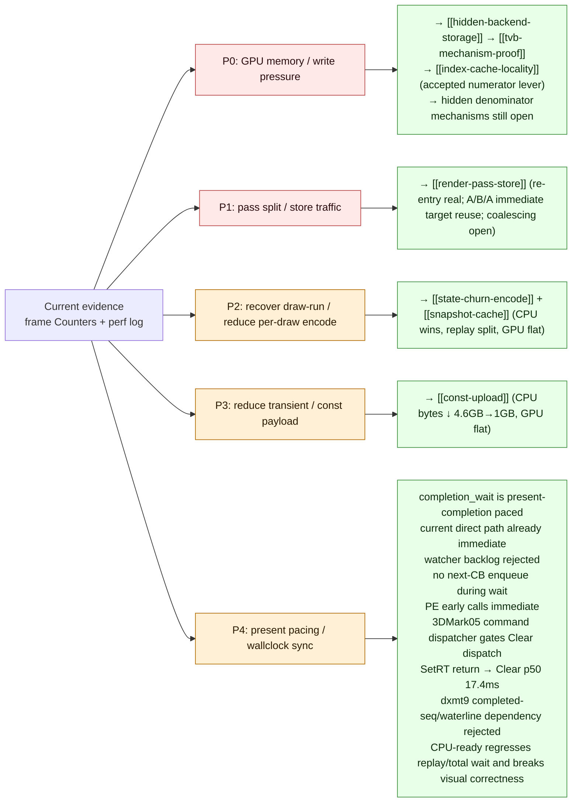
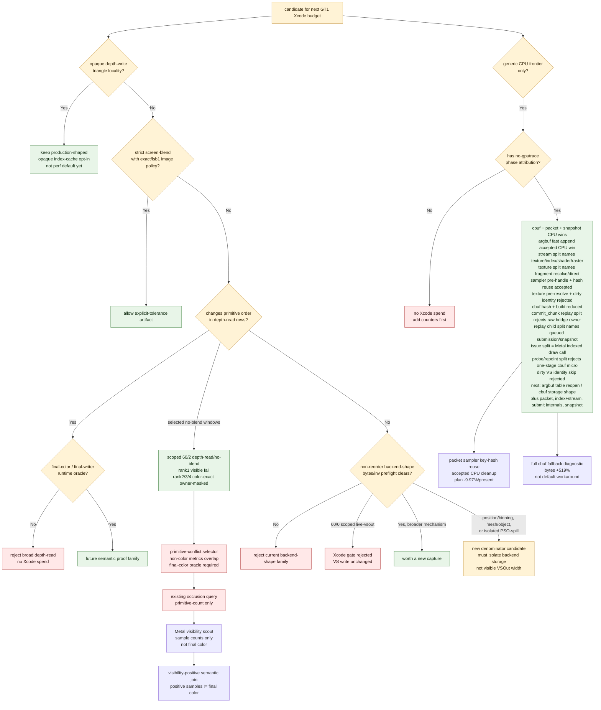

# 3DMark05 GT1 Performance — Investigation Map

> Root node of the `docs/perfomance/` knowledge graph. This is the
> authoritative cross-referenced set of domain overviews and
> one-experiment-per-file leaf nodes. The old append-only
> `specs/perfomance.plan.md` journal has been deleted/retired and must not be
> maintained as a performance source.

## The root question

**Why is 3DMark05 GT1 GPU-bound under dxmt9 (a D3D9→Metal translation
layer on Apple Silicon), and what owns the cost?**

Target: `app-d3d9-3dmark05`, GT1 path under `DXMT_EXPERIMENT_PROFILE=perf`.

Visual-safety anchor: `v0.0.3` is the last known GT1 correctness-safe code
point. Older `v0.0.1` captures remain useful historical broad-corruption triage
artifacts, but they are not the current alignment gate. Any performance
candidate that changes draw ordering, cbuf/uniform materialization, dynamic
buffer backing, render-pass grouping, or encode/present batching must pass the
`v0.0.3` visual gate before its FPS or Xcode-counter deltas are promoted.
The latest black-geometry / transparent-weapon report is not a proof that the
performance work hit a hardware wall; it is a visual gate. For the sampled
black-foreground firefight window, full-cbuf is rejected as the owner and the
broad dark-foreground class also appears in `v0.0.3`. A separate
weapon/lighting-coupled artifact can still be real, but it needs same-frame or
draw-local proof before redirecting the performance plan. See
[[snapshot-cache-visual.02]] before promoting any run that shows black vertices,
transparent weapon parts, or lighting-coupled artifacts. The latest current
`880..960:10` object-window capture does not reproduce the close-up artifact and
keeps the P4/replay/encode performance track open; see
[[snapshot-cache-visual.03]]. A later current wide-window internal capture
`100..1000:100` also does not reproduce it across red corridor, wide firefight,
`f900`, and `f1000` close-up frames; see [[snapshot-cache-visual.04]].

## Central finding (read this first)

The top-3 render encoders dominate every captured frame (~98% of GPU
time) and write a large **"VS Buffer Device Memory Bytes Written"**
bucket (~1.6 GiB at frame60, ~1.0–2.2 GiB depending on capture). That
bucket is **not** explained by:

- dxmt CPU-side writers (argbuf/transient/cbuf ≈ 0.4 MiB), nor
- visible MSL `VSOut` width (184 B), nor
- AIR-visible shader scratch (128 B).

The settled part is the **scaling law**: this is hidden Apple GPU
vertex-stage / tiler / parameter-buffer (TVB/PB) backend storage that scales
with **VS invocation count × hidden per-invocation backend storage**. The
numerator is now actionable; the denominator is still open. Visible `VSOut`
width is only a source-visible lower bound, not the measured storage width. See
[[hidden-backend-storage]] for the model and [[tvb-mechanism-proof]] for the
accepted invocation-reduction proof.

That distinction matters for the hardware ceiling. At the current shape,
`~1.6 GiB/frame` of VS writes at `~22 fps` is already about `37 GB/s` before
texture reads, depth/color traffic, tile stores/loads, and CPU/GPU coherence.
On a base M1-class `~68 GB/s` memory system, VS write alone can consume roughly
55% of peak bandwidth, so this can be a true bandwidth limiter. On M1
Pro/Max/Ultra-class memory systems (`~200-400 GB/s`), the same measured byte
rate is less likely to be the whole limiter; the bottleneck class is SKU-
dependent.

**The one accepted production win** is opaque-depth **index-cache
locality** ([[index-cache-locality]]): reordering indices for opaque
depth-writing triangles improves the post-transform vertex cache, which
lowers VS invocations, which linearly lowers TVB write. Historical target rows
proved GPU `-18.4%`, VS invocations `-14.1%`, VS write `-16.8%`; the refreshed
frame60 proof reattaches the same mechanism to current rows `60/0+60/1`
(`-10.64%` target GPU, `-14.12%` VS invocations, `-16.77%` VS write).
The current fast-measure implementation passes the strong Xcode proof gates,
but remains an opt-in rather than a shared `perf` default: the non-diagnostic
smoke still adds about `+216ms` of total encode-draw CPU / `+301ms` of
index-setup CPU over a 1440-present run, and the narrow source-resolve counter
shows the owner is cache/candidate/draw-path work rather than base
index-buffer lookup.
The strongest historical measured path combines that production-shaped subset
with screen-blend locality (top GPU -11.89%), but screen-blend is only an
explicit exact/`lsb1` policy artifact, not a broad depth-read rule. The current
screen-blend proof attempt now has semantic input and target-row Xcode movement,
but it still does not promote: `60/2` improves while the aggregate top-GPU gate
fails. Follow-up row telemetry shows the path only applies to `60/2`; the
`60/0+60/1` regression is GPU-time-only replay variance rather than
reordered-cache mutation on non-target rows.
Rifle muzzle fire is no longer best described as "not submitted" or "globally
absent." The public `01:05` oracle shows the expected effect as simple
weapon-attached circular white/yellow bloom discs; the user-captured reference
frame has several infantry rifle shots rendered as compact round bloom discs
rather than long tracer strips, impact sparks, or broad haze. Current local
artifacts now have matching positive samples in the wide infantry window, so the
remaining bug should be scoped as frame/timing/ROI-specific final-writer loss
rather than global rifle-fire absence. The latest local reruns reclassify the
old absence as a dynamic-buffer
backing correctness issue: when a
queued draw kept only the logical `BufferHandle`, a later dynamic
`D3DLOCK_DISCARD` rename could make encode bind a newer active backing. The
current implementation records the concrete Metal backing in a separate
per-draw `DrawBindingSnapshot` payload and lets DEFAULT+DYNAMIC DISCARD rotate
again, while snapshot-bearing draws bind the recorded Metal buffer instead of
resolving the mutable active handle at encode time. `DrawBindingOverride`
remains a compact logical stream/IB delta; snapshot storage is separate so the
old draw-run coalescing path does not pay snapshot bytes on every override-only
draw. This remains a correctness/performance gate, not a cosmetic side issue:
visual parity now needs to be rechecked under the optimized snapshot path, and
FPS should be interpreted only with the visual-coupling counters for skipped
draws, Metal errors, fallback/overflow, render-pass churn, and completion
waits.
Because previous large white bloom mistakes moved performance materially, and
recent glow/bloom correctness fixes appear to bring small timing gains, the next
proof gate is visual parity / final-color writer isolation before more paired
Xcode performance budget. Treat a visual-fix timing gain as actionable only
after the perf summary's `Correctness / Visual-Coupling Counters` shows whether
the change also reduced skipped draws, Metal errors, hazard/probe churn,
fallback/overflow counters, render-pass churn, or completion waits. See
[[backend-shape-classifiers-alpha.04]]. The current visual-coupling frame60
smoke narrows the obvious wrong-path branch: skipped draws, Metal command-buffer
errors, tracked frame60 overflows, map-buffer GPU waits, and queue-sequence waits
are zero. All bloom hazards are false positives and `render_split_hazard=0`, so
the bloom prefilter is noisy but not a false render-split owner. Render-pass
preservation remains high, and the actual split reasons are RT/depth changes,
clears, and presents, so the correctness/perf coupling is not closed. A follow-up
ROI final-color comparison on the close-up captures shows `0x80`/`0x82`
force-white candidates affect broad overlay/tint/beam color, but still do not
create a local rifle muzzle sprite in that older close-up branch. The follow-up
ROI geometry join makes the shape clearer:
`0x80`/`0x82` are screen-space/fullscreen glow quads that cover the muzzle ROI by
construction, while `0x7f` fire-atlas projected bboxes overlap comparable ROIs
only in the later rifle-window probe and remain bbox-level evidence, not
final-color proof for the close-up missing muzzle flash. A regenerated close-up
`0x77` geometry run (`seq 477..560`) with command-index logging found only `9`
muzzle ROI overlaps with max coverage `5.586%`, plus a draw-local force-white
queue. The rank-1 command-index force-white replay still reported
`encode_draw_pso_prefetch_bypass_probe=0`, so independent-run ordinal/command
slot selectors are not yet a final-writer oracle. A follow-up replay without
the command-index gate but with an ROI scissor did apply
`encode_draw_pso_prefetch_bypass_probe=11`, proving the row/texture/draw
selector can hit; its image deltas were still dominated by independent-run
frame drift, not a clean local muzzle delta. This further classifies `0x77` as
thin tracer/impact geometry rather than the missing radial rifle muzzle bloom,
and moves the next proof toward same-run final-writer instrumentation or direct
gputrace draw inspection. A later `0x80` component-local force-white attempt
(`app-d3d9-3dmark05-rifle-frame1033-tex80-local-r03-frame1036-component1-tex80-s1036-e2-d1-ci337`)
must be treated as invalid evidence: the component/geometry gate promoted
`frame1036-component1` (`0x80`, bbox coverage `96.133%`) as a plausible
round-bloom candidate, but the replay summary reports
`probe_force_texture_white_draws=0` and only `21` draws in `seq=1036/enc=2`,
so the scoped selector did not actually hit the intended command. The resulting
image sequence drifted into a different close-up/bloom moment and cannot be
used as an A/B proof. The follow-up same-run payload/mini-replay gate
refines that again: six `517/2` `0x77` payload draws render `577` nonzero
orange/white pixels in standalone Metal with the real texture sidecar, the
force-fragment-color replay has the same footprint, and `depth_clear=0.0`
rejects all pixels. Therefore `0x77` is not a blank or globally skipped draw
class. A same-run depth sidecar for `517/2` then narrows the depth branch:
captured depth preserves `542 / 577` pixels and the force-color replay has the
same captured-depth footprint, so depth is relevant but not the full reason this
candidate disappears from the final close-up frame. A same-run pass-end color
sidecar for a regenerated `517/2` payload run then captured the same `0x77`
draw window (`11` `0x77` probe rows, payload draws `267..272`) and found no
bright final-color trace: the mini-replay bbox max was `[206,199,174]`, the
muzzle ROI max was `[170,164,140]`, and the full `X8R8G8B8` color attachment
had `0` pixels with any channel above `220`. So `0x77` is submitted and
renderable in isolation, but it is not currently proven to be the pass-end
final writer for the missing rifle muzzle bloom. The first draw-boundary color
history probe strengthens that: when gated by `seq=517/enc=2` and
`texture0=0x200000100000077`, the selected draw writes bright pixels immediately
after draw (`bbox` max `[255,255,252]`, `27` bright pixels, `7` white pixels),
but the prior pass-end sidecar has no channel above `220`. A current-build
follow-up made the split effect explicit: a texture-list after-draw history
requested `0x77` and `0x80`, matched only `0x77`, and wrote `10` bright
after-draw sidecars at command index `306`; the last sidecar still had
`[255,255,250]` in the mini bbox and `273` pixels with any channel above `220`.
A split-free current-build pass-end dump for `seq=517/enc=2` stayed dark
(`mini bbox max [207,199,175]`, full attachment bright pixels `0`). So the
stronger statement is not just "a later draw overwrites it": the after-draw
diagnostic split can materialize bright intermediate pixels, while the normal
render pass final store does not preserve the expected local muzzle contribution.
A command-attributed rerun then found `0x77` split sidecars at commands
`319/320` with only non-local full-frame bright pixels, and `0x80` at command
`322` with cyan/white full-frame glow pixels but still zero bright pixels in the
mini/muzzle ROIs. A non-mutating `0x80` geometry census confirms why ROI overlap
alone was misleading: the `0x80` class is a fullscreen screen-space post/glow
quad in the close-up window, not a local muzzle sprite. Draw/blend/depth order,
tile load/store/preservation behavior, the diagnostic split changing pass shape,
animation-time mismatch, run-local selector drift, or a separate unidentified
muzzle draw are now stronger suspects than "not submitted" or "depth alone
rejects it."

A later correction lowers the earlier `seq=517` evidence: visual inspection now
shows that frame is not the foreground close-up rifle muzzle frame, so the
`517/2` artifacts are selector/pass-shape evidence rather than close-up final
writer proof. The close-up s820 rerun is the current anchor, but the oracle is
`analysis/captures_png/frame000820.png`, not the run-level `actual.png`:
`actual.png` is a later HUD frame (`984`) and contains a separate working
machine-gun muzzle flash. With the corrected rifle muzzle ROI
`620,200..770,330`, the s820 backbuffer pass-end has no local muzzle result
(`max [94,102,99]`, bright `0`, white `0`, warm `0`). The wider forward ROI
`600,180..800,360` is also warm/white zero. The effect census has `602` indexed
triangle rows with no point-sprite candidates, and the previously suspected
fire-atlas family `0x75/0x76/0x77/0x7f` is absent in that sample. The visible
s820 candidates are material/post/shadow classes: `0x5a` DXT1 material,
`0x8b` blue glyph/mask, `0x8d` R32F shadow/depth, and `0x8c/0x8e` scene/post
textures. The earlier s820 after-draw history was scoped to right-shifted ROIs
and produced only tiny weapon/post highlights, not a radial orange/white rifle
muzzle flash. A corrected after-draw ROI rerun (`ci0..260`, `579` rows per ROI,
commands `1..225`) has `warm_rows=0`, `white_rows=0`, and `max_warm=0` for both
the corrected muzzle and wider forward ROIs; its `bright_rows=243` are cyan/post
false positives (`max=(128,255,255)`, `warm=0`). Use the normal
YouTube/demo/working-machinegun flash as a visual shape oracle, then validate
with corrected final-color/warm ROIs. Public YouTube GT1/demo footage is only a
shape/event oracle; local promotion still requires a same-frame final-color
writer for the weapon-attached muzzle pixels. The YouTube demo shows infantry
rifle flashes around `00:01:00.6..00:01:05` as simple circular white/yellow
bloom discs attached to the muzzle, smaller than the machine-gun plume but with
the same saturated-core/post-bloom behavior. The user-captured `01:05` frame
from `JbKmFz6v9uk` is the clearest public reference: several rifle shots render
as round bright discs, not as long tracer strips and not as tiny isolated
pixels. The similar crouched close-up around `00:01:18` has no muzzle bloom, so
that frame remains a negative timing sample. A clipped YouTube analysis window
(`00:01:00..00:01:05`) recorded positive oracle frames at about `60.6s`,
`61.5s`, `61.9s`, and `63.3s`; with the `01:05` screenshot added, the expected
shape should be treated as a weapon-attached circular white/yellow bloom disc,
not merely any warm final pixel.
The DISCARD-wait scout aligned with that oracle in the firing window:
`app-d3d9-3dmark05-rifle-muzzle-oracle-0105-r1` at HUD `Time 0:59.56` shows
live rifle/impact flashes, while `app-d3d9-3dmark05-rifle-muzzle-oracle-0105-r2`
at HUD `Time 1:05.70` is already after the local flash event. The targeted
`app-d3d9-3dmark05-rifle-muzzle-oracle-0105-r3` capture at HUD `Time 1:04.10`
shows strong weapon/effect bloom in the same public-oracle scene. Its
`texture0=0x200000100000080` draw at `seq=964/enc=2/cmd=387/draw=399` is a
valid two-triangle sprite (`primitive_count=2`, `vertex_count=6`,
`screen_min=(879.263,332.626)`, `screen_max=(893.206,346.57)`) using the
working flash shader pair `VS 0xcc8eea2d38e22c96` /
`PS 0x6eac62f18235c99a`. This lowers the old "final writer unidentified"
hypothesis for the current build: the more likely owner is the dynamic
DEFAULT-vertex-buffer DISCARD/rename path, where queued draws previously kept
only the logical `BufferHandle` and could resolve a newer active backing at
encode time. The follow-up implementation now stores per-draw concrete stream/IB
backing snapshots in a separate `DrawBindingSnapshot` payload, marks the
selected rename ring entry's `lastUsedSeqId`, and makes encoder stream/index
binding prefer the snapshot Metal handle and contents bytes. The logical
`DrawBindingOverride` payload stays compact and only carries stream/IB deltas.
The first no-gputrace optimized-path scout below confirms the public round-bloom
visual shape; the remaining proof is whether it reduces the old DISCARD
serialization cost rather than merely moving work into pacing/completion waits.
The local positive machine-gun run (`seq=984`) confirms the same warm oracle:
warm starts at `cmd=182/enc=504` on the `0x7f` fire-atlas source and is then
carried through the post chain (`0x8c/0x8e/0x8a/0x8b`), reaching `36,548` warm
pixels / `25,201` white pixels in the wide ROI. The corrected s820 history
passes through post textures but never sees the `0x7f` warm source in the rifle
ROI, so the current issue is better framed as missing/wrong source-sprite
selection, animation timing, coordinates/state, or a separate unidentified
draw, not a globally broken bloom post chain. A follow-up normal-capture scout
over `900..1180`, then a dense `1080..1120` wide-scene window, found active
tracers/glare but no clean YouTube-style local infantry muzzle bloom. The
`seq=1092` after-draw ROI summary reached commands `1..260` across four
small-muzzle/glare ROIs and contained zero `0x7f` rows in that sampled
diagnostic; warm hits were dominated by `0x8d`/material/tracer/glare classes.
A denser local capture (`1086..1098` step 1) still classifies top warm/white
final pixels as tracer/impact/glare contamination rather than the external
public-oracle rifle muzzle bloom.

After the concrete rename-snapshot implementation, a no-gputrace visual scout
`app-d3d9-3dmark05-rename-snapshot-rifle-oracle-range1086-1098-r1` captured
`frame001086..001098` under the optimized path. The run still timed out at the
wrapper watchdog and has no Xcode proof, but the image series is visually
useful: large machine-gun bloom is present at `frame001086..001096`, and
`frame001098` (`Time 1:03.09`, HUD frame `1090`) shows multiple small circular
white/yellow rifle muzzle bloom discs on the right-side soldiers, matching the
public `01:05` oracle shape. A shaped warm/white component pass over the same
frame records the clearest right-side rifle disc as `component 11`, bbox
`776,343..796,364`, aspect `1.05`, fill `82.14%`, with a saturated white core.
That makes the local positive visual reproducible by artifact rather than only
manual inspection. Counters stayed quiet for the correctness/error branch
(`draw_skipped_no_pipeline=0`, `gpu_command_buffer_errors=0`,
`render_split_hazard=0`, `map_buffer_wait_ms=0.000`); `queue_sequence_wait_ms`
was `333.901ms` in this capture-range run, so completion/pacing remains a
separate perf axis, not a buffer-map serialization regression.
A current same-run rerun with effect geometry,
`app-d3d9-3dmark05-rifle-oracle-positive-effect-geometry-r1`, keeps that visual
shape reproducible under the split-payload model and ties the cleanest local
component to a concrete source row. The shaped scanner finds
`frame001094/component1` in the right-rifle oracle window, bbox
`767,344..790,368`, aspect `1.04`, fill `79.71%`, `warm=440`,
`white=254`, max `[255,255,255]`. The seq-matched geometry join promotes
`texture0=0x200000100000080` at `seq=1094/enc=2/cmd=319`, primitive count `2`,
with `roi_coverage=100%` and `bbox_coverage=19.241%`; `0x7f/0x75` remain
`blocked-local-non-source` for the same components. This makes `0x80` the
current local rifle-bloom source family, later confirmed by after-draw color
history, while the old fire-atlas interpretation should stay scoped to broad
frame-wide overlap unless it survives the same local bbox gate. The run still
has no gputrace/Xcode proof, but its
visual-coupling counters are clean enough for a no-gputrace gate:
`present_encoded=1680`, `draw_skipped_no_pipeline=0`,
`gpu_command_buffer_errors=0`, `render_split_hazard=0`,
`map_buffer_wait_ms=0.000`, `queue_sequence_wait_ms=334.736`, and split-payload
binding override traffic `84,983,920` bytes. The remaining perf question is not
"is rifle bloom globally absent"; it is whether this correctness path changes
the hot GPU rows or only fixes a small alpha/effect sprite while the main
bandwidth/TVB and render-pass-store owners remain elsewhere.

A direct force-white replay of the top row
(`app-d3d9-3dmark05-rifle-oracle-positive-tex80-local-r01-frame1094-component1-tex80-s1094-e2-d1-ci319`)
did not promote that candidate into proof. The run timeout-finalized and
captured frames, but its perf summary shows `probe_force_texture_white_draws=0`
and `encode_draw_pso_prefetch_bypass_probe=0`; the indexed-probe CSV has only
the header, and `seq=1094/enc=2` reports only `20` draw calls with
`alpha_blend_textured_draws=0`. Its `frame001094` capture also drifted from the
wide infantry scene into the close-up machine-gun scene. So the
`1094/2/cmd319` command queue remains a same-run geometry target, not an
independent A/B image proof.

A follow-up same-run after-draw color-history probe confirms the local writer:

- `app-d3d9-3dmark05-rifle-oracle-tex80-afterdraw-color-noenc-r1`
- artifacts:
  `traces/app-d3d9-3dmark05-rifle-oracle-tex80-afterdraw-color-noenc-r1/analysis/color-history-summary.md`,
  `traces/app-d3d9-3dmark05-rifle-oracle-tex80-afterdraw-color-noenc-r1/analysis/tex80-afterdraw-crops.png`
- first `0x80` draw: `seq=1094/enc=2/draw=297/cmd=319`, but
  `round_bloom_candidate` has `bright=0`, `white=0`, `warm=0`
- second `0x80` draw: forced split moves it to
  `seq=1094/enc=3/draw=0/cmd=320`; `round_bloom_candidate` records
  max `[255,254,252]`, `bright=706`, `white=196`, `warm=909`

This makes the two-triangle `0x80` sprite the after-draw writer for the
public-oracle-shaped rifle bloom. The after-draw crop visually matches the
user-provided `01:05` oracle: a compact circular white/yellow bloom disc at the
barrel tip, not a flame mesh, tracer strip, or broad haze. The earlier
`enc=2/cmd319` color-dump miss was an instrumentation trap: the first matching
after-draw dump split the pass, so the adjacent small bloom draw moved to the
next encoder. This confirms the visual-correctness source, but it is still a
diagnostic split, not an Xcode GPU-counter proof for the GT1 hot rows. The
performance interpretation after this proof is narrower: the confirmed muzzle
source is a tiny local sprite, so it does not by itself explain the current
8-22fps envelope. It remains a required visual parity gate because wrong
pass/order/blend/store behavior can hide submitted pixels while still paying
draw and preservation cost; the primary residual perf owners still point at
hidden TVB/PB writes, render-pass store/re-entry traffic, and completion/present
pacing.

A follow-up split-payload scout
`app-d3d9-3dmark05-rename-snapshot-splitpayload-scout-r1` kept the optimized
path but separated concrete backing snapshots into `DrawBindingSnapshot` instead
of bloating every `DrawBindingOverride`. This run also timeout-finalized with
partial logs, and the single captured `frame001098` drifted to the machine-gun
close-up rather than the public rifle-oracle infantry scene, so it is not new
rifle-proof. It is useful for structure/perf sanity: binding-override payload
traffic dropped from the previous snapshot scout's `252,327,296` bytes to
`84,775,040` bytes for roughly the same 302k override records, while
`draw_skipped_no_pipeline=0`, `gpu_command_buffer_errors=0`,
`render_split_hazard=0`, `map_buffer_wait_ms=0.000`, and
`queue_sequence_wait_ms=48.773ms`. The dominant wait remains
`completion_wait_ms=37,520.868`, so the next performance owner is still
completion/present pacing and GPU-side execution, not the old map-buffer wait.

Earlier `frame60` `.gputrace` attempts were blocked by capture-layer mechanics, not
by a dxmt9 draw/pipeline failure. File and `developerTools` destinations both
reported `startCapture failed` / `Capture layer is not inserted`; simply leaving
Xcode at the welcome screen did not insert the capture layer. A deliberate
`MTL_CAPTURE_ENABLED=1` smoke
(`app-d3d9-3dmark05-splitpayload-frame60-mtlcapture-r1`) produced a black
`actual.png`, no `result.json`, zero encoder rows, and no draw/present counters,
so that mode is not a valid performance sample for this app. Do not use it to
compare FPS or GPU time; either attach/launch through a real Xcode capture-layer
path, or keep using no-gputrace visual/perf scouts until a `.gputrace` can be
generated without changing the visual path.
A current-head phase43 recheck reproduced the same split after the latest
draw-state/resource-retention CPU work. The file destination
(`app-d3d9-3dmark05-phase43-frame60-gputrace-r1-20260613`) rendered normally
with `status=pass`, `present_encoded=1680`, and no timeout, but failed capture
with `destination=2 destination_supported=0` / `Capture layer is not inserted`.
The Xcode-open `developerTools` rerun
(`app-d3d9-3dmark05-phase43-frame60-xcode-devtools-r1-20260613`) also rendered
normally (`present_encoded=1740`) but failed with
`destination=1 destination_supported=0`. Therefore this branch still has no new
Xcode encoder-counter proof; treat both runs as normal-rendering counter samples
and capture-workflow negatives, not `.gputrace` evidence.
A sidecar Instruments capture does work without changing the visual path:
`app-d3d9-3dmark05-phase43-xctrace-system-r1-20260613` ran the supervised
no-gputrace wrapper and then recorded a 15s `Metal System Trace` with
`xctrace --all-processes`. Exported `metal-gpu-intervals` joined `3590/3590`
dxmt encoder rows by `RenderPass[seq=...,enc=...]`, covering
`seq=1394..1593`. The captured stage sum was `9303.143ms`, split
`8495.658ms` vertex and `807.485ms` fragment (`91.32%` vertex share). The top
rows were all `/11` large-geometry encoders (`16.299..21.459ms` stage sum) with
1.5M-1.86M vertices each, which reinforces the vertex-heavy bottleneck shape.
This still is not Xcode replay-counter proof: exported counter/shader-profiler
schemas were empty for the needed fields, so `VS Buffer Device Memory Bytes
Written` remains unavailable until a real `.gputrace` replay/export succeeds.
An in-place embedded-plist retry
(`app-d3d9-3dmark05-captureplist-frame60-gputrace-r1`) patched
`MetalCaptureEnabled=true` into copied `wine.capture.real` and
`wine.capture.real-preloader` binaries, then launched the normal Wine tree
without `MTL_CAPTURE_ENABLED=1`. This avoided the black-screen startup path and
rendered normally: `actual.png` at HUD `Time 0:58.77` / `Frame 1025` contains
visible circular white/yellow rifle/effect bloom in the wide infantry scene, and
the partial summary reports `present_encoded=1680`, `draw_calls=1234243`,
`draw_skipped_no_pipeline=0`, `gpu_command_buffer_errors=0`,
`map_buffer_wait_ms=0.000`, and `queue_sequence_wait_ms=0.000`. However,
`MTLCaptureManager` still logged `Capture layer is not inserted` at frame60 and
no `frame60.gputrace` was produced. Treat this as a cleaner negative capture
sample: embedded plist copies can be visually/runtime-safe, but they still do
not prove that the Wine temp child process has an inserted Metal capture layer.
The follow-up original-name replacement wrapper
(`scripts/tools/run_with_wine_metal_capture_layer.sh`) did prove that the temp
Wine launcher can receive `MetalCaptureEnabled`: the same mechanism wrote a
valid synthetic `perf-d3d9-present-loop` `.gputrace`, and the 3DMark05 temp
`/var/folders/.../winetemp.../wine.real` showed `Info.plist entries=13` with
`MetalCaptureEnabled`. That 2026-06-13 route nevertheless black-screened before
D3D9 draw/present (`bridge_draw=0`, `bridge_present=0`) and wrote no
`frame60.gputrace`.

The current 2026-06-16 recovery supersedes the blanket "3DMark05 file capture
is unavailable" conclusion. The replacement wrapper now swaps `wine.real` and
`wine-preloader` via same-directory temp files plus `mv` for both patch and
restore. This avoids the stale macOS code-signing vnode/cache state reproduced
with in-place `cp` overwrites, where the original `wine.real` path was killed
with `SIGKILL (Code Signature Invalid)` / `Taskgated Invalid Signature` despite
`codesign --verify` passing. With atomic replacement,
`capture-layer-atomic-r9` reached D3D9/dxmt9 frame60, wrote
`traces/app-d3d9-3dmark05-capture-layer-atomic-r9/frame60.gputrace` (195 MiB),
and restored the original Wine loader without `MetalCaptureEnabled`.
Capture-layer-inserted 3DMark05 runs remain diagnostic/Xcode-counter samples,
not normal FPS samples; pair them with no-gputrace scouts for wall-clock claims.
For new Metal System Trace sidecars, prefer
`scripts/tools/run_3dmark05_system_trace_sidecar.sh -- ...`; it runs the probe
dry-run first, refuses locked sessions before starting xctrace, and then
exports/summarizes `metal-gpu-intervals` against the dxmt encoder CSVs.
The usable System Trace sidecar was repeated after the compact draw-state
submission work. `app-d3d9-3dmark05-post-compact-state-r1-20260613` joined
`2482/2482` encoder rows over `seq=1154..1389`; its stage sum was
`6346.966ms`, split `5701.647ms` vertex and `645.319ms` fragment (`89.83%`
vertex share). Its top rows are still large indexed `rt_change` encoders:
`1155/1` is `20.002ms` with `1,149,930` vertices, and the top 12 rows stay in
the `15.927..20.002ms` range with only sub-ms fragment time. This is not a
strict A/B against the `phase43` trace because the seq ranges and scene phases
differ, but it keeps the residual owner in the hidden TVB / primitive-binning /
backend-route lane rather than moving it to fragment, texture, or attachment
traffic. The regenerated sidecar aggregate sharpens that: `opaque-depth-indexed`
owns `68.25%` of stage time and `rt_change` owns `79.52%`, both with vertex
share above `92%`. Route verdicts are still unavailable for these artifacts
because their indexed probe draw CSVs are header-only; the next System Trace
sidecar must include indexed draw telemetry and must fail if those rows do not
join the traced encoder rows before selecting depth-only, textured, or color
backend routes. [[hidden-backend-storage-shape.27]]
That capture-route status has now changed for the explicit diagnostic file
route. `app-d3d9-3dmark05-capture-layer-atomic-r9` writes `frame60.gputrace`,
Xcode performance data, and encoder counters after the draw PSO path retains
the fragment `WMT::Function` through descriptor setup and the capture wrapper
uses same-directory temp-file `mv` replacement for Wine binaries. The counter
result is not a wall-clock FPS sample, but it is valid Xcode replay evidence:
GPU time is `37.475ms`, the top-three encoders are `98.32%`, top-three VS buffer
device write is `1779.231 MiB`, and partial render count is `0`.
Therefore System Trace is no longer the only current GPU-side measurement path;
use System Trace for low-overhead route timing and the recovered file capture
route for Xcode replay counters. See [[baselines-gputrace-capture.02]] and
[[hidden-backend-storage-shape.32]].
The same artifact was run through the capture ROI/component gate. A tight
right-effect window found compact warm/white candidates, led by bbox
`1300,556..1370,602` with `warm=528`, `white=136`, and max `[255,255,255]`.
Relaxing the search shows that the surrounding effect can merge into a much
larger spark/glow component, so this frame is a visual-positive sample but not a
draw-owner-ready target. The visual-target gate currently reports
`blocked-components-no-local-writer` until same-run effect geometry ties the
component to a local `0x7f`/`0x75` source row.

That positive visual proof still does not identify the final writer for the
oracle's circular weapon-attached bloom. The first dense-candidate owner probe
(`seq=1097`, `ci0..260`) also contained zero `0x7f` rows in the sampled ROI
history; the suspicious right-soldier ROI topped out at `max_warm=53` on
`0x8d`, not the working fire-atlas source. A later non-mutating effect census
lowers the earlier source-absence interpretation: `0x7f` is present
frame-wide at `1086..1093` (`seq=1092 cmd=202`, four small screen-blend draws
with the working flash shader pair), while `0x75`/post-effect candidates appear
in `1094..1098`. The wide-scene bug is therefore not simply "fire atlas is
globally absent"; the missing proof is whether any submitted fire/effect draw is
the final-color writer for the YouTube-style local rifle muzzle bloom. Same-run
final-writer capture or direct Xcode draw inspection is the next gate. A first
same-run `seq=1092` capture/effect-trace probe confirmed four live `0x7f` draws
again, but its captured HUD was `Frame 1084` / `Time 1:02.89` in the large-gun
close-up rather than the intended wide infantry ROI scout. That makes frame/HUD
visual verification a required precondition before promoting any future ROI or
draw-owner result. A follow-up same-frame after-draw final-writer probe for
`texture0=0x7f,0x75` matched only `0x75`; it produced warm/white pixels in the
center and glare-control ROIs (`max_warm=1562` / `1714`), while the
right-soldier muzzle ROI stayed weak (`max_warm=47`, `max_white=0`). The
captured frame (`Time 1:03.21`, HUD frame `1084`) shows horizontal tracers/glare
rather than a local weapon-attached muzzle bloom, so this keeps `0x75` in the
beam/glare class for that earlier scout; the later same-run `0x80` after-draw
probe below resolves the current wide-scene local writer.
The external shape oracle is now anchored to James Mackenzie's `3DMark05 Demo
(4K 2160p)` page / YouTube video `JbKmFz6v9uk`: the useful evidence is the
GT1/demo `00:01:00..00:01:05` infantry window, especially the user-captured
`01:05` frame, where the expected rifle effect is a weapon-attached circular
white/yellow bloom disc with a saturated core and warm halo.
Treat the `01:05` frame as a compact round bloom oracle, not a flame-mesh
oracle: a correct rifle shot can be just a bright circular post-bloom disc at
the muzzle, similar in class to the machine-gun muzzle flash but smaller and
less plume-shaped.
This external oracle is a shape filter, not a pixel oracle: reject long tracer
lines, impact sparks, cyan beam/engine lights, broad haze, and warm background
panels unless the component is local to the barrel tip and short-lived across the
firing event. The local dense
component-to-geometry join reinforces the negative gate. Unfiltered
`1086..1098` component ROIs overlap many `0x7f` fire-atlas rows, but those are
huge projected bboxes with near-zero bbox coverage. After applying
`--min-bbox-coverage-pct 1`, only `0x5a` material and `0x8d` shadow/depth rows
survive; no `0x7f` or `0x75` local bloom writer remains in the current capture
set. The same local gate now feeds force-white queue planning: filtering for
the expected `0x20000010000007f`/`0x200000100000075` source textures with
`roi_coverage>=75%` and `bbox_coverage>=1%` yields an empty queue, while the
non-texture-filtered audit yields only four `0x5a` material candidates. This
current capture set should not be escalated to another Xcode/gputrace replay as
the rifle muzzle target. The combined visual-target gate now emits
`visual-target-gputrace=blocked-local-non-source`: `156` component rows are
present, but local overlap collapses to `0x5a:4` and `0x8d:1`, with `0` source
queue rows for `0x7f`/`0x75`. The corrected round-bloom component pass
(`aspect<=2.5`, `fill>=15%`) broadens the scanner to the public `01:05` oracle
and finds `221` compact components, but the seq-matched local effect join still
leaves only `9` non-source overlaps (`0x7b`, `0x01`, `0x17`, `0x5a`, `0x08`)
and `0` local `0x7f`/`0x75` source overlaps.

Almost every other hypothesis (visible varying width, shader temps,
render/raster state toggles, primitive reorder, const-upload size,
pixel-format views) was **rejected as "not the first-order owner."**
Several CPU-side reductions are real but orthogonal to the GPU limiter.
The current stream/IB branch is now a useful negative gate, not a GPU-side
denominator win: the preflight shows bounded stream0/stream1/IB tuple
alternation in frame60 hot rows ([[state-churn-encode-stream.05]]), the
row-scoped staging A/B proves `60/2` can be made handle-stable without changing
draw/PSO/argbuf shape ([[state-churn-encode-stream.08]]), and the Xcode
follow-up rejects handle identity as the first-order backend owner
([[state-churn-encode-stream.09]]). Stream/IB handle churn remains relevant for
CPU batching/encode work, but not for the current GT1 hidden-backend GPU
limiter. The follow-up per-draw PSO gate also finds no stream/IB-handle-stable
run where PSO changes independently, so current PSO movement is not an Xcode
counter target either ([[hidden-backend-storage-shape.18]]). The current full
gate now carries that result as `pso-backend-isolation=reject-current`, so
unisolated PSO motion is blocked in the next-experiment queue as well
([[hidden-backend-storage-shape.19]]).

## Domain map



## Priority DAG

The remaining work is organized into priority levels. P0/P1 are active
GPU-frame targets; P2/P3 are CPU encode/submit cadence tracks; P4 is the
wallclock/present-completion wait bucket that must move when P2/P3 work becomes
small enough. Keep this average-FPS lane separate from the hot-frame
hidden-backend GPU limiter.



## Current Gate Summary

The latest gate report narrows the next Xcode budget. Residual proxy bytes alone
are not enough to schedule a capture; the candidate must either be an accepted
locality path, carry an explicit semantic policy, or prove a new non-reorder
backend mechanism before replay. The refreshed gate also closes the stale
`60/0 live-vsout` shader-smoke queue after its matching Xcode rejection
([[hidden-backend-storage-shape.13]]). The current gate also keeps the semantic
blocker explicit without requiring a selector-sweep artifact:
`final-color-proof-gap=blocked-proof-gap` and
`final-color-occlusion-predicate=blocked-semantic-proof-gap`
([[hidden-backend-storage-shape.16]]), and the joined visibility-positive gate
now emits `visibility-positive-oracle=reject-positive-oracle`
([[hidden-backend-storage-shape.17]]). Historical opaque-depth and screen-blend
proofs are kept as mechanism evidence. The refreshed opaque-depth proof now
reattaches Xcode movement to current frame60 rows `60/0+60/1`; screen-blend
now has a current same-input mini-replay `lsb1` semantic input and target-row
Xcode movement, but the full proof is demoted because top GPU does not decrease.
The row-level follow-up shows this is target-only movement plus non-target
replay timing drift, not direct mutation of `60/0+60/1`
([[index-cache-locality-opaque.08]], [[index-cache-locality-screenblend.08]],
[[index-cache-locality-screenblend.07]], [[index-cache-locality-screenblend.06]],
[[index-cache-locality-proofinput.01]]). The per-draw PSO gate now adds the
same budget guard for backend-spill guesses: `60/2` has `47` PSO changes but
`160` handle-tuple changes and `0` PSO-isolated stable-tuple runs, so PSO
remains a future controlled A/B rather than a current Xcode replay
([[hidden-backend-storage-shape.18]]). The automated full gate now records that
as `pso-backend-isolation=reject-current` and adds a `pso-backend-spill =
blocked-current-telemetry` implementation track
([[hidden-backend-storage-shape.19]]). The same full gate now carries the
locality spend threshold as `locality-semantic-ceiling=oracle-required`:
color-exact/zero-sample locality is too small for another Xcode capture, while
sample-visible locality is large enough only if a final-color/final-writer
oracle makes it safe ([[index-cache-locality-screenblend.10]]). The full gate
now also accepts the current real-texture mini-replay summaries directly as
`final-writer-replay-oracle=blocked-final-writer-hazard`: rank1 is a real
final-writer fail, rank2-4 are owner-masked color-exact rows, and owner-safe
LRU32 is `0` ([[hidden-backend-storage-shape.20]]). The backend escape audit is
now attached to the same full gate as
`backend-escape-surface=reduced-ab-required`, so mesh/object bridge-only,
position/binning visible-probe-only, and Tile-FFP no-coverage results also
block direct GT1 Xcode spend ([[hidden-backend-storage-shape.22]]). The reduced
A/B planner then makes the blocker actionable as `blocked-before-reduced-ab`:
mesh/object lacks a dxmt9 route/emitter, position/binning is not a real route
below visible `VSOut`, and Tile-FFP lacks hot-row coverage
([[hidden-backend-storage-shape.23]]). The Tile-FFP expansion split then shows
that this is not a minor FFP selector problem: `60/2` and `60/1` are `100%`
not-FFP fallback, `60/0` is `100%` unsupported-state fallback, and the run-top
rows require a programmable/textured tile or mesh-style route
([[hidden-backend-storage-shape.24]]). The programmable route split then
separates this into a smaller first reduced A/B and harder follow-ups: `60/0`
is a depth-only candidate, `60/1` needs programmable color, and `60/2` needs
the full programmable textured route ([[hidden-backend-storage-shape.25]]).
The first implementation smoke for that branch reached the entire `60/0`
depth-only row through a fragmentless, position-only Metal render PSO, but that
first shape failed equality because it also collapsed the vertex output layout
to position-only `0x0` ([[hidden-backend-storage-shape.26]]). The follow-up
diagnostic keeps the ordinary pair-local `VSOut` layout (`0xfff`) while still
omitting the fragment function. It covers the same `42` draws / `97,294`
primitives / `291,882` vertices and pass-end `D24X8` depth plus `X8R8G8B8`
color both compare with `0` changed bytes. That made it a valid reduced
`60/0` Xcode candidate, but the completed counter gate rejects it as a
performance lever: target VS buffer write stays flat (`224.918 -> 224.944
MiB`) with unchanged VS invocations (`152,895 -> 152,895`)
([[hidden-backend-storage-shape.34]]).
A current shader-dump join then attaches MSL source and PS varying liveness to
the existing Xcode top rows without spending another gputrace. It matches `9/9`
top-row VS/PS pairs and shows the top rows read only small visible field sets,
but their Xcode VS-write density remains `1543..1602 B/VS invocation`, or
`8.4..8.7x` the `184 B` visible `VSOut`. That keeps generic varying trim closed
as a GPU lever; liveness now serves as a correctness constraint for any future
pair-specific backend route, not as a standalone FPS target
([[hidden-backend-storage-shape.35]]).

| Track | Status | Evidence | Decision |
|---|---|---|---|
| Opaque-depth index locality | accepted opt-in; refreshed frame60 proof passed | Fast-measure proof: top GPU `-9.50%`; target `50/0+50/1` GPU `-18.39%`, VS invocations `-14.12%`, VS write `-16.79%`. Current post-stream/IB proof: target `60/0+60/1` GPU `13.800ms→12.331ms` (`-10.64%`), VS invocations `536,583→460,839` (`-14.12%`), VS write `646.173MiB→537.842MiB` (`-16.77%`), top-3 GPU `33.614ms→32.501ms` (`-3.31%`). The new gate-shape scout shows frame60 candidates are all valid (`102/102` pass, `0` fail, LRU32 `-27.41%`), while the CPU tax is valid candidate build/cache lookup (`~0.331ms/present`) plus broader index setup (`0.724ms/present` contextual). | Production-shaped path remains the safe GPU win and current proof demonstrates why the ongoing experiment matters. It is still not a shared `perf` default until valid-candidate construction / lookup setup is cheaper or a broader runtime gate proves net positive. [[index-cache-locality-cpucost.18]], [[index-cache-locality-opaque.08]], [[index-cache-locality-proofinput.01]], [[index-cache-locality]] |
| Screen-blend index locality | historical explicit-tolerance proof; current target movement pass, aggregate proof fail | Historical combined run GPU `-11.89%`; `lsb1` image gate `739/786,432`, max delta `1`, SSIM `1.000000`. Current rank-1 mini-replay has LRU32 `52,865->38,272` (`-27.60%`) and `lsb1` image gate `33/786,432`, max delta `1`, SSIM `1.000000`. Full proof target `60/2` improves GPU `-3.55%`, VS invocations `-10.76%`, VS write `-10.84%`, but top GPU fails `+0.97%`; row follow-up shows reordered-cache applied only to `60/2` and non-target rows have GPU-time-only drift. | Keep as mechanism ceiling/proof artifact only. Target-row movement is not enough for promotion; do not generalize to broad depth-read. [[index-cache-locality-screenblend.09]], [[index-cache-locality-screenblend.08]], [[index-cache-locality-screenblend.07]], [[index-cache-locality-screenblend.06]], [[index-cache-locality-proofinput.01]], [[index-cache-locality-screenblend.04]] |
| Screen-blend / depth-read locality ceiling | blocked by semantic proof gap; automated as `oracle-required` | Current screen-blend target movement calibrates `-87,076` LRU32 to `-0.682ms` on `60/2`. Rank2-4 color-exact owner-masked windows sum to only `-9,113` LRU32 (estimated `-0.071ms`), and rank1-4 still include a visible fail while only reaching `-23,706` LRU32 (estimated `-0.186ms`). Zero-sample visibility rows are only `-2,016` LRU32; positive-sample rows are large (`-180,840`, estimated `-1.416ms`) but are not final-color proof. The semantic visibility join makes this concrete: rank2 has `39,835` samples but `0` final-color pixels, and rank1/rank3 are both sample-positive but split fail/pass. The current full gate emits `locality-semantic-ceiling=oracle-required`. | No more locality gputrace/Xcode spend without a final-color/final-writer oracle, a runtime selector that keeps at least `~41k` additional safe LRU32 delta, or a non-reorder backend-denominator mechanism. [[index-cache-locality-screenblend.10]], [[index-cache-locality-screenblend.09]], [[mini-replay-bisection-texture.10]], [[mini-replay-bisection-texture.11]] |
| Broad depth-read reorder | reject | Visible exact gain exists (`-8446` LRU32), but visible-fail hazard remains (`-1407` LRU32) | Requires final-color/final-writer proof; the Metal visibility scout can triage no-sample draws but positive samples are not final-color proof. [[mini-replay-bisection-semantic.01]], [[mini-replay-bisection-texture.08]], [[mini-replay-bisection-texture.09]], [[mini-replay-bisection-texture.11]] |
| Scoped depth-read/no-blend locality | mixed; not production-safe; current replay oracle blocked | Rank 1 keeps replay LRU32 `52,865 -> 38,272` (`-27.6%`) but real-texture replay changes `2 / 786,432` pixels and `7` final-writer pixels; rank 2 keeps final color exact with LRU32 `19,131 -> 13,194` (`-31.0%`) but `809` canonical owner pixels change; rank 3 keeps final color exact with LRU32 `11,398 -> 8,946` (`-21.5%`) but `52` owner pixels change; rank 4 keeps final color exact with LRU32 `4,237 -> 3,513` (`-17.1%`) but `17` owner pixels change; Metal visibility scout shows the old rank-1 `36..37` window is sample-visible, not no-sample; cache join shows zero rows are only `-2,016` of `-182,856` LRU32 delta; semantic visibility join shows all rank1-4 windows are sample-positive, including rank2 with no final color; current automated gate reports `final-color-proof-gap=blocked-proof-gap`, `visibility-positive-oracle=reject-positive-oracle`, and `final-writer-replay-oracle=blocked-final-writer-hazard` with owner-safe LRU32 `0` | Same state class contains both visible failure and color-exact owner-masked windows. The current real-texture replay set is not the oracle; another Xcode locality spend needs a different final-color/final-writer proof that keeps enough sample-visible gain, a stricter runtime-visible selector, or a non-reorder backend mechanism. Metal visibility remains useful for no-sample triage, but current positive rows are not a safe production selector. [[mini-replay-bisection-semantic.02]], [[mini-replay-bisection-texture.02]], [[mini-replay-bisection-texture.04]], [[mini-replay-bisection-texture.05]], [[mini-replay-bisection-texture.06]], [[mini-replay-bisection-texture.07]], [[mini-replay-bisection-texture.08]], [[mini-replay-bisection-texture.09]], [[mini-replay-bisection-texture.10]], [[mini-replay-bisection-texture.11]], [[hidden-backend-storage-shape.16]], [[hidden-backend-storage-shape.17]], [[hidden-backend-storage-shape.20]] |
| Primitive-conflict / occlusion selector | rejected-current | Rank1 fail vs rank2-4 pass scout: owner pixels `7` vs `3..641`, max depth `3.468` vs `0.0149..201.571`, max UV0 `544.169` vs `1.056..26497.059`; only color metrics separate. Existing D3D9 occlusion query resolves primitive count; diagnostic Metal visibility now reports per-draw sample counts but not final color; visibility-positive semantic join proves positive samples do not split final-color-empty, visible-exact, and visible-fail rows | Do not use owner-count/depth/UV/texcoord thresholds, the current D3D9 query path, or positive Metal visibility as a production selector. Use Metal visibility only as no-sample triage unless paired with final-color/final-writer proof. [[mini-replay-bisection-texture.07]], [[mini-replay-bisection-texture.08]], [[mini-replay-bisection-texture.09]], [[mini-replay-bisection-texture.11]] |
| Runtime final-color selector | blocked | Pass draws `3,5,6,7` and fail draw `4` share all `43` runtime-visible fields | Do not use full uniform payload identity as a production selector. [[mini-replay-bisection-semantic.01]] |
| Non-reorder backend mechanism | below-AIR gate only; reduced `60/0` fragmentless route rejected by Xcode | Half-VSOut bytes/inv `-1.94%`, but GPU `+3.40%`; scoped `60/0` live-vsout changed expected VSOut `184 B -> 68 B` while Xcode VS buffer stayed flat (`224.947 MiB -> 224.990 MiB`, `1542.722 -> 1543.013 B/VS invocation`); refreshed gate reports backend-shape `reject`, VS-write attribution `backend-rejected`, and `shader-variant-backend-smoke=closed-by-xcode-gate`; strongest remaining state clue is correctness-invalid `large4096+alpha` blend-off (`VS write -52.86%`, B/inv `-43.56%`), but current `60/2` large alpha rows fail static blend-off equivalence (`InvDestColor+One` screen and varying-alpha standard blend); current PSO churn is stream/IB-dominant, the per-draw gate finds `0` PSO-isolated stable-tuple runs, and the full gate emits `pso-backend-isolation=reject-current`; backend escape audit reports `mesh-object=bridge-only-reduced-ab-required`, `position-binning=visible-vsout-probe-only`, and `tile-ffp=rejected-current-coverage`, now carried as `backend-escape-surface=reduced-ab-required`; the reduced A/B plan reports `blocked-before-reduced-ab`; Tile-FFP expansion refines that to `tile-ffp=blocked-hot-row-coverage/needs-programmable-tile-route`; programmable feasibility identifies `60/0` as a depth-only route candidate; fragmentless keep-VSOut passes equality but the Xcode counter gate leaves target VS write unchanged (`224.918 -> 224.944 MiB`), so the fragment-function-presence bit is not the hidden-write owner; the current shader-dump join matches `9/9` top-row VS/PS pairs and shows useful liveness, but top rows still write `8.4..8.7x` the visible `VSOut` bytes | Do not spend more Xcode budget on visible-width retries, blend-off-as-fix, current no-sample locality, positive-visibility locality without final-color proof, unisolated PSO churn, stale shader-output smokes, current Tile-FFP widening, bridge-only backend escape guesses, fragmentless-only `60/0` variants, or generic varying trim. The next backend-route work needs a different below-visible route for `60/1`/`60/2`, an invocation/locality reducer with an oracle, or final-color/final-writer proof for sample-visible locality. [[hidden-backend-storage-shape.02]], [[hidden-backend-storage-shape.05]], [[hidden-backend-storage-shape.06]], [[hidden-backend-storage-shape.07]], [[hidden-backend-storage-shape.08]], [[hidden-backend-storage-shape.09]], [[hidden-backend-storage-shape.10]], [[hidden-backend-storage-shape.11]], [[hidden-backend-storage-shape.13]], [[hidden-backend-storage-shape.14]], [[hidden-backend-storage-shape.16]], [[hidden-backend-storage-shape.18]], [[hidden-backend-storage-shape.19]], [[hidden-backend-storage-shape.21]], [[hidden-backend-storage-shape.22]], [[hidden-backend-storage-shape.23]], [[hidden-backend-storage-shape.24]], [[hidden-backend-storage-shape.25]], [[hidden-backend-storage-shape.34]], [[hidden-backend-storage-shape.35]], [[mini-replay-bisection-texture.09]], [[mini-replay-bisection-texture.10]], [[mini-replay-bisection-texture.11]] |
| Apple position/binning path | visible-probe-only; real route missing | Existing `DXMT9_PROBE_POSITION_ONLY_VSOUT` only changes the source-visible `VSOut`/fragment diagnostic shape; the backend escape audit finds no separate position/binning route token in dxmt9, and the reduced A/B plan reports `blocked-real-route-missing`. It does not prove that Apple's hidden `[[position]]` binning output or a tile vertex/fragment split was avoided | Do not cite visible position-only VSOut as closure. A future probe must implement/force a real position-only binning/depth/mesh route and measure bytes/invocation in reduced A/B before GT1. [[vsout-layout]], [[hidden-backend-storage]], [[hidden-backend-storage-shape.21]], [[hidden-backend-storage-shape.23]] |
| Metal 3 mesh/object path | bridge-only; blocked before reduced A/B | Mesh/object command replay and PSO descriptors exist below winemetal, but the audit reports dxmt9 route `missing` and shader emitter `missing`; GT1's D3D9 path is not currently routed through a mesh/object backend, and the reduced A/B plan reports `blocked-missing-dxmt9-route` | Track as an exploratory backend escape hatch. The next evidence is not direct GT1 Xcode; it is a dxmt9 route/emitter or out-of-GT1 synthetic/replay A/B that passes equality and counter gates. [[hidden-backend-storage-shape.14]], [[hidden-backend-storage-shape.21]], [[hidden-backend-storage-shape.23]] |
| Tile-FFP path | rejected-current GT1 hot-row lever; programmable route required | `DXMT9_TILE_FFP=off` is still the default, but the current code has the selector, base-colour render PSO, tile PSO, tile constants, and per-draw tile post-pass. The coverage gate reports frame60 `60/0..2` eligible primitives `0`, and the partial run has only `98,469 / 1,900,371,413` eligible primitives (`0.005%`); the reduced A/B plan reports `blocked-hot-row-coverage`. The expansion split shows `60/2` and `60/1` are `100%` not-FFP fallback and `60/0` is `100%` unsupported-state fallback; full gate evidence is now `tile-ffp=blocked-hot-row-coverage/needs-programmable-tile-route`. | Keep current Tile-FFP as a narrow correctness/architecture lever. Do not spend GT1 Xcode budget on it and do not chase selector widening as the fix. A future Tile-FFP-class experiment must first define a programmable/textured tile or mesh-style route, then pass portable-vs-route equality and reduced counter gates. [[hidden-backend-storage-shape.14]], [[hidden-backend-storage-shape.15]], [[hidden-backend-storage-shape.23]], [[hidden-backend-storage-shape.24]] |
| Depth-only programmable route | equality passed; Xcode counter gate rejected performance lever | `60/0` has `97,294` primitives, `100%` depth-only candidate coverage, `color_write=0`, depth write on, no alpha blend/test, and one PS shape. The first fragmentless-depth-only smoke covered all `42` row draws / `97,294` primitives / `291,882` vertices but used position-only VSOut `0x0`; that route reached Metal but failed same-input equality with `D24X8` depth changing `1,252,096 / 3,145,728` bytes (`39.803060%`). The follow-up keep-VSOut sub-mode preserves `0xfff`, covers the same `42` draws / `97,294` primitives / `291,882` vertices, logs `2` accepted / `0` rejected variants, and passes pass-end equality for both `D24X8` depth and `X8R8G8B8` color with `0` changed bytes. The completed Xcode counter gate then rejects the candidate: total GPU `37.709ms -> 37.687ms`, target `60/0` GPU `5.474ms -> 5.496ms`, target VS buffer write `224.918 -> 224.944 MiB`, and target VS invocations unchanged at `152,895` | Do not promote the fragmentless keep-VSOut route and do not spend more Xcode budget on fragmentless-only `60/0` variants. The useful result is negative: fragment-function removal alone does not reduce hidden backend VS writes. Separate equality/counter gates are still required for any future `60/1` color or `60/2` textured route. [[hidden-backend-storage-shape.25]], [[hidden-backend-storage-shape.26]], [[hidden-backend-storage-shape.34]] |
| Post-compact System Trace sidecar | accepted shape evidence; route verdict missing in that artifact | `post-compact-state-r1` joins `2482/2482` System Trace encoder rows and remains `89.83%` vertex-stage dominated (`5701.647ms` vertex / `645.319ms` fragment). The top row is `1155/1`, `20.002ms`, `1,149,930` vertices, and the top 12 rows are all large indexed `rt_change` encoders with sub-ms fragment time. Aggregate attribution puts `68.25%` of stage time in `opaque-depth-indexed` rows and `79.52%` in `rt_change` rows; both are >`92%` vertex-stage dominated. The earlier `phase43` sidecar is also vertex-dominated (`91.32%`) but captures a different seq/scene phase, so the comparison is ownership evidence rather than a strict A/B. Route verdicts are `route-unavailable` for this artifact because its indexed probe draw CSV is header-only. | Keep this as vertex-stage ownership evidence only. Route selection should use the seq-range sidecar below, not the header-only post-compact artifact. Keep CPU submit/snapshot compaction separate in no-gputrace counter lanes. Do not retry 3DMark05 `.gputrace` until capture can avoid startup mutation. [[hidden-backend-storage-shape.27]], [[baselines-gputrace-capture.01]] |
| Seq-range System Trace route sidecar | accepted route-attributed timing evidence | `systemtrace-indexed-r6-range` joins `215/215` System Trace rows, captures seq `1005..1024`, and proves indexed telemetry range gating (`29,549` indexed probe rows, seq `1000..1035`, out-of-range rows `0`). The trace is still vertex dominated (`650.195ms` stage, `577.770ms` vertex, `72.425ms` fragment, `88.86%` vertex share). Route attribution now splits the residual: programmable color `45.65%`, programmable textured `40.49%`, mixed programmable `12.02%`, and depth-only only `1.85%`. The first failed range attempt was not a renderer regression: stale `winemetal.so` meant the new seq-range env filter was absent from the active Wine unix provider, causing logs from `seq=2`; `install_heroic_wine.sh` now builds the unix provider target before copying it. | Use this as the normal-rendering timing fallback when a lower-overhead route split is enough. The next GPU-facing route work must account for programmable color/textured rows, not only depth-only. The evidence is timing/label/route attribution; Xcode replay counters are still required for `VS Buffer Device Memory Bytes Written` proof. [[hidden-backend-storage-shape.28]], [[baselines-gputrace-capture.01]], [[baselines-gputrace-capture.02]] |
| Encoder-summary route sidecar tooling | accepted instrumentation and verified sidecar path | Encoder breakdown now emits `route_depth_only_*`, `route_programmable_textured_*`, `route_programmable_color_*`, `route_alpha_blend_primitives`, and `route_alpha_test_primitives` directly per encoder. The no-indexed `systemtrace-route-summary-r1` rerun joins `1633/1633` System Trace rows with `route_source=encoder-summary`, `0` indexed probe draw lines, `91.90%` vertex-stage share, and route split dominated by programmable color (`57.04%`) plus programmable textured (`29.22%`). | Use encoder-summary route sidecars as the default low-overhead route-timing fallback. Indexed per-draw telemetry is now optional detail for exact draw/index selectors, not a prerequisite for route verdicts. [[hidden-backend-storage-shape.29]], [[baselines-frame60.04]], [[baselines-gputrace-capture.02]] |
| GPU floor vs wall-clock owner | accepted gate split | `replay.03` proves the hot GPU path is not at a hardware floor: original 113-draw replay and sorted-row control have nearly identical VS invocations (`668,929` vs `667,944`) but VS write density drops `1710.0 -> 442.6 B/inv`. At the same time, the current low-overhead no-gputrace scout shows average wall-clock FPS is not GPU-execution-time-bound: `gpu_command_buffer_time_ms=3.113ms/present` versus `completion_present_wait_ms=25.091ms/present`, with frame wall p50/p95 `55.242/84.648ms`. | Keep two proof lanes separate. Primitive/PB locality work can still reduce hot-frame Xcode GPU cost, but it is not a broad average-FPS claim unless pacing/CPU also moves. Conversely, pacing-bound average FPS does not mean the GPU hot-frame path is efficient. [[hidden-backend-storage-shape.30]], [[mini-replay-bisection-replay.03]], [[present-pacing-current-fps-owner.04]], [[present-pacing]] |
| Current System Trace refresh | accepted historical sidecar refresh; `.gputrace` was blocked | `gputrace-current-refresh-r1-20260615` renders a normal GT1 screenshot but file capture still fails with `MTLCaptureError error_code=1` / `Capture layer is not inserted`, leaving no `frame120.gputrace`. The matching normal-rendering sidecar `systemtrace-current-refresh-r1-20260615` joins `5263/5263` RenderPass rows over `seq=1213..1591` and records `13556.053ms` stage time with `90.39%` vertex share. Route verdicts remain programmable: color `46.22%`, textured `39.15%`, mixed `14.63%`; the top rows are large `/11` alpha-blend indexed textured encoders and `/1` opaque-depth indexed programmable-color encoders. | Keep this as route-attributed timing evidence from the pre-r18 capture state. It does not expose `VS Buffer Device Memory Bytes Written`, so it is not a TVB/PB byte proof. [[hidden-backend-storage-shape.31]], [[hidden-backend-storage-shape.29]], [[baselines-gputrace-capture.01]] |
| Recovered capture-layer file route | accepted Xcode counter refresh | `capture-layer-redebug-r1` writes `frame60.gputrace`, `frame60-performance.gputrace`, and `frame60-counters-xcode.csv` after the fragment-function lifetime fix and same-directory temp-file `mv` Wine-binary replacement. The latest `capture-layer-current-post-compact-r1` refresh proves the integrated `--with-wine-capture-layer` wrapper path with GPU `35.919ms`, top-three encoder share `98.26%`, and top-three VS buffer device write `1779.230 MiB`. The run also exports `frame60-performance.gputrace` and `frame60-counters-xcode.csv` under `traces/app-d3d9-3dmark05-capture-layer-current-post-compact-r1/analysis`. | Use the recovered file route for Xcode replay counters and keep System Trace as the lower-overhead route-timing path. This result changes measurement availability, not the owner: the next GPU gate still needs invocation/locality reduction or a below-visible backend-route A/B; average FPS remains a separate pacing/CPU proof. [[baselines-gputrace-capture.02]], [[hidden-backend-storage-shape.32]] |
| Current Xcode/dxmt joined attribution | accepted next gate | The existing Xcode counter summarizer joins `frame60-counters-xcode.csv` to dxmt encoder and stream sidecars with top-three coverage. Top rows `60/2`, `60/1`, and `60/0` represent different state classes (depth-read textured alpha, opaque depth-write color, opaque depth-write textured) but share the same hidden-density band; the latest joined report estimates hidden backend write at `1749.865 MiB`, `VS buffer / expected VSOut = 8.6x`, `VS buffer / named tiled-buffer counters = 61.2x`, and dxmt CPU writer bytes are negligible. | Do not spend the next Xcode capture on a one-off alpha/texture/depth toggle, visible `VSOut`, stream/IB handle identity, or partial-render/PB overflow. The next GPU capture must be backed by invocation/locality movement with an oracle, a final-color/final-writer oracle for sample-visible `60/2`, or a real backend-route denominator A/B. Average-FPS work remains P2/P3/P4. [[hidden-backend-storage-shape.33]], [[hidden-backend-storage-shape.32]], [[present-pacing]] |
| Current default P2/P3 scout | accepted current average-FPS baseline | `current-p2p3-scout-r1` is a supervised no-gputrace run with a normal GT1 frame, `1,800` presents, sampled avg FPS `16.766`, `gpu_command_buffer_time_ms=3.218ms/present`, `completion_wait_without_enqueue=27.475ms/present`, overlap share `0.086%`, `commit_chunk_replay=8.325ms/present`, snapshot lookup `2.850ms/present`, and `encode_chunk=11.152ms/present`. The same-run compare against direct-cbuf cuts encode by `-24.44%` but leaves FPS flat and no-enqueue wait worse. | Treat capture-layer recovery as measurement availability, not an FPS owner change. Average-FPS candidates must reduce serial P2/P3 stages and prove P4 overlap/wait or frame sampling moves; local encode cleanup alone is not enough. [[present-pacing-current-p2p3.46]], [[present-pacing-direct-cbuf.45]], [[present-pacing]] |
| PE Present timing vs completion wait | rejected as hidden wait owner | `present-pe-timing-info-r1` logs PE `Present total_ms` p50/p95/max `2.580/5.077/22.659ms`, almost all in `flushPendingCommandChunk(Present)`, while `completion_wait_ms` p50/p95/max is `28.419/39.576/52.217ms`. The next unix chunk still crosses shortly after completion (`wait_to_commit_chunk_entry` p50/p95 `0.888/3.025ms`), but that is not a PE API-call timestamp. | Do not describe the no-enqueue gap as "app blocked inside Present". [[present-pacing-pe-present-timing.09]], [[present-pacing-stage-delta.08]] |
| PE next-call cadence after Present | rejected as app/Wine call-wait owner; accepts PE-local next-frame start | `present-pe-cadence-r1` logs `1703` first-call rows after PE `Present`; `1702` are `BeginScene`, with `entry_delta_ms` p50/p95/p99 `0.310/0.436/1.811ms`. `completion_wait_with_enqueue_ms=0` still holds, and post-wait stage counters remain large (`commit_entry_to_publish` p50 `18.475ms`, `encode_dequeue_to_command_buffer_commit` p50 `16.564ms`). | The app starts next-frame D3D9 work immediately in PE. The missing overlap is therefore PE-recorder/unix submission boundary or later: earlier chunk flush/publish architecture, pre-publish replay/snapshot reduction, and backend encode reduction are the relevant lanes. [[present-pacing-pe-call-cadence.10]], [[present-pacing]] |
| PE chunk cadence after Present | accepted attribution; rejects immediate unix crossing after first PE call | `present-pe-chunk-cadence-r1` keeps first PE call fast (`0.308ms` p50), but first non-empty PE chunk after `Present` is always `capacity_post`, always `64` records, and crosses into unix at steady p50/p95 `19.908/34.810ms`; first bridge cost itself is only `0.504/0.617ms` p50/p95. | The first boundary is PE-local chunk fill, not app API absence or bridge latency. Earlier useful publish is now a real architecture candidate, but must beat extra bridge/replay/render-pass costs and preserve D3D9 ordering/resource lifetime. [[present-pacing-pe-chunk-cadence.11]], [[present-pacing]] |
| PE chunk-size A/B | rejected as a simple run-ahead knob | `DXMT9_PE_CHUNK_MAX_RECORDS=32` reaches the recorder (`recordCount=32`) and slightly lowers first-chunk p50 (`19.908 -> 19.034ms`) plus no-enqueue wait-to-commit-entry p50 (`0.917 -> 0.471ms`), but `completion_wait_with_enqueue_ms` stays `0.000`; the run timed out, so aggregate wallclock is not a fps proof. | The first unix-visible N+1 boundary is capacity-driven, but simply halving capacity does not recover overlap. Do not blame steady-state first-call `GetBackBuffer`, `Query::GetData`, or lock dependency: first calls remain almost entirely `BeginScene`. [[present-pacing-pe-chunk-size-ab.12]], [[present-pacing]] |
| PE record milestones after Present | accepted attribution; refines chunk-cadence owner | `present-pe-record-milestones-r1` shows `BeginScene` p50 `0.306ms`, but record 1 is delayed to p50 `18.061ms` and is always `apply_state`; record 4 is already `draw_indexed` in every steady sample; record 64 reaches p50 `19.683ms` and the first chunk follows at `19.706ms`. | First-chunk delay is not mainly 64-record fill time. The front gate is the first record-producing state/draw boundary; once that boundary is hit, the recorder fills and flushes quickly. Early publish before the first draw is only useful if it can safely move dirty-state replay, not because empty `BeginScene` itself has Metal work. [[present-pacing-pe-record-milestones.13]], [[present-pacing]] |
| PE call sequence after Present | superseded coverage gap | `present-pe-call-sequence-r1` showed calls `1..4` after `Present` are immediate early RT setup, but it omitted `Clear` and `EndScene` from call milestones and therefore misidentified call 5 as `SetVertexShaderConstantF`. | Keep as the historical reason H20 added return/milestone coverage for `Clear` and `EndScene`. [[present-pacing-pe-call-sequence.14]], [[present-pacing]] |
| PE Clear gate after Present | accepted attribution; current front-gap owner | `present-pe-call-return-r2` shows `SetRenderTarget` return p50 `0.581ms` with only `0.015ms` duration, then `Clear` entry p50 `18.408ms`; the p50 gap from `SetRenderTarget` return to `Clear` entry is `17.635ms`. Record 1 is `apply_state` inside `Clear` at p50 `18.554ms`, and the first `capacity_post` chunk follows at p50 `20.400ms`. | Do not blame early RT setup, `GetBackBuffer`, `Query::GetData`, lock, or `SetRenderTarget` internals. The next pacing probe should explain the app/Wine cadence between `SetRenderTarget` return and `Clear` entry. [[present-pacing-pe-clear-gate.15]], [[present-pacing]] |
| PE Clear gate without frame sampling | rejected sampling artifact; accepted gate stability | `present-pe-clear-no-frame-sampling-r1` removes all `dxmt9-perf-frame` lines (`1,726 -> 0`) while preserving `SetRenderTarget` return -> `Clear` entry p50 (`17.651 -> 17.646ms`) and first-chunk p50 (`20.402 -> 20.386ms`). | Treat frame summary logs as correlation only. Continue investigating the owner before `Clear` entry: app timer/message cadence, Wine/macdrv processing, or an uncovered D3D9-adjacent path. [[present-pacing-pe-clear-nosampling.16]], [[present-pacing]] |
| PE wide call coverage before Clear | rejected child getter stall; accepted wider attribution | `present-pe-child-return-r1` reveals the narrow sequence skipped immediate child calls: `Surface::GetDesc`, `Texture::GetSurfaceLevel`, another `GetRenderTarget`, `SetRenderTarget`, and another `Surface::GetDesc`. The last `Surface::GetDesc` returns at p50 `0.674ms`, but `Clear` still enters at p50 `18.421ms`; last-return -> `Clear` p50 is `17.656ms`. | Do not spend another run on descriptor/subresource getter coverage. The remaining owner is below or outside meaningful PE D3D9 entry points: app timer/message cadence, Wine/macdrv event processing, or COM housekeeping that does not produce records. [[present-pacing-pe-wide-call-coverage.17]], [[present-pacing]] |
| Xcode System Trace CPU thread state | rejects broad runloop sleep; exact PE PC still open | Re-exported `phase43` `Metal System Trace` CPU tables show `time-profile`, `time-sample`, `runloop-events`, CoreAnimation present, and Metal submission/completion rows are available. The D3D/Wine producer thread `3DMark05.exe (0x3b1b5c)` has `15,354ms` Running sample weight across a `15.563s` trace, while `runloop-events` has only two `3DMark05.exe` rows on a different main thread. CA present request cadence remains p50 `74.398ms`, request -> presented handler p50 `33.637ms`, and submit -> completion p50 `14.397ms`. | Do not frame the remaining `SetRenderTarget` -> `Clear` gap as a broad app/Wine sleep without stronger evidence. Next proof should map raw PE/app frames on the producer thread or align a new System Trace with PE milestone logs. [[present-pacing-xctrace-threadstate.18]], [[present-pacing]] |
| PE caller PC/module for Clear gate | rejects hidden dxmt9 API wait; accepts wrapper-level gap | `present-pe-caller-module-r1` resolves caller PCs to PE modules. The steady sequence is identical in `1,716 / 1,716` ordinals: `SetRenderTarget` returns from 3DMark05.exe wrapper RVA `0x2AF4F` at p50 `0.730ms`, the nested getter resolves to `d3d9.dll!0x13EE9` with duration p50 `0.020ms`, then `Clear` enters from 3DMark05.exe wrapper RVA `0x2B061` at p50 `18.373ms`. `SetRenderTarget` return -> `Clear` remains p50 `17.484ms`, while `Clear` duration is only p50 `0.252ms`. | The remaining P4 front gate is above the wrapper stubs, not inside `SetRenderTarget`, `Clear`, descriptor/getter, lock, or query. The caller-stack follow-up supersedes using `0x2AF4F`/`0x2B061` as higher render-loop owners. [[present-pacing-pe-caller-pc.19]], [[present-pacing]] |
| PE caller stack for Clear gate | accepts 3DMark05 command-dispatch cadence | `present-pe-caller-stack-r1` shows milestones 2..8 share higher frame `3DMark05.exe+0x88760` in `1,707 / 1,707` matching ordinals. Disassembly identifies `0x88760` as the return site of command-object dispatcher `0x4886E0`; the virtual `call *0x18(%eax)` executes D3D wrapper commands such as `SetRenderTarget` and `Clear`. `SetRenderTarget` return -> `Clear` remains p50 `17.429ms`, with `completion_wait_with_enqueue_ms=0.0`. | P4's front gate is when 3DMark05 dispatches the record-producing `Clear` command object. This is external app command cadence unless a stronger raw-stack/static proof finds a dxmt9-controlled sleeper inside the dispatcher path. Continue average-FPS work on P2/P3 copy/replay/encode reductions, and treat earlier PE publish before `Clear` as speculative/order-sensitive. [[present-pacing-pe-caller-stack.20]], [[present-pacing]] |
| winemac OnMainThread transmission audit | source-audit hypothesis; runtime owner demoted | Wine `OnMainThread()` can block an app thread until the Cocoa main thread services the request: event-queue threads wait in `kevent(..., NULL)`, and non-queue threads wait in `dispatch_semaphore_wait(..., DISPATCH_TIME_FOREVER)`. Candidate winemac calls include `ClipCursor`, cursor get/set, and window-frame reads. `GetCursorPos` is lower-priority because win32u caches recent cursor updates for `100ms`, but a stale cursor timestamp can still fall through to winemac. dxmt9 rejects the per-frame metal-layer getter branch because the presenter retains the layer and winemac does not issue `presentDrawable`. Current local Wine `winemac.so` builds are arm64, while the active 3DMark05 runtime driver is x86_64. | Keep as a possible transmission mechanism and targeted reopen path, not the current average-FPS owner. Later native-selector System Trace scouts sample the selected producer running with `0` wait-keyword hits, so broad winemac debugging stays below replay/snapshot/encode and P4-overlap work unless x86_64 Wine threshold rows or a future producer wait stack contradict the negative scouts. [[present-pacing-winemac-onmainthread.28]], [[present-pacing-winemac-onmainthread.44]], [[present-pacing-pe-caller-stack.20]], [[present-pacing]] |
| xctrace CPU thread summary tooling | accepted tooling; old trace still rejects broad producer wait | `summarize_xctrace_cpu_threads.py` and `run_3dmark05_system_trace_sidecar.sh --export-cpu-summary` export/summarize `time-profile`, `time-sample`, and `thread-info` rows for P4 scouts. Existing `phase43` smoke parses `20,964` target `time-profile` rows and keeps producer thread `0x3b1b5c` at `15,354ms` running with zero `OnMainThread` / `kevent` / `dispatch_semaphore_wait` hits; the generated P4 scout verdict is `producer-running-negative-scout`, and `5` non-producer wait hits appear only on callback-like threads. Current builds also log `unix_commit_chunk_entry native_tid=0x...` under `DXMT9_PE_RECORDER_STATS=1`; `--cpu-producer-from-pe-log` now prefers that native selector before falling back to PE `pe_present_* thread_id=0x...` rows. Missing ids report `producer-thread-selector-missing`; extracted ids that do not match xctrace rows report `producer-thread-not-found`. | Use this as the non-invasive fallback before patching x86_64 Wine. It can reject/triage the winemac transmission hypothesis on a current-head sidecar, but final promotion still needs PE milestone alignment or Wine threshold telemetry. [[present-pacing-xctrace-cpu-summary-tooling.29]], [[present-pacing-winemac-onmainthread.28]], [[present-pacing]] |
| Current PE-log xctrace CPU scout | inconclusive; native id mapping required | `winemac-onmainthread-xctrace-r2` completed with xctrace and wrapper status `0`, joined `1528/1528` encoder rows, and parsed `13,509` target `time-profile` rows plus `13,540` `time-sample` rows. The PE log now contains `45,053` `pe_present_*` rows with a single `thread_id=0xd0`, and the selector source is `pe-log-clear-return`; however, no xctrace thread label or `thread-info` `tid` matches `0xd0`, so the verdict is `producer-thread-not-found`. | The non-invasive route is not disproven, but PE `GetCurrentThreadId()` is in the Win32 namespace and cannot directly select xctrace's native thread id. The next proof should use the new unix replay-boundary `native_tid` selector or Wine/macdrv threshold logging on the active x86_64 driver. [[present-pacing-xctrace-cpu-summary-current.30]], [[present-pacing-xctrace-cpu-summary-tooling.29]], [[present-pacing]] |
| Native-selector xctrace CPU scout | negative scout; P2/P3 remains primary | `winemac-onmainthread-xctrace-r3` completed with xctrace/wrapper status `0`; direct log selector source is now `native-log-commit-chunk-entry` from `40,044` `unix_commit_chunk_entry native_tid=0x5cef8b` rows, while PE still reports `thread_id=0xd0`. The selected producer matches xctrace `tid=0x5cef8b`, is sampled `10427/10427` rows Running, has `0` producer wait keyword hits, and only `2` non-producer wait hits appear elsewhere. The run still has `completion_present_wait_ms/present=27.589ms`, `completion_present_wait_with_enqueue_ms=0`, `commit_entry_to_publish` p50/p95 `16.701/38.664ms`, and `encode_chunk_cpu_ms/present=14.597ms`. | Do not treat broad winemac `OnMainThread` as the current primary owner unless a targeted threshold log contradicts this native-selector scout. Continue average-FPS work on replay/snapshot/encode serialization and use native-selector P4 summaries as the validation gate. [[present-pacing-native-selector-xctrace.31]], [[present-pacing-xctrace-cpu-summary-current.30]], [[present-pacing]] |
| Default-on native-selector xctrace CPU scout | negative scout; P2/P3 remains primary | After resource-shape PSO memo default promotion, `default-on-native-selector-xctrace-r1` selects native producer `0x61e72f` from `unix_commit_chunk_entry`, matches it in xctrace, and samples it running in `10439 / 10439` rows with `0` producer wait keyword hits. The same sidecar still has no completion overlap (`completion_present_wait_with_enqueue_ms=0`) and shows inflated but structurally identical post-wait work under all-frame encoder breakdown: `commit_entry_to_publish` p50/p95 `34.071/64.333ms`, `encode_dequeue_to_command_buffer_commit` `26.705/37.060ms`. Metal intervals join `1535/1535` rows and remain vertex-heavy (`91.71%` vertex stage). | This is not a low-overhead FPS baseline, but it strengthens the validation gate: broad winemac `OnMainThread` should stay below replay/snapshot/encode serialization unless targeted threshold logs contradict both native-selector scouts. [[present-pacing-native-selector-xctrace.32]], [[state-churn-encode-encode-phase.81]], [[present-pacing]] |
| Completion-signal delay perturbation | rejects dxmt9 completed-seq/waterline dependency | `DXMT9_PERF_COMPLETION_SIGNAL_DELAY_MS=8` applies `1696` sleeps / `13568ms` after `waitUntilCompleted()` and before completed-seq publication. PE cadence and next enqueue remain flat: `SetRenderTarget -> Clear` p50 `17.631 -> 17.550ms`, record 1 p50 `19.025 -> 19.011ms`, first chunk p50 `20.802 -> 20.827ms`, and `completion_no_enqueue_wait_to_next_enqueue_p50_ms` `21.558 -> 20.274`. | Do not treat the `Clear` front gate or next Metal enqueue as waiting on dxmt9's completion signal. A lower actual Metal/CA completion dependency is still a separate experiment because this perturbation happens after Metal completion. [[present-pacing-completion-signal-delay.21]], [[present-pacing]] |
| PE Clear flush early-publish A/B | rejected as simple overlap lever; current low-overhead refresh also rejects | `DXMT9_PE_FLUSH_AFTER_CLEAR=1` changes the first chunk after `Present` from `capacity_post` / `64` records to `clear` / `2` records and moves first-chunk p50 `20.582 -> 18.935ms`; bridge p50 also drops `0.502 -> 0.067ms`. The current matching recorder-stats refresh preserves the result: first chunk p50 `20.710 -> 19.089ms`, `completion_wait_with_enqueue` `2 -> 0`, tail-600 FPS p50 `15.788 -> 15.681`, and `commitCount` `41,429 -> 45,617`. | Do not promote Clear-after-flush to `perf` or default. Earlier publish remains a larger architecture problem; near-term average-FPS work should continue on P2/P3 replay/snapshot/encode reductions. [[present-pacing-pe-clear-flush.22]], [[present-pacing-pe-clear-flush.23]], [[present-pacing]] |
| Low-overhead serial cadence | accepted current average-FPS attribution | The latest Stage2 low-overhead run shows the next unix `commit_chunk` entry arrives quickly after completion (`0.861ms` p50), so the old "app never issues N+1" framing is too broad. The exposed path is serial P2/P3 work: `commit_chunk` entry -> `CommitPublish` `14.068ms` p50, publish -> `EncodeDequeue` `3.678ms`, and encode dequeue -> Metal commit `11.528ms`. Stage1/Stage2 argbuf policy proves local CPU shrink is insufficient by itself: `encode_draw_cpu_ms / present` falls `9.388 -> 6.143ms`, but `completion_wait_ms / present` rises `27.116 -> 31.148ms`. | Average-FPS promotion now requires a proof that also moves P4 wait, producer overlap, or same-cycle serial stage deltas. Treat single-bucket CPU wins as cleanup until frame sampling and completion wait move together. [[present-pacing-lowoverhead-serial.24]], [[state-churn-encode-encode-phase.68]], [[present-pacing]] |
| Current low-overhead refresh | accepted current attribution; next gate remains P2/P3 -> P4 movement | `current-lowoverhead-after-cleanup-r1-20260615` is visually normal and samples `18.878fps` average (`p50/p95/max 18.657/26.833/29.865`). It still records `gpu_command_buffer_time_ms=3.072ms/present` versus `completion_wait_ms=28.834ms/present`, and almost no useful overlap during wait (`completion_wait_with_enqueue_ms=0.208ms/present`). The current serial CPU owners are replay/snapshot/submit `8.457ms/present`, snapshot lookup `3.057ms/present`, backend encode `10.695ms/present`, draw encode `8.730ms/present`, with children `argbuf_setup=1.879`, `cbuf_update=0.971`, `binding_packet=1.023`, `stream_bind=1.388`, and `encode_slot_pso_prefetch=1.228ms/present`. | Do not spend `.gputrace` on this CPU refresh alone. The next promotion must reduce a named CPU child and prove completion wait / frame sampling moves in the same direction with normal visual smoke and clean skipped/error/hazard/wait counters. [[present-pacing-lowoverhead-refresh.33]], [[present-pacing]], [[state-churn-encode]], [[snapshot-cache]] |
| Stream-bind phase split default-off cleanup | accepted hot-path cleanup; not FPS proof | `DXMT9_PERF_STREAM_BIND_PHASE_SPLIT=1` now gates the coarse raster/FFP-stream/shader-stream/texture/index child timers under `encode_draw_stream_bind_cpu_ms`. The default-off 120s smoke keeps normal bloom/particles/scene/HUD output, keeps aggregate `stream_bind` and phase call counters live, and reports all five phase child timers at `0.000ms`; the opt-in run restores the expected child shape (`texture=0.441ms/present`, `shader_stream=0.272`, `index=0.256`, `raster=0.213`, `FFP=0.004`). Both runs keep skipped/error/hazard/map-wait/sequence-wait counters clean, while sampled FPS stays flat/noisy (`18.931` vs `18.960`). | Keep the split disabled in normal perf profiles and enable it only for short stream-bind attribution probes. This lowers default profiling perturbation but does not solve the structural `stream_bind` cost or the P4 completion-wait owner. [[state-churn-encode-encode-phase.89]], [[state-churn-encode]], [[present-pacing-lowoverhead-refresh.33]] |
| Commit-chunk pending submission scratch | accepted hot-path cleanup; not FPS proof | Thread-local replay scratch now reuses `pendingDrawSubmissions` vector capacity across `dxmt9c_device_commit_chunk` calls. Two low-overhead smokes remain visually normal and repeat the local direction against [[present-pacing-lowoverhead-refresh.33]]: r1/r2 average `commit_chunk_replay_cpu_ms/present` `8.457 -> 8.313ms`, queue draw submission `4.314 -> 4.190ms`, and snapshot/cache lookup `3.057 -> 2.957ms`. The average FPS movement is still sub-percent (`18.878 -> 18.930`), and r1's completion-overlap bump does not repeat (`completion_wait_with_enqueue_ms` r1/r2 `1.063/0.148ms`). | Keep the scratch reuse as copy/allocation cleanup. Do not promote it as a P4/fps fix or spend `.gputrace` on it alone; the next average-FPS proof still needs completion wait, producer overlap, or same-cycle serial-stage movement. [[state-churn-encode-encode-phase.90]], [[state-churn-encode]], [[present-pacing-lowoverhead-refresh.33]] |
| Current next-owner scout | accepted current attribution | `current-next-owner-r1-20260615` refreshes the current-head low-overhead owner after phase90. The run is visually normal, frame CSV avg/p50/p95/tail600 is `18.914 / 18.731 / 26.912 / 17.278fps`, and GPU execution remains small (`3.119ms/present`) relative to completion wait (`27.579ms/present`). Completion overlap is still near zero (`0.120ms/present`, `5` enqueues during wait). The serial CPU owners are unchanged in class: `encode_chunk=10.440ms/present`, `commit_chunk_replay=8.244`, queue draw submission `4.159`, snapshot `3.465`, and snapshot lookup `2.932`. Backend encode remains distributed across argbuf setup `1.880`, PSO prefetch `1.220`, stream bind `1.161`, binding packet `1.024`, and cbuf update `0.965ms/present`. | Treat this as the current no-gputrace baseline for the next CPU/P4 proof. Do not spend Xcode on CPU-only cleanup while Developer Mode is disabled and no no-gputrace run moves completion wait or producer overlap. Next work should either reduce a larger snapshot/storage/encode child and show P4 movement, or pursue a larger producer-overlap/earlier-publish design. [[state-churn-encode-encode-phase.91]], [[state-churn-encode]], [[present-pacing]], [[snapshot-cache]] |
| Current copy-elision validation | accepted current validation | `current-copyelision-r1-20260615` confirms the promoted same-generation/lane state-copy elision is live in the low-overhead path: `413,344` state snapshots / `4.23GiB` are elided, state copy falls to `0.077ms/present`, and same-generation/lane compat has `0` incompatibilities. The residual queue/snapshot owner is now uniform/hash/storage: `885,613` uniform payloads still materialize (`9.07GiB`), uniform elision has `0` rows, uniform hash is `1.028ms/present`, and batch uniform append is `0.627ms/present`. Visual output is normal; sampled average FPS remains in the same band at `18.898fps`. | Keep state-copy elision as a validated cleanup, but stop treating N-1 canonical-state copies as the current owner. The next CPU/P4 proof should target uniform payload/hash/append, remaining hot-build/cache width, or producer overlap. [[state-churn-encode-encode-phase.92]], [[state-churn-encode-encode-phase.91]], [[state-churn-encode]], [[present-pacing]] |
| Uniform fixed-payload handle carry | accepted local cleanup; not FPS proof | The stage-level split showed fixed-payload find as the largest measured uniform append component (`0.229ms/present`). Carrying the previous slot-local fixed handle when `uniformFixedPayloadGeneration` is unchanged lowers fixed find to `0.150ms/present` and component find `0.323 -> 0.257ms/present`, with skipped pipeline and command-buffer error counters clean. | Keep the carry path as a local CPU cleanup. It does not move the uniform append parent (`0.882 -> 0.880ms/present`) or the P4 class; average-FPS work still needs P4/no-enqueue overlap or larger replay/encode materialization elision. [[state-churn-encode-encode-phase.199]], [[state-churn-encode-encode-phase.200]], [[present-pacing]] |
| Uniform payload hash opportunity | rejected current broad lever | `uniform-payload-hash-opportunity-r1/r2-20260615` adds observation-only adjacent payload-hash counters. r1 is a numeric scout only because its screenshot is HUD-only black; r2 captures a normal GT1 scene with glow/sparks/fog. Both runs agree that same-payload-hash adjacent rows are only about `0.7%` (`5,512 / 784,666`, `5,531 / 783,821`), while uniform materialization still copies about `9.04GiB` and uniform hash costs about `1.15ms/present`. | Do not implement broad adjacent-uniform copy elision from this signal. The residual uniform lane should target hash/build cost, payload storage/append shape, or P4 overlap instead. [[state-churn-encode-encode-phase.93]], [[state-churn-encode-encode-phase.92]], [[state-churn-encode]], [[snapshot-cache]] |
| Uniform component hash opportunity | accepted attribution; design open | `uniform-component-hash-opportunity-r1-20260615` splits the adjacent probe into VS and PS constant component hashes. The run captures a normal GT1 scene and records `801,819` adjacent pairs. Full-payload equality stays rare (`5,037`, `0.628%`), but PS constant hash equality is common (`514,938`, `64.221%`, with `412,182` same-state-lane rows). VS constant equality is only `141,295` (`17.622%`). The cost shape still points at VS first: VS constant hash is `0.610ms/present`, while PS copy+hash is about `0.155ms/present` combined. | Keep VS/PS component generation as a possible local cleanup, but only if it can skip copy/hash before the hash is computed. Current code has one `drawUniformGeneration_` through `mutableShaderConstantsState()`, so post-build hash equality is evidence, not a ready optimization. Rank this below P4/serial-stage work unless a cheap patch moves `d3d9_snapshot_uniform_build_hash_cpu_ms` and repeated low-overhead frame sampling. [[state-churn-encode-encode-phase.94]], [[state-churn-encode-encode-phase.93]], [[state-churn-encode]], [[snapshot-cache]] |
| Uniform component generation reuse | accepted local cleanup; not FPS proof | `uniform-component-generation-r1-20260615` implements VS/PS shader-constant component generations and reuses unchanged cache-owned halves during uniform refresh. The 120s run timeout-finalizes with complete artifacts and a normal GT1 screenshot. It lowers the smaller PS half: PS constant copy `0.084 -> 0.048ms/present`, PS constant hash `0.071 -> 0.048ms/present`, and total uniform hash `1.027 -> 0.989ms/present` versus phase94. VS constant hash stays flat at `0.610ms/present`, and encode chunk is noise-flat (`10.477 -> 10.525ms/present`). | Keep the patch as a low-risk CPU cleanup, but it confirms the current uniform owner is not PS reuse. The next CPU/P4 proof should target VS constant hash/full indexed fallback, payload/append storage shape, larger encode children, or producer/encode overlap. [[state-churn-encode-encode-phase.95]], [[state-churn-encode-encode-phase.94]], [[state-churn-encode]], [[present-pacing]] |
| Cache-miss shader-constant hash reuse | accepted local cleanup; rejected FPS lever | `uniform-shader-const-miss-reuse-r1-20260615` lets cache misses reuse VS/PS component hashes when stage constant generation and scanned usage bounds are unchanged. The normal 120s run lowers total uniform hash `0.989 -> 0.955ms/present`, VS hash `0.610 -> 0.592ms/present`, and batch-miss VS hash `0.300 -> 0.284ms/present`, but residual full indexed VS hashes remain `165,734`, uniform materialization remains `9.09GiB`, and completion wait is still `27.655ms/present`. | Keep the bounded cleanup, but stop treating smaller component-hash reuse as the next VS/FPS owner. The next average-FPS proof should target full indexed VS hash/storage frequency, payload/append bytes, larger encode children, or P4 overlap. [[state-churn-encode-encode-phase.96]], [[state-churn-encode-encode-phase.95]], [[state-churn-encode]], [[present-pacing]] |
| Indexed-float constant hash tail trim | accepted local cleanup; rejected FPS lever | `indexed-float-hash-tail-trim-r1-20260615` keeps the full float-array hash for indexed-float shaders but trims unused int/bool tails when int/bool access is not indexed. The normal 120s no-gputrace run lowers VS hash bytes `791.56MB -> 747.09MB`, VS hash CPU `0.592 -> 0.561ms/present`, and total uniform hash `0.955 -> 0.920ms/present` versus phase96. | Keep the hash-width cleanup, but it closes only the safe tail of the indexed-float path. Full indexed VS hashes still occur `165,873` times, uniform materialization is still `8.46GiB`, append-uniform is `0.628ms/present`, and completion wait remains `27.538ms/present`. The next average-FPS proof still needs fewer full indexed VS hash calls, a payload storage/copy change, a larger encode child, or P4 overlap. [[state-churn-encode-encode-phase.97]], [[state-churn-encode-encode-phase.96]], [[state-churn-encode]], [[present-pacing]] |
| Current P4 System Trace sidecar | accepted current constraint; no positive producer wait-stack proof | `current-p4-sidecar-r1-20260615` repeats the short normal-rendering System Trace path from the period when `.gputrace` attach was blocked. It joins `386/386` encoder rows over seq `1052..1087`, selects native producer `0x665ec1` from `unix_commit_chunk_entry`, and records `producer_wait_keyword_hits=0`. The CPU verdict is weaker than the prior strict negative scout because the selected producer has `1` blocked row out of `2,429` samples (`producer-state-inconclusive`). The run is visually normal with bloom/particles, but all-frame encoder breakdown makes FPS non-representative; pacing still has `completion_wait_with_enqueue_ms=0`, `completion_wait_ms=26.319ms/present`, `commit_chunk_replay=8.510ms/present`, and `encode_chunk=13.254ms/present`. | Keep broad winemac `OnMainThread` below the current P2/P3 CPU lane unless a future trace gets a targeted positive wait-stack sample or a low-overhead run moves completion overlap. Use System Trace as the timing/route fallback only; it still cannot prove `VS Buffer Device Memory Bytes Written`. [[present-pacing-systemtrace-p4-current.35]], [[present-pacing-systemtrace-p4-smoke.34]], [[present-pacing]], [[state-churn-encode-encode-phase.91]] |
| Seq-range P4 System Trace sidecar | accepted preferred fallback; negative P4 scout | `current-p4-sidecar-range-r1-20260615` repeats the current sidecar with `--encoder-breakdown-seq-range 1000:1125`. It joins `395/395` encoder rows over seq `1037..1073`, reduces probe output from `553MiB` to `130MiB`, and keeps a normal bloom/particle screenshot. The native producer `0x668652` is sampled running in `2515 / 2515` rows with `0` blocked rows and `0` producer wait keyword hits (`producer-running-negative-scout`). Pacing remains no-overlap: `completion_wait_with_enqueue_ms=0`, `completion_wait_ms=27.606ms/present`, `commit_chunk_replay=8.516ms/present`, and `encode_chunk=10.874ms/present`; System Trace remains vertex dominated (`93.67%` vertex share). | Use seq-range System Trace sidecars as the default bounded timing/P4 fallback. It is good timing/route/P4 evidence with bounded artifact size, but not a `VS Buffer Device Memory Bytes Written` proof. The average-FPS fix still needs P2/P3 CPU reduction plus completion-overlap or frame-sampling movement. [[present-pacing-systemtrace-p4-range.36]], [[present-pacing-systemtrace-p4-current.35]], [[present-pacing]], [[state-churn-encode-encode-phase.91]] |
| Sub-command-buffer cap A/B | rejected as current FPS lever | `DXMT9_MID_CHUNK_COMMIT_CAP_PER_RENDER_PASS=8` reaches the runtime (`chunk_subcb_count_max 4 -> 8`), doubles sub-CBs (`5,355 -> 12,173`), and drops cap suppression (`8,658 -> 1,471`), but it does not recover overlap or FPS: completion wait per present rises `27.116 -> 28.900ms`, wait-end -> next-enqueue p50 worsens `15.135 -> 19.980ms`, and tail-600 FPS p50 worsens `16.849 -> 16.665`. | Keep the default cap at `4` for GT1 and do not spend Xcode on cap retuning without a no-gputrace overlap/FPS win first. The no-gputrace GPU-time counter is not total GPU-time proof for mid-chunk chains. [[present-pacing-subcb-cap.25]], [[present-pacing]] |
| Encode-slot PSO prefetch placement | accepted default | Publish-time PSO prefetch was the Present replay owner (`2.497ms/present`). The new default resolves PSO/depth handles on the encode worker's slot copy: `prepare_slot_pso_prefetch_cpu_ms=0`, `encode_slot_pso_prefetch_cpu_ms=2.605ms/present`, `encode_draw_pso_prefetch_handle_missing=0`, `submit_present_cpu_ms 2.753 -> 0.270ms/present`, `completion_wait_ms 30.153 -> 28.644ms/present`, and warm FPS avg `17.628 -> 18.345`. | Keep encode-slot prefetch as the default. Use `DXMT9_ENABLE_PUBLISH_PSO_PREFETCH=1` only for legacy-placement/cold-PSO A/B; future work should reduce or overlap `encode_slot_pso_prefetch_cpu_ms` rather than reserializing `submitPresent()`. [[state-churn-encode-encode-phase.70]], [[present-pacing-publish-pso-prefetch.27]], [[state-churn-encode-encode-phase.69]], [[present-pacing-publish-pso-prefetch.26]] |
| Encode-slot PSO prefetch split | accepted attribution | The split run records `encode_slot_pso_prefetch_cpu_ms=2.806ms/present`; `draw_lookup` alone is `2.506ms/present`, while depth lookup is `0.127ms/present` and state copy/tile select/argbuf select are each about `0.017ms/present` or less. There are `591,477` eligible prefetch candidates but only `503` draw PSO slots and `encode_draw_pso_prefetch_handle_missing=0`. | The residual owner is repeated draw PSO lookup/key work on cache hits, not PSO build, selector work, or depth-state lookup. Do not use `DrawPsoSubview` alone as a memo key; it omits sampler/texture/sample/VSOut/debug-env bits from the authoritative `ShaderVariantKey`. Next proof should measure exact-key or final-handle reuse opportunity before adding a slot-local cache. [[state-churn-encode-encode-phase.71]], [[state-churn-encode]] |
| Encode-slot PSO handle reuse opportunity | accepted opportunity | The non-mutating handle-reuse scout observes `584,441` final draw PSO handles after the authoritative lookup. `484,107` are slot-local repeats (`82.832%`), `100,334` are unique (`17.168%`), adjacent hits are `207,131 / 582,641` (`35.550%`), and overflow is `0`. Current draw lookup time is `2.489ms/present`, so the repeated-handle share is roughly `2.061ms/present`. | The next CPU encode target is a slot-local exact-key/final-handle memo, not a reduced `DrawPsoSubview` key. Require lower `encode_slot_pso_prefetch_draw_lookup_cpu_ms`, no prefetched-handle misses, stable PSO slot/build counts, and normal visual output before treating it as a real win. [[state-churn-encode-encode-phase.72]], [[state-churn-encode-encode-phase.71]], [[state-churn-encode]] |
| Encode-slot PSO probe-key memo | accepted CPU cleanup | A slot-local memo keyed by the canonical probe key validates the phase 72 opportunity: memo hits `485,197`, misses `100,818`, overflow `0`, and `encode_draw_pso_prefetch_handle_missing=0`. The global draw-cache lookup child falls from `2.489 -> 0.225ms/present` (`-90.97%`) and visual smoke remains normal. | This is not the end of the PSO-prefetch bottleneck. The parent only moves `2.803 -> 2.660ms/present` because resolved-key/source-context construction is now explicit at `2.015ms/present`. Next work should split and reduce that construction or carry a safe pre-source prefetch key from slot build time. [[state-churn-encode-encode-phase.73]], [[state-churn-encode-encode-phase.72]], [[state-churn-encode]] |
| Encode-slot PSO semantic memo | accepted CPU cleanup | Pointer identity was rejected (`0 / 586,299` state-pointer hits). A default slot-local semantic memo then hits `310,499 / 587,325` (`52.867%`) before resolved-key construction, with overflow `0`, prefetched-handle misses `0`, and normal visual smoke. `encode_slot_pso_prefetch_draw_key_resolve_cpu_ms` drops `2.237 -> 1.060ms/present`, and the parent drops `2.942 -> 1.766ms/present`; `draw_lookup` stays flat because phase 73 already removed that owner. | Keep `DXMT9_DISABLE_ENCODE_SLOT_PSO_SEMANTIC_MEMO=1` as the A/B opt-out. Remaining misses are conservative identity misses, likely texture/attachment handle exactness or stream/layout shape; do not relax them without same-run visual/X8-alpha/format proof. This is CPU cleanup, not average-FPS completion proof (`sampled_avg_fps 16.836 -> 16.912`, noisy). [[state-churn-encode-encode-phase.74]], [[state-churn-encode-encode-phase.73]], [[state-churn-encode]] |
| Encode-slot PSO semantic memo split | rejects semantic overhead as primary | The split run keeps the same semantic hit shape (`310,304 / 587,658 = 52.805%`, overflow `0`, prefetched-handle misses `0`) and measures semantic key/probe/store at `0.058 + 0.036 + 0.008 = 0.102ms/present`. `draw_key_resolve` remains `1.062ms/present`, led by `ShaderVariantKey` construction at `0.669ms/present`; the visual smoke frame is normal. | Do not micro-optimize semantic key/probe/store as the next PSO-prefetch target. Classify conservative semantic misses instead, then only relax fields with same-run visual and X8-alpha/format proof. Treat these child timers as attribution probes because they add hot-path clock calls. [[state-churn-encode-encode-phase.75]], [[state-churn-encode-encode-phase.74]], [[state-churn-encode]] |
| Encode-slot PSO semantic miss classifier | accepted attribution | The opt-in miss split records `179,072` semantic misses that later hit the slot-local probe-key memo. `diff_texture_handles=176,291` (`98.447%`) and `diff_texture_handles_only=169,729` (`94.783%`); `diff_hash_only=0` and `diff_unknown=0`. The run keeps overflow, skipped-pipeline, and Metal command-buffer error counters at `0`, and visual smoke is normal. | The next PSO-prefetch CPU candidate should be a resource-shape / texture-handle-blind semantic memo, not another cache lookup micro-optimization. It must keep active texture mask/type, X8-alpha mask, attachment format, sampler/TSS, and visual smoke gates before becoming default. This remains CPU cleanup until completion/pacing counters move. [[state-churn-encode-encode-phase.76]], [[state-churn-encode-encode-phase.75]], [[state-churn-encode]] |
| Encode-slot PSO resource-shape opportunity | accepted opportunity | The opt-in non-mutating resource-shape scout probes all `276,842` semantic non-overflow misses with a key that ignores exact texture handles, then validates after the normal resolve. It hits `167,983` candidates (`60.678%`), all hits match the final canonical probe key, every mismatch bucket is `0`, overflow is `0`, skipped-pipeline and Metal command-buffer errors stay `0`, and visual smoke is normal. | This is enough evidence for a default-off behavior A/B that reuses the memoized `PsoHandle` on resource-shape hits. The expected win is lower `encode_slot_pso_prefetch_draw_key_resolve_cpu_ms`; do not claim FPS ownership unless completion wait / producer overlap counters also move. [[state-churn-encode-encode-phase.77]], [[state-churn-encode-encode-phase.76]], [[state-churn-encode]] |
| Encode-slot PSO resource-shape memo behavior | accepted default-off smoke; superseded by default promotion | With `DXMT9_ENABLE_ENCODE_SLOT_PSO_RESOURCE_SHAPE_MEMO=1`, shape hits are `167,974 / 276,912`, overflow is `0`, and the shortcut consumes the repeated rows before canonical probe-key lookup (`probe_key_memo_hits 175,836 -> 7,870`). The local CPU target moves: `encode_slot_pso_prefetch_draw_key_resolve_cpu_ms` `1.098 -> 0.442ms/present`, parent prefetch `2.019 -> 1.335ms/present`, while handle-missing, skipped-pipeline, and Metal error counters stay `0`; visual smoke is normal. | Historical default-off smoke. [[state-churn-encode-encode-phase.81]] promotes the path after repeated A/B; validation counters are expected to stay `0` in behavior/default mode because hits skip final-key construction, so use the opportunity knob when changing the resource-shape key. [[state-churn-encode-encode-phase.78]], [[state-churn-encode-encode-phase.77]], [[state-churn-encode]] |
| Encode-slot PSO resource-shape memo paired A/B | accepted CPU win; not FPS proof | The current-code default vs enabled pair repeats the CPU movement without validation overhead: parent prefetch `1.865 -> 1.335ms/present`, `draw_key_resolve` `1.060 -> 0.442ms/present`, `draw_resolve_variant_key` `0.667 -> 0.276ms/present`, shape hits `167,974`, probe-key hits `175,758 -> 7,870`, overflow/handle-missing/skipped-pipeline/Metal-error counters stay `0`, and visual smoke is normal. | This is a local CPU cleanup, not an average-FPS proof: sampled FPS is `16.924 -> 16.929`, and P4/completion still owns the broader frame cadence. [[state-churn-encode-encode-phase.79]], [[state-churn-encode-encode-phase.78]], [[state-churn-encode]] |
| Encode-slot PSO resource-shape memo repeat A/B | accepted repeated CPU win; not FPS proof | A second low-overhead pair repeats the local direction: parent prefetch `1.853 -> 1.332ms/present`, `draw_key_resolve` `1.053 -> 0.441ms/present`, `draw_resolve_variant_key` `0.664 -> 0.275ms/present`, shape hits `167,252`, overflow/handle-missing/skipped-pipeline/Metal-error counters stay `0`, and visual smoke remains normal. Across r1/r2 the win is consistently about `0.52-0.53ms/present`; sampled FPS moves `+0.005` then `-0.073`, so global frame cadence is unchanged/noisy. | Resource-shape memo can be promoted only as CPU cleanup with an opt-out/validation guard; it should not consume Xcode budget as a GPU bottleneck candidate. The next FPS proof should return to serial P2/P3/P4 cadence and require completion-wait or producer-overlap movement. [[state-churn-encode-encode-phase.80]], [[state-churn-encode-encode-phase.79]], [[state-churn-encode]], [[present-pacing]] |
| Encode-slot PSO resource-shape memo default promotion | accepted default CPU cleanup; not FPS proof | The no-env default smoke after promotion records shape candidates/hits `277,156 / 168,200`, overflow `0`, probe-key hits `7,863`, handle-missing/skipped-pipeline/Metal-error counters `0`, and normal visual smoke. Local timing remains in the expected enabled band: prefetch `1.336ms/present`, `draw_key_resolve=0.436ms/present`, `draw_resolve_variant_key=0.271ms/present`. | Keep `DXMT9_DISABLE_ENCODE_SLOT_PSO_RESOURCE_SHAPE_MEMO=1` as the opt-out. This closes the local PSO-prefetch CPU cleanup but not average FPS: sampled FPS is `16.911` and completion wait is still `26.377ms/present`. The next FPS proof should move serial P2/P3/P4 cadence, not this PSO memo. [[state-churn-encode-encode-phase.81]], [[state-churn-encode-encode-phase.80]], [[state-churn-encode]], [[present-pacing]] |
| Encode-slot PSO resource-shape memo scratch reuse | accepted hot-path cleanup; not FPS proof | The default-on resource-shape memo table no longer allocates and value-initializes a `671,744B` table per slot; it reuses thread-local scratch with an epoch. The 120s smoke keeps the same mechanism band: shape candidates/hits `276,393 / 167,727`, overflow `0`, probe-key hits `7,868`, handle-missing/skipped-pipeline/Metal-error counters `0`, and normal machine-gun muzzle-bloom visual output. Local timing is still enabled-band (`prefetch=1.289ms/present`, `draw_key_resolve=0.433ms/present`). | Treat this as hot-path allocation hygiene for the accepted PSO-prefetch cleanup. It does not change the average-FPS conclusion: sampled FPS is `16.880` and completion wait is `27.002ms/present`. Next FPS-facing work remains serial P2/P3/P4 cadence or a larger producer-overlap design. [[state-churn-encode-encode-phase.82]], [[state-churn-encode-encode-phase.81]], [[state-churn-encode]], [[present-pacing]] |
| Encode-slot PSO memo scratch epochs | accepted hot-path cleanup; not FPS proof | The remaining slot-local final-handle, semantic, and probe-key memo tables now reuse thread-local epoch scratch instead of per-call stack zero-init. The 120s smoke keeps the mechanism band: semantic hits/misses `306,884 / 277,109`, resource-shape hits/misses `167,036 / 110,073`, probe-key hits/misses `7,875 / 102,198`, all memo overflows `0`, handle-missing/skipped-pipeline/Metal-error counters `0`, and normal visual output. Local timing remains enabled-band (`prefetch=1.290ms/present`, `draw_key_resolve=0.439ms/present`). | This closes the PSO memo scratch cleanup. It is not an FPS owner: sampled FPS is `16.861` and completion wait is `28.443ms/present`. Return to P2/P3/P4 serial cadence or the argbuf/constant-storage model for frame-rate work. [[state-churn-encode-encode-phase.83]], [[state-churn-encode-encode-phase.82]], [[state-churn-encode]], [[present-pacing]] |
| Argbuf table shadow direct slot check | accepted cleanup; rejected FPS lever | The Stage 2 slot-30 table shadow no longer keeps a separate `argbufTableHash` / `argbufTableValid` side channel; it uses the existing exact vertex-buffer bind shadow for slot 30. The 120s smoke is visually normal and keeps skipped/error/hazard counters at `0`, but `encode_draw_argbuf_table_bind_skipped` is still `0` over `987,526` table binds. Local argbuf cost stays structural: setup `2.522ms/present`, open `1.397ms/present`, cbuf update `0.979ms/present`. | Do not chase more slot-30 bind shadowing in the current fresh-table design. The next argbuf work needs to change table storage/reopen frequency, dirty VS cbuf update frequency/width, or the broader constant-storage model, and any FPS claim still needs P4 completion-wait/stage-delta movement. [[state-churn-encode-encode-phase.84]], [[state-churn-encode-encode-phase.83]], [[state-churn-encode]], [[present-pacing]] |
| Argbuf reopen split default-off cleanup | accepted hot-path cleanup; not FPS proof | `DXMT9_PERF_ARGBUF_REOPEN_SPLIT=1` now gates the old phase57 post-open child timers. The default 120s smoke is visually normal, all split child counters are `0.000ms`, and aggregate argbuf counters remain live: reopen post `0.514ms/present`, table bind `0.100ms/present`, cbuf update `0.979ms/present`, with skipped/error/hazard counters still clean. | Keep the default profile low-overhead and use the split only for short attribution probes. This does not move the Stage 2 argbuf structure: table skips are still `0`, and the next work must change table storage/reopen frequency, dirty VS cbuf update frequency/width, or constant-storage shape. [[state-churn-encode-encode-phase.85]], [[state-churn-encode-encode-phase.84]], [[state-churn-encode]], [[present-pacing]] |
| Encode-slot PSO semantic split default-off cleanup | accepted hot-path cleanup; not FPS proof | `DXMT9_PERF_ENCODE_SLOT_PSO_SEMANTIC_SPLIT=1` now gates the phase75 semantic key/probe/store child timers. The default 120s smoke is visually normal, all three child timers are `0.000ms`, and mechanism counters remain live: semantic hits/misses `316,115 / 281,818`, resource-shape hits `171,046`, overflow/handle-missing/skipped-pipeline/Metal-error counters `0`. | This removes an attribution-only timer layer from the default PSO-prefetch path. It does not change the remaining structural PSO owners: draw-key resolve is still `0.430ms/present` and lookup is `0.219ms/present`, while completion wait remains `27.163ms/present`. [[state-churn-encode-encode-phase.87]], [[state-churn-encode-encode-phase.75]], [[state-churn-encode]], [[present-pacing]] |
| Uniform-payload split default-off candidate | rejected; visual timing-sensitive | A temporary candidate made `draw_uniform_payload_lookup`, bucket, reserve, copy, and link timers default-off while preserving mechanism counters. Two default-off runs keep summary status `pass` and explicit error counters clean, but both screenshots are HUD-only black scene. Restoring the timers in the same code state produces a normal scene with bloom and particles. | Candidate reverted. Do not remove this timer layer blindly; treat it as a new timing-coupling clue around queue append, slot publication, and encode/present ordering. Existing correctness counters do not explain a black 3D scene with HUD still visible. [[state-churn-encode-encode-phase.88]], [[state-churn-encode-encode-phase.52]], [[visual-coupling]], [[state-churn-encode]] |
| Programmable textured route | required for largest residual row; hard | `60/2` has `389,376` primitives, `100%` programmable textured coverage, `14` unique PS, texture masks `0x7f`, `0x3f`, `0x1f`; this is the largest row but requires texture sampling or preserving the existing fragment path | Keep as the long path after depth-only/color reduced A/B. It is not a near-term selector tweak. [[hidden-backend-storage-shape.25]] |
| PSO/state churn backend spill | rejected-current Xcode candidate; isolated A/B still open | Current frame60 preflight shows hot rows are stream/IB-dominant: `60/2` has `47` PSO changes, but `271` stream-handle and `160` IB-handle changes; the per-draw join then shows `60/2` has `160` handle-tuple changes, max stable tuple run `6`, and `0` PSO-isolated stable-tuple runs; the automated full gate emits `pso-backend-isolation=reject-current`; `60/1` and `60/0` show the same no-isolated-run pattern | Keep CPU and GPU claims separate. Do not spend Xcode on PSO churn from the current rows; add a PSO-stable/PSO-churn A/B only if geometry, stream/IB bindings, visible state, and invocation count can be isolated. [[state-churn-encode]], [[hidden-backend-storage-shape.11]], [[hidden-backend-storage-shape.18]], [[hidden-backend-storage-shape.19]] |
| Stream/IB backend handle-stable A/B | rejected as first-order GPU owner | Baseline `60/2` is handle-churn-dominant (`stream_handle_changes=271`, `ib_handle_changes=160`, tuple changes `160/187`). Staged `60/2` keeps `187` draws, PSO `48 -> 48`, argbuf table `5056 -> 5056`, cbuf `96424 -> 96424`, and drops stream/IB handle changes to `0`, but adds `7.38 MiB` staged copy and turns the diversity into offset churn. Xcode then shows target GPU `19.184 -> 19.278 ms`, VS write `981.159 -> 981.166 MiB`, and unchanged VS invocations. | Do not spend more Xcode budget on stream/IB handle identity as a GPU-denominator hypothesis. Keep stream/IB work in the CPU/draw-run lane unless a new mechanism also changes VS invocations, primitive/binning shape, or a below-visible-VSOut backend path. [[state-churn-encode-stream.08]], [[state-churn-encode-stream.09]], [[hidden-backend-storage-shape.12]] |
| Index-cache CPU reduction | reject current attempts | Fixed cap cuts slots but not CPU; heap lazy frontier cuts scored work `-80.97%` but select CPU regresses `+21.40%`; bucketed select cuts scored work `-72.61%` but select CPU regresses `+32.46%`; unique upper-bound gate rejects `76` candidates but candidate CPU regresses `+8.50%`; persistent rejected verdicts are already implemented (`401,681` rejected hits / `143` cold misses); non-scope draw-shape prefiltering already happens before lookup; strict LRU builder normalization worsens candidate miss32 by `+46` and total encode CPU by `+36.930ms` | Do not spend more Xcode budget on these CPU-only variants. Next CPU work needs cheaper cold-miss candidate construction, a telemetry-proven eligible-subclass exclusion, or broader semantic-safe GPU payoff before no-gputrace promotion. [[index-cache-locality-cpucost.11]], [[index-cache-locality-cpucost.12]], [[index-cache-locality-cpucost.13]], [[index-cache-locality-cpucost.14]], [[index-cache-locality-cpucost.15]], [[index-cache-locality-cpucost.16]], [[index-cache-locality-cpucost.17]] |
| Current no-gputrace baseline | accepted as counter sample | Capture-delay-aware 120s scout: `present_encoded=1680`, standard `result.json` preserved, `draw_calls` `-0.02%`, GPU CB `+0.50%`, completion wait `+2.38%`, encode CPU flat, snapshot CPU `-0.11%` vs [[snapshot-cache-snapshot.10]]. A pre-fix 120s attempt produced only `partial-log` because the wrapper watchdog omitted the 70s capture delay. | Use as the current supervised timeout shape; it does not justify new Xcode budget by itself. [[baselines-frame50.05]] |
| Current visual-coupling frame60 scout | accepted as counter sample; not Xcode proof | Frame60 seq breakdown no-gputrace: `present_encoded=1680`, `draw_skipped_no_pipeline=0`, `gpu_command_buffer_errors=0`, tracked frame60 overflows `0`, `map_buffer_wait_ms=0`, `queue_sequence_wait_ms=0`; hazard bloom is entirely false-positive (`104,004 / 104,004`) but `render_split_hazard=0`; split reasons are RT/depth `13,169`, clear `4,906`, present `1,673`; render-pass preservation remains `120.10MiB/present`. A post-`01:05` oracle refresh (`current-residual-perf-after-oracle-r1`) stayed flat: `draw_calls -0.02%`, `render_pass_begin -0.09%`, `render_split_rt_change=13,163`, clear `4,895`, present `1,673`, `tile_preservation +0.03%`, `gpu_command_buffer_time_ms -0.26%`, `completion_wait_ms -2.44%`, sampled average `15.753fps`, late steady frames `~23fps`. Same-run wide-scene after-draw color history confirms two `0x80` sidecars; the second (`seq=1094/enc=3/draw=0/cmd=320`) writes the round candidate ROI (`bright=706`, `white=196`, `warm=909`) | Use for visual-fix before/after wrong-path gates. It narrows skipped/error/overflow/hazard-split, depth-alone rejection, and blank/unsent effect draws as the obvious explanations. The `0x80` sidecar proves the wide-scene rifle bloom writer, but remains diagnostic split evidence rather than a production perf sample. The current refresh confirms the residual performance owner did not move toward skipped/error handling after the muzzle writer was identified; continue with TVB/PB, RT/depth re-entry, and completion/present pacing. [[baselines-frame60.03]], [[backend-shape-classifiers-alpha.04]] |
| Low-overhead FPS recovery scout | accepted counter sample; rejects current FPS-zero interpretation and names the average-FPS lane | `current-lowoverhead-20260613` ran `--no-gputrace --no-encoder-breakdown --frame-sampling --timeout 120` and produced `1,807` frame samples with p50/p95/max FPS `18.102`/`26.630`/`30.351`, last sample `24.798fps`, `completion_present_wait_ms=25.091ms/present`, `gpu_command_buffer_time_ms=3.113ms/present`, `encode_chunk_cpu_ms=11.112ms/present`, `commit_chunk_replay_cpu_ms=10.746ms/present`, `present_boundary_wait_ms=0.000`, and no encoder/indexed probe rows. The same code state was visually normal by observation. Compared with the seq-range sidecar, the normal FPS envelope is similar but the sidecar's second-scale p99 encode/stream-bind/present-boundary tails disappear. | Treat the observed FPS-zero / one-draw-per-several-seconds state as a heavy instrumentation or transient-stall artifact unless a low-overhead scout reproduces it. Continue using System Trace sidecars for route attribution, not baseline FPS. Average-FPS work should now target P2/P3 CPU cadence and require P4/sample-FPS movement as the proof gate. [[baselines-frame60.04]], [[hidden-backend-storage-shape.28]], [[present-pacing-current-fps-owner.04]] |
| No-enqueue before-publish scout | accepted attribution | Current no-gputrace run records `1,800` presents, `completion_wait_without_enqueue_ms_per_present=27.151`, overlap share `2.114%`, and `gpu_command_buffer_time_ms_per_present=3.220`. New before-publish counters show the first `CommitPublish` after a no-enqueue wait is preceded by p50 `12` `commit_chunk` entries/replay starts and p50 `11` replay ends. | This rejects the broad producer-absent framing. Average-FPS work should now target first-publish formation (`commit entry -> publish` p50 `14.866ms`) and backend encode-to-Metal-commit (`17.218ms` p50), still gated by P4/FPS movement. [[present-pacing-noenqueue-beforepublish.47]], [[present-pacing-current-p2p3.46]], [[present-pacing]] |
| PE all-chunk cadence attribution | accepted producer-gap refinement | The r3 no-gputrace scout records `1,680` presents, `completion_wait_without_enqueue=28.998ms/present`, first-publish inter-replay gap `13.813ms/present`, completed replay `4.076ms/present`, and PE all-chunk `chunkFillGapMs=92,944.963` (`55.324ms/present`, `2.215ms/chunk`). Synchronous bridge/replay duration is separately `9.741ms/present`. | The H60 residual has enough PE-local chunk-fill time to explain it; do not frame it as queue publish wait or hidden bridge overhead. Next average-FPS work should target PE record/publish run-ahead or replay/state-copy reduction, and must preserve H57 command-buffer/render-pass/tile locality gates. [[present-pacing-pe-chunk-cadence-all.56]], [[present-pacing-noenqueue-inter-replay-gap.55]], [[present-pacing]] |
| PE chunk-fill split | accepted attribution refinement | The split scout records `1,680` presents, `completion_wait_without_enqueue=27.693ms/present`, first-publish inter-replay gap `14.894ms/present`, and PE all-chunk fill gap `55.331ms/present`. That fill gap closes as first-record gap `25.340ms/present` (`45.8%`) plus active fill `29.991ms/present` (`54.2%`). | The producer gap is not one bucket. Earlier useful publish/run-ahead must address the first-record half, while state/copy/materialization work targets only the active-fill half unless it also changes P4 overlap. [[present-pacing-pe-chunk-fill-split.57]], [[present-pacing-pe-chunk-cadence-all.56]], [[present-pacing]] |
| PE active-fill split | accepted attribution refinement | The active-fill split scout records `1,680` presents, active fill `30.127ms/present`, same-chunk inter-append producer gap `27.405ms/present` (`90.97%` of active fill), and clean no-flush append CPU `2.577ms/present` (`8.56%`). Inter-append plus no-flush append closes `99.52%` of active fill. | Raw append-copy work is not the dominant active-fill owner. The next CPU/P4 candidate should target record materialization, D3D9 producer work between appendable records, or async/run-ahead publish formation; append-copy cleanup alone is too small unless it also changes cadence. [[present-pacing-pe-active-fill-split.58]], [[present-pacing-pe-chunk-fill-split.57]], [[present-pacing]] |
| PE inter-append pair attribution | accepted attribution refinement | The pair scout records `1,718` presents and `chunkInterAppendGap=27.001ms/present`. Top pairs are `draw_indexed -> set_vs_const_f` (`12.340ms/present`, `45.70%`), `draw_indexed -> apply_state` (`6.704ms/present`, `24.83%`), `draw_indexed -> draw_indexed` (`4.142ms/present`, `15.34%`), and `draw_indexed -> set_ps_const_f` (`2.301ms/present`, `8.52%`). | The primary active-fill owner is draw-to-const/state materialization, not record append copy. Next no-gputrace work should split VS constant dirty-span/flush materialization and apply-state packet/barrier materialization, while keeping P4/no-enqueue and H57 locality gates as promotion requirements. [[present-pacing-pe-inter-append-pairs.59]], [[present-pacing-pe-active-fill-split.58]], [[present-pacing]] |
| PE const/apply-state leaf split | accepted attribution refinement | The leaf split scout records `1,620` presents, `chunkInterAppendGap=29.457ms/present`, `draw_indexed -> set_vs_const_f=14.019ms/present`, and `draw_indexed -> apply_state=6.819ms/present`. `SetVertexShaderConstantF` itself is only `1.000ms/present`, `SetPixelShaderConstantF` is `0.263ms/present`, APPLY_STATE build is `0.009ms/present`, and `chunkBarrierFlush` const drain is `0.006ms/present`. Const flush remains a real inclusive local CPU bucket at `5.307ms/present`, led by VS float flush `3.866ms/present`. | Demote APPLY_STATE packet-build and raw setter-body micro-optimizations as primary FPS levers. The remaining active-fill wall time sits in broader producer/state cadence or needs a run-ahead/early-publish design that converts it into overlap without increasing command buffers, render passes, or tile preservation. Const flush can be cleaned locally, but it is not by itself the whole inter-append wall gap. [[present-pacing-pe-const-apply-split.60]], [[present-pacing-pe-inter-append-pairs.59]], [[present-pacing]] |
| PE hot-state setter family split | accepted attribution refinement | The family split scout records `1,620` presents, `chunkInterAppendGap=30.000ms/present`, and `draw_indexed -> apply_state=6.672ms/present`. All PE hot-state setter families together are only `0.729ms/present`; the largest families are vertex input `0.332ms/present`, render target `0.178ms/present`, texture `0.112ms/present`, and shader `0.046ms/present`. | Reject broad hot-state setter body optimization as the current average-FPS lever. The apply-state gap remains broader producer cadence / deferred record materialization / run-ahead overlap work, with const flush still only a local bucket unless P4 movement follows. [[present-pacing-pe-hotsetter-split.61]], [[present-pacing-pe-const-apply-split.60]], [[present-pacing]] |
| PE inter-append call-family attribution | accepted attribution refinement + tooling fix | The focused call-family r3 scout records `1,560` presents and resolves the former `unknown` rows: `draw_indexed -> set_vs_const_f=15.245ms/present` is `draw`, `draw_indexed -> apply_state=6.895ms/present` is `barrier`, `draw_indexed -> draw_indexed=4.760ms/present` is `draw`, and `draw_indexed -> set_ps_const_f=2.879ms/present` is mostly `draw` with a small `barrier` tail. | Treat VS/PS const rows as draw-side deferred const-shadow flush/materialization before later draws, and APPLY_STATE wall time as barrier-path pending-state materialization. Do not chase setter bodies or APPLY_STATE packet build as primary FPS levers; the next CPU-side candidate must move P2/P3/P4 gates or become part of a locality-preserving run-ahead design. [[present-pacing-pe-gap-callfamily.62]], [[present-pacing-pe-hotsetter-split.61]], [[present-pacing]] |
| PE inter-append phase split | accepted attribution refinement | The focused phase-split scout records `1,560` presents and divides each focused pair at the next PE D3D9 call entry. `draw_indexed -> set_vs_const_f=15.901ms/present` is `12.983ms/present` pre-call and `2.918ms/present` inside-call; `draw_indexed -> apply_state=6.789ms/present` is `6.780ms/present` pre-call and only `0.009ms/present` inside-call; `draw_indexed -> draw_indexed=4.698ms/present` is `3.259ms/present` pre-call; `draw_indexed -> set_ps_const_f=3.047ms/present` is `2.471ms/present` pre-call. | The call-family source remains useful, but most focused wall time has already elapsed before the helper-triggering PE call begins. Shift the next owner toward producer cadence, next-call source, or locality-preserving run-ahead; keep draw const flush as secondary local cleanup and demote barrier/helper-body micro-optimization. [[present-pacing-pe-gap-phase-split.63]], [[present-pacing-pe-gap-callfamily.62]], [[present-pacing]] |
| PE pre-call tail split | accepted attribution refinement | The tail-split scout records `1,559` presents and divides H68's pre-call phase at previous `DrawIndexedPrimitive` return. `draw_indexed -> set_vs_const_f` pre-call `12.949ms/present` is only `0.151ms/present` previous-call tail and `12.798ms/present` between-calls; `draw_indexed -> apply_state` is `0.001` tail vs `6.789` between-calls; `draw_indexed -> draw_indexed` is `0.055` tail vs `3.230`; `draw_indexed -> set_ps_const_f` is `0.018` tail vs `2.397`. | Reject previous draw-call tail as the current owner. The focused wall gap is now draw-return-to-next-D3D9-call-entry cadence, so the next probe should name the app/Wine producer path or prove locality-preserving run-ahead overlap. [[present-pacing-pe-gap-tail-split.64]], [[present-pacing-pe-gap-phase-split.63]], [[present-pacing]] |
| PE between-calls family split | accepted attribution refinement | The between-calls family scout records `1,500` presents and counts PE D3D9 call-entry families inside H69's draw-return-to-next-call-entry windows. `draw_indexed -> set_vs_const_f` has `14.597ms/present` between-calls led by `vs_const` at `3,429.576` entries/present; `draw_indexed -> set_ps_const_f` has `2.818ms/present` led by `ps_const` and `vs_const`; `draw_indexed -> draw_indexed` includes `vertex_input` at `353.960` entries/present. | Reject the broad "producer absent/idle" framing. The focused gap is real D3D9 producer/materialization traffic, so the next candidates are constant/state traffic compression and locality-preserving run-ahead that overlaps this work without increasing command buffers, render passes, or tile preservation. [[present-pacing-pe-between-call-family.65]], [[present-pacing-pe-gap-tail-split.64]], [[present-pacing]] |
| PE between-calls exact-name split | accepted attribution refinement | The child-name scout records `1,440` presents and names the dominant between-calls entries. `draw_indexed -> set_vs_const_f` has `15.912ms/present` between-calls, led by `SetVertexShaderConstantF=3,489.217` entries/present and `IndexBuffer::GetDesc=902.976`. `draw_indexed -> draw_indexed` is led by `IndexBuffer::GetDesc=374.757`, and `draw_indexed -> apply_state` splits into `SetRenderTarget` plus nested `Surface::GetDesc`. | Keep constant traffic compression on the table, but promote PE child desc caching / getter fast paths as the next local P2/P3 candidate. Buffer/surface descriptions are immutable enough to audit for PE-side caching before another GPU trace spend. [[present-pacing-pe-between-call-name.66]], [[present-pacing-pe-between-call-family.65]], [[present-pacing]] |
| PE child desc cache | cleanup accepted; rejected average-FPS lever | The desc-cache scout records `1,472` presents after caching immutable buffer/surface descs in the PE child wrappers. Focused rows move only slightly (`draw_indexed -> set_vs_const_f` `15.912 -> 15.345ms/present`, `draw_indexed -> draw_indexed` `3.873 -> 3.669`, `draw_indexed -> apply_state` `6.839 -> 6.772`), while aggregate rows stay flat: `completion_wait_without_enqueue` `27.326 -> 27.472ms/present`, replay `7.887 -> 7.871`, encode `10.959 -> 11.020`, and completion overlap remains `0`. | Keep the cache because repeated backend desc queries are unnecessary, but do not treat child getter bodies as the current average-FPS owner. The next CPU/P4 target remains constant traffic compression or locality-preserving run-ahead. [[present-pacing-pe-desc-cache.67]], [[present-pacing-pe-between-call-name.66]], [[present-pacing]] |
| Run-ahead coalescing prototype | historical mechanism accepted; prototype reverted | With `DXMT9_OFFSCREEN_RUN_AHEAD=1`, ready-slot coalescing, and slot limit `4`, present wait collapsed (`29.839 -> 0.202ms/present`), overlap rose (`1.915 -> 20.855ms/present`), and no-enqueue wait fell (`27.924 -> 16.135ms/present`). The same run worsened total completion wait (`29.839 -> 36.990ms/present`), raised command buffers per present (`3.999 -> 19.156`), raised GPU command-buffer time (`3.718 -> 35.197ms/present`), and created `15852` draw-limit publications. | This validates that P4 can be moved, but the carrier failed and the code has since been reverted. Do not schedule new runs with this env in current HEAD; the next overlap attempt is a fresh R-BACK-2.35-R-BACK-2.41 design. [[present-pacing-run-ahead-coalesce.69]], [[present-pacing-run-ahead-current-code.73]], [[present-pacing]] |
| CPU-ready run-ahead staging prototype | locality refinement accepted; prototype reverted | R-BACK-2.40 CPU-ready staging improved the historical run-ahead carrier versus prior coalescing: `command_buffers_per_present` `19.156 -> 5.741`, `sub_command_buffers_per_present` `10.394 -> 1.287`, and present wait stayed near zero (`0.116ms/present`). The FPS gate still failed versus baseline: CBs remained above baseline (`3.999 -> 5.741`), total completion wait worsened (`29.839 -> 40.347ms/present`), wait-to-next-enqueue worsened (`31.632 -> 52.724ms/present`), and commit replay rose (`8.363 -> 40.441ms/present`). The correctness gate also failed: `actual.png` had a large black vertical scene artifact, so `status=pass` was not a visual smoke pass. | CB locality recovery is necessary but not sufficient, and the implementation is no longer present in HEAD. The next run-ahead work must reintroduce a carrier that splits replay/staging cost, preserves visual correctness, and moves total wait or fixed-workload wallclock. [[present-pacing-run-ahead-cpu-ready.70]], [[present-pacing-run-ahead-current-code.73]], [[present-pacing]] |
| Draw-chunk limit overlap A/B | accepted mechanism; rejected simple knob | The record-shape scout shows before-publish chunks are already draw/const-heavy (`93.1%` chunks with draw, `372.366` draw records and `348.008` const records per publish sample). `DXMT9_DRAW_CHUNK_COMMAND_LIMIT=64` proves earlier publish can create overlap (`completion_wait_with_enqueue_ms_per_present` `1.191 -> 21.032`, no-enqueue wait `26.568 -> 15.289`), but it worsens the actual run shape: total completion wait `27.759 -> 36.321ms/present`, GPU CB time `3.309 -> 24.519ms/present`, command buffers `7,199 -> 22,846`, render passes `21,234 -> 26,280`, and tile preservation `+75.63%`. | Earlier-publish/overlap is reachable, but a global draw-count split is the wrong architecture because it fragments Metal pass locality. The next P4 design must overlap replay/encode without forcing extra render-pass store/load churn. [[present-pacing-drawchunk-limit.48]], [[present-pacing-noenqueue-beforepublish.47]], [[present-pacing]] |
| Current low-overhead post-capture scout | accepted current average-FPS baseline | `current-lowoverhead-post-capture-r2` reruns the supervised no-gputrace low-overhead path after file `.gputrace` capture and Xcode counter export were repaired. It renders a normal GT1 frame, records `1,812` presents, sampled avg FPS `16.557`, GPU CB time `3.231ms/present`, completion wait `27.916ms/present`, no-enqueue wait `27.717ms/present`, replay `8.519ms/present`, snapshot lookup `2.919ms/present`, and encode chunk `11.348ms/present`. | Treat capture-layer repair as measurement availability, not a performance fix. The current average-FPS owner is still `under-pipelined-no-enqueue`: P2/P3 replay/snapshot/encode plus P4 overlap. Do not spend Xcode on CPU-only cleanup until a no-gputrace candidate moves these rows. [[present-pacing-current-lowoverhead.49]], [[present-pacing-drawchunk-limit.48]], [[present-pacing]] |
| Current low-overhead after uniform ABI-prefix fix | accepted current average-FPS baseline | `current-lowoverhead-after-uniform-prefix-r1-20260618` reruns the default no-gputrace path after restoring compact-uniform ABI-prefix correctness. The run is clean (`draw_skipped_no_pipeline=0`, `gpu_command_buffer_errors=0`) and records sampled avg FPS `16.395`, completion wait `28.287ms/present`, no-enqueue share `98.721%`, replay `8.195ms/present`, snapshot lookup `2.470ms/present`, encode chunk `11.403ms/present`, and encode draw `8.710ms/present`. | The correctness fix does not change the average-FPS owner. The current baseline is still `under-pipelined-no-enqueue`; next candidates must move replay/snapshot/encode and P4 gates together, or prove locality-preserving overlap. [[present-pacing-current-lowoverhead.71]], [[snapshot-cache-visual.01]], [[present-pacing]] |
| Current PE between-call refresh | accepted current attribution | `noenqueue-pe-between-call-current-r1-20260618` reruns PE recorder stats on the current post-uniform-prefix renderer. It is fully no-enqueue (`completion_wait_with_enqueue=0`) and exposes `commit entry -> publish=29.079ms/present`; inter-replay producer gap explains `24.077ms/present` (`82.798%`), completed replay explains `5.054ms/present`, and publish wait is zero. The focused exact-name rows still point at `SetVertexShaderConstantF` (`3444.356` entries/present in `draw_indexed -> set_vs_const_f`) plus visible but already-demoted child desc getters. | This confirms the current average-FPS bottleneck is still PE producer/record cadence plus replay/snapshot/encode serialization. No `.gputrace` spend from this CPU-only refresh; next work needs constant/record cadence reduction or locality-preserving run-ahead that moves `wait -> next enqueue` / completion overlap without increasing CB/pass/tile traffic. [[present-pacing-pe-between-call-current.72]], [[present-pacing-run-ahead-design.68]], [[present-pacing]] |
| Current PE cadence after compact timer gate | accepted current attribution | `h171-current-pe-cadence-r1` reruns `DXMT9_PE_RECORDER_STATS=1` after the compact breakdown timer gate. It is still fully no-enqueue (`completion_wait_with_enqueue=0`) and records `commit entry -> publish=29.240ms/present`; completed replay explains `5.053ms/present`, inter-replay producer gap explains `24.279ms/present` (`83.031%`), and publish wait is effectively zero. Top PE pairs remain draw/const heavy: `draw_indexed -> set_vs_const_f=19.790ms/present`, `draw_indexed -> apply_state=7.229`, `draw_indexed -> draw_indexed=5.577`, and `draw_indexed -> set_ps_const_f=3.831`; phase/tail split attributes most of those gaps to between-call producer cadence, not setter body CPU. | Compact-uniform cleanup did not move the average-FPS owner. Do not spend CPU-only Xcode budget here; the next code-facing work is draw/const record cadence that reduces `commit entry -> publish` / `wait -> next enqueue`, or a larger overlap carrier that moves the same P4 rows while preserving CB/pass/tile locality and the `v0.0.3` visual gate. [[present-pacing-current-pe-cadence.90]], [[state-churn-encode-encode-phase.160]], [[present-pacing]] |
| Current compact uniform repeat | rejected current FPS lever | `h173-current-baseline-r1` and `h173-compact-uniform-current-r1` rerun same-HEAD no-gputrace/frame-sampling after the H98/H99 queue work. `DXMT9_ENABLE_COMPACT_UNIFORM_SUBMISSIONS=1` passes broad effects-heavy visual smoke and reduces `uniform_materialized_bytes_per_present` `5.046MB -> 1.430MB` (`-71.65%`), but producer CPU regresses: snapshot draw submission `3.053 -> 3.171ms/present`, queue draw submission `3.801 -> 3.917`, and replay `8.147 -> 8.223`. P4 also moves the wrong way: wait-with-enqueue `1.562 -> 0.139`, no-enqueue wait `26.860 -> 27.554`, sampled FPS `16.621 -> 16.588`. | Compact submissions remain default-off. The current compact path still starts from full `cached.uniforms`, adds scratch append/fixed compare work, and leaves the large `DrawRunSubmission` carrier shape in place. The next compact attempt must avoid full uniform materialization or shrink the carrier; otherwise keep priority on P4/replay-publish overlap. [[state-churn-encode-encode-phase.161]], [[state-churn-encode-encode-phase.160]], [[present-pacing-pre-present-stage-runtime.99]] |
| Compact submission carrier direct path | accepted cleanup; rejected current FPS lever | H175/H176 remove the measured full-uniform carrier waste under `DXMT9_ENABLE_COMPACT_UNIFORM_SUBMISSIONS=1`: h182 -> h184 cuts `submission_carrier_bytes_per_record` `21,176 -> 10,904` (`-48.51%`) and full-uniform storage `10,272 -> 0B/record`, while materialized uniform bytes fall `5.052MB -> 1.422MB/present` (`-71.86%`). H176 then removes the temporary full-submission bridge and fills `DrawRunCompactSubmission` directly; the compact-vs-compact queue row improves `4.025 -> 3.927ms/present`, and broad effects-heavy smoke is normal. | This closes the carrier-shell thread but not the average-FPS owner: h184 still has worse normalized snapshot CPU than default (`3.096 -> 3.301ms/present`), encode ready depth remains `1.000`, and sampled FPS is not promoted. Keep compact submissions default-off until the cached uniform source itself becomes compact; otherwise return to P4/replay-publish cadence and locality-preserving overlap. [[state-churn-encode-encode-phase.166]], [[state-churn-encode-encode-phase.165]], [[present-pacing-current-pe-cadence.90]] |
| Resource-shape memo ProbeKey validation | rejected as visual owner; rejected default validation | H177 temporarily validated every resource-shape PSO memo hit after the `v0.0.3` visual anchor correction. The h189 run records `161,025 / 161,025` validated hits, `validated_misses=0`, all mismatch buckets `0`, skipped-pipeline and Metal-error counters `0`, and gross-normal visual smoke. This lowers the stale-PSO-memo branch for the current black/translucent lighting reports. | Do not keep the validation path by default: it raises `draw_key_resolve` to `1.104ms/present` and the prefetch parent to `1.872ms/present`, above the recent default band. The experiment was reverted; if the artifact reproduces, first do a targeted `DXMT9_DISABLE_ENCODE_SLOT_PSO_RESOURCE_SHAPE_MEMO=1` or `DXMT9_PERF_ENCODE_SLOT_PSO_RESOURCE_SHAPE_OPPORTUNITY=1` A/B before blaming this memo. [[state-churn-encode-encode-phase.167]], [[state-churn-encode-encode-phase.81]], [[state-churn-encode]] |
| Resource-shape memo opt-out visual A/B | rejected visual fix; rejected FPS lever | H178 performs that targeted opt-out with `DXMT9_DISABLE_ENCODE_SLOT_PSO_RESOURCE_SHAPE_MEMO=1`. The run proves the memo is disabled (`resource_shape_memo_* = 0`) and shifts repeats to `probe_key_memo_hits=169,745`, but `actual.png` still shows the sampled dark foreground/silhouette class. Cadence remains unchanged in kind: command buffers per present `3.999`, ready depth `1.000`, completion wait `26.723ms/present`, and no-enqueue wait `26.693ms/present`. | Treat stale resource-shape PSO reuse as closed unless a same-frame A/B reopens it. H182 later lowers this sampled window to normal-scene/post-process because it also appears in `v0.0.3`; a separate weapon-attached or lighting artifact still needs final-writer/pass or binding-source proof. [[state-churn-encode-encode-phase.168]], [[state-churn-encode-encode-phase.172]], [[state-churn-encode]] |
| Full-cbuf oracle for current black-geometry window | rejected cbuf visual owner; rejected default workaround | H179 captures the current wide firefight window `1060..1100:5` and repeats it with `DXMT9_FORCE_FULL_CBUF_UPLOADS=1`. The oracle is active and costly: `argbuf_hybrid_bytes_per_encoder` rises `0.94GB -> 4.96GB`, cbuf update rises `1.010 -> 1.332ms/present`, and encode chunk rises `12.841 -> 13.478ms/present`. The offset-paired h191/h192 contact sheet still shows the same dark foreground silhouette class; skipped-pipeline and Metal-error counters remain `0`. | Do not reopen the compact uniform ABI-prefix/cbuf-width fix based on this time-based window. The next visual gate needs same-frame final-writer/pass inspection or binding-source isolation; average-FPS work remains P4/replay-publish and not full-cbuf fallback. [[state-churn-encode-encode-phase.169]], [[snapshot-cache-visual.01]], [[state-churn-encode]] |
| `v0.0.3` black-foreground window oracle | accepted normal-scene class | H182 compares h199 current against h196 `v0.0.3` release at the same HUD time class (`0:59.36` vs `0:59.30`). Both captures show the same firefight family: strong spark/bloom passes, crates, dark foreground silhouettes, and limb/prop shapes. The image diff remains large because the scene is not frame-locked, but the black-foreground class itself is present in the safe tag. | Lower this specific window from "visual regression" to "normal-scene/post-process unless a same-frame object-specific artifact is reproduced." A weapon-attached lighting or transparency bug should still be debugged, but needs final-writer/pass or binding-source isolation against `v0.0.3`, not a time-based screenshot alone. [[state-churn-encode-encode-phase.172]], [[state-churn-encode-encode-phase.169]], [[baselines-visual-capture.02]] |
| Current f880-960 object-window visual smoke | accepted nonrepro window | `visual-object-current-f880-960-r1` rebuilds/stages current HEAD and captures internal backbuffers `880..960:10` with no gputrace. The window is visually coherent: rifle/character geometry, ricochet particles, sparks, bloom, and wide-scene muzzle flashes are present. Runtime gates stay clean (`draw_skipped_no_pipeline=0`, `gpu_command_buffer_errors=0`) and the run records `sampled_avg_fps=16.232`, `completion_wait_without_enqueue=28.383ms/present`. | This sampled window is not a reason to pause performance work. Keep the `v0.0.3` visual gate, but continue P4/replay/encode candidates unless the exact close-up weapon/lighting artifact is reproduced in its own capture range and proven current-only. [[snapshot-cache-visual.03]], [[snapshot-cache-visual.02]], [[present-pacing]] |
| Current wide-window visual scout | accepted nonrepro window | `visual-current-wide-window-r1` rebuilds/stages current HEAD and captures internal backbuffers `100..1000:100` with no gputrace. The window covers the red corridor, wide firefight, `f900` object class, and `f1000` close-up. It stays clean (`draw_skipped_no_pipeline=0`, `gpu_command_buffer_errors=0`, `timed_out=false`) and records `sampled_avg_fps=16.457`, `completion_wait_without_enqueue=28.053ms/present`, `completion_wait_with_enqueue=0.050ms/present`, ready-depth max `1`. | This is a second current non-reproduction, not a GPU/FPS wall. Continue P4/replay/encode work under the `v0.0.3` visual gate. A future weapon/lighting artifact report still needs same-window capture or draw/pass ownership before `.gputrace` or FPS deltas are promoted. [[snapshot-cache-visual.04]], [[snapshot-cache-visual.03]], [[present-pacing]] |
| Current dense red-corridor visual scout | target-window miss | `visual-redcorridor-regression-r1` rebuilds/stages current HEAD and captures internal backbuffers `1..291:10` with no gputrace after the close-up transparent-weapon / black-vertex report. The red-corridor frames are dark but coherent, the later wide firefight `actual.png` has normal muzzle/bloom, and runtime gates stay clean (`draw_skipped_no_pipeline=0`, `gpu_command_buffer_errors=0`, `timed_out=false`). The run records `sampled_avg_fps=16.100`, `completion_wait_without_enqueue=28.076ms/present`, `completion_wait_with_enqueue=0.000ms/present`, ready-depth max `1`. | This does not close the visual report because the exact close-up camera window was not captured. Keep the `v0.0.3` visual gate and continue P4/replay/encode work, but require same-window current capture and then same-window `v0.0.3` comparison before promoting any candidate that reproduces the artifact or spending `.gputrace` on visual ownership. [[snapshot-cache-visual.05]], [[snapshot-cache-visual.04]], [[present-pacing]] |
| Draw-submission state-elision visual A/B | rejected state-elision as direct owner for sampled window | `visual-state-elision-off-r1` adds `DXMT9_DISABLE_DRAW_SUBMISSION_STATE_ELISION=1` and proves the opt-out path (`d3d9_snapshot_state_elided=0`, `879,885` states materialized). `visual-state-elision-on-r1` rechecks the default path (`411,532` elisions, `4.211GiB` saved). Both no-gputrace screenshots are nearby effects-heavy frames with coherent bloom, sparks, geometry, and lighting; the default run timed out only after complete artifacts were written. | Keep the new knob as an exact-window diagnostic, but do not treat state-copy elision alone as the current visual owner or performance wall. The exact close-up transparent-weapon report still needs same-window capture/current-vs-`v0.0.3` proof. P4/replay/encode remains the average-FPS direction because ready depth stays `1` and no useful enqueue-during-wait overlap appears. [[snapshot-cache-visual.06]], [[snapshot-cache-visual.05]], [[present-pacing]] |
| Batch-miss shader-hash memo opportunity probe | rejected opportunity; instrumentation accepted | H183 adds default-off `DXMT9_PERF_BATCH_MISS_SHADER_HASH_MEMO_PROBE=1` after H171 showed most selected batch-miss VS/PS constant hashes are rebuilt. The h203 no-gputrace run is clean (`present_encoded=1,800`, skipped-pipeline and Metal errors `0`) but the memo does not hit: VS probes/hits are `278,940 / 0` (`0.000%`) and PS probes/hits are `300,577 / 253` (`0.084%`). | Do not implement a real per-stage shader-hash memo for GT1. Keep the probe as opt-in attribution only; the bounded hash bucket is about `0.316ms/present`, while h203 remains no-enqueue dominated (`27.493ms/present`) and needs P4/replay-publish or larger serial-cadence work for FPS movement. [[state-churn-encode-encode-phase.173]], [[state-churn-encode-encode-phase.171]], [[state-churn-encode]] |
| Pending draw submission flush reason split (h204) | superseded instrumentation label error | H184's first split used the right broad counter but mislabeled direct/indexed draw-run preflushes as fallback. The broad pending-flush owner (`1.660ms/present`) remains useful, but the large h204 `draw_fallback=47.71%` value is not an optimization target. | Do not use h204's reason split for priority. Use the corrected h205/H185 attribution below. [[state-churn-encode-encode-phase.174]], [[state-churn-encode-encode-phase.175]], [[state-churn-encode-encode-phase.173]] |
| Corrected pending draw submission flush reason split | accepted runtime attribution | H185 reruns h205 after correcting the draw-run/fallback labels. The path is still `under-pipelined-no-enqueue` (`completion_wait_with_enqueue=0`, no-enqueue wait `27.163ms/present`) and the pending-flush bucket is `1.677ms/present` (`20.64%` of replay). The corrected split is `draw_run=47.42%`, chunk `end=47.30%`, `before_record=5.03%`, real `draw_fallback=0.25%`, failure `0`. | Do not chase fallback-draw classification or a broad non-draw-boundary fix. Next replay/snapshot work should target pending-submission to draw-run boundary churn, `submitDrawRunBatch()` / `appendDrawRunBatch()` cost, or larger replay/snapshot/P4 movement, with a `v0.0.3` visual-safe gate before promotion. [[state-churn-encode-encode-phase.175]], [[state-churn-encode-encode-phase.174]], [[present-pacing]] |
| Pending flush reason volume | accepted runtime attribution | H186 adds reason-specific flush count and record count. h206 keeps the same CPU split (`draw_run=47.36%`, `end=47.29%`, fallback `0.25%`) and shows the real shape: `draw_run` is `57,367` flushes / `416,211` records (`7.255` records/flush, `32.970` flushes/present), while `end` is `32,330` flushes / `408,196` records (`12.626` records/flush, `18.580` flushes/present). Combined `draw_run+end` is `51.55` small drains/present. | The pending-flush owner is high-frequency small-batch carrier churn, not fallback classification or a few large chunk-end drains. Next code work should either merge pending submissions with explicit draw-run replay, safely delay/merge compatible chunk-end drains, or reduce `submitDrawRunBatch()` / `appendDrawRunBatch()` per-group/per-record width. [[state-churn-encode-encode-phase.176]], [[state-churn-encode-encode-phase.175]], [[present-pacing]] |
| Draw-run preflush carrier opportunity | accepted runtime attribution | H187 pairs every non-empty draw-run preflush with the following explicit imported draw-run: `57,128` opportunities, `414,472` pending records, `219,283` following run records, and `633,755` combined records (`11.094` per boundary, `364.227` per present). | This promotes pending-submission plus explicit draw-run replay merge from a plausible H186 branch to a measured CPU candidate. It still leaves chunk-end flushes open and needs no-gputrace P4/cadence movement plus the `v0.0.3` visual gate before any mutating promotion or Xcode spend. [[state-churn-encode-encode-phase.177]], [[state-churn-encode-encode-phase.176]], [[present-pacing]] |
| Draw-run preflush merge runtime A/B | mechanism accepted; runtime promotion rejected | H188 tests default-off `DXMT9_ENABLE_DRAW_RUN_PREFLUSH_MERGE=1` against a same-code control. It removes `draw_run` pending flushes (`59,109 -> 0`) and collapses explicit draw-run build/submit CPU (`268.074/2,091.400ms -> 68.348/506.944ms`), but it materializes the imported run as queued submissions: queue submission rises `3.805 -> 4.218ms/present`, snapshot rises `3.123 -> 3.301ms/present`, batch records rise `882,567 -> 1,217,493`, and chunk-end pending flush CPU absorbs the work (`1,406.691 -> 2,816.407ms`). | Keep the knob default-off as a diagnostic prototype. The next carrier should combine pending submissions with the following imported draw-run while preserving explicit-run shared-state behavior, or separately attack cross-chunk/end drains. This candidate does not justify `.gputrace`; promotion still needs no-gputrace P4/replay movement plus the `v0.0.3` visual gate. [[state-churn-encode-encode-phase.178]], [[state-churn-encode-encode-phase.177]], [[state-churn-encode]] |
| Canonical imported draw-run submit fast path | rejected-current | H189 tests default-off `DXMT9_ENABLE_DRAW_RUN_CANONICAL_FAST_PATH=1`, which sends scanner-accepted imported runs through `drawPrimitiveRunCanonical()` and bypasses the public `TriangleFan` normalization/copy path. Native coverage proves the narrow API contract. Runtime h210/h211 shows no promotable movement: the targeted submit row is effectively flat after normalization (`1.169 -> 1.161ms/present`), FPS does not improve (`16.546 -> 16.412`), replay/queue/snapshot rows do not improve, and completion wait remains fully no-enqueue. | Keep the knob default-off as a diagnostic. Public fan-normalization is not the first-order state-churn owner; return to carrier merging that preserves explicit-run shared-state behavior, N-1 state/uniform materialization elision, or P4 overlap work. No `.gputrace` spend without no-gputrace movement and the `v0.0.3` visual gate. [[state-churn-encode-encode-phase.179]], [[state-churn-encode-encode-phase.178]], [[state-churn-encode]] |
| Current compact-uniform carrier repeat | mechanism accepted; runtime promotion rejected | H190 reruns the current opt-in compact-uniform path after H189. The storage target is real: carrier width drops `21,176 -> 10,904B/record`, full-uniform carrier storage drops to `0`, and logical uniform materialization drops `5.027 -> 1.431MB/present`. The runtime gate still rejects promotion: snapshot CPU worsens (`3.125 -> 3.212ms/present`), `d3d9_snapshot_uniform_copy` worsens (`0.143 -> 0.236ms/present`), ready depth remains `1.000`, and completion wait worsens (`27.195 -> 27.740ms/present`). | Keep `DXMT9_ENABLE_COMPACT_UNIFORM_SUBMISSIONS=1` default-off. The compact path needs direct compact construction that avoids first building/copying full `cached.uniforms`, or the next FPS work should return to serial-cadence/P4 overlap. No `.gputrace` spend from this result. [[state-churn-encode-encode-phase.180]], [[state-churn-encode-encode-phase.166]], [[state-churn-encode]] |
| Direct compact uniform construction audit | accepted design gate | H191 audits that proposed follow-up. A snapshot-only compact constructor would not remove the larger source work because the binding-agnostic draw cache still owns a full `CachedBaseDrawState::uniforms` payload. The h212 source rows are larger than the compact scratch copy: uniform build hash `1,701.597ms`, VS const hash `1,025.998ms`, non-constant hash `293.326ms`, and copy scope `425.185ms`. | Treat direct compact construction as a uniform-cache representation change, not another queued-carrier variant. Full materialization must become lazy or lane-specific before compact can be a serious FPS candidate. Until then, use no-gputrace P4/replay movement to justify the next mutation; no `.gputrace` spend from compact-only copy-loop changes. [[state-churn-encode-encode-phase.181]], [[state-churn-encode-encode-phase.180]], [[present-pacing]] |
| Mixed pending plus explicit draw-run carrier audit | accepted design gate | H192 separates H188's failed shape from the still-valid opportunity. The failed prototype expanded the following explicit draw-run into per-record submissions, so it removed `draw_run` flushes but raised queue/snapshot CPU and batch records. The desired shape is a mixed carrier that keeps pending draws as submissions while keeping the following run as one canonical shared-state `DrawParam` span. | Keep `DXMT9_ENABLE_DRAW_RUN_PREFLUSH_MERGE=1` default-off. A future implementation needs a new mixed API/SoA contract and must prove no-gputrace P4 movement plus flat command-buffer/pass/tile/load-store shape and `v0.0.3` visual safety before `.gputrace`. [[state-churn-encode-encode-phase.182]], [[state-churn-encode-encode-phase.178]], [[present-pacing]] |
| Mixed pending plus explicit draw-run carrier runtime | mechanism accepted; runtime promotion rejected | H193 implements default-off `DXMT9_ENABLE_DRAW_RUN_PREFLUSH_MIXED_CARRIER=1` and uses h215 as the timer-fixed runtime verdict against h213. The corrected shape removes the `draw_run` pending flush (`1435.098ms -> 0`) while preserving the following imported run as a canonical shared-state span. The top-level batch-submit row rises, but the main child rows are flat (`submit_draw_run_batch_append_cpu_ms 2295.245 -> 2290.760`, uniform append `1182.069 -> 1180.647`, resource mark `25.945 -> 26.083`), so the parent movement is mostly timer reclassification from the old draw-run-submit parent. It does not move the frame owner: replay improves only `8.153 -> 8.092ms/present`, completion overlap stays `0`, ready depth stays `1.000`, GPU CB time worsens `+0.61%`, passes rise `+37`, and tile preservation rises `+641.121MiB`. | Keep the mixed carrier default-off and skip `.gputrace` for this candidate. The boundary-elision mechanism is real, but not a bottleneck fix; return to direct uniform-cache representation or a separate locality-preserving P4 overlap design, all gated by `v0.0.3` visual safety. [[state-churn-encode-encode-phase.183]], [[state-churn-encode-encode-phase.184]], [[present-pacing]] |
| Post mixed-carrier next-owner review | accepted next-owner review | H194 closes more draw-run preflush carrier variants unless they also remove underlying state/uniform materialization. The next split is direct compact uniform cache representation as bounded P2/P3 cleanup versus locality-preserving P4 overlap/render-pass carry as the average-FPS lane. | Do not use `specs/perfomance.plan.md`; it is retired. Use 120s no-gputrace runs first, require P4/locality movement before Xcode/gputrace, and use `v0.0.3` as the current visual-safe anchor. [[state-churn-encode-encode-phase.184]], [[state-churn-encode-encode-phase.181]], [[present-pacing]] |
| Hot state hash-only uniform input refactor | accepted prerequisite; no runtime claim | H195 adds a hashes-only hot-build input path in `core_draw.cpp`: `FlatDrawStateRecord` key/hot construction can now consume `DrawUniformPayloadHashes` without requiring a full `DrawUniformPayload` argument. Focused native tests pass. | This only removes the first source-level blocker for direct compact uniform cache work. It does not yet avoid full `CachedBaseDrawState::uniforms` materialization and does not justify `.gputrace`; the next step must split the cache source and pass the 120s no-gputrace plus `v0.0.3` visual gate. [[state-churn-encode-encode-phase.185]], [[state-churn-encode-encode-phase.184]], [[state-churn-encode]] |
| Direct compact uniform runtime gate | mechanism accepted; runtime promotion rejected | H196/H187 pairs h216 control with h217 compact-direct after the cache-source split. The compact lane now removes the full uniform carrier (`10,272 -> 0B/record`) and cuts logical uniform materialization (`5.070 -> 1.428MB/present`), with local CPU wins in snapshot uniform build (`0.467 -> 0.405ms/present`), queue draw submission (`3.919 -> 3.629`), and replay (`8.247 -> 7.902`). Broad effects-heavy visual smoke is normal. | This closes the compact-uniform source thread but not the GT1 FPS owner: ready depth stays `1.000`, completion wait remains no-enqueue dominated (`25.801ms/present`), encode chunk slightly worsens, and FPS movement is noise (`16.429 -> 16.545`). Do not spend `.gputrace` on compact direct; return to P4/serial-cadence work with CB/pass/tile locality and the `v0.0.3` visual gate. [[state-churn-encode-encode-phase.187]], [[state-churn-encode-encode-phase.186]], [[present-pacing]] |
| Owned chunk-end carry runtime gate | mechanism accepted; runtime promotion rejected | H202 pairs h222 control with h223 `DXMT9_ENABLE_CHUNK_END_CARRY=1`. The carry mechanism works: `649,242` stored records, `648,183` adopted (`99.84%`), and chunk-end pending flush CPU falls `0.817 -> 0.045ms/present`. But replay stays flat (`8.497 -> 8.492ms/present`), encode stays flat (`13.060 -> 13.001`), ready depth remains `1.000`, and `completion_wait_with_enqueue` falls to `0.000`. The saved end-flush work shifts into larger submit batches (`draw_batch_submit` `1.714 -> 1.983ms/present`, records per submit `9.053 -> 12.497`). | Keep `DXMT9_ENABLE_CHUNK_END_CARRY=1` default-off and skip `.gputrace` for this candidate. This proves the H197-H201 carrier mechanism, not an average-FPS fix. The next useful branch is submit-cost attribution plus real N-1 materialization elision, or a locality-preserving P4 overlap design that creates enqueue-during-wait without regressing CB/pass/tile locality or the `v0.0.3` visual gate. [[state-churn-encode-encode-phase.193]], [[state-churn-encode-encode-phase.192]], [[present-pacing]] |
| Forced resource-marking pending-flush attribution | instrumentation accepted; runtime partially attributed; visual gate failed | H203 adds `commit_chunk_replay_pending_flush_forced_resource_marking_*` counters and h224 reruns `DXMT9_ENABLE_CHUNK_END_CARRY=1`. Carry still works (`557,652` stored records, `557,140` adopted), and the new counter reports `0.144ms/present`, `1.089` flushes/present, and `30.401` records/present through forced resource marking. This is a real local cost (`20.09%` of pending flush CPU), but it does not explain the whole submit shift: `draw_batch_submit` remains `2.007ms/present` and batch resource marking remains `0.114ms/present`. H224's output screenshot is HUD plus black scene (`mean_luma=6.289`), so the run is counter evidence only, not visual-safe promotion evidence. | Keep chunk-end carry default-off. Do not spend `.gputrace` or mutate carry again from H224 alone. Next work should either narrow the remaining resource-marking residual, inspect queue lock / outer submit / batch-width cost, or return to P4 overlap. Any timing claim still needs repeated no-gputrace counters and the `v0.0.3` visual gate. [[state-churn-encode-encode-phase.194]], [[state-churn-encode-encode-phase.193]], [[state-churn-encode]] |
| Current wall review and next-owner split | accepted current direction | H204/H195 reviews the current visual-safe evidence after the wide-window scout. Same-generation state-copy elision is already live (`410,814` states, `4.203GiB` saved) and same-generation compat has no incompatibilities, so more N-1 canonical-state copying is not the wall. Adjacent uniform elision remains unavailable (`d3d9_snapshot_uniform_elided=0`, same uniform generation `0`), while compact-uniform and chunk-end carry mechanisms already failed average-FPS/P4 promotion. The current shape remains `completion_wait_without_enqueue=28.053ms/present`, `completion_wait_with_enqueue=0.050`, ready-depth max `1`, with replay and encode exposed at about `8.655` and `12.882ms/present`. | Treat the project as narrowed, not stuck. Next no-gputrace work should either inspect queue lock / outer submit / batch-width residuals under `draw_batch_submit`, now split by `submit_draw_run_batch_queue_lock_cpu_ms`, or build a render-pass-safe overlap carrier that moves no-enqueue/P4 rows. Spend `.gputrace` only for GPU-hot-frame questions or after a candidate moves P4/locality and passes the `v0.0.3` visual gate. [[state-churn-encode-encode-phase.195]], [[snapshot-cache-visual.04]], [[present-pacing-current-visual-p4.136]] |
| Open-CB fail-open source audit | accepted design gate | H139 reviews the rejected H134/H135 open-CB render-session carry against current source. The black-screen path is not a session-storage reset: `initializeEncodeChunkSessionStorage()` is guarded. The narrower bug is that open-CB `PresentSplitBefore` heads are left encode-visible, so the encode loop can consume and defer visible draw work before a Present tail exists; without a tail, that work is withheld from Metal and the current drain fallback can inline-complete retained sources instead of publishing the frame. | Do not run another open-CB threshold sweep. A future P4 carrier must avoid consuming visible heads until a tail is ready, or provide a fail-open finalizer/submit path with strict completion ordering, no final same-key reopen/load-store regression, and the `v0.0.3` visual gate before Xcode or `.gputrace`. [[present-pacing-open-cb-fail-open-contract.139]], [[present-pacing-open-cb-carry-state.135]], [[present-pacing-render-pass-carry-contract.128]], [[present-pacing]] |
| Open-CB carry safety guard | accepted safety guard; rejected performance candidate | H140 implements the first safety part of H139. With `DXMT9_OPEN_CB_CARRY_RENDER_SESSION=1`, a tail-less `PresentSplitBefore` head no longer starts a deferred active-render pending record. The old failing knob set now records `open_cb_tail_present_pending_suppressed_no_tail=3,516`, `open_cb_tail_present_pending_started=0`, `draw_skipped_no_pipeline=0`, and `gpu_command_buffer_errors=0`, with a normal effects-heavy `actual.png`. | This removes the H134/H135 black-screen owner but is not an FPS win: `sampled_avg_fps=15.732`, completion wait is `35.279ms/present`, and wait shifts into the with-enqueue bucket. Keep the guard default-off as safety only; the next P4 carrier still needs tail-ready dequeue or external session finalization while preserving render-pass locality and the `v0.0.3` visual gate. [[present-pacing-open-cb-carry-safety-guard.140]], [[present-pacing-open-cb-fail-open-contract.139]], [[present-pacing]] |
| Open-CB tail-ready prefix probe | rejected P4 carrier; implementation/test gate retained | H141 adds a strict ready-queue selector for `[PresentSplitBefore head..., Present-only tail]` and lets the open-CB loop inspect ring-sized scratch before starting render-session carry. The old failing knob set stays visually normal (`draw_skipped_no_pipeline=0`, `gpu_command_buffer_errors=0`), but the tail-ready path never activates: `open_cb_tail_present_pending_started=0`, tail append/submit `0`, `open_cb_tail_present_pending_suppressed_no_tail=3,517`, and `encode_dequeue_ready_depth_max=1`. | Tail-ready dequeue is not enough because GT1 does not make the head and tail ready together. The next P4 carrier needs external fail-open session finalization or earlier encoder-invisible staging that creates a complete head+tail batch without regressing CB/pass/tile/load-store locality or the `v0.0.3` visual gate. [[present-pacing-open-cb-tail-ready-prefix.141]], [[present-pacing-open-cb-carry-safety-guard.140]], [[present-pacing]] |
| Current wall baseline refresh | accepted current baseline | H142 reruns a low-overhead foreground no-gputrace/frame-sampling scout on current head. The run is visually coherent (`mean_luma=70.035`, bloom/sparks/bullet trails visible), with `present_encoded=1,803`, `draw_skipped_no_pipeline=0`, `gpu_command_buffer_errors=0`, and sampled average `18.443fps`. The wall shape is unchanged: GPU CB time is `3.192ms/present`, completion wait is `28.297ms/present`, no-enqueue completion wait is `28.235ms/present` (`99.781%`), and ready depth remains `1`. | Treat this as narrowed, not blocked. Average FPS is still not GPU floor; do not spend `.gputrace` from this baseline alone. The next implementation must either create render-pass-safe P4 overlap or reduce replay/encode materialization enough to move no-enqueue stage rows under the `v0.0.3` visual gate. [[present-pacing-current-wall-baseline.142]], [[present-pacing-current-visual-p4.136]], [[state-churn-encode-encode-phase.201]], [[present-pacing]] |
| Open-CB finalizer extraction gate | accepted design gate | H143 audits the queue/encoder seam after H141/H142. `encodeChunk()` has the necessary finalizer sequence, but it was a local lambda tied to active encoder state, pending clear, callbacks, GPU sample rows, capture state, sidecars, shadows, and the command buffer. The public `EncodeChunkSession` API could defer finalization, but could not finalize a pending visible head into the existing `QueueSubmissionRecord` when no tail was available. | Do not retry open-CB carry with another threshold or queue-only fallback. H144 implements the missing finalizer API, but runtime promotion still needs a no-gputrace P4/locality/visual gate. [[present-pacing-open-cb-finalizer-extraction.143]], [[present-pacing-open-cb-session-finalizer-api.144]], [[present-pacing-open-cb-fail-open-contract.139]], [[present-pacing]] |
| Open-CB encode-session finalizer API | implementation prerequisite | H144 adds `finalizeEncodeChunkSessionIntoSubmission(ctx, session, record)`, which closes pending clear/render/blit work into the existing command buffer, moves deferred GPU samples, callbacks, and capture request into the record, and resets the session. The queue now routes pending direct-submit through this helper before falling back to abandon. | This removes the H143 API blocker but does not prove an FPS win. The next evidence must be a 120s foreground no-gputrace opt-in run with `DXMT9_OPEN_CB_PREENCODE_TAIL_PRESENT=1` and `DXMT9_OPEN_CB_CARRY_RENDER_SESSION=1`, passing visual, command-buffer/render-pass/tile locality, and P4 overlap/no-enqueue gates before `.gputrace`. [[present-pacing-open-cb-session-finalizer-api.144]], [[present-pacing-open-cb-finalizer-extraction.143]], [[present-pacing-open-cb-tail-ready-prefix.141]], [[present-pacing]] |
| Open-CB finalizer limit128 runtime scout | rejected runtime | H145 reruns the finalizer-era open-CB candidate. The no-trigger run proves `DXMT9_OPEN_CB_PREENCODE_TAIL_PRESENT=1` alone is inert (`PresentSplitBefore=0`). The `limit128` run reaches `3,525` split heads and renders visible effects without skipped pipelines or Metal errors, but every head is suppressed by the H140 no-tail guard: `pending_started=0`, `pending_suppressed_no_tail=3,525`, and `encode_session_carry_deferred_chunks=0`. | Do not spend `.gputrace`. H145 moves wait into the with-enqueue bucket but worsens total wait/FPS and pass/GPU shape. The remaining open-CB work is a bounded pending-head release policy; otherwise return to serial replay/encode materialization cleanup. [[present-pacing-open-cb-finalizer-limit128.145]], [[present-pacing-open-cb-session-finalizer-api.144]], [[present-pacing-open-cb-carry-safety-guard.140]], [[present-pacing]] |
| EncodeSession pass-streaming runtime retest | mechanism accepted; runtime promotion rejected | H147 retests after session-owner retention, ordered session source metadata, live-slot views, and fail-open prefix submit. The tail-ready/pass-streaming scout is visual-safe and collapses command buffers (`4.010 -> 1.011/present`) while slightly lowering render passes (`11.766 -> 11.359/present`), with `gpu_command_buffer_errors=0`, `completion_dequeue_status_error=0`, and no `invalidcall` strings. Bounded waits prove the carrier can work but are diagnostic: 2ms fragments locality (`timeout_submitted=2,364`, passes `13.052/present`, tile `166.666MiB/present`), while 16ms recovers command buffers (`1.012/present`) and tile (`124.774MiB/present`) but still depends on wallclock release. PE-stats invalid-call captures pass with no `0x8876086c` / `D3DERR` rows. Queue-state event-wait removes `DXMT9_OPEN_CB_PENDING_TAIL_WAIT_US`, and ordinary session-head prefix selection accepts draw-limit heads before the final Present tail. The later semantic-split retest restores baseline-style pass-boundary sub-CBs; the first attempt over-splits (`5.706 CB/present`) because the cap resets per source, then the session-wide cap fix returns the logical coalesced chain to baseline shape: command buffers `4.013/present`, sub-CBs `3.004/present`, passes `11.614/present`, `chunk_subcb_count_max=4`, no timeout-submitted prefixes, no nonappendable/merge failures, no invalid-call/D3DERR strings, and normal non-black output. | Keep the implementation primitives default-off. Event-wait plus ordinary-head prefix selection plus session-wide sub-CB cap is the strongest R-BACK-2.39/R-BACK-2.43/R-BACK-2.41 mechanism so far, but it is still not promotion: the latest smoke is timeout-finalized, tile preservation remains above h220 (`125.638MiB/present` vs `120.222MiB/present` baseline), and no useful enqueue-during-wait overlap appears (`completion_wait_with_enqueue=0`). The next candidate must reduce tile/load-store overhead or move fixed-workload wallclock/P4 while preserving this CB/pass shape. [[present-pacing-encode-session-pass-streaming-runtime.147]], [[present-pacing-open-cb-bounded-tail-wait.146]], [[present-pacing-open-cb-finalizer-limit128.145]], [[present-pacing]] |
| EncodeSession multi-source store-proof | mechanism accepted; runtime promotion rejected | H148 adds a call-local selected-suffix lookahead span so R-BACK-2.48 store proofs can cross already dequeued session sources without storing borrowed spans or guessing future writer output. The GT1 smoke is visual-safe and error-free (`status=pass`, `gpu_command_buffer_errors=0`, no `commit_chunk_fail`, `0x8876086c`, `D3DERR_INVALIDCALL`, or `INVALIDCALL` strings), with baseline-style command-buffer shape preserved (`4.004 CB/present`, `2.999` sub-CBs/present, `11.628` passes/present). | Do not promote as a performance fix. The proof path does not find GT1 next-clear opportunities (`render_pass_depth_proof_allow_next_clear=0`, `render_pass_color_proof_allow_next_clear=0`), tile preservation stays above baseline (`125.859MiB/present` vs h220 `120.222`), and P4 overlap remains absent (`completion_wait_with_enqueue=0`). The next candidate must move overlap or reduce serial replay/encode/materialization cost while keeping this CB/pass/tile shape. [[present-pacing-encode-session-multisource-storeproof.148]], [[present-pacing-encode-session-pass-streaming-runtime.147]], [[present-pacing]] |
| EncodeSession wait-stage counters | mechanism observed; runtime promotion rejected | H150 adds wait-window stage counters after H149. A short current-head smoke is visual-safe and error-free, and shows the semantic-release gate can occasionally open (`submitted=17`) rather than being impossible. The useful path is still too sparse: semantic candidates `763`, blocked outside completion wait `737`, wait-window publish/dequeue `42`, command-buffer commit `17`, and enqueue-during-wait `17`. | Keep the mechanism default-off. The next P4 carrier must make prefix work CPU-ready earlier or shorten publish/dequeue-to-commit enough to land before the wait ends, while preserving the baseline-style CB/sub-CB shape. Loosening the release predicate alone would submit outside the useful window and risks known locality fragmentation. [[present-pacing-encode-session-wait-stage-counters.150]], [[present-pacing-encode-session-semantic-release-gate.149]], [[present-pacing]] |
| EncodeSession wait-stage durations | mechanism observed; runtime promotion rejected | H151 adds duration counters for active completion-wait overlap events. The GT1 smoke is visual-safe and error-free. It records more wait-window work than H150 (`completion_wait_commit_publish=188`, `completion_wait_encode_dequeue=188`, `completion_wait_command_buffer_commit=44`, `completion_wait_enqueues_during_wait=44`) while retaining baseline-style shape (`4.049 CB/present`, `2.997` sub-CBs/present, `10.313` passes/present). The measured handoff durations are not the wall: publish-to-dequeue p50/p95 is `0.071/0.110ms`, and dequeue-to-Metal-commit p50/p95 is `1.074/1.249ms`. | Keep the mechanism default-off. H151 shifts the next-owner diagnosis from slow same-window handoff to sparse same-window coverage: most semantic candidates still arrive outside completion wait (`1252 / 1424` blocked), and only `44 / 188` wait-window publish/dequeue samples become a Metal commit before the wait ends. The next P4 carrier must make CPU-ready work arrive earlier or preserve an open session unit that can commit already-dequeued work inside the wait without increasing CB/pass/tile preservation. [[present-pacing-encode-session-wait-stage-durations.151]], [[present-pacing-encode-session-wait-stage-counters.150]], [[present-pacing]] |
| EncodeSession fresh-build smoke | mechanism observed; runtime promotion rejected | H152 rebuilds and reinstalls the native/unix/PE staging outputs, then reruns the current opt-in open-CB `EncodeSession` path. The smoke passes with no invalid-call/GPU/queue errors, non-black output (`mean_luma=63.028`, `variance=5268.824`), active render-session carry (`encode_session_carry_deferred_active_render_chunks=1725`), and semantic-release submissions (`57`). | This is a fresh current-state safety sample, not a promotion result. Most semantic-release candidates still miss the completion-wait window (`1318 / 1528` blocked with no active wait), so the next carrier still needs earlier CPU-ready arrival or an already-dequeued session commit inside the active wait without increasing CB/pass/tile preservation. [[present-pacing-encode-session-current-smoke.152]], [[present-pacing-encode-session-wait-stage-durations.151]], [[present-pacing]] |
| EncodeSession completion-wait wakeup | mechanism observed; runtime promotion rejected | H153 makes the completion watcher notify the encode loop when a Metal completion wait opens/closes, then fixes the first spin-prone predicate variant. The r2 smoke is visual-safe and error-free with no invalid-call/GPU/queue rows. It increases same-window activity over H152: semantic-release submissions `57 -> 126`, completion-wait command-buffer commits `57 -> 125`, enqueue-during-wait `56 -> 124`, and with-enqueue wait `1572.978ms -> 3721.949ms`. | This is a scheduler improvement, not an FPS promotion. Most candidates still miss the active wait (`1625 / 1785` blocked with no completion wait), while locality shape regresses (`4.059 -> 4.124 CB/present`, `10.360 -> 10.843` passes/present). The next carrier must create earlier CPU-ready work or merge already-ready work without increasing CB/pass/tile shape. [[present-pacing-encode-session-completion-wait-wakeup.153]], [[present-pacing-encode-session-current-smoke.152]], [[present-pacing]] |
| EncodeSession deterministic semantic release | negative control; runtime promotion rejected | H154 exposes the semantic-release knobs in the 3DMark wrapper and runs deterministic semantic-boundary release. The smoke is visual-safe and error-free, with every semantic-release candidate submitted (`1598 / 1598`) and no no-wait/already-used blocks. Same-window activity rises (`completion_wait_command_buffer_commit=232`, `completion_wait_enqueues_during_wait=229`, `completion_wait_with_enqueue=5947.460ms`). | This proves the missed-window gate was a real policy limiter, but dropping it is not a fix. Command buffers rise to `6.280/present`, sub-CBs to `3.613/present`, GPU CB time to `8.441ms/present`, and no-enqueue wait remains `26.657ms/present`. Keep deterministic release diagnostic-only; a promotable carrier still needs earlier CPU-ready or already-dequeued wait-window commits without breaking baseline CB/sub-CB shape. [[present-pacing-encode-session-deterministic-semantic-release.154]], [[present-pacing-encode-session-completion-wait-wakeup.153]], [[present-pacing]] |
| EncodeSession ready-source preemptive semantic release | mechanism observed; runtime promotion rejected | H155 submits an active-wait semantic-boundary pending prefix before appending the next ready source. The smoke is visual-safe and error-free, and same-window activity rises over H153: semantic-release submissions `126 -> 141`, completion-wait command-buffer commits `125 -> 141`, enqueue-during-wait events `124 -> 140`, and with-enqueue wait `3.649 -> 4.502ms/present`. | This is a better policy point than H154, not an FPS promotion. It preserves baseline-like sub-CB shape (`2.997/present`, `chunk_subcb_count_max=4`) and lowers passes/tile/GPU-CB time versus H153, but command buffers edge up to `4.147/present`, total completion wait stays `20.365ms/present`, and most candidates still miss the active wait (`1396 / 1602`). The next carrier still needs earlier CPU-ready arrival or already-dequeued wait-window commits without increasing CB/pass/tile shape. [[present-pacing-encode-session-ready-preempt-release.155]], [[present-pacing-encode-session-completion-wait-wakeup.153]], [[present-pacing-encode-session-deterministic-semantic-release.154]], [[present-pacing]] |
| EncodeSession ready-source miss counter | diagnostic observed; runtime promotion rejected | H158 adds `open_cb_tail_present_semantic_release_blocked_ready_source_no_completion_wait` to distinguish ready-source append-locality misses from the older no-active-wait blocker. The smoke is visual-safe and error-free, with `PresentSplitBefore=0` and `chunk_subcb_count_max=4`. It records `188` ready-source/no-wait observations, while legacy no-active-wait blocks remain much larger (`1391`) and same-window activity is lower than H157 (`semantic_release_submitted 163 -> 139`, completion-wait CB commits `162 -> 138`). | Ready-source append misses are real but secondary. Do not broaden release-before-ready outside active waits; H154 already shows that removing the wait predicate fragments locality. The remaining owner is earlier CPU-ready arrival or an already-dequeued wait-window commit path that preserves command-buffer, render-pass, and tile shape. [[present-pacing-encode-session-ready-source-miss-counter.158]], [[present-pacing-encode-session-strict-semantic-start.157]], [[present-pacing-encode-session-deterministic-semantic-release.154]], [[present-pacing]] |
| EncodeSession no-wait writer split | diagnostic observed; runtime promotion rejected | H159 adds writer-active/writer-inactive classification to the dominant no-active-wait semantic-release blocker. The smoke is visual-safe and error-free, with `PresentSplitBefore=0`, `chunk_subcb_count_max=4`, no pending timeout/abandon/merge failures, and every legacy no-wait miss classified as writer-active (`1398 / 1398`, writer-inactive `0`). Ready-source/no-wait remains secondary at `196`. | This rejects an inactive-writer drain tweak as the main owner. The remaining owner is earlier CPU-ready semantic work or a logical source/tape merge that can make writer-active work commit-ready inside the active wait while preserving command-buffer, render-pass, tile, and load/store shape. [[present-pacing-encode-session-no-wait-writer-split.159]], [[present-pacing-encode-session-ready-source-miss-counter.158]], [[present-pacing-encode-session-deterministic-semantic-release.154]], [[present-pacing]] |
| EncodeSession writer-active slot state | diagnostic observed; runtime promotion rejected | H160 splits H159's writer-active no-wait class by writing-slot state. The smoke is visual-safe and error-free, with `PresentSplitBefore=0`, `chunk_subcb_count_max=4`, no pending timeout/abandon/merge failures, and every writer-active no-wait miss already carrying non-present writing-slot work (`1365 / 1365`; empty `0`, present-bearing `0`, writer-inactive `0`). | This rejects the empty-writing-slot / first-work-arrival variant. The remaining owner is a locality-safe CPU-ready/session boundary over already-existing non-present writing-slot work, or a logical source/tape merge that lets `EncodeSession` consume it without increasing command-buffer, render-pass, tile, or load/store shape. [[present-pacing-encode-session-writer-active-slot-state.160]], [[present-pacing-encode-session-no-wait-writer-split.159]], [[present-pacing]] |
| EncodeSession writer-active slot shape | diagnostic observed; runtime promotion rejected | H161 measures the H160 writer-active non-present writing-slot contents. The smoke is visual-safe and error-free with no invalid-call/GPU/queue rows. The sampled blocker has `1380` slot-shape samples averaging `14.359` commands, `13.359` draw-run commands, `35.059` draw items, `1.000` non-draw commands, and `8109.652` payload bytes; maxima are `67` commands, `159` draw items, and `39480` payload bytes. | This shows the remaining work is usually a small semantic source, not a whole-frame backlog. The next candidate can cut that writer-active slot as CPU-ready only if the source boundary is metadata-only to `EncodeSession` and does not create extra Metal CB/pass/load-store boundaries. Direct ordinary publish or broad deterministic release remains rejected. [[present-pacing-encode-session-writer-active-slot-shape.161]], [[present-pacing-encode-session-writer-active-slot-state.160]], [[present-pacing]] |
| EncodeSession writer-active CpuReady publish | mechanism observed; runtime promotion rejected | H162 adds default-off `DXMT9_OPEN_CB_WRITER_ACTIVE_CPU_READY_PUBLISH=1`, cutting the current writer-active non-present writing slot as a semantic source while a tail-less pending `EncodeSession` waits with no ready source. The smoke is visual-safe and error-free, and the mechanism is clearly active (`semantic_boundary=3408`, `4.057/present`; `head_appended=2567`; `chunk_subcb_count_max=4`; no pending abandon/merge failures). | Do not promote. The reactive cut moves source count but not the FPS wall: semantic-release submissions drop `149 -> 83`, completion-wait CB commits drop `148 -> 83`, enqueues during wait drop `148 -> 83`, with-enqueue wait drops `4.604 -> 3.192ms/present`, ready-source/no-wait blocks rise `187 -> 2065`, and writer-active no-wait blocks rise `1380 -> 3078`. The remaining direction is earlier deterministic CPU-ready/source-tape staging or logical source merge before encode, not encode-thread reactive publication after the wait window was already missed. [[present-pacing-encode-session-writer-active-cpuready-publish.162]], [[present-pacing-encode-session-writer-active-slot-shape.161]], [[present-pacing]] |
| EncodeSession producer CpuReady command-limit publish | mechanism observed; runtime promotion rejected | H163 adds default-off `DXMT9_OPEN_CB_CPU_READY_COMMAND_LIMIT=N`, active only with semantic-boundary publish, so producer-side draw submission publishes non-present writing slots deterministically once they reach the command threshold. The valid `N=48` r2 smoke is visual-safe and error-free (`status=pass`, `gpu_command_buffer_errors=0`, no invalid-call rows) and proves the carrier is active: `semantic_boundary=6576` (`7.307/present`), first-publish command p50/p95 `48/48`, `head_appended=5675`, `tail_submitted=898`, and no pending abandon/merge failures. | Do not promote or sweep thresholds as the main path. The source cuts do not become useful same-window Metal work: `semantic_release_submitted=0`, `completion_wait_encode_dequeue=0`, `completion_wait_command_buffer_commit=1`, and `completion_wait_enqueues_during_wait=1`. The Metal shape remains baseline-like rather than better (`4.006` CB/present, `3.000` sub-CB/present, `10.667` passes/present). The remaining owner is below source publication: source boundaries must be metadata-only to an open render encoder, or the encoder must stream across staged sources without creating separate CB/sub-CB scheduling units. [[present-pacing-encode-session-producer-cpuready-command-limit.163]], [[present-pacing-encode-session-writer-active-cpuready-publish.162]], [[present-pacing]] |
| EncodeSession open-CB Present-tail split | mechanism observed; runtime promotion rejected | H164 makes `DXMT9_OPEN_CB_PREENCODE_TAIL_PRESENT=1` split the remaining pre-Present writing slot at `submitPresent()` so the final Present publish is drawable/present-only. The smoke is visual-safe and error-free, and proves the structure: `chunk_publish_reason_present_split_before=829` (`0.987/present`), H163's Present pre-Present draw-tail opportunity falls `884 -> 0`, `head_appended=6052`, and `tail_submitted=839`. | Keep the primitive default-off. This fixes the tail ownership model but not the FPS wall: `semantic_release_submitted=0`, `completion_wait_encode_dequeue=0`, `completion_wait_command_buffer_commit=1`, and `completion_wait_enqueues_during_wait=1`. Shape stays baseline-like (`4.006` CB/present, `3.000` sub-CB/present, `10.577` passes/present), so the next owner is earlier CPU-ready arrival or an already-dequeued open `EncodeSession` commit inside the active wait window without extra CB/pass/tile/load-store cost. [[present-pacing-encode-session-open-cb-present-tail-split.164]], [[present-pacing-encode-session-producer-cpuready-command-limit.163]], [[present-pacing]] |
| Larger PE chunk current A/B | rejected simple chunk-size lever | `h172-pe-chunk128-512k-r1` raises PE chunk capacity to `128` records and `512KiB`. It reaches the recorder and cuts commits per present `25.924 -> 14.140`; local rows improve (`chunkBridgeMs/present` `10.276 -> 9.566`, `recordAppendCpuMs/present` `14.179 -> 12.840`, `commit entry -> publish` `29.240 -> 25.293`). But `completion_wait_with_enqueue` remains `0`, total completion wait worsens `28.047 -> 29.863ms/present`, sampled avg FPS is `13.491`, and the time-based screenshot is HUD-only black near the end of GT1 rather than a visual-safe proof. | H12 and H91 reject both smaller and larger PE chunks as simple fixes. Keep the P4 target on structural CPU-ready/encode overlap or a record-cadence change that moves no-enqueue wait and passes locality plus `v0.0.3` visual gates. [[present-pacing-pe-chunk-large-current.91]], [[present-pacing-pe-chunk-size-ab.12]], [[present-pacing-current-pe-cadence.90]] |
| Tail-Present staging code audit | accepted design gate | Post-H91 source audit separates the reusable pieces from the missing carrier. `DXMT9_SPLIT_PRESENT_CHUNK` + `DXMT9_ENCODE_TAIL_PRESENT_BATCH` can recombine a head and Present-only tail once both are ready, and `completionSources` is the right strict-order completion carrier. But default replay only prefetches the writing slot, Present is still the normal publish point, and draw-limit publishes make chunks encode-visible immediately, reproducing the known CB/pass/tile-fragmenting failure class. | The next overlap implementation needs encoder-invisible CPU-ready staged sources: replayed draw work may leave the writing-slot path before Present, but it must not be consumed as separate Metal command buffers. Tail Present should release staged sources plus tail as one coalesced batch, then prove P4 movement, locality, and `v0.0.3` visual safety before any Xcode spend. [[present-pacing-tail-present-staging-code-audit.92]], [[present-pacing-tail-present-batch-current.88]], [[present-pacing-run-ahead-design.68]] |
| Tail-Present staged carrier | implemented; runtime promotion rejected | `DXMT9_STAGE_TAIL_PRESENT_CHUNK=1` provides the H92 carrier when paired with `DXMT9_ENCODE_TAIL_PRESENT_BATCH=1`: the pre-Present head is committed, hidden from encode-visible `readySlots` while it remains Pending/in-flight, and released before the Present-only tail so the existing tail batch encoder can submit a single combined Metal command buffer with expanded `completionSources`. Unit coverage locks the visibility primitive and mismatched-tail rejection. The same-current H94 runtime A/B confirms the mechanism (`encode_ready_depth_avg 1.000 -> 2.000`, `encode_ready_depth_gt1_per_present 0 -> 1`) and broad visual smoke passes, but it does not create useful overlap (`completion_wait_with_enqueue=0.036ms/present`, no-enqueue share `99.865%`) and fails locality/total-wait gates: completion wait `26.234 -> 26.921ms/present`, passes `11.660 -> 11.765/present`, tile preservation `118.965 -> 120.411MiB/present`, GPU CB `3.030 -> 3.197ms/present`. | Keep H93 default-off and do not spend `.gputrace` on this candidate. The structural lesson is that staging at `submitPresent()` time creates a two-source tail batch but not earlier CPU-ready run-ahead. The next P4 design must stage pre-Present work before Present at replay/chunk boundaries, keep it encode-invisible, and release it with the tail while preserving CB/pass/tile locality and the `v0.0.3` visual gate. [[present-pacing-tail-present-staged-runtime.94]], [[present-pacing-tail-present-staged-carrier.93]], [[present-pacing-tail-present-staging-code-audit.92]] |
| Tail-Present multi-head staging audit | accepted design blocker; followed by H96/H97/H98 | H95 audits the obvious H94 follow-up: stage replay/chunk-boundary work earlier and release several pre-Present heads before a Present-only tail. The completion carrier is ready for several source seqIds, but the backend selector was not: scratch and predicate selected exactly two sources, and `encodeTailPresentBatch()` only appended a tail Present to `sources.front().slot`. Multiple heads required remapping `ChunkSlot` payload indices and draw payload offsets before one Metal tail command buffer could encode them. | This blocked an earlier `DXMT9_STAGE_PRE_PRESENT_*` runtime knob at the time. H96 adds the native-tested `ChunkSlot` merge/remap helper, H97 adds the complete-pattern dequeue selector, and H98 is the first default-off runtime candidate. Promotion still requires no-gputrace P4/locality evidence plus the `v0.0.3` visual gate. [[present-pacing-tail-present-multi-head-audit.95]], [[present-pacing-tail-present-merge-primitive.96]], [[present-pacing-tail-present-prefix-selector.97]], [[present-pacing-pre-present-stage-trigger.98]] |
| Tail-Present ChunkSlot merge primitive | accepted implementation primitive | H96 implements the first H95 gate. `ChunkSlot::appendCommandsFrom()` merges another slot's command stream while rebasing command payload indices, draw-run state/param/payload offsets, and nested uniform handles/constant byte offsets. `canCoalesceTailPresentBatch()` now accepts a complete multi-head span. Focused native tests pass for draw/clear/draw/present order, payload bytes, clear/present records, uniform handle rebasing, and multi-head shape acceptance. | H96 is followed by H97's complete-pattern selector. This is still not a runtime P4 promotion: no `.gputrace` spend until an earlier pre-Present staging trigger exists and a no-gputrace run proves P4/locality/`v0.0.3` gates. [[present-pacing-tail-present-merge-primitive.96]], [[present-pacing-tail-present-prefix-selector.97]], [[present-pacing-tail-present-multi-head-audit.95]] |
| Tail-Present complete-prefix selector | accepted implementation primitive | H97 adds a queue prefix-selector dequeue primitive and wires `DXMT9_ENCODE_TAIL_PRESENT_BATCH=1` to `render::selectTailPresentBatchPrefix()` with ring-sized scratch. The selector inspects ready FIFO plus slot state before any state transition, accepts only `[non-present head..., Present-only tail]` when the tail fits in scratch, and returns zero otherwise so the queue falls back to single-source dequeue. Native tests cover complete-prefix dequeue, rejection-to-single fallback, tail outside scratch, head-only rejection, and pre-tail-present rejection. | This closes the second H95 gate but still does not create earlier CPU-ready work. Current `DXMT9_STAGE_TAIL_PRESENT_CHUNK=1` only creates the historical one-head shape. The next useful implementation is an earlier pre-Present staging trigger, then a no-gputrace P4/locality/`v0.0.3` gate before Xcode/gputrace. [[present-pacing-tail-present-prefix-selector.97]], [[present-pacing-tail-present-merge-primitive.96]], [[present-pacing-tail-present-staged-runtime.94]] |
| Pre-Present command-limit stage trigger | implemented runtime candidate; rejected by H99 | H98 adds `DXMT9_STAGE_PRE_PRESENT_COMMAND_LIMIT=N`, active only with `DXMT9_ENCODE_TAIL_PRESENT_BATCH=1`. After draw append reaches the command limit, the queue commits that pre-Present source, immediately hides it in the staged lane, and continues replay into a new writing slot. Present commits the remaining current head if any, commits the Present tail, and releases staged heads before the tail so H97/H96 can encode one multi-head tail submission. | H99 proves the carrier reaches the multi-head runtime surface but is not a bottleneck fix by itself. Keep the contract primitive default-off; do not spend `.gputrace` on limit sweeps without a stronger overlap design. [[present-pacing-pre-present-stage-trigger.98]], [[present-pacing-pre-present-stage-runtime.99]], [[present-pacing-tail-present-prefix-selector.97]], [[present-pacing-tail-present-merge-primitive.96]] |
| Pre-Present command-limit runtime gate | rejected runtime promotion; contract proof retained | `h98-pre-present-limit128-r1` runs `DXMT9_ENCODE_TAIL_PRESENT_BATCH=1 DXMT9_STAGE_PRE_PRESENT_COMMAND_LIMIT=128` with a 120s no-gputrace gate. It creates staged heads and ready backlog (`encode_ready_depth_avg 1.000 -> 3.942`, `encode_ready_depth_gt1_per_present 0 -> 0.997`, `chunk_publish_reason_present_split_before=4,704`) and preserves locality (`command_buffers_per_present=3.999`, passes `11.779 -> 11.407`, tile preservation `216,777.633 -> 184,847.508MiB`) with a normal effects-heavy screenshot. But overlap and FPS fail: `completion_wait_with_enqueue_ms_per_present 0.108 -> 0.000`, `commit_chunk_replay_cpu_ms_per_present 8.017 -> 18.522`, first-publish closure `15.586 -> 23.025ms/present`, sampled FPS `14.599`. | The preserved-tail design hides heads until the Present tail exists, so the encoder sees backlog only after the producer is entering the present/frame boundary. The next P4 architecture must either pre-encode into an open Metal command buffer/encoder, find a render-pass-safe early commit route, or reduce replay/producer cadence directly. [[present-pacing-pre-present-stage-runtime.99]], [[present-pacing-pre-present-stage-trigger.98]], [[present-pacing-pre-present-opportunity.86]] |
| No-enqueue first-publish slot shape | accepted current attribution | H101 adds counters and report rows for the first `ChunkSlot` published after a no-enqueue completion wait, then runs h180 with a 120s no-gputrace foreground gate. The first-publish samples appear in `1,677 / 1,740` presents and are draw-heavy: `335.305` commands, `330.346` draw-run commands, `746.432` draw items, and `200,632` payload bytes per sampled slot, with p50 `474` commands / `991` draw items / `260,956` bytes. | The missed P4 window is not empty or only Present-like; it contains a substantial draw/payload slot. H180 is still not a performance win (`completion_wait_without_enqueue_ms_per_present 28.032 -> 28.442`, ready depth `1.000`, sampled FPS `16.418`), so the next design should target pre-encoding/open-CB or another render-pass-safe early CPU-ready path without repeating draw-limit command-buffer/pass fragmentation, and must keep the `v0.0.3` visual gate. [[present-pacing-first-publish-slot-shape.101]], [[present-pacing-publish-residency-percentiles.100]], [[present-pacing-pre-present-stage-runtime.99]] |
| Present-tail prefix attribution | accepted current attribution | H102 shows the draw-heavy first-publish work is specifically the pre-Present prefix, not an opaque mixed slot. In h180, `tail_slot_share=100%` and the prefix costs `329.652` commands, `325.709` draw runs, `739.172` draw items, and `198,596` payload bytes per Present slot. | The implementation target is now sharper: make that pre-Present head encode-ready earlier while preserving one tail-local Metal submission, or reduce producer/replay cadence. Another command-limit split is already rejected because it buys overlap by fragmenting command buffers/passes. [[present-pacing-present-tail-prefix-current.102]], [[present-pacing-first-publish-slot-shape.101]], [[present-pacing-pre-present-stage-runtime.99]] |
| Open-CB feasibility audit | accepted design gate | H103 audits the current encode/queue contract. `encodeChunk()` creates and owns a complete command buffer transaction and returns a `QueueSubmissionRecord`; `submit()` immediately commits and assigns GPU completion. There is no existing encoded-but-uncommitted head state. | The plausible P4 fix is not a small knob. It needs an encoded-pending-tail or streaming encode carrier that lets the encode thread consume the pre-Present head during completion wait, then append/present/commit when the tail arrives while retaining all source slots until tail completion. [[present-pacing-open-cb-feasibility.103]], [[present-pacing-present-tail-prefix-current.102]] |
| Encoded-pending-tail carrier primitive | accepted implementation primitive | H104 adds the queue-side lifetime primitive before any Metal encoder split. `retainEncodedSourcesForPendingTail()` only accepts already-dequeued `Encoding` heads and records their completion identity, while `submitEncodedSubmission()` lets a tail record transition head+tail sources through the normal `completionSources` path. Native tests prove pending-source rejection, hidden retained heads, shared completion-chain order, and present completion at the tail seqId. | This closes the queue carrier gate from H103 but is not a P4/FPS win. The remaining work is actual uncommitted Metal command-buffer/encoder ownership, followed by no-gputrace P4/locality and `v0.0.3` visual gates. [[present-pacing-encoded-pending-tail-carrier.104]], [[present-pacing-open-cb-feasibility.103]] |
| Encoded tail record merge primitive | accepted implementation primitive | H105 adds a native-tested `QueueSubmissionRecord` merge primitive for the future open-CB path. It prepends encoded-head completion sources, diagnostics, render samples, and callbacks into the Present tail record, keeps tail slot/seq as the public identity, folds command-buffer chain length as one shared final commit, and rejects sequence gaps. | The primitive deliberately rejects different command-buffer handles, so it does not legitimize the rejected closed-head CB-chain class. The next remaining gate is splitting `encodeChunk()` so the head is actually encoded early into an uncommitted CB and the tail appends to the same CB before P4/locality/`v0.0.3` runtime gates. [[present-pacing-encoded-tail-record-merge.105]], [[present-pacing-encoded-pending-tail-carrier.104]] |
| Open-CB encode split guards | accepted implementation primitive | H106 adds `EncodeChunkOptions` with default-off guards for `disableMidChunkCommits` and `disablePresentAcquireSplit`. This matters because the current default `PerRenderPass` mid-chunk policy can commit sub-CBs inside a pre-encoded head, and `DXMT9_SPLIT_PRESENT_ACQUIRE` can commit before Present. | Default rendering is unchanged. The options are the encode-side guardrails for the next open-CB prototype; the runtime path still needs an existing-command-buffer append API and then no-gputrace P4/locality/`v0.0.3` gates. [[present-pacing-open-cb-encode-options.106]], [[present-pacing-encoded-tail-record-merge.105]] |
| Open-CB injected command buffer | accepted implementation primitive | H107 extends `EncodeChunkOptions` with an optional owned `WMT::CommandBuffer`. Default encoding still creates a fresh command buffer, while an injected command buffer is adopted and returned through the same `QueueSubmissionRecord`. The injected path also suppresses internal mid-chunk commits and present-acquire splits. | This closes the narrow encoder API gate needed by the open-CB carrier, but it is not wired into runtime pre-encoding yet. Promotion still needs queue/backend pre-Present head encoding, H104/H105 source/record merge, no-gputrace P4/locality movement, and the `v0.0.3` visual gate. [[present-pacing-open-cb-injected-command-buffer.107]], [[present-pacing-open-cb-encode-options.106]], [[present-pacing-encoded-tail-record-merge.105]] |
| Open-CB pre-encode tail-Present runtime | implemented; runtime promotion rejected | H108 wires the H104-H107 primitives into `DXMT9_OPEN_CB_PREENCODE_TAIL_PRESENT=1`: a `PresentSplitBefore` head can be encoded into an uncommitted Metal command buffer, later heads and the Present tail append through the injected-CB path, and only the final tail record is submitted with strict `completionSources`. H109 then runs the 120s no-gputrace gate against a current control. The mechanism reaches the split path (`chunk_publish_reason_present_split_before=3,433`) and collapses command buffers per present (`3.999 -> 1.010`), but ready depth does not move (`0 -> 0` gt1), passes increase (`11.762 -> 13.481`), tile preservation increases (`216,896.805 -> 280,174.887 MiB`), GPU CB time regresses (`5,775.166 -> 59,178.478ms` total), and completion wait worsens (`26.894 -> 35.859ms/present`). | Keep H108 default-off as a prototype only. It proves encoded-source retention and one-tail completion can be wired, but the current open-CB shape removes mid-chunk relief, fails P4 overlap, and regresses pass/tile/GPU cost. Do not spend `.gputrace` on H108 limit sweeps until a new pass-safe carrier first passes no-gputrace P4/locality plus the `v0.0.3` visual gate. [[present-pacing-open-cb-preencode-runtime.109]], [[present-pacing-open-cb-preencode-runtime.108]], [[present-pacing-open-cb-injected-command-buffer.107]], [[present-pacing-encoded-tail-record-merge.105]], [[present-pacing-encoded-pending-tail-carrier.104]] |
| Open-CB final-pass sidecar attribution | accepted root cause | H110 adds compare-tool parsing for `3dmark05-perf-encoders.csv` and regenerates the H108 report. The new sidecar rows show the pass regression is chunk-final: `encoder_sidecar_final_end_reason_per_present 0.000 -> 2.065`, while RT-change, clear, and present end reasons are flat or lower. The load/store traffic follows: color load `6.301 -> 19.018MiB/present`, depth load `14.585 -> 27.865MiB/present`, color store `43.727 -> 56.592MiB/present`, depth store `56.287 -> 65.363MiB/present`. | A shared `WMT::CommandBuffer` does not preserve Metal render-pass locality if `encodeChunk()` still ends render encoders at each staged source. The next P4 carrier must carry render-pass state across chunks, split only at pass-safe boundaries, or return to producer/replay cadence reduction. Use the encoder final/color-load/depth-load no-increase gates with the existing P4/locality/`v0.0.3` visual gates before Xcode spend. [[present-pacing-open-cb-final-pass-sidecar.110]], [[present-pacing-open-cb-preencode-runtime.109]] |
| PresentSplitBefore tail-shape attribution | accepted carrier blocker | H111 adds queue counters and summary/compare rows for the last command kind in every `PresentSplitBefore` source. The h185 open-CB limit128 run records `3,429 / 3,429` split heads ending in draw-run commands, all other tail kinds at `0`, and `render_split_final=3,429`. | The current command-limit trigger has no measured pass-safe numerator. It publishes immediately after draw appends and maps exactly to chunk-final render-pass closure, so H108/H185 threshold sweeps should stop unless the trigger changes or active render-pass state is carried across staged sources. [[present-pacing-present-split-tail-shape.111]], [[present-pacing-open-cb-final-pass-sidecar.110]] |
| Present-published prefix tail-shape attribution | accepted carrier blocker | H112 adds the same tail-kind lens to the normal Present-published prefix. The current default h187 run records one pre-Present opportunity per present, with `tail_draw_run=1,553 / 1,560` (`99.55%`), `tail_clear=7` (`0.45%`), and `draw_only_pre_present_opportunity_share=0.00%`. The prefix remains a large numerator (`323.680` commands, `319.889` draw runs, `728.447` draw items, `291.153MiB` payload, `41.183ms/present` residency), but it is draw-run-tailed. | The natural prefix is not a pass-safe staging boundary either. The next P4 carrier must preserve active render-pass state across staged sources, stream prefix+tail into one open encoder/CB, or reduce producer/replay cadence directly; do not spend Xcode/gputrace budget on another threshold search until no-gputrace counters first show a real non-draw/clear/present tail population. [[present-pacing-present-prefix-tail-shape.112]], [[present-pacing-present-split-tail-shape.111]], [[present-pacing-present-tail-prefix-current.102]] |
| Current PE cadence after prefix-tail gate | accepted current attribution | H113 reruns `DXMT9_PE_RECORDER_STATS=1` after H111/H112 close cheap staging-boundary searches. The path is still fully no-enqueue: `completion_wait=27.853ms/present`, `completion_wait_with_enqueue=0`, and `wait -> next enqueue=47.274ms/present`. `commit entry -> publish=28.786ms/present` is explained by completed replay `5.039ms/present` plus inter-replay producer gap `23.869ms/present` (`82.917%`); active replay and publish wait are effectively zero. PE top pairs remain draw/const/state cadence: `draw_indexed -> set_vs_const_f=19.098ms/present`, `draw_indexed -> apply_state=6.894`, `draw_indexed -> draw_indexed=5.396`, and `draw_indexed -> set_ps_const_f=3.689`. | The next FPS-facing work remains producer cadence or a true locality-preserving overlap carrier, not setter-body microfixes, queue publish wait, or another pass-safe threshold search. Xcode/gputrace should wait for a no-gputrace candidate that moves P4/locality, or be used for separate GPU-hot-frame/backend-storage questions. [[present-pacing-current-pe-cadence.113]], [[present-pacing-present-prefix-tail-shape.112]], [[present-pacing-current-pe-cadence.90]] |
| PE flush after draw diagnostic | rejected diagnostic | H114 adds `DXMT9_PE_FLUSH_AFTER_DRAW=1` and tests whether flushing the PE recorder after each draw can overlap the H113 producer gap. It does not. The knob raises `commit_chunk` crossings (`completion_wait_commit_chunk_entries_per_present 4.284 -> 73.489`, no-enqueue before-publish entries `19.716 -> 643.422`) but queue publish remains Present-only (`chunk_publish_reason_flush=0`), ready depth remains `1.000`, and `completion_wait_with_enqueue=0`. The candidate lowers apparent completion wait per present but loses progress (`present_encoded 1,140 -> 816`) and regresses replay/snapshot/encode plus no-enqueue closure (`commit_chunk_replay 10.231 -> 17.323ms/present`, `encode_chunk 13.517 -> 16.426`, `commit entry -> publish 46.674 -> 83.348`). | Treat PE draw-flush as a negative diagnostic only. More PE/unix crossings are not a P4 fix unless queue/backend publication or replay cadence changes. Future P4 candidates still need no-gputrace overlap/locality movement and the `v0.0.3` visual-safe gate before Xcode/gputrace spend. [[present-pacing-pe-draw-flush.114]], [[present-pacing-current-pe-cadence.113]], [[present-pacing-pe-clear-flush.22]] |
| Open-CB final same-key reopen attribution | accepted carrier blocker | H115 extends the encoder-sidecar compare path and reanalyzes existing H108/H185 CSVs. The chunk-final rows are not harmless final markers: H108 has `3,285 / 3,469` (`94.696%`) final rows immediately followed by the same `rt`/`depth` key, and H185 repeats with `3,252 / 3,449` (`94.288%`). Those same-key reopens add about `1.95` forced reopens per present and roughly `13MiB/present` each of reload/store traffic in the measured sidecar. | The current open-CB command-limit carrier is conclusively cutting continuing render passes. Future P4 overlap candidates must pass `--require-encoder-final-same-key-reopen-not-increase` plus the existing final/color-load/depth-load, locality, P4, and `v0.0.3` visual gates before another Xcode/gputrace spend is treated as promotable. [[present-pacing-open-cb-final-reopen.115]], [[present-pacing-open-cb-final-pass-sidecar.110]], [[present-pacing-present-split-tail-shape.111]] |
| Open-CB render-state carry audit | accepted design blocker | H116 checks the H108/H185 same-key reopens against exact hazard evidence and source ownership. Same-key next rows have `0` active RT alias rows and `0` shader-read-view rows; `render_split_hazard=0` and `hazard_exact=0` also hold, while open-CB uniquely creates `render_split_final≈3.4k`. Source audit shows `EncodeChunkOptions` carries only command-buffer lifetime; active render encoder state, attachment key, dirty/cbuf state, argbuf table/shadows, sidecars, visibility samples, and callbacks are still `encodeChunk()` locals and are finalized by unconditional `flushRender(Final)`. | The next P4 carrier is not another threshold or boolean. It needs an `EncodeSession`/render-pass carry contract, a logical command-tape merge before Metal encode, or a return to producer/replay cadence reduction. Do not spend `.gputrace` on H108/H185 sweeps until a no-gputrace candidate preserves render-pass locality and passes the `v0.0.3` visual gate. [[present-pacing-open-cb-render-state-carry-audit.116]], [[present-pacing-open-cb-final-reopen.115]], [[present-pacing-open-cb-final-pass-sidecar.110]] |
| Wrapper-forwarded current PE cadence | accepted current attribution | H117 fixes the perf-probe wrapper's PE-recorder env forwarding and reruns h205 with `--pe-recorder-stats`; h204 is rejected as PE evidence because it produced no `pe_recorder_*` rows. The valid h205 run is fully no-enqueue (`completion_wait=27.124ms/present`, `completion_wait_with_enqueue=0`, `wait -> next enqueue=46.696ms/present`). `commit entry -> publish=28.519ms/present` is still mostly inter-replay producer gap (`23.701ms/present`) with completed replay secondary (`4.949ms/present`), and backend encode remains exposed (`encode dequeue -> Metal commit=12.868ms/present`). The first post-wait publish slot is draw-heavy (`324.577` commands/slot, `319.696` draw-run commands/slot, `728.928` draw items/slot), and PE top pairs remain draw/const/state cadence. | Use `--pe-recorder-stats` for wrapper-launched PE cadence runs. The current average-FPS owner remains P4 under-pipelining plus PE/replay/encode serial work; do not spend `.gputrace` on this CPU-only refresh unless a no-gputrace candidate first moves P4/locality and passes the `v0.0.3` visual gate. [[present-pacing-current-pe-cadence-wrapper.117]], [[present-pacing-current-pe-cadence.113]], [[present-pacing-open-cb-render-state-carry-audit.116]] |
| PE between-call exact body-time attribution | accepted instrumentation | H118 extends `DXMT9_PE_RECORDER_STATS=1` so focused between-calls exact call-name buckets now report body CPU total/max in addition to entry counts. This closes the H117 ambiguity where `IndexBuffer::GetDesc`, `Surface::GetDesc`, or repeated constant setters may be high-frequency cadence markers rather than actual PE body CPU owners. | The next PE-recorder scout should interpret exact call-name entries together with CPU ms/present. Promote a local PE body fix only if the body-time row is material and a follow-up candidate moves P4 or serial PE/replay/encode rows; otherwise keep priority on record-cadence reduction or a locality-preserving overlap carrier. [[present-pacing-pe-between-call-body-time.118]], [[present-pacing-current-pe-cadence-wrapper.117]], [[present-pacing-pe-between-call-name.66]] |
| Current PE between-call body-time scout | accepted current attribution | H119 runs h206 with the H118 body-time counters. The run is valid (`status=pass`, `present_encoded=1,380`, skipped pipelines and GPU errors `0`) and keeps the current P4 shape: `completion_wait=28.089ms/present`, `completion_wait_with_enqueue=0`, replay `8.032ms/present`, and encode `10.975ms/present`. Exact body-time rows demote child desc getters: `IndexBuffer::GetDesc` is frequent but small (`911.775` entries/present, `0.213ms/present`; another window `378.399`, `0.085`), and `Surface::GetDesc` is negligible (`0.001`). `SetVertexShaderConstantF` is the largest exact body row at `2.057ms/present`. | Keep PE desc getter fast paths out of the average-FPS target set. Constant setter/record traffic remains a bounded local cleanup candidate, but it must move no-enqueue/P4 or serial PE/replay/encode rows before promotion; otherwise the larger lever remains record-cadence reduction or a locality-preserving overlap carrier. [[present-pacing-pe-between-call-body-current.119]], [[present-pacing-pe-between-call-body-time.118]], [[present-pacing-pe-desc-cache.67]] |
| PE const setter/flush source audit | accepted current attribution | H120 audits the current constant path after h206. `touchConstShadow()` already compares per element and marks only changed registers dirty, so unchanged setters do not generate const records. `flushConstShadow()` keeps one merged dirty span by default or exact dirty runs under `DXMT9_SPLIT_SPARSE_CONST_RECORDS=1`; H151/H160 already proved sparse splitting fixes width attribution but not FPS/P4. | Do not add another default constant no-op shortcut now. Constant traffic is a bounded local target only if a future candidate moves no-enqueue/P4 or serial replay/encode rows and passes the `v0.0.3` visual-safe gate; otherwise prioritize record-cadence reduction or a locality-preserving overlap carrier. [[present-pacing-pe-const-flush-source-audit.120]], [[present-pacing-pe-between-call-body-current.119]], [[state-churn-encode-encode-phase.150]] |
| PE between-call body coverage residual | accepted current attribution | H121 fixes aggregate body emission by splitting `pe_recorder_gap_body_stats` out of the truncated main PE-recorder line, then runs `pe-body-current-r2`. All intermediate PE call bodies cover only `17.73%` of `draw_indexed -> set_vs_const_f`, `0.96%` of `draw_indexed -> apply_state`, `10.86%` of `draw_indexed -> draw_indexed`, and `17.52%` of `draw_indexed -> set_ps_const_f`; residual shares remain `82.27%`, `99.04%`, `89.14%`, and `82.48%`. | Direct PE setter/getter body microfixes are not the next average-FPS lever. The next candidate must reduce residual record cadence, create locality-preserving overlap, or move serial replay/encode enough that P4/frame rows also improve, with the `v0.0.3` visual-safe gate before promotion. [[present-pacing-pe-between-call-body-coverage.121]], [[present-pacing-pe-between-call-body-current.119]], [[present-pacing-pe-const-flush-source-audit.120]] |
| PE body coverage with encoder sidecar | accepted current attribution | H122 runs `pe-body-sidecar-current-r1` with PE recorder stats and all-frame encoder breakdown. It emits `16,546` encoder rows, repeats H121's body-coverage range (`0.97%-17.64%`), and stays fully no-enqueue (`completion_wait_with_enqueue=0`, no-enqueue wait `26.462ms/present`). The default sidecar has real pass pressure (`11.990` encoders/present, RT-change `8.031`, clear `2.938`, present `1.020`, same-key re-entry `3,085`, load rows `6.316/14.872MiB color/depth per present`), but no H108-style final reopen (`encoder_sidecar_final_end_reason=0`, `final_same_key_reopen=0`). | Keep direct PE body cleanup demoted. Use H122 as the current no-gputrace pass-locality floor for future P4 candidates: they must create overlap or reduce no-enqueue rows without increasing command buffers, render passes, tile preservation, final same-key reopens, or load/store traffic, and still pass the `v0.0.3` visual gate before Xcode/gputrace promotion. [[present-pacing-pe-body-sidecar-current.122]], [[present-pacing-pe-between-call-body-coverage.121]], [[present-pacing-open-cb-final-reopen.115]] |
| PE return-to-entry transition residual | accepted current attribution | H123 runs `pe-transition-current-r1` after adding focused family-level return-to-next-entry transition timing. The run remains fully no-enqueue (`completion_wait_without_enqueue=27.573ms/present`, `completion_wait_with_enqueue=0`) and repeats H121/H122 body residuals (`0.98%-15.96%` coverage). The only sharp local row is `draw -> viewport_scissor` inside `draw_indexed -> apply_state`: `3.019ms/present`, `43.34%` of that between-calls window. Top rows for `draw_indexed -> set_vs_const_f`, `draw_indexed -> draw_indexed`, and `draw_indexed -> set_ps_const_f` explain much less, leaving distributed or untracked residual. | Keep direct PE body cleanup demoted. The next local probe is exact transition-name or targeted return-hook coverage for `draw -> viewport_scissor`; otherwise stay on record-cadence reduction or locality-preserving overlap. Do not spend `.gputrace` from this CPU-only evidence alone. Any mutating candidate still needs P4/locality movement and the `v0.0.3` visual-safe gate. [[present-pacing-pe-between-call-transition-current.123]], [[present-pacing-pe-body-sidecar-current.122]], [[present-pacing-pe-between-call-body-coverage.121]] |
| PE exact return-to-entry transition residual | accepted current attribution | H124 adds exact call-name transition counters and maps `GetViewport`/`GetScissorRect` before rerunning `pe-name-transition-current-r2`. The current P4 shape remains fully no-enqueue (`completion_wait_without_enqueue=27.340ms/present`, `completion_wait_with_enqueue=0`). H123's `draw -> viewport_scissor` row resolves to `DrawIndexedPrimitive -> GetViewport`: `2.931ms/present`, `43.07%` of the `draw_indexed -> apply_state` between-calls window. Other exact rows are smaller markers: `DrawIndexedPrimitive -> CubeTexture::GetCubeMapSurface=0.620ms/present`, `DrawIndexedPrimitive -> SetVertexShaderConstantF=1.650ms/present` inside the VS const window. | This rejects `GetViewport` body CPU as the owner: the measured interval is draw return to next getter entry, outside dxmt9. Treat it as an app/producer cadence marker. The next work is either call-site/RVA attribution for the marker, record-cadence reduction that moves P4 rows, or locality-preserving overlap; no `.gputrace` spend from this CPU-only evidence alone, and any mutation still needs the `v0.0.3` visual gate. [[present-pacing-pe-between-call-exact-transition-current.124]], [[present-pacing-pe-between-call-transition-current.123]], [[present-pacing-pe-between-call-body-coverage.121]] |
| PE return-to-entry callsite attribution | accepted current attribution | H125 adds caller-PC aggregation for exact return-to-entry transitions and reruns `pe-callsite-transition-current-r1`. The path remains fully no-enqueue (`completion_wait_without_enqueue=27.725ms/present`, `completion_wait_with_enqueue=0`). The H124 marker is now tied to a stable app callsite: `DrawIndexedPrimitive -> GetViewport` from `3DMark05.exe+0x2afeb` accounts for `2.904ms/present` and `43.03%` of `draw_indexed -> apply_state` between-calls. Rank2 is `DrawIndexedPrimitive -> CubeTexture::GetCubeMapSurface` from `3DMark05.exe+0xd37b3` at `0.624ms/present`. | This closes the local PE body branch: the sharp viewport row is an app/producer re-entry marker, not a dxmt9 getter implementation target. Use the RVA if disassembly/source-oracle correlation is needed, but keep FPS-facing work on record-cadence reduction, replay/snapshot/encode reductions that move P4, or locality-preserving overlap. No `.gputrace` spend from H125 alone; any mutation still needs the `v0.0.3` visual gate. [[present-pacing-pe-between-call-callsite-current.125]], [[present-pacing-pe-between-call-exact-transition-current.124]], [[present-pacing-pe-between-call-body-coverage.121]] |
| PE callsite RVA disassembly correlation | accepted current attribution | H126 disassembles the catalogue `3DMark05.exe` around H125's app RVAs. The dominant `3DMark05.exe+0x2afeb` maps to `0x42afeb`, immediately after `call *0xc0(%ecx)`, which is the `IDirect3DDevice9::GetViewport` wrapper return (`0xc0 / 4 = 48`). `0x2b061` is the companion `Clear` wrapper return, while `0x155f41` and `0x155c44` are VS/PS constant setter wrapper returns. The historical higher frame `0x88760` also matches app command dispatch, not a hidden dxmt9 wait. | This removes the last local getter-body ambiguity from H123-H125. Do not spend `.gputrace` or implement dxmt9 getter fast paths from this row; keep FPS-facing work on record-cadence/P4 movement, serial replay/encode reduction, or a true render-pass/encoder carry overlap path. Any mutation still needs the `v0.0.3` visual gate. [[present-pacing-pe-callsite-disassembly.126]], [[present-pacing-pe-between-call-callsite-current.125]], [[present-pacing]] |
| Current run-ahead code audit | accepted current-code audit | Current HEAD no longer honors `DXMT9_OFFSCREEN_RUN_AHEAD`, `DXMT9_ENCODE_COALESCE_READY_SLOTS`, or `DXMT9_ENCODE_COALESCE_READY_SLOT_LIMIT`; `dequeueReadySlot()` consumes one ready slot and `QueueSubmissionRecord` / `PendingCompletion` carry one slot and one seqId. | H74/H75 remain mechanism lessons, not available knobs. The current bottleneck review should not assume a default-off run-ahead path exists; any new P4 overlap work must reintroduce and verify the carrier from scratch. [[present-pacing-run-ahead-current-code.73]], [[present-pacing]] |
| Draw-chunk limit 256 sweep | rejected threshold sweep; mechanism accepted | `DXMT9_DRAW_CHUNK_COMMAND_LIMIT=256` reaches the runtime (`chunk_publish_reason_draw_limit=1,423`) and creates overlap (`completion_wait_with_enqueue_ms_per_present` `0.199 -> 14.569`, no-enqueue `27.717 -> 15.828`), but still worsens total completion wait (`27.916 -> 30.397ms/present`), GPU CB time (`3.231 -> 4.646ms/present`), command buffers (`7,247 -> 11,153`), render passes (`21,367 -> 22,686`), tile preservation (`+5.52%`), and encode chunk (`11.348 -> 12.488ms/present`), while sampled FPS stays flat (`16.557 -> 16.586`, tail-600 p50 slightly worse). | The problem is not only the `64` threshold. Draw-count splitting is the wrong carrier for P4 overlap because it buys overlap by adding Metal command-buffer/render-pass work. The next design must decouple replay/encode progress from present completion while preserving normal pass locality. [[present-pacing-drawchunk-limit-sweep.50]], [[present-pacing-current-lowoverhead.49]], [[present-pacing]] |
| P4 overlap locality gates | accepted tooling | The compare tooling now exposes `command_buffers_per_present` and `sub_command_buffers_per_present`, and adds not-increase gates for command buffers per present, render passes per present, and tile-preservation MiB. These gates deliberately reject the known-bad limit256 shape even though it creates overlap. | Future overlap candidates must pass both recovered-overlap and locality-preservation gates before being treated as an average-FPS architecture win. [[present-pacing-overlap-locality-gates.51]], [[present-pacing-drawchunk-limit-sweep.50]], [[present-pacing]] |
| Unpublished-slot PSO prefetch | rejected sync placement | `DXMT9_PREFETCH_UNPUBLISHED_SLOT_PSO=1` moves PSO prefetch work out of the final encode-slot scan (`encode_slot_pso_prefetch_cpu_ms_per_present 1.169 -> 0.002`) and into a new pre-publish bucket (`unpublished_slot_pso_prefetch_cpu_ms_per_present=1.812`) while preserving Metal shape (`command_buffers_per_present=3.999`, passes per present flat). It does not recover P4 overlap (`completion_wait_with_enqueue_ms_per_present 0.115 -> 0.070`, no-enqueue share `99.608% -> 99.761%`) and sampled FPS falls (`16.666 -> 16.264`). | Keep the knob default-off and do not spend `.gputrace` on this CPU-only placement. The useful lesson is that overlap must be asynchronous or otherwise hidden; synchronous pre-publish work just moves the cost earlier in the same serialized path. [[present-pacing-unpublished-pso-prefetch.53]], [[present-pacing-current-lowoverhead.52]], [[present-pacing]] |
| Encode CPU attribution | CPU wins accepted, fps proof still open | No-gputrace attribution has narrowed broad encode guesses into named CPU-only children: cbuf identity, packet-cache, snapshot, argbuf-open, sampler, and transient fast-append work all moved CPU but not GPU. Cbuf residual split named binding content hash as a dominant child (`570.070ms`, VS `489.627ms`), then the default path removed that byte scan (`binding_hash=0`) and cut cbuf update `1.216 -> 0.875ms/present`; prefix-preserving cbuf builders then cut cbuf build `0.333815 -> 0.175342ms/present`; binding-packet sampler key-hash reuse cut packet plan `0.666122 -> 0.599724ms/present`; uniform-refresh component reuse cuts refresh `2014.263ms→814.507ms` and snapshot submission `7622.807ms→6495.069ms` with FPS flat. A full-cbuf visual bisection knob rejects full upload as a default workaround (`argbuf_hybrid_bytes_per_encoder` +519.59%, no obvious visual normalization); the later visual fix is per-draw payload component hashes for argbuf cbuf identity, not full cbuf upload. The commit_chunk stage split rejects raw bridge/ABI overhead as the owner (`bridge_commit_latency=22.473s`, replay `21.839s`), and the child split names queued draw submission/snapshot as the first replay owner (`replay=22.224s`, queue submission `9.927s`, nested snapshot `7.697s`, draw-batch submit `3.229s`, draw-run submit `2.094s`). Queue append attribution rejects raw payload copy (`payload=65ms` despite `232.5MB`) and names state/uniform append; removing extra `CanonicalDrawState` value hops cuts batch append `2708→2116ms` and state append `958→720ms` with GPU flat. The remaining state child is now split far enough to reject PSO subview/invariant construction as the owner: SoA `appendDrawState()` storage is `707ms` (`80.47%` of state), while PSO is `50ms` and invariant is `22ms`; the split run itself adds timer overhead and should be read as attribution only. The latest resource-retention cleanup marks batch-front draw resources once and keeps per-draw binding override/snapshot marking, cutting `submit_draw_run_batch_resource_mark_cpu_ms` `27.146→24.739` with GPU flat. The F1 N-1 state-copy elision first proved the mechanism behind `DXMT9_DRAWRUN_GROUP_BY_GEN_LANE=1` (`400,838` elisions, `4.10GB` state bytes elided, state-copy CPU `258.969→139.672ms`) but stayed FPS-flat. The safe subset is now default: same-stamp continuations elide state while normal compatibility grouping remains, removing the measured default waste (`submit_draw_run_batch_discarded_state_records 411,362→0`, `d3d9_snapshot_state_elided=412,180`, state-copy CPU `261.001→138.856ms`, queue submission `7,463.771→7,023.458ms`) with a normal output frame; GPU/completion remain flat/noisy, so it is a copy-policy cleanup, not the average-FPS owner. The queued-submission carrier split accepted a bounded target (`emplace=1,123.253ms`, `13.99%` of queued-submission CPU); optional carrier storage then cut that target to `573.056ms` (`-48.98%`) and queue submission to `7,867.581ms` (`-2.04%`) with a normal output frame. Snapshot residual now points at queued batch miss: `batch_hit+miss=5,692.001ms` vs lookup `5,892.464ms`, then batch miss splits into uniform build `2,083.529ms`, hot build `1,774.774ms`, and shader layout `607.942ms`; the batch-uniform split then names hash as the local owner (`1,413.471ms`, `64.97%` of batch uniform build), led by non-constant hash `677.447ms` and VS constant hash `490.107ms` with indexed-float full fallback. Generation-gated non-constant hash reuse then accepts that local CPU target: reuse hits `376,949 / 418,143` (`90.15%`), non-constant hash drops `677.447→73.490ms`, batch uniform build drops `2,175.433→1,591.208ms`, and the output frame remains normal, but sampled FPS/GPU/completion wait stay flat/noisy. The follow-up hot-build split names repeated render-state `FlatStateSet` materialization as the local owner (`1,202.861ms`), ahead of key build (`485.840ms`), sampler (`213.765ms`), and TSS (`204.392ms`); generation-gated flat-state reuse then accepts that target with render/TSS/sampler hit rates `90.12%` / `99.36%` / `79.93%`, cutting hot-build `1.444→0.684ms/present` and snapshot submission `4.255→3.469ms/present`, with FPS/GPU/completion still flat/noisy. Adjacent uniform-payload elision is rejected for GT1: state elision fires but `d3d9_snapshot_uniform_elided=0`, so the same-state groups still change `uniformGeneration`. The VS indexed-float opportunity probe then rejects that fallback as a next large target: the safe int/bool tail reduction is only `20.720MB`, `272B` per call, and `5.47%` of batch VS-constant hash bytes. The binding-packet 2-way cache probe then rejects simple associativity: misses/collisions fall `189k→133k`, but cache CPU regresses `706.875→816.355ms`, parent packet CPU regresses `1,835.316→1,939.451ms`, and the code was reverted. The indexed default fast path gates diagnostic/reorder index-byte preparation when no diagnostic or staging path is active, cutting `encode_draw_index_setup_cpu_ms` `636.514→342.602` and index phase `775.311→480.350`, but total encode moves only `-0.73%` and FPS/GPU/completion stay flat/noisy. The argbuf reopen split rejects the idea that `argbuf_open` is mostly actual Metal open work (`open_call=573.804ms`, `reopen_post=891.359ms`), the follow-up pre-open identity skip rejects whole-table reuse for GT1 (`961,473` candidates, `0` skips, VS misses `812,520`, identity-check CPU `956.102ms`), and the post-open residual split shows the old `~319ms` residual is distributed bookkeeping rather than one hidden child. The argbuf cbuf probe split then rejects cached-repoint/content-probe as a one-stage primary lever: FFPPS repoint is `899,453` calls / `345.390MB` but only `137.306ms`, VS probe is `83.048ms` with `143,728 / 931,743` hits, and dirty VS update remains larger at `936.123ms`. Exact shader bytecode sparsity rejects generic non-indexed packed constants as the next cbuf width lever: frame60 has `0` safe non-indexed packed bytes, while the whole theoretical gap is indexed VS (`59` draws / `59` full uploads), and the BLENDINDICES follow-up rejects a broad indexed window because a sampled hot draw reaches `a0.x=255`. The Stage2-off scout then shows the current argument-buffer table model is CPU-negative for GT1 (`encode_draw_cpu_ms 17,399.519 -> 12,847.687`, transient bytes `909.169MB -> 62.660MB`), and the low-overhead FPS gate rejects it as the current default-policy lever: warm encode-draw p50 drops `8.621 -> 5.545ms`, but warm completion-wait p50 rises `27.409 -> 30.010ms` and tail-600 FPS p50 stays flat (`16.855 -> 16.817`). | No Xcode spend from these CPU results alone. Continue no-gputrace work on argbuf table reopen frequency/storage shape, dirty VS cbuf update frequency, binding-packet stronger identity/plan reuse that reduces packet/probe width, shader-stream diversity, direct-construct/interned-state work, compact/interned draw-state storage, and commit_chunk submit-path internals; revisit index setup/source resolve only if a new counter names a non-diagnostic owner. Do not chase broad D3D9 setter no-op guards, slot-30 bind shadowing, dirty-category identity repoint, FFP stream binding, resource-array binding, vertex texture binding, LOD-bias upload, sampler lookup/rehash skip, texture pre-resolve source matching, raw cbuf `setBuffer`, cbuf upload-plan, observer callbacks, default cbuf content hashing, live-range-only cbuf prefix zeroing, full VS/PS cbuf fallback, another sampler `FlatStateSet` rehash removal, binding-packet cache associativity, default diagnostic index-byte preparation, bridge ABI tuning, raw payload-arena byte copy, PSO subview micro-optimization, run-invariant micro-optimization, repeated per-submission draw resource marking, draw-run scan heuristics, shader-layout micro-optimization, uniform copy/FFP build micro-optimization, batch non-constant uniform hashing, adjacent uniform snapshot elision, standalone VS indexed-float partial hashing, whole-table argbuf reuse, cached-repoint/content-probe micro-splits, generic non-indexed packed cbuf layouts, broad indexed cbuf windows, or further queued-submission carrier refactors unless cheap instrumentation first proves a new non-zero opportunity. Require same-input visual proof plus repeated no-gputrace counters before promoting stamp-only grouping or any binding/cbuf semantic shortcut to default. [[state-churn-encode-encode-phase.02]], [[state-churn-encode-encode-phase.03]], [[state-churn-encode-encode-phase.04]], [[state-churn-encode-encode-phase.05]], [[state-churn-encode-encode-phase.06]], [[state-churn-encode-encode-phase.07]], [[state-churn-encode-encode-phase.08]], [[state-churn-encode-encode-phase.09]], [[state-churn-encode-encode-phase.10]], [[state-churn-encode-encode-phase.11]], [[state-churn-encode-encode-phase.12]], [[state-churn-encode-encode-phase.13]], [[state-churn-encode-encode-phase.14]], [[state-churn-encode-encode-phase.15]], [[state-churn-encode-encode-phase.16]], [[state-churn-encode-encode-phase.17]], [[state-churn-encode-encode-phase.18]], [[state-churn-encode-encode-phase.19]], [[state-churn-encode-encode-phase.20]], [[state-churn-encode-encode-phase.21]], [[state-churn-encode-encode-phase.22]], [[state-churn-encode-encode-phase.23]], [[state-churn-encode-encode-phase.24]], [[state-churn-encode-encode-phase.25]], [[state-churn-encode-encode-phase.29]], [[state-churn-encode-encode-phase.30]], [[state-churn-encode-encode-phase.31]], [[state-churn-encode-encode-phase.43]], [[state-churn-encode-encode-phase.44]], [[state-churn-encode-encode-phase.45]], [[state-churn-encode-encode-phase.46]], [[state-churn-encode-encode-phase.47]], [[state-churn-encode-encode-phase.48]], [[state-churn-encode-encode-phase.49]], [[state-churn-encode-encode-phase.50]], [[state-churn-encode-encode-phase.55]], [[state-churn-encode-encode-phase.56]], [[state-churn-encode-encode-phase.57]], [[state-churn-encode-encode-phase.61]], [[state-churn-encode-encode-phase.65]], [[state-churn-encode-encode-phase.66]], [[state-churn-encode-encode-phase.67]], [[snapshot-cache-snapshot.04]], [[snapshot-cache-snapshot.05]], [[snapshot-cache-snapshot.06]], [[snapshot-cache-snapshot.07]], [[snapshot-cache-snapshot.08]], [[snapshot-cache-snapshot.09]], [[snapshot-cache-snapshot.10]], [[snapshot-cache-snapshot.11]], [[snapshot-cache-snapshot.12]], [[snapshot-cache-snapshot.13]], [[snapshot-cache-snapshot.14]], [[snapshot-cache-snapshot.15]], [[snapshot-cache-snapshot.16]], [[snapshot-cache-snapshot.17]], [[snapshot-cache-snapshot.18]] |

Latest snapshot-cache update: [[snapshot-cache-snapshot.23]] rechecks the
residual after [[state-churn-encode-encode-phase.144]] removes the Stage 2b
argbuf table/open path, [[snapshot-cache-snapshot.24]] adds the missing
batch-only exclusive reason buckets, and [[snapshot-cache-snapshot.25]] rejects
whole-payload reuse as the next owner. The direct-cbuf scout still has
`completion_wait_without_enqueue=28.565ms/present`, but the pre-publish CPU
owner is clearer: `d3d9_snapshot_cache_lookup_cpu_ms=2.859ms/present`,
`d3d9_snapshot_cache_batch_miss_cpu_ms=2.162ms/present`, batch-miss uniform
build `0.883ms/present`, and batch-miss hot build `0.707ms/present`. Keep the
redundant shader-constant no-op guard from [[snapshot-cache-snapshot.22]] as a
correctness-preserving cleanup. The new batch-miss reason sample reports texture
membership in `75.006%` of batch misses, `single_texture=37.889%`, mixed buckets
`58.866%`, binding-only `1.910%`, and negligible unknown rows. Mixed rows are
not texture-only in disguise: the tuple split shows `shader+FVF/VDecl` in
`80.117%` of mixed rows and `texture+shader+FVF/VDecl` in `42.761%`. That makes
texture binding/key churn a real axis, but the implementation target should
cover texture+shader-layout/vdecl co-churn or use compact/interned state
storage. Any snapshot candidate still has to move true batch-miss uniform/hash
or hot-build key/state work and pass the P4 overlap/wait gates before calling it
an FPS fix. The whole-payload reuse gate is kept as cleanup, but it removes only
`4,752` batch-miss uniform builds (`-1.13%`) and moves lookup
`2.850 -> 2.843ms/present`; it does not change the target ranking. The current
direct-cbuf repeat in [[state-churn-encode-encode-phase.146]] reinforces this
ordering: removing argbuf encode work shifts exposed time into
`commit entry -> publish`, so snapshot/replay/publish cadence remains the
nearer FPS-facing lane than another argbuf-local cleanup.

Latest encode-state update: generation/lane fast-path and queued-submission
microfixes close the deep-compare and trivial-copy branches
([[state-churn-encode-encode-phase.32]] through
[[state-churn-encode-encode-phase.37]]). Shared shader bytecode plus sampler
and TSS/render-state flat-capacity compaction reduce copied state width
([[state-churn-encode-encode-phase.38]],
[[state-churn-encode-encode-phase.39]],
[[state-churn-encode-encode-phase.40]],
[[state-churn-encode-encode-phase.42]]). The resource-retention follow-up then
marks batch-front draw resources once while preserving per-draw binding
override/snapshot resource marking
([[state-churn-encode-encode-phase.43]]). The F1 N-1 state-copy elision was
first proven behind `DXMT9_DRAWRUN_GROUP_BY_GEN_LANE=1`
([[state-churn-encode-encode-phase.44]]), then the default-path attribution
showed `411,362` non-front materialized states / `4.209GB` discarded by batch
append ([[state-churn-encode-encode-phase.47]]). The safe subset is now
default: same-stamp continuations elide state copies while the queue keeps
normal compatibility grouping. The 120s scout reports
`submit_draw_run_batch_discarded_state_records 411,362 -> 0`,
`d3d9_snapshot_state_elided=412,180`, and
`d3d9_snapshot_state_copy_cpu_ms 261.001 -> 138.856`, with a normal output
frame and no pipeline skips/errors. GPU/completion remain flat/noisy, so this
is accepted as copy-policy cleanup rather than the FPS owner
([[state-churn-encode-encode-phase.48]]). The current follow-up accepts
queued-submission carrier construction as a bounded CPU target:
`commit_chunk_queue_draw_submission_emplace_cpu_ms=1,123.253`,
`13.99%` of queued-submission CPU, or `0.646ms/present`, so optional-state or
direct-construct work is plausible cleanup but not the whole FPS answer
([[state-churn-encode-encode-phase.45]]). Optional queued-submission carrier
storage then removes about half of that child:
`commit_chunk_queue_draw_submission_emplace_cpu_ms` `1,123.253 -> 573.056`
(`-48.98%`) and queued-submission CPU `8,031.316 -> 7,867.581` (`-2.04%`),
with a normal output frame ([[state-churn-encode-encode-phase.46]]). The
after-run queue residual closes further carrier work for now: queue submission
is `4.522ms/present`, but snapshot is `3.900ms/present`, emplace is
`0.329ms/present`, and the remainder is only `0.292ms/present`; snapshot cache
lookup remains `3.343ms/present`. The render-state entry-count probe
shows GT1 fits in `64` active render states (`max=62`, `gt64=0`), but the
default table already starts at `62`, so the implementation uses a conservative
`128`-slot priority active payload rather than a `64` cap
([[state-churn-encode-encode-phase.41]],
[[state-churn-encode-encode-phase.42]]). The latest structural sizes are
`FlatDrawStateRecord=7,984B`, `CanonicalDrawState=10,312B`, and
`DrawRunSubmission=21,008B`; the 120s scout stayed visually normal with
render-state overflow `0`. The follow-up VS indexed-float opportunity probe
keeps hash semantics unchanged and shows only a small safe tail remains:
batch-miss VS const hashing could avoid `20.720MB` (`272B` per indexed-float
call, `5.47%` of VS-constant hash bytes) by hashing the full float file but
prefix-bounding int/bool constants. These are CPU state-width/hash wins/proofs
only: do not spend Xcode budget on them without a new GPU-facing mechanism. The
shader-layout reuse follow-up accepts only the conservative reason-mask-safe
subset by default: broad post-build compatibility is `154,985 / 380,288`
(`40.75%`), but actual safe reuse is only `7,565 / 390,712` (`1.94%`) and cuts
shader-layout rebuild `0.3715 -> 0.3386ms/present`; treat it as a small CPU
cleanup, not the next FPS owner ([[snapshot-cache-snapshot.19]]). The
uniform payload append prereserve probe then rejects a simple reserve-check
cleanup: `append_uniform/present` stays flat (`0.474488 -> 0.474157ms`) and the
parent append bucket regresses, so future work on that child must split lookup
bucket walk, equality compare, payload copy, and lookup linking first
([[state-churn-encode-encode-phase.51]]). That split now exists as attribution:
`draw_uniform_payload_append_copy_cpu_ms=813.196ms` dominates reserve
(`53.018ms`) and link (`62.443ms`), while lookup is `294.215ms` total
(`154.102ms` in bucket chains). Read phase52 as timer attribution, not an
optimization A/B; the next plausible uniform-append lever is fewer or narrower
owned payload copies across the queue boundary
([[state-churn-encode-encode-phase.52]]). The first narrow copy cleanup is now
accepted: in-place `DrawUniformPayloadRecord` construction cuts append-copy
`813.196 -> 602.274ms` and append-uniform parent `1299.014 -> 1128.212ms`, with
visual smoke normal but FPS flat/noisy. Remaining uniform-payload work requires
storage-shape changes, not another construction micro-optimization
([[state-churn-encode-encode-phase.53]]). A follow-up prefetched-PSO resolve
cache is rejected-current: it found `152,261` same-handle hits, but the parent
`encode_draw_pipeline_lookup_cpu_ms` did not fall (`934.420 -> 950.626ms`), so
the experiment code was reverted. Treat pipeline lookup as secondary until a
split counter names a larger subchild; keep the next no-gputrace focus on the
larger encode/snapshot/replay buckets and completion-pacing
([[state-churn-encode-encode-phase.54]]). Returning to that larger encode
child, the argbuf reopen split shows the legacy `argbuf_open` counter is a
reopen-block parent rather than actual Metal open work: `open_call=573.804ms`
versus `reopen_post=891.359ms`, with table bind, cached cbuf repoint, content
probe, and about `319ms` of still-unattributed post-open work. This is
attribution-only and keeps FPS/GPU/completion flat, but it redirects argbuf work
toward pre-open component identity or a further post-open split instead of a
single `openArgbuf()` micro-optimization
([[state-churn-encode-encode-phase.55]]). The pre-open whole-table reuse check
then rejects that direction for GT1 (`961,473` candidates, `0` skips), and the
post-open residual split shows the phase55 `~319ms` residual is distributed
bookkeeping rather than a single hidden child: table probe `50.933ms`, byte
account `51.990ms`, cbuf cache/dirty scans `118.813ms`, and force-dirty
bookkeeping `104.757ms`. The split run adds hot-path timer overhead, so use it
as attribution only ([[state-churn-encode-encode-phase.56]],
[[state-churn-encode-encode-phase.57]]). The binding-packet plan split then
rejects plan construction as the next primary FPS lever: the largest named
child is fragment texture/sampler planning at only `0.204682ms/present`, and
the child timers are default-off via `DXMT9_PERF_BINDING_PACKET_PLAN_SPLIT=1`
because they perturb the parent bucket ([[state-churn-encode-encode-phase.58]]).
The latest uniform-payload backend A/B then rejects slot-local dedup as a
required GT1 default: `DXMT9_DISABLE_DRAW_UNIFORM_PAYLOAD_DEDUP=1` removes
lookup CPU (`276.107 -> 0ms`) and cuts the targeted append-uniform parent
`1041.108 -> 799.528ms`, but extra appends rise `877,508 -> 930,994` and the
broader queue submission bucket is flat (`6813.183 -> 6817.526ms`). Keep the
knob as a diagnostic or repeat-run policy candidate; it does not change the
current FPS owner by itself ([[state-churn-encode-encode-phase.59]]).
The draw-issue split then closes another open CPU bucket as attribution:
`DXMT9_PERF_DRAW_ISSUE_SPLIT=1` shows every GT1 issued draw is indexed,
visibility/non-indexed/expanded/split children are `0`, and the Metal
`drawIndexedPrimitives` call itself accounts for `897.049ms` (`77.0%` of the
issue parent). Do not spend the next iteration on wrapper micro-optimization
around `encode_draw_issue_cpu_ms`; only fewer Metal draw calls or a different
submission model can move that bucket materially
([[state-churn-encode-encode-phase.60]]).
The argbuf cbuf probe split then closes cached-repoint/content-probe as a
single-stage primary target: FFPPS repoint is large in bytes
(`899,453` calls / `345.390MB`) but only `137.306ms`, VS probe is `83.048ms`
with low hits (`143,728 / 931,743`), and dirty VS update remains larger at
`936.123ms`. Keep the next argbuf work on table reopen frequency/storage shape
or dirty VS upload frequency rather than skipping VS probe or micro-optimizing
FFPPS repoint ([[state-churn-encode-encode-phase.61]]). The later default
cleanup moves the cached-repoint/content-probe timers behind
`DXMT9_PERF_ARGBUF_CBUF_PROBE_SPLIT=1`, keeping calls/bytes/hit counters live
while removing another attribution-only timer layer from the normal profile
([[state-churn-encode-encode-phase.86]]). The dirty VS identity
refresh closes the local dirty-mirror skip variant too: the original probe saw
`808,845` dirty VS probes with `0` hits, and the current post-compact recheck
still sees `862,747` probes with `0` hits and `992.154MB` of miss bytes. Treat
dirty VS updates as real current-model identity churn, not stale cache repeats
([[state-churn-encode-encode-phase.62]],
[[state-churn-encode-encode-phase.123]]). The completed-seq snapshot cleanup
then trims only the table-reserve child (`0.196 -> 0.158ms/present`) while
`argbuf_open`, `argbuf_setup`, encode, and replay fail to promote, so
completed-waterline plumbing is not the argbuf/FPS answer
([[state-churn-encode-encode-phase.124]]). The follow-up
PSO-prefetch cleanup removes another legacy uniform scratch consumer:
`prefetchSlotPipelines()` no longer materializes `DrawUniformPayload` just to
build depth/tile/draw PSO keys, and the key-descriptor spec proves those keys
are uniform-value independent. The A/B cuts backend uniform materialization
`12.345MB/present -> 9.011MB/present`, materialization CPU
`0.449 -> 0.337ms/present`, and PSO-prefetch state-copy CPU
`0.150 -> 0.016ms/present`, but `encode_chunk`, `commit_chunk_replay`, and
no-enqueue completion wait are effectively flat, so this is a local compact-
consumer cleanup rather than an FPS owner ([[state-churn-encode-encode-phase.125]]).
The following site-attribution scout then shows the remaining backend
materialization is not hidden in framegraph or miscellaneous consumers:
draw-encoder command `36.81%`, queue observation `36.79%`, and draw-encoder
per-param `26.40%`. Queue observation is the cleanest next local target because
its full payload dependency is only the projected-texture compat input, not
actual Metal draw encoding ([[state-churn-encode-encode-phase.126]]).
That queue site is now gone: compact hot state carries
`nonIdentityTextureTransformStageMask`, so queue diagnostics report projected
compatibility with `0` queue-observation materialization
([[state-churn-encode-encode-phase.127]]). The adjacent lazy command-uniform
probe is rejected: delaying command materialization until the draw loop changes
`draw_encoder_command_materialized/present` only `323.548 -> 323.233`, so the
remaining command site is real draw consumption rather than pass-open observer
waste ([[state-churn-encode-encode-phase.128]]). The follow-up
payload-delta probe also rejects broad non-shader payload hash churn as the
argbuf reopen owner: all `931,917` changed-payload reopens are explained by
VS/PS constant hashes and `changed_nonconst_only=0`
([[state-churn-encode-encode-phase.63]]). The scoped VS-cbuf plan-shape run
then rejects dirty-range width as the next large cbuf owner: frame60 averages
`0.702` dirty float regs/upload but `57.483` planned float regs/upload, with
`20.21%` indexed-float full-struct fallback. The follow-up exact bytecode
sparsity pass then lowers the generic packed-layout branch: frame60 has `0`
safe non-indexed packed bytes, and the whole theoretical gap is indexed VS
(`59` draws matching the `59` full/indexed uploads). All hot indexed rows use
static offsets `0;1;2` with relative sources `a0.x/a0.y`, so the remaining
packing proof is specifically a vertex BLENDINDICES dynamic-window problem,
not arbitrary sparse constants. Packed constants now require that hard
dynamic-window translator/ABI proof rather than a generic non-indexed layout.
The geometry follow-up then rejects that branch as a current broad target for
the hottest indexed VS sample: `12` payloads / `75,395` vertices include one
draw with `a0.x=0..255` and `a0.y=0..254`, so the required
`c[a0 + 0..2]` window reaches the full vertex constant range. The cbuf lane now
points at constant churn, segmented/persistent storage, or table-reopen
frequency, not another prefix trim or packed indexed constants
([[state-churn-encode-encode-phase.64]],
[[state-churn-encode-encode-phase.65]],
[[state-churn-encode-encode-phase.66]]).
The later source-attribution probes sharpen that conclusion: wide VS deltas
are mostly contiguous full-prefix churn (`span / changed = 1.057x`,
full-prefix `78.46%` of changed regs), and `prefix_regs=256` source buckets
own `92.51%` of changed regs while the top two shader-pair buckets own
`54.63%` of full-prefix regs. The top owners include the known frame60 `60/1`
hidden-backend hot row and the known BLENDINDICES matrix-palette VS, so the
next cbuf gate is setter-range attribution for those hot sources or a Stage 2b
cbuf ABI, not small-delta slicing ([[state-churn-encode-encode-phase.138]],
[[state-churn-encode-encode-phase.139]]). The setter-range follow-up then
moves that gate upstream: app `SetVertexShaderConstantF` calls are mostly
small (`count=3/4` in the hot concrete rows), while the PE dirty-shadow flush
merges them into wide `SET_VS_CONST_F` spans such as `count=196/201/205`.
The existing sparse dirty-run splitter then proves the width mechanism by
making flush records exact, but rejects record splitting as the current
argbuf/FPS lever because VS cbuf update bytes and P4 stay flat while record
count rises. The surviving cbuf lane is Stage 2 cbuf ABI/storage or broader
P2/P3/P4 movement, not more PE const-record slicing
([[state-churn-encode-encode-phase.140]],
[[state-churn-encode-encode-phase.141]]). The follow-up Stage 2b opportunity
counter then confirms the remaining table churn is the constants-only cbuf
path, not resource-array mutation: `resource_array=0`,
`reopen_cbuf_only=1,004,713`, and `argbuf_table_bind_calls=1,004,713`
([[state-churn-encode-encode-phase.142]]). The Stage 2b ABI/runtime follow-up
then proves that table churn is mechanically removable: the default-off
`DXMT9_ARGBUF_DIRECT_CBUF=1` scout keeps the Stage 2 candidate shape
(`588,953` candidates, `0` resource-array candidates) while dropping
`argbuf_table_bind_calls`, `argbuf_open`, `argbuf_setup`, and argbuf cbuf
updates to `0` in a normal visual run. That does not promote FPS:
`sampled_avg_fps=16.864` and
`completion_wait_without_enqueue_ms_per_present=28.565`, so the current
average-FPS lane returns to P4/P2/P3 cadence and producer overlap rather than
more argbuf table microfixes ([[state-churn-encode-encode-phase.143]],
[[state-churn-encode-encode-phase.144]]). A follow-up legacy uniform scratch
cleanup removes redundant full-payload zero-fill before compact materialization
and nudges `encode_draw_cpu_ms_per_present` `8.580 -> 8.426` in a normal visual
run, but it is also FPS-flat (`16.865 -> 16.931`) and leaves no-enqueue
completion wait dominant ([[state-churn-encode-encode-phase.145]]).



## Frame shape

Frame120 (historical bottleneck-shape capture, [[baselines-frame120.01]]):
total **33.611 ms** GPU, top-3 encoders **33.075 ms / 98.4%**; the same
RT/depth pair returns after another pass and accounts for **24.643 ms /
73.3%**. Passes are LLC/MMU/buffer-write limited, **not** ALU- or
texture-read-bound. Run-level: ~14673 passes preserve **167.73 GB** of
tile contents; draw-run submits = **580** against 913714 draws (≈99.94%
fail to batch), broken by const-upload (659938) and stream/IB state
deltas (793059 / 750041).

The current canonical A/B baseline is frame50 normal-source
([[baselines-frame50.01]]): **35.024 ms**, top-3 98.19%, rows 50/2
(56.9%) / 50/1 (24.5%) / 50/0 (16.8%), hidden backend estimate
≈1597.6 MiB. Mid-investigation probes A/B against frame60
([[baselines-frame60.01]]). The current post-visualfix frame60 refresh
([[baselines-frame60.02]]) keeps the same owner after the latest visual/cbuf
identity path: **33.614 ms**, top-3 **32.984 ms / 98.12%**, VS write
**1627.332 MiB**, hidden backend **1597.755 MiB**. Its no-mutate class proxy
([[hidden-backend-storage-shape.04]]) splits residual `60/2` into depth-read,
screen-blend, and standard-alpha classes with `~111-128 MiB` proxy hidden
backend each and `~25-28%` candidate LRU32 reduction. A scoped follow-up
([[mini-replay-bisection-semantic.02]]) proved one `60/2 depth-read +
no-alpha-blend` two-draw candidate exact under standalone same-input replay
(`0` changed pixels, replay LRU32 `-27.6%`) with clear depth and captured D24X8
depth. The rank-1 real-texture replay ([[mini-replay-bisection-texture.02]])
then supplied the missing sampled inputs and rejected exact promotion:
`2 / 786,432` pixels changed, max delta `5`, so the candidate fails both exact
and `lsb1`. A canonical primitive-id replay shows `7` final-writer pixels
changed, confirming a depth-read/depth-write-off order hazard rather than
same-primitive texture noise. The rank-2 follow-up
([[mini-replay-bisection-texture.04]]) keeps final color exact while cutting
LRU32 `19,131 -> 13,194` (`-31.0%`), but canonical primitive ownership still
changes at `809` pixels. Rank 3 ([[mini-replay-bisection-texture.05]]) repeats
the color-exact owner-masked shape with LRU32 `11,398 -> 8,946` (`-21.5%`) and
`52` owner pixels changed. Rank 4 ([[mini-replay-bisection-texture.06]]) also
keeps final color exact with LRU32 `4,237 -> 3,513` (`-17.1%`) and `17` owner
pixels changed. This keeps a stricter selector or Metal visibility scout path
alive for triage, while ruling out a broad same-state-class promotion. The
primitive-conflict selector
scout ([[mini-replay-bisection-texture.07]]) then checks the cheap threshold
family directly: owner-count, depth, UV, and projected-texcoord ranges all
overlap between the visible rank-1 failure and the rank2-4 exact passes. Only
final-color metrics separate the rows, so a real final-color/final-writer policy
is required before any further reorder promotion; Metal visibility can only
triage no-sample cases unless paired with that policy.
The follow-up occlusion feasibility audit
([[mini-replay-bisection-texture.08]]) rejects the current implementation as
that oracle: D3D9 occlusion query resolution is
primitive-count based. The diagnostic Metal visibility scout
([[mini-replay-bisection-texture.09]]) is now wired into dxmt9 draw encoding and
can export per-Metal-draw sample counts after GPU completion, but its first
`60/2` pass shows the old rank-1 `36..37` window and all `large4096` buckets are
sample-visible. The follow-up cache join ([[mini-replay-bisection-texture.10]])
shows zero-sample rows are small `596`-primitive buckets and account for only
`-2,016` of `-182,856` LRU32 delta. That makes visibility useful for no-sample
triage, not a final-color oracle or the hot hidden-backend owner. The semantic
visibility join ([[mini-replay-bisection-texture.11]]) closes the positive side:
rank2 is sample-positive (`39,835` samples) but has no final color, and rank1
and rank3 are both sample-positive but split visible fail versus visible
exact-pass. The current
post-rank4 perf gate
([[hidden-backend-storage-shape.05]]) folds this into the Xcode spend policy:
depth-read reorder is blocked by oracle requirements, while non-reorder
backend-shape work needs a bytes-per-invocation preflight. The
first offline shader preflight ([[hidden-backend-storage-shape.06]]) says the
top `60/2` and `60/1` rows are not promising visible-VSOut-width retries:
`live-vsout` cuts their IR return to `36 B`, but leaves `128 B` scratch. The
rank3 `60/0` row is the only hot row where `live-vsout` also removes visible
scratch, so it became the narrow primitive-order-preserving smoke candidate.
The scoped Xcode follow-up ([[hidden-backend-storage-shape.08]]) rejects that
candidate as a bottleneck fix: `60/0` expected VSOut falls `184 B -> 68 B`, but
VS buffer write remains `224.947 MiB -> 224.990 MiB` and bytes/invocation
remains `1542.722 -> 1543.013`. This closes visible `VSOut` width as the
non-reorder denominator lever. [[hidden-backend-storage-shape.09]] makes the next
budget rule explicit: no more visible-width Xcode retries; spend only on a legal
below-AIR state/parameter-shape hypothesis, final-color/final-writer proof for
sample-visible locality, or a real backend escape path. The
automated gate refresh ([[hidden-backend-storage-shape.13]]) then closes the
stale `live-vsout` shader-smoke queue as `closed-by-xcode-gate`, so the
automation no longer schedules another visible-output smoke after the matching
Xcode rejection. The follow-up alpha static-equivalence gate
([[hidden-backend-storage-shape.10]]) rejects the naive legal shortcut:
current `60/2` large alpha rows are `15` draws / `154,761` primitives split
across screen and standard-alpha blend classes, and none can disable blending
with static color equivalence. The PSO/state churn preflight
([[hidden-backend-storage-shape.11]]) then rejects the current hot rows as an
isolated Xcode candidate: `60/2` has `47` PSO changes, but the same row has
`271` stream-handle changes and `160` IB-handle changes, so current evidence
points at stream/IB and geometry locality before PSO/backend spill. The
stream/IB preflight ([[state-churn-encode-stream.04]]) confirms that this
state-motion signal is handle-dominant (`60/2` combined handle changes/draw
`2.305`, binding tuple changes `160/187`, stream1 extra changes `111`) and not
offset/stride noise. The row-scoped staging A/B
([[state-churn-encode-stream.08]]) keeps the geometry and high-level encoder
shape fixed while dropping `60/2` stream/IB handle changes to `0`; it does not
yet prove a win because it adds explicit copy traffic and leaves offset churn.

Bandwidth framing: frame60's `1627.332 MiB` VS write is already the dominant
single visible counter in the GPU ledger. At `~22 fps`, that is roughly
`37 GB/s` of VS write traffic alone. The base-M1 implication is different from
M1 Pro/Max/Ultra: the former can saturate once read/sampling/depth/color/store
traffic is included, while the latter needs a narrower backend or CPU/pacing
explanation for the same scene shape. This bandwidth framing is a hot-frame GPU
efficiency question, not an average-FPS ownership claim: [[hidden-backend-storage-shape.30]]
separates the two, using `replay.03` as the `3.86x` hidden-write-density
headroom proof and no-gputrace completion counters as the wall-clock pacing
proof.

## What is settled vs open

**Accepted**
- The GPU limiter is hidden vertex/tiler/parameter (TVB) backend storage,
  scaling with VS invocations × hidden per-invocation backend storage. The
  invocation numerator is proved actionable; the actual per-invocation storage
  denominator remains open. [[hidden-backend-storage]], [[tvb-mechanism-proof]]
- Opaque-depth index-cache locality is a real, semantic-safe GPU win, but
  stays opt-in until the remaining index-setup CPU side-effect is reduced or
  amortized by a broader runtime gate. [[index-cache-locality]]
- Several CPU reductions are real (dirty-range reset + FFP-VS slice reuse
  cut cbuf traffic 4.6 GB→~1 GB; binding-override cut encode CPU 10–30%) —
  but every one left GPU frame time flat. [[const-upload]], [[state-churn-encode]], [[snapshot-cache]]

**Rejected as first-order GPU owner**
- Visible `VSOut`/varying width, point-size, half-precision varyings. [[vsout-layout]]
- Translated-shader temp/scratch sizing; owner is below AIR. [[shader-codegen]]
- Current primitive-order-preserving backend-shape probes: half-VSOut moves
  bytes/inv only `-1.94%` and regresses GPU, so it fails the non-reorder gate.
  Offline `live-vsout` also left `60/2`/`60/1` scratch unchanged, and the
  scoped `60/0` Xcode counter gate then rejected the remaining visible-width
  candidate outright. [[hidden-backend-storage]]
- Render/raster state toggles (depth-write, depth-func, cull, scissor) and
  alpha-test; cull moves only the small named-tiled counters (~30 MiB). Large
  alpha blend-off remains a diagnostic backend-state clue, not a legal fix:
  current screen/standard-alpha rows fail static blend-off equivalence.
  [[backend-shape-classifiers]], [[hidden-backend-storage-shape.10]]
- Current PSO/state churn as an Xcode candidate. The hot rows are
  stream/IB-dominant rather than isolated PSO churn, and the per-draw join
  finds no stable stream/IB tuple run where PSO changes independently. PSO /
  backend spill still needs a deliberately controlled A/B before expensive
  counters. [[hidden-backend-storage-shape.11]],
  [[hidden-backend-storage-shape.18]], [[hidden-backend-storage-shape.19]]
- Current stream/IB churn as a production claim. The hot rows are true handle
  churn, and the row-scoped staging A/B proves handle identity can be
  controlled. The Xcode follow-up then rejects handle identity as the
  first-order owner: `60/2` stream/IB handles go to zero while GPU time and VS
  buffer writes stay flat. [[state-churn-encode-stream.04]],
  [[state-churn-encode-stream.08]], [[state-churn-encode-stream.09]]
- Primitive/triangle reorder as a *stable* lever — apparent wins were
  frame-shape/tile-coverage artifacts that did not reproduce on HEAD. [[primitive-reorder-diagnostics]]
- Const-upload payload size, R32F/X8 PixelFormatView suppression. [[const-upload]], [[attachment-pixelformat]]

**Open**
- Which sub-component of the hidden backend dominates (stage-out vs binning
  parameter storage vs compiler spill). [[hidden-backend-storage]]
- Whether a correctness-preserving alpha/backend-state A/B exists after the
  static blend-off gate. The known `large4096+alpha` clue is strong but still
  diagnostic-only. Rifle muzzle fire now has a concrete rename-snapshot
  implementation, so the open performance question is no longer "is the source
  draw globally missing?" but "does the optimized snapshot path preserve the
  round-bloom oracle while removing DISCARD completion waits?" Current FPS should
  remain diagnostic until the snapshot implementation is compared against the
  wait-based correctness baseline and the `Correctness / Visual-Coupling
  Counters` block stays quiet for skipped draws, Metal errors,
  fallback/overflow, render-pass churn, and completion waits. The latest frame60
  smoke has no skipped/error/overflow/hazard-split evidence, so the next cheap
  branch is final-color isolation plus RT/depth/clear/present pass-churn
  comparison, not broad error handling.
  [[hidden-backend-storage-shape.10]],
  [[backend-shape-classifiers-alpha.04]]
- Whether an actual Apple position-only/binning path can avoid hidden
  `[[position]]`/parameter storage. The existing position-only VSOut probe is a
  correctness-invalid visible-output diagnostic, not proof that this backend
  path was enabled or impossible. [[vsout-layout]], [[shader-codegen]]
- Whether Metal 3 mesh/object shaders can move GT1-style FFP/fixed-function
  geometry off the current vertex/tiler storage path. This has not been tried.
- Tile-FFP as a current GT1 FPS lever. The two-stage base-colour draw + tile
  post-pass code exists, but the coverage gate shows zero eligible primitives
  in frame60 hot rows and only `0.005%` eligible primitive share in the partial
  run. It remains a narrow correctness/architecture lever, not a measured GT1
  performance path. [[hidden-backend-storage-shape.15]]
- Whether a deliberately isolated PSO/state-churn A/B changes hidden backend
  layout/spill storage. The current rows do not isolate it: stream/IB handle
  churn dominates PSO changes in the hot encoders, and per-draw stable tuple
  runs contain no independent PSO changes. The present data rejects another
  PSO-churn Xcode spend but does not close the mechanism forever.
  [[hidden-backend-storage-shape.11]], [[hidden-backend-storage-shape.18]],
  [[hidden-backend-storage-shape.19]]
- Whether enough sample-visible locality can be made final-color/final-writer
  safe. The automated ceiling gate now rejects current color-exact/zero-sample
  buckets as too small for another Xcode capture, while leaving the large
  sample-visible bucket open only behind an oracle.
  [[index-cache-locality-screenblend.10]]
- Residual row `50/2` / refreshed `60/2` locality: useful under explicit
  exact/`lsb1` semantic policy for screen-blend, with current rank-1 semantic
  input and target-row Xcode movement prepared but aggregate top-GPU proof
  failed; row follow-up shows the failure is not non-target reordered-cache
  mutation. Class proxy now shows depth-read/screen/alpha `60/2` classes all
  have real `~25-28%` LRU32 ceilings;
  selected depth-read/no-blend two-draw windows have real `-27.6%`, `-31.0%`,
  `-21.5%`, and `-17.1%` LRU32 miss reductions. Rank 1 rejects exact/`lsb1`
  promotion after real textures, while ranks 2-4 are color-exact but
  owner-masked. A primitive-conflict selector scout rejects simple non-color
  thresholds, and the existing D3D9 occlusion query path is primitive-count only.
  dxmt9 now has a diagnostic Metal visibility scout for per-draw sample counts;
  zero counts can triage no-sample work, but positive counts still do not prove
  final color. The `60/2` cache join shows current zero rows are too small to
  own the hot LRU/hidden-backend traffic, and the current semantic ceiling
  projection shows rank2-4 exact-color windows are too small to justify another
  Xcode pass by themselves (`-9,113` LRU32, estimated `-0.071ms`). The path
  remains blocked by final-color/final-writer proof, a stricter runtime-visible
  selector that separates visible failures from masked windows, or a
  non-reorder backend mechanism.
  [[index-cache-locality]], [[hidden-backend-storage-shape.04]],
  [[mini-replay-bisection-semantic.02]], [[mini-replay-bisection-texture.02]],
  [[mini-replay-bisection-texture.04]], [[mini-replay-bisection-texture.05]],
  [[mini-replay-bisection-texture.08]], [[mini-replay-bisection-texture.09]],
  [[mini-replay-bisection-texture.10]]
- Dependency-aware pass coalescing for same RT/depth re-entry (P1). The current
  render-pass-store proof rejects direct texture reads, present/clear/helper
  ownership, and distant live-out for the top rows: dominant `A -> B -> A`
  patterns immediately touch color/depth targets again at distance `1`. The
  encoder-role join narrows the selector to textured/screen-blend depth-read
  passes alternating with opaque untextured depth-write passes; exact handle
  identity rotates and is not the useful selector. The pass-action follow-up
  confirms the stable shape: the depth-read side is color/depth `Load+Store`,
  while the opaque depth-write side is color/depth `Clear+Store`. This rejects a
  simple redundant-store-before-clear interpretation for the dominant pairs; the
  next proof has to preserve D3D9 ordering while moving or coalescing
  `Load+Store` depth-read work around `Clear+Store` opaque work.
  [[render-pass-store]]
- Remaining CPU tracks: pacing/completion wait, backend encode, commit_chunk
  replay, and residual snapshot rebuild. The current low-overhead scout
  `app-d3d9-3dmark05-current-lowoverhead-20260613` makes this the average-FPS
  owner lane: `completion_present_wait_ms=25.091ms/present`,
  `gpu_command_buffer_time_ms=3.113ms/present`,
  `encode_chunk_cpu_ms=11.112ms/present`,
  `commit_chunk_replay_cpu_ms=10.746ms/present`,
  `commit_chunk_queue_draw_submission_cpu_ms=4.596ms/present`,
  and `d3d9_snapshot_draw_submission_cpu_ms=3.748ms/present`. Immediate
  presents, `present_boundary_wait_ms=0`, and `completion_pending_depth_max=0`
  mean P4 is the observed wait bucket. The follow-up overlap scout
  `app-d3d9-3dmark05-pipeline-overlap-r1-20260613` makes the mechanism sharper:
  `completion_wait_with_enqueue_ms=0`,
  `completion_wait_without_enqueue_ms=44789.044`,
  `completion_enqueue_while_waiting=0`,
  `completion_enqueue_pending_depth_max=1`, and
  `completion_dequeue_age_p50/p95_ms=0.044/0.065`. The gap follow-up
  `app-d3d9-3dmark05-pipeline-gap-r1-20260613` then shows wait-end to next
  enqueue p50/p95/p99 `20.501/54.643/63.634ms`. The stage split
  `app-d3d9-3dmark05-pipeline-stage-r1-20260613` refines that edge:
  wait-end to `CommitPublish` p50/p95 `16.645/30.880ms`,
  `EncodeDequeue` `20.116/35.167ms`, Metal commit `36.470/55.470ms`, and
  pending enqueue `36.502/55.508ms`. The current wallclock owner is therefore
  hard under-pipelining at the P4 boundary plus P2/P3 CPU cadence that runs
  after the exposed wait instead of feeding a next command buffer during it.
  The direct boundary/latency A/B
  [[present-pacing-boundary-latency-ab.06]] rejects dxmt9's explicit boundary
  wait as that missing producer-overlap lever: fresh baseline,
  `DXMT9_DISABLE_PRESENT_BOUNDARY=1`, and
  `DXMT9_MAX_FRAME_LATENCY=6 DXMT9_CAP_FRAME_LATENCY_TO_BACKBUFFERS=0` all keep
  `present_boundary_waits=0`, `completion_wait_without_enqueue_ms≈44s`, and
  sampled FPS p50 `17.8-18.0`; the disabled-boundary run proves env propagation
  with `present_boundary_skipped=1740`. The next localization must therefore
  timestamp before `CommitPublish` or outside dxmt9's explicit boundary wait
  instead of re-tuning `DXMT9_*PRESENT_BOUNDARY*` policy. The later completion
  signal perturbation also rejects dxmt9 completed-seq/waterline publication as
  the hidden dependency: `DXMT9_PERF_COMPLETION_SIGNAL_DELAY_MS=8` applies
  `13568ms` of delay, but `SetRenderTarget -> Clear`, record 1, first chunk,
  and next-enqueue p50 all remain flat.
  A later sub-command-buffer cap A/B also rejects simple mid-chunk cap
  retuning: cap=8 doubles sub-CBs and drops cap suppression, but tail FPS is
  flat/worse and wait-end -> next-enqueue p50 lengthens.
  [[present-pacing-subcb-cap.25]]
  That follow-up [[present-pacing-prepublish-stage.07]] shows the app/Wine/PE
  side is not the long edge: wait-end to unix `commit_chunk` entry is only
  p50/p95 `1.040/2.668ms`, while wait-end to `CommitPublish` remains
  `15.894/29.912ms` and wait-end to Metal commit remains `22.276/54.146ms`.
  Current average-FPS work is therefore back inside dxmt9 commit/replay/submit
  and backend encode, with `commit_chunk_replay_cpu_ms=18981.064`, nested
  `commit_chunk_queue_draw_submission_cpu_ms=8154.509`, and nested
  `d3d9_snapshot_draw_submission_cpu_ms=6636.191` in the new scout. The
  same-sample stage-delta follow-up [[present-pacing-stage-delta.08]] removes
  the percentile-subtraction ambiguity: current GT1 still has
  `completion_wait_with_enqueue_ms=0`, and the exposed path splits into
  `commit_chunk entry -> CommitPublish` p50/p95 `6.172/28.101ms`,
  `CommitPublish -> EncodeDequeue` `2.535/5.086ms`, and
  `EncodeDequeue -> commandBuffer.commit()` `11.384/22.232ms`. Queue wake is
  secondary; pre-publish replay/submit/snapshot and post-dequeue backend encode
  are the two load-bearing CPU stages.
  After the
  accepted cbuf identity, packet-cache, and snapshot hash
  work, `snapshot.09` was
  `completion_wait_ms=39978.924`, `encode_draw_cpu_ms=17711.215`, and
  `d3d9_snapshot_draw_submission_cpu_ms=7196.881` over `1740` presents. The
  latest commit_chunk stage split is similar end-to-end but corrects the
  attribution: `completion_wait_ms=38990.561`, `encode_draw_cpu_ms=17051.620`,
  `d3d9_snapshot_draw_submission_cpu_ms=7779.855`, and
  `bridge_commit_latency=22.473s`, of which `21.839s` is replay, not raw
  bridge ABI cost. The replay child split then names queued draw submission and
  snapshot as the first replay owner: `commit_chunk_replay_cpu_ms=22223.637`,
  `commit_chunk_queue_draw_submission_cpu_ms=9927.191`, nested
  `d3d9_snapshot_draw_submission_cpu_ms=7696.922`,
  `commit_chunk_draw_batch_submit_cpu_ms=3229.424`, and
  `commit_chunk_draw_run_submit_cpu_ms=2093.639`; draw-run scan, state apply,
  and const upload record dispatch are all sub-400ms. The broad bind-cache,
  broad setter-skip, bridge-ABI, and draw-run-scan guesses are rejected. The
  current low-overhead scout already reads the
  `submit_draw_run_batch_*_cpu_ms` child counters: append remains
  `1.068ms/present`, append-uniform `0.488ms/present`, append-state
  `0.297ms/present`, and compat scan is now only `0.027ms/present`, so the
  generation/lane fast path has closed deep-compare as the near-term owner.
  Static follow-up [[state-churn-encode-encode-phase.27]] points at the nested
  snapshot side as an equally important candidate: snapshot cache lookup is
  `6350.751ms`, cache miss is `5271.187ms`, uniform build calls are `928,656`,
  and queue-slot uniform payload dedup appends `874,477` payloads. The key
  unproven assumption is whether declared draw-packet non-binding deltas often
  repeat the current value; if so, invalidating from actual changed reason
  rather than declared delta mask could reduce snapshot misses. The
  `--probe-draw-packet-actual-change` no-gputrace scout
  [[state-churn-encode-encode-phase.28]] rejects that branch for current GT1:
  `draw_packet_declared_nonbinding=419,990`,
  `draw_packet_actual_nonbinding=419,990`, and
  `draw_packet_redundant_nonbinding=0`. The follow-up
  [[snapshot-cache-snapshot.10]] accepts the narrower shader-constant refresh
  fast path: snapshot submission drops `7622.807ms→6495.069ms`, uniform refresh
  drops `2014.263ms→814.507ms`, and user-observed muzzle flash / particles /
  fog remain correct, but sampled FPS is flat (`15.717→15.752`). The remaining
  no-gputrace work should split or reduce named buckets first: cbuf
  upload/probe/repoint residual, binding-packet plan/cache, index setup/source
  resolve, shader-stream binding diversity, snapshot miss hot-build/VS indexed
  fallback, and the two draw submit paths. The later draw-issue split closes
  `encode_draw_issue_cpu_ms` as normal indexed Metal draw-call cost rather than
  wrapper overhead. The first
  argbuf-open split shows
  slot-30 bind shadowing is not useful (`table_bind_skipped=0`), and transient
  arena fast append has already removed the simple reserve-scan cost
  (`reserve` -51.95%, `encode_draw` -3.87%). Dirty-category identity repoint
  was also rejected (`0` hits over `19,769` candidates). The stream-bind split
  then shows the parent is not one bind class: texture/sampler is largest
  (`1065ms`), followed by index (`670ms`), shader stream (`497ms`), and raster
  (`389ms`), while FFP stream is negligible (`6.845ms`). The texture/sampler
  child further narrows to fragment resolve (`575ms`) and fragment direct bind
  (`317ms`); resource-array, vertex texture, and LOD-bias lanes are zero for
  GT1. Sampler pre-handle skip then avoids `2.108M` skipped sampler lookups and
  cuts texture/sampler parent CPU `-18.84%` in a same-present run; sampler-state
  hash reuse follows with fragment direct `-68ms` and texture/sampler parent
  `-69.6ms` in the default perf profile. Texture pre-resolve source matching is
  rejected and removed from the hot path. The cbuf category split shows raw
  `setBuffer` (`114.568ms`) and transient upload (`276.019ms`) are not the main
  remaining cbuf owners; the residual split then rejects upload-plan
  (`43.287ms`, nested in build) and observer callbacks (`0`) as owners and
  names binding content hash as the dominant cbuf child (`570.070ms`, VS
  `489.627ms`). The content-hash removal then drops the default binding hash
  counter to `0` and cuts cbuf update `1.216 -> 0.875ms/present`, leaving
  build/upload, content-probe/cached-repoint, binding writeback, and residual
  dispatch/timer cost as the next cbuf targets. Prefix-preserving raw cbuf
  builders then reduce build from `0.333815 -> 0.175342ms/present` and cbuf
  update from `0.875284 -> 0.679652ms/present`, with normal visual smoke. The
  failed live-range-only prefix variant produced dark/black geometry, so cbuf
  builders must preserve the old full-builder byte prefix even when usage bounds
  choose the prefix size. A later full-cbuf diagnostic forced full VS/PS cbuf
  uploads and raised cbuf/transient traffic by about `+519%` without an obvious
  visual fix, so full upload is not a default workaround; same-input mini-replay
  remains the required visual proof path. The accepted visual fix is instead to
  keep VS/PS component hashes inside each per-draw `DrawUniformPayload` and use
  those hashes for argbuf cbuf identity, because draw submission batches can
  carry a current payload while base `hot` still has the first draw's constant
  hashes. The opt-in argbuf cbuf probe split then rejects cached
  repoint/content-probe as a single-stage primary target: FFPPS repoint is many
  calls and bytes (`899,453` / `345.390MB`) but only `137.306ms`, VS probe is
  `83.048ms` with low hits, and dirty VS update remains larger
  (`936.123ms`). Those cached-repoint/content-probe timers are now opt-in only
  in the default profile, while the non-timed sizing counters remain live. The
  dirty VS identity refresh then reports `0` cached hits in both the original
  probe and the post-compact recheck (`862,747` dirty VS candidates,
  `992.154MB` miss bytes), so a local dirty-mirror repoint/skip path is closed.
  The exact bytecode sparsity pass rejects generic non-indexed
  packed constants as that cheaper storage shape: safe non-indexed packed save
  is `0`, and the whole theoretical gap is indexed VS (`59` draws matching the
  `59` full/indexed uploads). The indexed shape is static offsets `0;1;2`
  with relative sources `a0.x/a0.y`, so the missing bound is the runtime vertex
  BLENDINDICES range. The geometry follow-up rejects that bound for the hottest
  indexed VS sample: one dumped draw observes `a0.x=0..255` and `a0.y=0..254`.
  Remaining argbuf targets are now fewer table reopens, upstream VS
  dirty-frequency reduction, or segmented/persistent cbuf storage that preserves
  full indexed access semantics.
  Snapshot work is still open, especially residual non-constant payload hashing
  and VS indexed constant fallback, but it is no longer the sole first-order CPU
  owner.
  [[baselines-frame50.05]], [[state-churn-encode-encode-phase.02]],
  [[state-churn-encode-encode-phase.03]], [[state-churn-encode-encode-phase.04]],
  [[state-churn-encode-encode-phase.05]],
  [[state-churn-encode-encode-phase.06]],
  [[state-churn-encode-encode-phase.07]],
  [[state-churn-encode-encode-phase.08]],
  [[state-churn-encode-encode-phase.09]],
  [[state-churn-encode-encode-phase.10]],
  [[state-churn-encode-encode-phase.11]],
  [[state-churn-encode-encode-phase.12]],
  [[state-churn-encode-encode-phase.13]],
  [[state-churn-encode-encode-phase.14]],
  [[state-churn-encode-encode-phase.15]],
  [[state-churn-encode-encode-phase.16]],
  [[state-churn-encode-encode-phase.17]],
  [[state-churn-encode-encode-phase.18]],
  [[state-churn-encode-encode-phase.19]],
  [[state-churn-encode-encode-phase.20]],
  [[state-churn-encode-encode-phase.21]],
  [[state-churn-encode-encode-phase.22]],
  [[state-churn-encode-encode-phase.23]],
  [[state-churn-encode-encode-phase.24]],
  [[state-churn-encode-encode-phase.25]],
  [[state-churn-encode-encode-phase.61]],
  [[state-churn-encode-encode-phase.62]],
  [[state-churn-encode-encode-phase.63]],
  [[state-churn-encode-encode-phase.64]],
  [[state-churn-encode-encode-phase.65]],
  [[state-churn-encode-encode-phase.66]],
  [[snapshot-cache-snapshot.04]],
  [[snapshot-cache-snapshot.05]],
  [[snapshot-cache-snapshot.06]],
  [[snapshot-cache-snapshot.07]],
  [[snapshot-cache-snapshot.08]],
  [[snapshot-cache-snapshot.09]],
  [[snapshot-cache-snapshot.10]],
  [[snapshot-cache]],
  [[present-pacing]]

## Domain index

| Domain | Role | Headline verdict |
|--------|------|------------------|
| [[baselines]] | frame120 / frame50 / frame60 reference captures | shape stable across regimes |
| [[hidden-backend-storage]] | TVB/parameter storage model, VS-write density, scaling | model ACCEPTED; dominant sub-component OPEN; visible `VSOut` gate rejected in [[hidden-backend-storage-shape.08]], stale live-vsout smoke closed in [[hidden-backend-storage-shape.13]], backend escape feasibility triaged in [[hidden-backend-storage-shape.14]], Tile-FFP hot-row coverage rejected in [[hidden-backend-storage-shape.15]], stream/IB handle identity rejected in [[state-churn-encode-stream.09]], seq-range System Trace route attribution accepted in [[hidden-backend-storage-shape.28]], encoder-summary route sidecars enabled in [[hidden-backend-storage-shape.29]], GPU floor vs wall-clock owner split accepted in [[hidden-backend-storage-shape.30]], current System Trace refresh accepted in [[hidden-backend-storage-shape.31]], current shader-dump liveness refresh keeps generic varying trim closed in [[hidden-backend-storage-shape.35]] |
| [[tvb-mechanism-proof]] | VS-inv ↓ → TVB write ↓, row-local + full-frame | ACCEPTED (load-bearing) |
| [[index-cache-locality]] | opaque-depth cache, screen-blend, min-gain, CPU cost | opaque-depth WIN with refreshed frame60 proof; gate-shape scout says hot-row CPU waste is valid candidate build/lookup, not failed-gate churn; screen-blend target movement passes but aggregate top-GPU proof fails by non-target timing drift |
| [[index-reuse-measurement]] | index reuse, geometry signature/size, state-class | VS-inv tracks cache-miss estimate |
| [[primitive-reorder-diagnostics]] | reverse/min-index/split reorder probes | order = frame-shape artifact, not stable owner |
| [[mini-replay-bisection]] | row-local replay + encoder bisection | reproduced amplification; enabled the proof |
| [[vsout-layout]] | visible varying width attempts | all REJECTED as owner |
| [[shader-codegen]] | temp/scratch trim, offline Metal IR | REJECTED; owner below AIR |
| [[backend-shape-classifiers]] | alpha/depth/cull/scissor/fog/texture/expand | REJECTED/secondary; indexed path mandatory |
| [[attachment-pixelformat]] | R32F / X8 PixelFormatView suppression | secondary (texture-write), not VS owner |
| [[const-upload]] | cbuf/argbuf class/volatility/dirty-range/sparse | CPU amplifier, GPU unmoved |
| [[state-churn-encode]] | stream/IB churn, draw-run, binding override | CPU wins, GPU flat; stream/IB handle-stable A/B accepted as diagnostic in [[state-churn-encode-stream.08]], Xcode rejected handle identity in [[state-churn-encode-stream.09]], argbuf broad-payload-hash reopen path rejected in [[state-churn-encode-encode-phase.63]], dirty VS cbuf width attributed to usage-prefix/indexed fallback in [[state-churn-encode-encode-phase.64]], generic non-indexed packed cbuf layout rejected in [[state-churn-encode-encode-phase.65]], indexed BLENDINDICES window rejected for the hottest VS sample in [[state-churn-encode-encode-phase.66]], Stage2 argbuf hybrid is CPU-negative in [[state-churn-encode-encode-phase.67]], the low-overhead FPS gate rejects disabling Stage2 as the current average-FPS lever in [[state-churn-encode-encode-phase.68]], adjacent full-uniform payload elision is rejected in [[state-churn-encode-encode-phase.93]], component generations clean up only the smaller PS half in [[state-churn-encode-encode-phase.95]], fixed-payload split storage narrows append bytes but not FPS/P2/P3 in [[state-churn-encode-encode-phase.116]], command-front uniform payload copies are removed but do not move FPS/P4 in [[state-churn-encode-encode-phase.117]], VS/PS stage split shrinks the payload record to `96B` but leaves aggregate append bytes dominated by VS constants in [[state-churn-encode-encode-phase.118]], stage constants are then compacted to the usage-live floor in [[state-churn-encode-encode-phase.120]] (`uniform_append_bytes_per_present=490,549.644`, stage amplification `0.971x`) without FPS/P4 promotion, [[state-churn-encode-encode-phase.121]] shows remaining backend legacy uniform scratch materialization is `17.542MB/present` but only `0.616ms/present`, [[state-churn-encode-encode-phase.122]] cuts that scratch path to `12.345MB/present` / `0.449ms/present` by reusing command-front uniform scratch while P4 stays flat, [[state-churn-encode-encode-phase.123]] rejects dirty VS argbuf identity repoint (`862,747` probes, `0` hits), [[state-churn-encode-encode-phase.124]] trims only argbuf table reserve (`0.196 -> 0.158ms/present`) without moving the parent, [[state-churn-encode-encode-phase.125]] removes PSO-prefetch legacy uniform materialization (`12.345 -> 9.011MB/present`, PSO state-copy `0.150 -> 0.016ms/present`) while encode/replay/P4 stay flat, [[state-churn-encode-encode-phase.126]] attributes the remaining materialization to draw-encoder command `36.81%`, queue observation `36.79%`, and draw-encoder param `26.40%`, [[state-churn-encode-encode-phase.127]] eliminates the queue-observation site (`0` bytes/cpu) via compact projected-texture state while P4 remains no-enqueue dominated, [[state-churn-encode-encode-phase.128]] rejects lazy command materialization because command materialized draws stay flat at about `323/present`, [[state-churn-encode-encode-phase.129]] moves VS/FFPVS cbuf content-history scans behind `DXMT9_PERF_ENCODER_BREAKDOWN_CBUF_CONTENT=1` so default encoder breakdown does not self-report diagnostic observer CPU as a renderer owner, [[state-churn-encode-encode-phase.130]] confirms current legacy uniform scratch is only `0.228ms/present`, [[state-churn-encode-encode-phase.131]] refreshes the argbuf payload-delta probe with `changed_nonconst_only=0`, [[state-churn-encode-encode-phase.132]] rejects sharing a mutable argbuf table across changed cbuf pointers as last-write-wins, [[state-churn-encode-encode-phase.133]] classifies direct cbuf Stage 2 as a shader/PSO ABI project rather than a host-only microfix, [[state-churn-encode-encode-phase.134]] proves the remaining argbuf payload-delta churn is float-constant turnover (`changed_vs=843,136 == changed_vs_float`, int/bool `0`) rather than int/bool invalidation, [[state-churn-encode-encode-phase.135]] is superseded because the first width probe retained unsafe previous-payload scratch, [[state-churn-encode-encode-phase.136]] fixes ownership and shows a mixed width distribution (`76.86%` of VS-float-changed rows `<=16`, `21.48%` `>64`, VS upload/changed-byte ratio `1.13x`), [[state-churn-encode-encode-phase.137]] shows the `>64` VS tail owns `91.07%` of changed registers, [[state-churn-encode-encode-phase.138]] shows those wide changes are mostly contiguous full-prefix churn (`span / changed = 1.057x`, full-prefix `78.46%` of regs), [[state-churn-encode-encode-phase.139]] attributes the full-prefix churn to a few shader-pair buckets, and [[state-churn-encode-encode-phase.140]] shows PE dirty-span flush merging, not full-range app setters, creates many wide VS const records. Next local cbuf experiment is sparse VS constant dirty-run flushing; [[present-pacing-lowoverhead-serial.24]] still requires future CPU wins to move P4 wait/overlap before claiming FPS ownership |
| [[snapshot-cache]] | D3D9 draw-state snapshot rebuild | historical CPU owner; current P2/P3 residual after direct-cbuf. Stream/IB miss-reason counts are not a new binding-only owner because pure binding invalidation does not bump `drawStableStateGeneration_`; redundant shader constant no-op invalidation is fixed but GT1 still has zero adjacent uniform-generation reuse; the latest direct-cbuf scout leaves lookup `2.859ms/present` and batch miss `2.162ms/present`; batch-only miss reasons show texture in `75.006%` of batch misses, but tuple counters show mixed rows are dominated by `shader+FVF/VDecl`, so texture-only is a scoped candidate, not the whole fix; whole-payload reuse is only a small cleanup (`-4,752` batch uniform builds, lookup `2.850 -> 2.843ms/present`), so the next owner remains batch-miss count/co-churn, hot-state storage, compact/interner work, or P4 overlap; see [[snapshot-cache-snapshot.21]], [[snapshot-cache-snapshot.22]], [[snapshot-cache-snapshot.23]], [[snapshot-cache-snapshot.24]], and [[snapshot-cache-snapshot.25]] |
| [[render-pass-store]] | RT/depth re-entry, store DontCare, pass-chain | re-entry real; dominant top rows are immediate role-pair A/B/A target reuse; coalescing OPEN |

Latest state-churn visual update: [[state-churn-encode-encode-phase.172]]
compares the current h199 black-foreground window against the `v0.0.3` h196
release capture at the same HUD time class. The same dark foreground /
silhouette class exists in the visual-safe tag, so this sampled window is not a
standalone correctness regression.

Latest state-churn CPU update: [[state-churn-encode-encode-phase.193]]
runs the owned chunk-end pending-submission carry implementation under the
standard 120s no-gputrace foreground gate. The carry mechanism is valid:
`99.84%` of stored records are adopted and the chunk-end flush bucket falls
`0.817 -> 0.045ms/present`. It is not a bottleneck fix: replay stays flat
(`8.497 -> 8.492ms/present`), ready depth remains `1.000`, enqueue-during-wait
does not appear, and the saved end-drain work shifts into wider
`commit_chunk_draw_batch_submit_cpu_ms` (`1.714 -> 1.983ms/present`). Keep
`DXMT9_ENABLE_CHUNK_END_CARRY=1` default-off and do not spend `.gputrace` on
this candidate. The next useful branch is either submit-cost attribution plus
real N-1 materialization elision, or a locality-preserving P4 overlap design
that creates overlap without breaking CB/pass/tile locality or the `v0.0.3`
visual gate. [[state-churn-encode-encode-phase.194]] adds the next attribution
counter family for that branch:
`commit_chunk_replay_pending_flush_forced_resource_marking_*`.

Latest present-pacing update:
[[present-pacing-current-visual-p4.136]] restores a current default
visual-safe no-gputrace baseline after the H134/H135 open-CB black-screen
carrier rejection. `h220-current-visual-p4-baseline-r1` passes the 120s
foreground/frame-sampling gate (`present_encoded=1,784`,
`draw_skipped_no_pipeline=0`, `gpu_command_buffer_errors=0`) and internal
captures for frames `880..960` show coherent bloom, ricochet particles,
rifle/character geometry, and robot/gun silhouettes. The reported close-up
transparent weapon artifact is not reproduced in that window, so h220 is usable
as the next no-gputrace baseline. The bottleneck model remains unchanged:
sampled FPS is `16.267`, `completion_wait_without_enqueue_ms_per_present` is
`28.504`, no-enqueue share is `99.553%`, ready depth is still `1.000`, replay
is `8.592ms/present`, and encode is `11.082ms/present`. Do not promote the
baseline itself to Xcode/gputrace. A future `.gputrace` spend still needs a
candidate that first moves P4/locality gates, or a separate GPU-hot-frame
question.

[[present-pacing-current-pe-cadence-fixed-carry.137]] refreshes the PE
producer-cadence attribution after the fixed-uniform carry cleanup. This run is
attribution-only because `DXMT9_PE_RECORDER_STATS=1` perturbs wall-clock, but
it confirms the same owner: no useful completion overlap
(`completion_wait_with_enqueue_ms_per_present=0`), a Present-tail first-publish
slot with `724.800` pre-Present draw items per sampled slot, and
`commit entry -> publish` dominated by inter-replay producer gap
(`34.571ms/present`, `85.916%`). Focused rows are mostly between-calls
residual rather than PE call-body CPU: `draw_indexed -> set_vs_const_f`
keeps `20.005ms/present` between-calls with `15.31%` body coverage, and
`draw_indexed -> apply_state` keeps `6.753ms/present` with `0.98%` body
coverage. This reinforces the current answer to the wall question: fixed/uniform
cleanup is not the average-FPS owner; the next promotable branch must move
P4/no-enqueue via producer cadence reduction or a locality-preserving run-ahead
carrier.

[[present-pacing-pe-producer-cadence-source-audit.138]] ties that current run
back to the PE recorder source. `SetVertexShaderConstantF()` and
`SetPixelShaderConstantF()` are still shadow-only, `flushPendingConsts()` is
the ordered const-drain point before draw/barrier records, the sparse const
dirty-run path is already a rejected default FPS lever, and
`appendCommandRecordDirect()` measures inter-append gap before append CPU. That
rules out another direct setter/getter/body microfix or more PE/unix crossings
as the next average-FPS owner. The plan is not at a hardware wall: the open
branches are now explicit. Either take a low-risk serial cleanup such as N-1
state/materialization-width elision and require exposed replay/queue/encode
movement, or redesign logical run-ahead so CPU-ready work can overlap without
breaking visual correctness, command-buffer/pass locality, or tile traffic.
[[present-pacing-open-cb-bounded-tail-wait.146]] tests the direct open-CB
bounded-release variant for that run-ahead branch and rejects it visually:
`pending_started=1` and `encode_session_carry_deferred_active_render_chunks=1`
prove the branch is no longer inert, but the run times out with pure black
output and never reaches a coherent tail submission. Do not promote this
pending-head carrier or spend `.gputrace` on it. The default path should return
to low-risk CPU materialization/copy-width work, or to a smaller P4 diagnostic
that does not keep an uncommitted render command buffer as the main correctness
mechanism.
[[present-pacing-encode-session-pass-streaming-runtime.147]] then repairs the
carrier into the current strongest default-off mechanism: session-owner
retention, ordered source completion, live-slot views, fail-open submit,
ordinary-head prefix selection, event-wait release, and a session-wide sub-CB
cap recover baseline-style command-buffer shape without the earlier black
screen or invalid-call reproduction. It remains a runtime rejection because
tile preservation stays above the h220 baseline and
`completion_wait_with_enqueue=0`.
[[present-pacing-encode-session-multisource-storeproof.148]] closes the
R-BACK-2.48 selected-suffix store-proof gap and confirms the same result:
visual/error safety holds, but GT1 exposes no depth/color allow-next-clear
proofs across selected sources, so tile preservation and P4 overlap do not
move. The next run-ahead branch must change producer/encode overlap or reduce
serial replay/encode/materialization cost while preserving this CB/pass/tile
shape.
[[present-pacing-encode-session-semantic-release-gate.149]] then adds the
missing observability around the semantic-boundary release predicate. The run
is visually normal and has no invalid-call/GPU/queue error, but all
`1054` semantic release candidates are blocked because no completion wait is
active; `semantic_release_submitted=0` and `completion_wait_with_enqueue=0`.
This confirms the current policy is locality-safe but not a P4 recovery path:
GT1's semantic prefixes are not becoming ready inside the previous Present
completion-wait window.
[[present-pacing-encode-session-wait-stage-counters.150]] shows that the gate
can open but remains too sparse: the short smoke submits `17` semantic releases
and records `17` enqueue-during-wait events, while `737 / 763` candidates still
arrive outside completion wait and only `17 / 42` wait-window publish/dequeue
events reach Metal command-buffer commit before the wait ends.
[[present-pacing-encode-session-wait-stage-durations.151]] then rules out slow
same-window handoff as the primary wall. Publish-to-dequeue is `0.071/0.110ms`
p50/p95 when both events occur during wait, and dequeue-to-Metal-commit is
`1.074/1.249ms` p50/p95 for committed samples. The remaining wall is window
coverage and final commit incidence: most candidates still arrive outside
completion wait (`1252 / 1424`), and only `44 / 188` same-window
publish/dequeue samples commit before wait end.
[[present-pacing-encode-session-current-smoke.152]] refreshes the current
fresh-build safety sample: no invalid-call/GPU/queue errors, coherent output,
active render-session carry, and `57` semantic-release submissions, but most
release candidates still miss the wait (`1318 / 1528`).
[[present-pacing-encode-session-completion-wait-wakeup.153]] then confirms that
waking the encode loop on completion-wait start/end increases same-window
commit incidence (`57 -> 125` command-buffer commits during wait and
`56 -> 124` enqueue-during-wait events), but still rejects promotion because
`1625 / 1785` candidates miss the active wait and locality worsens
(`4.059 -> 4.124` CB/present, `10.360 -> 10.843` passes/present).
[[present-pacing-encode-session-ready-preempt-release.155]] then closes the
ready-source append variant: when a wait opens while another source is ready,
the pending semantic prefix can submit first. This raises same-window commits
again (`125 -> 141`) and avoids deterministic fragmentation
(`2.997` sub-CBs/present), but still rejects promotion because command buffers
edge up to `4.147/present`, total completion wait stays `20.365ms/present`, and
`1396 / 1602` candidates still miss the active wait.
[[present-pacing-encode-session-prepresent-initboundary.156]] then retries the
draw-heavy `DXMT9_STAGE_PRE_PRESENT_COMMAND_LIMIT=128` diagnostic with a
queue-side initializer-wait boundary. The pre-change run never becomes a valid
sample (`9` frame rows, dark early image, no run counters, `2` active-render
initializer forced finalizations). The new boundary makes the diagnostic
visual/error safe over `960` presents and removes initializer forced
finalization (`0`), with substantial carrier activity (`head_appended=1950`,
`tail_submitted=919`, `semantic_release_submitted=161`). It still rejects
promotion because the added source splits raise locality and boundary costs:
`4.171` CB/present, `10.553` passes/present, `107.286MiB/present` tile
preservation, `2.913ms/present` GPU CB time, and `4.063ms/present`
present-boundary wait. This keeps command-limit pre-Present splitting as a
diagnostic, not the production R-BACK-2.50 carrier.
[[present-pacing-encode-session-strict-semantic-start.157]] then reruns the
latest source after tailless carried-session starts are restricted to
`SemanticBoundary` sources unless the final Present tail is already selected.
The smoke stays visual/error safe, removes the draw-count path
(`PresentSplitBefore=0`), and increases same-window work over H155
(`semantic_release_submitted 141 -> 163`, completion-wait CB commits
`141 -> 162`, with-enqueue wait `4.502 -> 5.123ms/present`). It still misses
promotion: command buffers rise to `4.173/present`, total completion wait is
`20.757ms/present`, and `1359 / 1581` semantic candidates still arrive outside
active wait. The remaining gap is earlier CPU-ready semantic sources or
already-dequeued wait-window commits without increasing CB count.
[[present-pacing-encode-session-ready-source-miss-counter.158]] then splits out
ready-source/no-wait append-locality misses. They exist (`188`) but are
secondary to the older no-active-wait blocker (`1391`), and broad release
outside active waits remains rejected by H154's locality fragmentation.
[[present-pacing-encode-session-no-wait-writer-split.159]] classifies that
dominant no-active-wait blocker: every legacy no-wait miss is writer-active
(`1398 / 1398`) and writer-inactive is `0`. The next overlap owner is therefore
not an inactive-writer drain tweak, but earlier CPU-ready semantic work or a
logical source/tape merge that can make writer-active work commit-ready inside
the active wait without increasing CB/pass/tile/load-store shape.
[[present-pacing-encode-session-writer-active-slot-state.160]] then proves the
writer-active state is not empty waiting for first work: every writer-active
no-wait miss has non-present work already in the writing slot (`1365 / 1365`),
while empty and present-bearing writer-slot classes are `0`. The next carrier
therefore needs a locality-safe CPU-ready/session boundary over already-existing
non-present writing-slot work, or a logical source/tape merge that lets
`EncodeSession` consume that work without turning the source boundary into a
new Metal CB/pass/load-store boundary.

Related CPU-side counter design doc: [[overview]].

Latest queue-submit attribution:
[[state-churn-encode-encode-phase.195]] reframes the current "wall" question as
closed local copy/carrier branches versus the still-open P4/no-enqueue and
replay/encode owners. [[state-churn-encode-encode-phase.196]] then runs the
first discriminator and rejects queue mutex acquisition:
`submit_draw_run_batch_queue_lock_cpu_ms_per_present=0.018` while
`completion_wait_without_enqueue_ms_per_present=27.837`,
`commit_chunk_replay_cpu_ms_per_present=8.424`, and
`encode_chunk_cpu_ms_per_present=11.249` remain in the current-head class. The
H225 visual captures are coherent and the run has
`draw_skipped_no_pipeline=0` / `gpu_command_buffer_errors=0`. Do not treat queue
lock tuning as the next GT1 average-FPS lever. The follow-up summary-only
reanalysis in [[state-churn-encode-encode-phase.197]] rejects the broad
outer-submit-unknown branch as well: known child scopes explain `89.96%` of
`commit_chunk_draw_batch_submit_cpu_ms`, append is `76.63%` of that parent, and
append is mostly uniform (`51.51%`) plus state (`26.00%`). The remaining local
branch is append materialization width or the larger snapshot/cache branch.
[[state-churn-encode-encode-phase.198]] then narrows the uniform half: payload
lookup plus payload-record append storage explain only `38.02%` of uniform
append, leaving `0.411ms/present` in stage-level uniform append work. This keeps
N-1 materialization elision or stage-level uniform append reduction alive as
local CPU cleanup, but the FPS branch still requires a render-pass-safe
P4/run-ahead design. [[state-churn-encode-encode-phase.199]] adds the missing
fixed/VS/PS component find/append split for the next no-gputrace run; old H225
data predates those counters and intentionally reports the new rows as `n/a`.
[[state-churn-encode-encode-phase.200]] then implements the resulting
fixed-payload handle carry and cuts the targeted component
`0.229 -> 0.150ms/present`, but `uniform_append_parent_cpu_ms_per_present`
stays flat (`0.882 -> 0.880`) and the P4 class does not move, so it remains
local cleanup rather than a wall-breaking FPS lever.
[[state-churn-encode-encode-phase.201]] then puts a ceiling on the remaining
uniform append branch: known scopes plus component scopes explain `77.75%` of
the `0.880ms/present` parent, residual is `0.196ms/present`, and the largest
named child left is VS stage append at `0.116ms/present` with `661,640` VS
stage records. That makes further uniform append work optional local cleanup,
not an Xcode/gputrace candidate by itself. The FPS branch remains P4/no-enqueue
overlap or a larger replay/encode materialization change that moves serial rows.

## How to read this graph

- **Domain overview** = `<domain>.md` (e.g. `index-cache-locality.md`). Each
  has a scope, a hypotheses/verdicts table, a mermaid dependency graph, and a
  synthesis.
Layout: the top level of `docs/perfomance/` holds only the root and the
domain overviews; every experiment lives under its domain's subdirectory.

```
docs/perfomance/
  overview.md                          # this file
  <domain>.md                          # 15 domain overviews
  <domain>/<domain>-<subcat>.<NN>.md   # leaf nodes (one experiment each)
```

- **Leaf node** = `<domain>/<domain>-<subcategory>.<NN>.md`, one experiment per
  file, numbered by execution order within its subcategory. Frontmatter carries
  `workload: 3DMark05 GT1`, `status`
  (accepted/rejected/inconclusive/model/tooling), and `source:` provenance. New
  entries should point at the actual `experiments/output/...` result, `traces/...`
  analysis, exported Xcode counters, or other concrete artifact rather than the
  deleted/retired spec journal. Every experiment is a 3DMark05 GT1 run.
- Links use the wiki-link form, e.g. `[[index-cache-locality]]` (basename
  without `.md`, resolved across subdirectories).
  Follow them like a wiki.
