# DXMT9 Performance Bottleneck Model

Date: 2026-06-05

Scope:

- macOS Wine D3D9 path using dxmt9 PE `d3d9.dll`, PE `winemetal.dll`,
  and unix `winemetal.so`.
- General dxmt9 performance model, not a title-specific investigation.
- Current backend structure: chunked D3D9 command recording, encode-thread
  replay, Metal render/pass encoding, sub-command-buffer chaining, and
  present-frame pacing.
- This document keeps the existing directory spelling, `docs/perfomance/`,
  to match the current repository path.

## Bound Legend

- CPU-bound: app thread, Wine PE thunking, D3D9 state validation, command
  recording, bridge/import validation, resource marking, encode-thread command
  generation, pipeline lookup, FVF/declaration lowering, and CPU-side upload
  bookkeeping.
- GPU/driver-bound: Metal command-buffer execution, render-pass tile
  load/store, pipeline compilation, CAMetalLayer drawable acquisition, present
  scheduling, compositor pacing, and driver-side residency/allocation work.
- Sync-bound: CPU waits caused by ring pressure, frame-latency tokens,
  drawable availability, query/readback fences, or GPU completion. These are
  CPU stalls whose root cause may be CPU backlog, GPU work, driver pacing, or
  present pacing.

## Current dxmt9 Shape

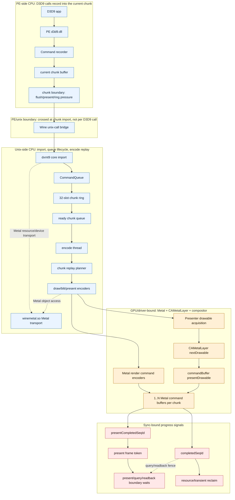

### Current Sequence

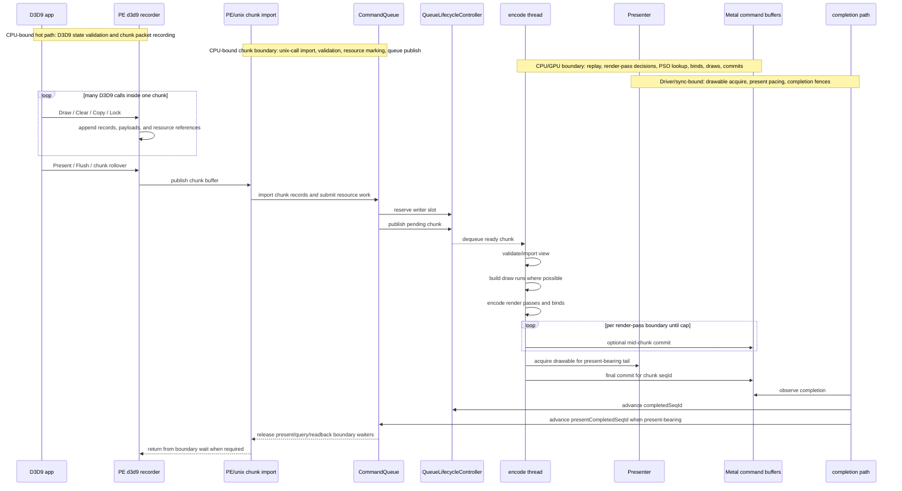

### Current Chunk State

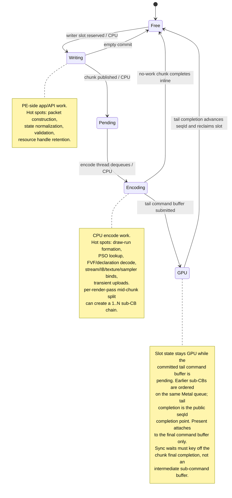

### Current Buffering Strategy

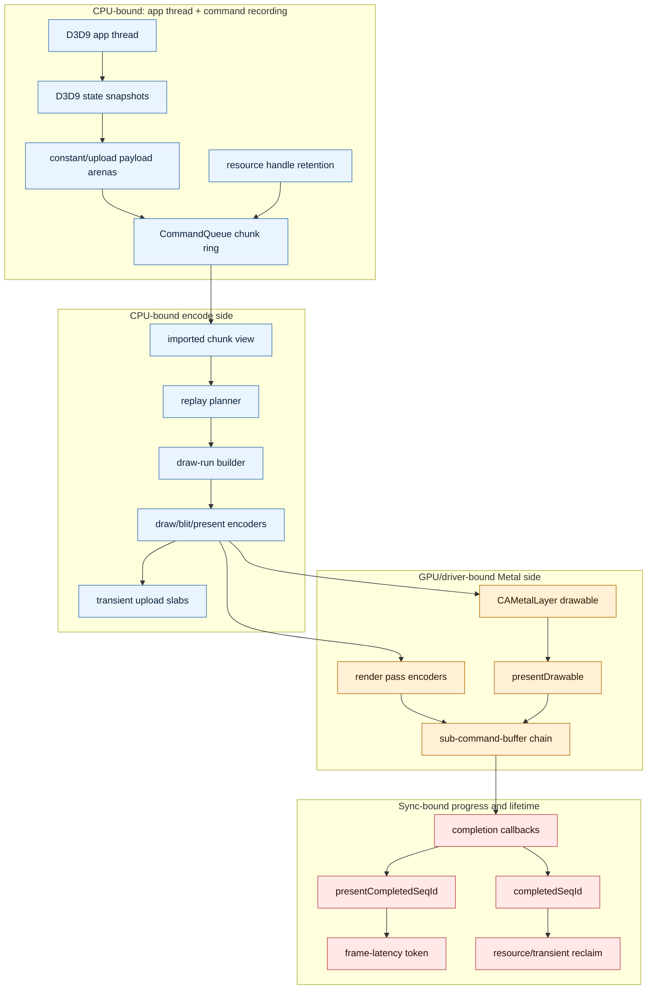

## General Bottleneck Map

```mermaid
flowchart TD
  Start[dxmt9 frame or chunk] --> CPUFront[CPU front-end]
  Start --> Encode[encode thread]
  Start --> GPU[Metal/GPU]
  Start --> Sync[sync and pacing]

  CPUFront --> BridgeCost[PE/unix bridge call boundary]
  CPUFront --> CommitReplay[commit_chunk import/replay/submit]
  CPUFront --> RecordCost[packet construction and resource retention]
  CPUFront --> LockCost[buffer lock/map/shadow copy]

  Encode --> RunCost[draw-run formation failures]
  Encode --> StateCost[per-draw state rebuild]
  Encode --> UploadCost[transient upload pressure]
  Encode --> BindCost[stream/IB/texture/sampler bind churn]
  Encode --> PSOCost[PSO lookup and cold compile]

  GPU --> PassCost[render-pass split and tile preservation]
  GPU --> ShaderCost[shader/register/texture cost]
  GPU --> ResidencyCost[heap/resource residency]

  Sync --> PresentCost[drawable and present pacing]
  Sync --> CompletionCost[command-buffer completion wait]
  Sync --> QueryCost[query/readback/hazard flush waits]
  Sync --> RingCost[chunk ring pressure]

  RunCost --> RootA[Candidate A: record shape prevents batching]
  UploadCost --> RootB[Candidate B: payload frequency too high]
  PassCost --> RootC[Candidate C: pass split policy too eager]
  PresentCost --> RootD[Candidate D: present boundary hides real bottleneck]
  LockCost --> RootE[Candidate E: 32-bit pointer compatibility copy path]

  classDef hot fill:#ffe8e8,stroke:#b64242,color:#2b0d0d
  classDef cpu fill:#eaf4ff,stroke:#2f6fad,color:#0b2239
  classDef gpu fill:#fff0d6,stroke:#b26b00,color:#2b1900
  classDef sync fill:#f3e8ff,stroke:#6b42b6,color:#1d0d2b
  class RootA,RootB,RootC,RootD,RootE hot
  class CPUFront,BridgeCost,CommitReplay,RecordCost,LockCost,Encode,RunCost,StateCost,UploadCost,BindCost,PSOCost cpu
  class GPU,PassCost,ShaderCost,ResidencyCost gpu
  class Sync,PresentCost,CompletionCost,QueryCost,RingCost sync
```

## Primary Bottleneck Classes

| Class | Symptom counters | Typical root cause | Preferred fix direction |
|---|---|---|---|
| Commit chunk replay | `bridge_commit_latency_ns`, `commit_chunk_import_cpu_ms`, `commit_chunk_handle_cpu_ms`, `commit_chunk_replay_cpu_ms`, `commit_chunk_queue_draw_submission_cpu_ms`, `commit_chunk_draw_batch_submit_cpu_ms`, draw-run child timers, `submit_draw_run_*_cpu_ms`, `submit_draw_run_batch_*_cpu_ms` | The synchronous `commit_chunk` call is spending time in unix-side record replay, draw-run scanning, snapshot/draw submission construction, queued submission flushing, or queue slot append/resource-mark/chunk-commit work. A large historical `bridge_commit_latency_ns` value is not necessarily raw PE/unix bridge overhead. | Split replay and submit children first; optimize snapshot/draw submission, record dispatch, draw-run scan, constant-upload pass-through, submission batch construction, resource marking, and chunk append/publish cost before changing the ABI. |
| Snapshot cache invalidation | `d3d9_snapshot_cache_lookup_cpu_ms`, `d3d9_snapshot_cache_miss_cpu_ms`, `d3d9_snapshot_cache_uniform_refresh_cpu_ms`, `d3d9_snapshot_uniform_build_calls`, `draw_uniform_payload_appends`, `draw_packet_declared_nonbinding`, `draw_packet_actual_nonbinding`, `draw_packet_redundant_nonbinding`, `draw_packet_redundant_uniform` | D3D9 snapshot submission rebuilds shader layout, hot state, or uniform payload too often. Current GT1 proof rejects broad same-value non-binding deltas (`redundant_nonbinding=0`), and the accepted cache-hit uniform refresh fast path proves a large part is real component payload construction/hash rather than redundant invalidation. | Keep cache-hit shader-constant refresh on the fast path. Remaining work is miss hot-build, VS indexed constant fallback, and stronger proof before revisiting invalidation policy. |
| Per-draw CPU encode | `encode_draw_cpu_ms`, `bind_*`, `pipeline_lookup`, `fvf_decode` | Draws are replayed one by one even when state is stable. | Improve draw-run formation, cache decoded state, skip redundant binds. |
| Payload/upload pressure | `transient_upload_calls`, `transient_upload_bytes`, `uniform_*`, payload arena counters | Stable constants or state are uploaded at draw frequency. | Split stable/volatile payloads, coalesce slab reservations, skip duplicate payload copies. |
| Render-pass churn | `render_pass_begin`, split reason counters, tile preservation bytes, store/load action counters | RT/depth/clear/hazard decisions force too many pass boundaries. | Exact hazard tracking, better clear/load/store proof, coalesce same RT/depth passes when legal. |
| Present pacing | `present_acquire_wait_ms`, `present_boundary_wait_ms`, `completion_present_wait_ms` | Drawable availability or frame-latency token dominates wall time. | Keep pacing counters separate; tune latency only after encode/GPU attribution is clear. |
| Command-buffer grain | `command_buffers`, `sub_command_buffers`, `chunk_subcb_count_max`, `gpu_command_buffer_time_ms` | 1 CB can serialize GPU behind encode; too many CBs add tile/commit cost. | Current default: per-render-pass split with cap=4; validate by workload. |
| Lock/map compatibility | `map_buffer_total_ms`, `map_buffer_wait_ms`, `d3d9_buffer_lock_*` | 32-bit app needs low4GB CPU-visible pointer; native storage may not be 32-bit safe. | Reuse low4GB CPU shadows; free on resource destroy, not every lock. |
| Cold PSO/archive miss | `pipeline_build_*`, `cold_compile_count_after_warm`, archive counters | Shader/state variants are not prewarmed or are over-specialized. | Better archive prewarm, reduce PSO key churn, specialize only when win is proven. |

## Current 3DMark05 GT1 Calibration

The 3DMark05 GT1 investigation is the current high-signal calibration case for
this general model. The root map is [[overview-3dmark05-gt1]]. Its latest gate
state separates GPU frame-time, CPU encode cost, and wallclock present pacing:

| General class | 3DMark05 GT1 status | Decision |
|---|---|---|
| GPU hidden backend storage | Dominant GPU frame limiter. Xcode VS-buffer write tracks VS invocations, not dxmt CPU writers, visible `VSOut`, or fragment volume. | Reduce VS invocations when semantics allow; do not chase visible varying width as the first-order owner. [[hidden-backend-storage]] |
| Opaque-depth index locality | Accepted production-shaped GPU win: historical target `50/0+50/1` GPU `-18.39%`, VS invocations `-14.12%`, VS write `-16.79%`; refreshed frame60 target `60/0+60/1` GPU `-10.64%`, VS invocations `-14.12%`, VS write `-16.77%`. | Keep as opt-in locality path. The current opaque proof reattaches the movement to refreshed rows, but this is still not a shared `perf` default until index-setup CPU cost is lower or a broader runtime gate proves net positive. [[index-cache-locality-opaque.08]], [[index-cache-locality-proofinput.01]], [[index-cache-locality]] |
| Screen-blend index locality | Strong measured movement, but destination-dependent; current gate is missing movement/semantic image inputs. | Keep as historical exact/`lsb1` proof artifact until the proof is reattached or regenerated; do not generalize to broad depth-read reorder. [[index-cache-locality-screenblend.05]], [[index-cache-locality-proofinput.01]], [[index-cache-locality-screenblend.04]] |
| Broad depth-read reorder | Blocked by final-color correctness. | Needs a real final-color/final-writer oracle before another Xcode budget; the current D3D9 occlusion path is primitive-count only. [[mini-replay-bisection-semantic.01]], [[mini-replay-bisection-texture.08]] |
| Non-reorder backend-shape | Current candidates rejected or unproven. | Half-VSOut and scoped `live-vsout` stayed flat in Xcode; the refreshed gate closes stale shader-output smokes. Future candidates need a new below-visible backend mechanism or bytes/inv preflight. [[hidden-backend-storage-shape.13]] |
| Present pacing | Wallclock limiter, separate from GPU frame limiter. | Historical `DXMT9_DISABLE_VSYNC=1` remains an opt-in for sync-paced workloads, but current GT1 direct is already immediate; use `present_schedule_*` counters before treating vsync-off as a lever. [[present-pacing]] |
| Per-draw CPU encode | Orthogonal to GPU limiter, still important for wallclock. Commit_chunk stage counters now show large historical bridge latency can be replay-owned rather than ABI-owned. | Focus on draw-run break reduction, commit_chunk replay internals, snapshot rebuild, and measured bind/state churn rather than assuming bind-cache hit rates or raw bridge overhead. [[state-churn-encode]] |

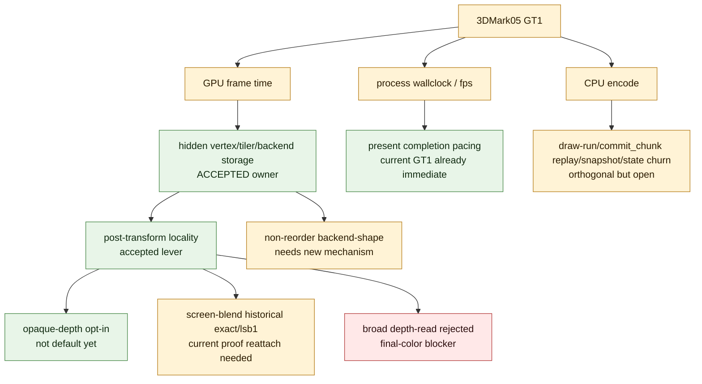

## Ideal Design

The ideal dxmt9 design is not "minimum command buffers" or "maximum batching"
in isolation. It is a bounded pipeline where each boundary carries enough work
to amortize overhead but still exposes enough progress for the GPU and
presenter to run ahead.

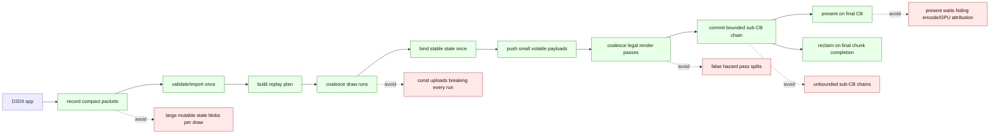

### Design Principles

- Keep chunk `seqId` as the lifetime and synchronization unit.
- Allow a chunk to emit 1..N Metal command buffers, but complete/reclaim only
  on the final command buffer.
- Attach present metadata to the final command buffer only.
- Keep mid-chunk split decisions deterministic and record-driven.
- Prefer exact hazard and dependency proofs over probabilistic or broad flushes.
- Move stable data out of the per-draw hot path; keep per-draw payloads small.
- Treat present pacing as a separate axis from encode cost and GPU execution.
- Use env knobs for A/B experiments, but keep production defaults conservative
  and backed by counters.

## Solution Trade-Offs

| Direction | Pros | Cons / risks | Validation needed |
|---|---|---|---|
| Draw-run coalescing across benign records | Reduces per-draw encode, bind, and lookup overhead. | Incorrect if constants/state/resources change visibility between draws. | Record-sequence audit, state/payload hash stability, image tests. |
| Stable/volatile payload split | Shrinks upload bytes and CPU writes. | Requires shader layout support and PSO compatibility discipline. | Shader source tests, layout ABI tests, perf counters for byte reduction. |
| Redundant bind suppression | Low-risk CPU win when encoder state is stable. | Encoder-side cache can become stale after pass/PSO/resource transitions. | Recorder tests for command order, Metal validation, per-bind counters. |
| Per-render-pass sub-CB chain cap | Lets GPU start before chunk tail is fully encoded. | Extra command buffers can increase tile store/load and commit overhead. | `sub_command_buffers`, `chunk_subcb_count_max`, GPU time, tile counters. |
| Render-pass coalescing | Reduces tile preservation and pass setup. | Hard correctness boundary around clears, resolves, hazards, and depth reuse. | Split-reason counters, exact hazard tests, pixel/golden validation. |
| Aggressive store-action proof | Saves tile stores when attachments are dead. | Wrong proof causes missing depth/color data in later passes. | Store/load counters, targeted depth/RT reuse tests, frame capture. |
| Low4GB shadow reuse | Avoids repeated VM allocation for 32-bit locks. | Shadow capacity and dirty/readback rules must stay correct. | Lock/unlock tests, map wait counters, app compatibility runs. |
| Archive/prewarm expansion | Reduces runtime PSO compile stalls. | Archive growth and stale variants can mask key explosion. | Cold/warm run comparison, archive hit rate, compile count after warm. |

## Current Default Policy

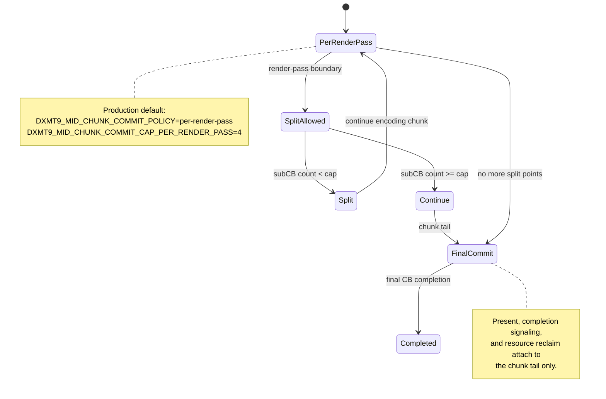

This default is a compromise:

- Better than `off` when long encode tails would otherwise delay GPU start.
- Safer than unbounded per-pass splitting because the cap bounds tile
  preservation and command-buffer commit overhead.
- Still workload-dependent. Heavy render targets, MSAA, many attachments, or
  high store/load pressure can erase the pipelining win.

## Experiment And Validation Areas

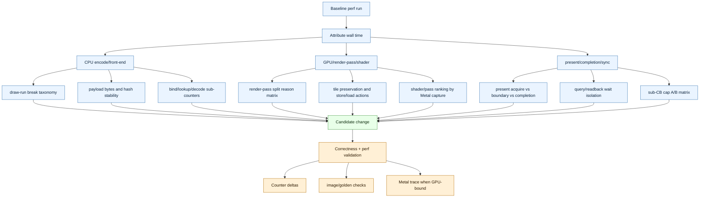

### Measurement Coverage Checklist

Before changing a performance policy, the relevant path should be measurable
with counters that distinguish work from waits:

- Render-pass begin/end and split reason counters distinguish normal pass reuse
  from forced splits.
- Pipeline cache hit/miss/build counters expose state churn and shader variant
  pressure.
- Draw call, indexed draw, primitive, and vertex counters quantify replay
  volume.
- Bind churn counters track vertex buffers, index buffers, textures, samplers,
  depth state, viewport, scissor, rasterizer, and pipeline binds.
- Upload counters track transient call count, bytes, CPU time, and uniform
  frequency classes.
- Hazard counters distinguish exact overlap from legacy broad/probabilistic
  overlap decisions.
- Present source counters identify selected source validity, source size,
  destination size, handle, texture, format, and sample count.
- Completion buckets separate draw, present, compatibility, shader bucket,
  completion-watcher dequeue age/status, and command-buffer execution time
  where available.
- Frame/present pacing counters separate drawable acquire, present boundary,
  frame-token wait, query/readback wait, and chunk ring pressure.

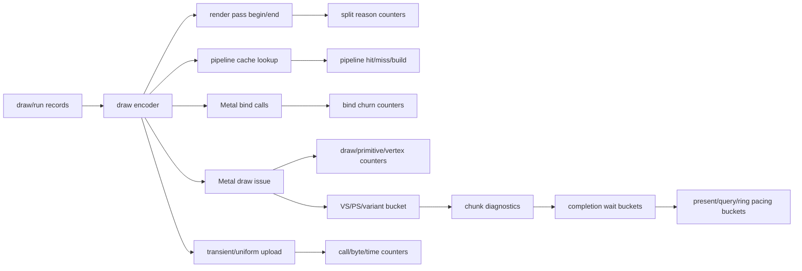

### Present Path Ownership

The target present path is not "remove frame latency". It is to avoid using
encode-thread progress as the pacing primitive and to keep ownership clear.

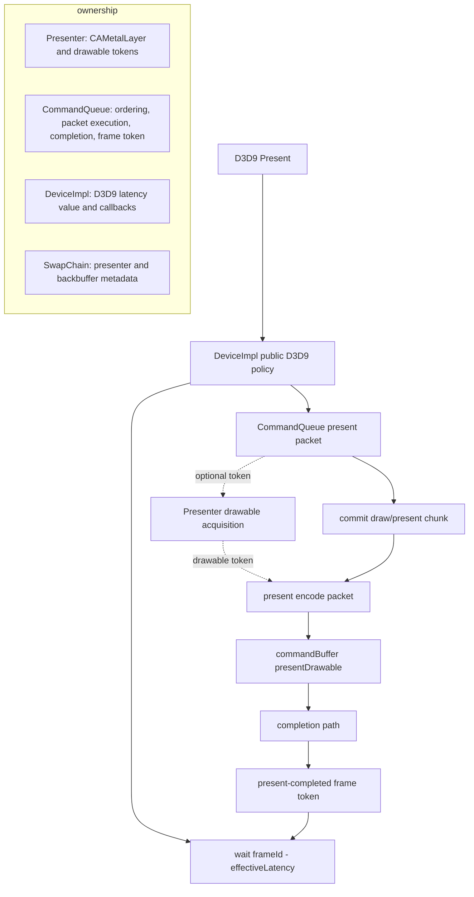

Ownership rules:

- `Presenter` owns CAMetalLayer properties, drawable acquisition state, and
  any future drawable-token mechanism.
- `CommandQueue` owns chunk ordering, present packet execution, completion
  signaling, frame-latency token advancement, and present-boundary waits.
- `DeviceImpl` supplies public D3D9 latency values and presentation callbacks;
  it should not own acquire or boundary mechanics.
- `SwapChain` owns the `Presenter` and passes per-present source/backbuffer
  metadata.

### Reference Backend Shapes

DXVK and Wine are useful references for ownership boundaries, not direct
templates to copy.

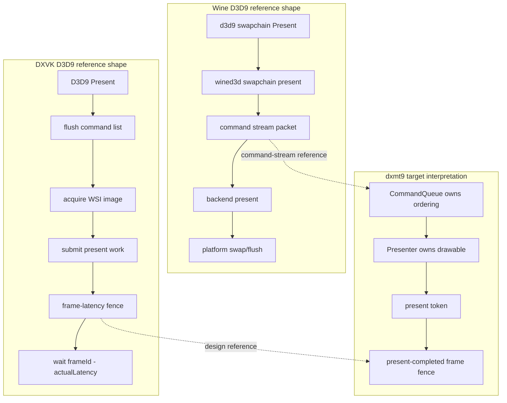

Lessons to preserve:

- Frame-latency waits should be explicit fence/token rules, not accidental
  waits on encode-thread progress.
- Present acquisition, present packet execution, and latency waiting are
  separate concerns.
- The app-facing D3D9 layer should not synchronously wait for all GPU work on
  every immediate present unless the API contract requires it.

### Negative Findings To Preserve

These prior findings should stay visible because they prevent repeating
attractive but weak fixes:

- Direct indexed draws are the production path. Expanding indexed draws into a
  transient non-indexed stream is a diagnostic/compatibility lane, not a default
  performance fix.
- Broad hazard filters are useful as diagnostics, but render-pass split
  decisions should be exact-handle driven where possible; false positives create
  avoidable encoder churn.
- Chunk splitting is a tail-latency and GPU-overlap tool, not a universal
  throughput fix. Smaller chunks can reduce sequence tails while increasing
  completion, ring, and command-buffer overhead.
- Present async/preacquire paths should remain opt-in until draw, pass, hazard,
  and present-source counters show that present pacing is the actual limiter.
- Hoisting or caching uniform construction is not automatically a win if the
  remaining hot cost is writing large shared-memory payloads or adding
  indirection to a hot loop.
- Process-level FPS is useful for end-to-end comparison, but it includes startup,
  window creation, device/resource creation, teardown, and final flush. It must
  not be used alone for renderer attribution.

### Required Measurement Discipline

- Report throughput and wall time, but do not use process-level FPS alone for
  attribution.
- Separate CPU encode time, GPU command-buffer time, present/drawable wait,
  completion wait, and query/readback waits.
- Compare medians and p95/p99 where possible; single runs are useful for
  direction but not for default-policy decisions.
- Keep A/B knobs scoped and explicit:
  - `DXMT9_MID_CHUNK_COMMIT_POLICY`
  - `DXMT9_MID_CHUNK_COMMIT_CAP_PER_RENDER_PASS`
  - draw-run or payload experimental toggles
  - present/frame-latency toggles
- Treat Metal frame captures as the decisive tool when counters show GPU time
  but cannot attribute it to pass, shader, texture, or tile behavior.

## Recommended Investigation Order

1. Attribute wall time into CPU encode, GPU execution, and sync/present waits.
2. If CPU encode dominates, inspect draw-run breaks, payload upload frequency,
   bind churn, FVF/declaration decode, and PSO lookup.
3. If GPU execution dominates, rank render passes, tile preservation, store/load
   actions, shader families, texture sampling, and overdraw.
4. If sync dominates, split present acquire, present boundary, completion
   dequeue age/status, query/readback, and ring pressure before changing
   latency policy.
5. Only after attribution is stable, choose a design change and validate with
   counters plus image/golden correctness checks.

## Open Areas

- Draw-run planner support for benign interleaved records such as stable
  constant uploads.
- Payload-liveness model that proves when a constant/upload record can be
  hoisted, merged, or skipped.
- Render-pass coalescing proof for same RT/depth sequences with clears and
  depth reuse.
- Better pass/shader GPU attribution from Xcode `.gputrace` captures and GPU
  counters.
- Workload-specific sub-CB cap validation across render-target sizes, MSAA,
  attachment counts, and present rates.
- Cold/warm PSO archive quality, including variant explosion from shader
  liveness and compatibility flags.
