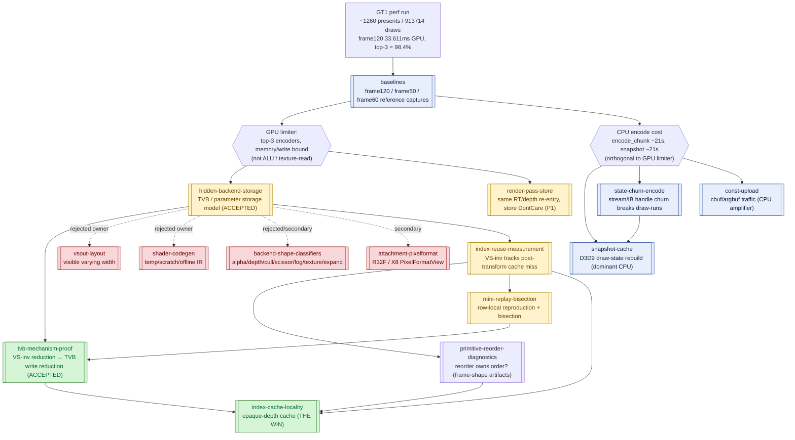
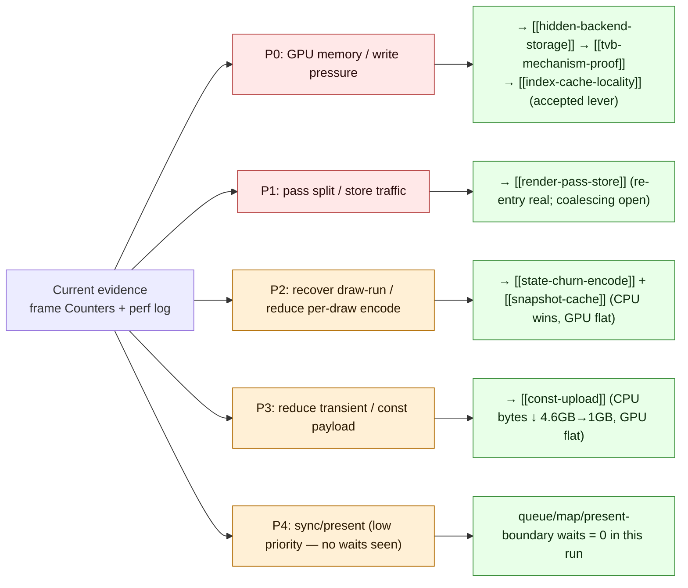

# 3DMark05 GT1 Performance — Investigation Map

> Root node of the `docs/perfomance/` knowledge graph. This is the
> decomposition of `specs/perfomance.plan.md` (a 23k-line append-only
> research journal) into a cross-referenced set of domain overviews and
> one-experiment-per-file leaf nodes.

## The root question

**Why is 3DMark05 GT1 GPU-bound under dxmt9 (a D3D9→Metal translation
layer on Apple Silicon), and what owns the cost?**

Target: `app-d3d9-3dmark05`, GT1 path under `DXMT_EXPERIMENT_PROFILE=perf`.

## Central finding (read this first)

The top-3 render encoders dominate every captured frame (~98% of GPU
time) and write a large **"VS Buffer Device Memory Bytes Written"**
bucket (~1.6 GiB at frame60, ~1.0–2.2 GiB depending on capture). That
bucket is **not** explained by:

- dxmt CPU-side writers (argbuf/transient/cbuf ≈ 0.4 MiB), nor
- visible MSL `VSOut` width (184 B), nor
- AIR-visible shader scratch (128 B).

It is **hidden Apple GPU vertex-stage / tiler / parameter-buffer (TVB)
backend storage** that scales with **VS invocation count × per-vertex
VSOut bytes**. See [[hidden-backend-storage]] for the model and
[[tvb-mechanism-proof]] for the accepted proof.

**The one accepted production win** is opaque-depth **index-cache
locality** ([[index-cache-locality]]): reordering indices for opaque
depth-writing triangles improves the post-transform vertex cache, which
lowers VS invocations, which linearly lowers TVB write — verified
target-row GPU −18.4%, VS invocations −14.1%, VS write −16.8%.

Almost every other hypothesis (visible varying width, shader temps,
render/raster state toggles, primitive reorder, const-upload size,
pixel-format views) was **rejected as "not the first-order owner."**
Several CPU-side reductions are real but orthogonal to the GPU limiter.

## Domain map

## Priority DAG (from the journal)

The journal organized remaining work into priority levels. P0/P1 are the
active GPU targets; P2–P4 are CPU/sync tracks deferred until counters move.

## Frame shape

Frame120 (historical bottleneck-shape capture, [[baselines-frame120.01]]):
total **33.611 ms** GPU, top-3 encoders **33.075 ms / 98.4%**; the same
RT/depth pair returns after another pass and accounts for **24.643 ms /
73.3%**. Passes are LLC/MMU/buffer-write limited, **not** ALU- or
texture-read-bound. Run-level: ~14673 passes preserve **167.73 GB** of
tile contents; draw-run submits = **580** against 913714 draws (≈99.94%
fail to batch), broken by const-upload (659938) and stream/IB state
deltas (793059 / 750041).

The current canonical A/B baseline is frame50 normal-source
([[baselines-frame50.01]]): **35.024 ms**, top-3 98.19%, rows 50/2
(56.9%) / 50/1 (24.5%) / 50/0 (16.8%), hidden backend estimate
≈1597.6 MiB. Mid-investigation probes A/B against frame60
([[baselines-frame60.01]]).

## What is settled vs open

**Accepted**
- The GPU limiter is hidden vertex/tiler/parameter (TVB) backend storage,
  scaling with VS invocations × per-vertex VSOut bytes. [[hidden-backend-storage]], [[tvb-mechanism-proof]]
- Opaque-depth index-cache locality is a real, semantic-safe GPU win. [[index-cache-locality]]
- Several CPU reductions are real (dirty-range reset + FFP-VS slice reuse
  cut cbuf traffic 4.6 GB→~1 GB; binding-override cut encode CPU 10–30%) —
  but every one left GPU frame time flat. [[const-upload]], [[state-churn-encode]], [[snapshot-cache]]

**Rejected as first-order GPU owner**
- Visible `VSOut`/varying width, point-size, half-precision varyings. [[vsout-layout]]
- Translated-shader temp/scratch sizing; owner is below AIR. [[shader-codegen]]
- Render/raster state toggles (depth-write, depth-func, cull, scissor) and
  alpha-test; cull moves only the small named-tiled counters (~30 MiB). [[backend-shape-classifiers]]
- Primitive/triangle reorder as a *stable* lever — apparent wins were
  frame-shape/tile-coverage artifacts that did not reproduce on HEAD. [[primitive-reorder-diagnostics]]
- Const-upload payload size, R32F/X8 PixelFormatView suppression. [[const-upload]], [[attachment-pixelformat]]

**Open**
- Which sub-component of the hidden backend dominates (stage-out vs binning
  parameter storage vs compiler spill). [[hidden-backend-storage]]
- Row 50/2 (screen-blend) owner: blocked on a final-color/semantic oracle;
  the screen-blend cache is profiling-only. [[index-cache-locality]]
- Dependency-aware pass coalescing for same RT/depth re-entry (P1). [[render-pass-store]]
- Remaining CPU tracks: snapshot rebuild + pacing/completion waits. [[snapshot-cache]]

## Domain index

| Domain | Role | Headline verdict |
|--------|------|------------------|
| [[baselines]] | frame120 / frame50 / frame60 reference captures | shape stable across regimes |
| [[hidden-backend-storage]] | TVB/parameter storage model, VS-write density, scaling | model ACCEPTED; dominant sub-component OPEN |
| [[tvb-mechanism-proof]] | VS-inv ↓ → TVB write ↓, row-local + full-frame | ACCEPTED (load-bearing) |
| [[index-cache-locality]] | opaque-depth cache, screen-blend, min-gain, CPU cost | opaque-depth WIN; screen-blend profiling-only |
| [[index-reuse-measurement]] | index reuse, geometry signature/size, state-class | VS-inv tracks cache-miss estimate |
| [[primitive-reorder-diagnostics]] | reverse/min-index/split reorder probes | order = frame-shape artifact, not stable owner |
| [[mini-replay-bisection]] | row-local replay + encoder bisection | reproduced amplification; enabled the proof |
| [[vsout-layout]] | visible varying width attempts | all REJECTED as owner |
| [[shader-codegen]] | temp/scratch trim, offline Metal IR | REJECTED; owner below AIR |
| [[backend-shape-classifiers]] | alpha/depth/cull/scissor/fog/texture/expand | REJECTED/secondary; indexed path mandatory |
| [[attachment-pixelformat]] | R32F / X8 PixelFormatView suppression | secondary (texture-write), not VS owner |
| [[const-upload]] | cbuf/argbuf class/volatility/dirty-range/sparse | CPU amplifier, GPU unmoved |
| [[state-churn-encode]] | stream/IB churn, draw-run, binding override | CPU wins, GPU flat |
| [[snapshot-cache]] | D3D9 draw-state snapshot rebuild | dominant CPU cost; partly recovered |
| [[render-pass-store]] | RT/depth re-entry, store DontCare, pass-chain | re-entry real; coalescing OPEN |

Related CPU-side counter design doc: [[perfomance-bottleneck]].

## How to read this graph

- **Domain overview** = `<domain>.md` (e.g. `index-cache-locality.md`). Each
  has a scope, a hypotheses/verdicts table, a mermaid dependency graph, and a
  synthesis.
- **Leaf node** = `<domain>-<subcategory>.<NN>.md`, one experiment per file,
  numbered by execution order within its subcategory. Frontmatter carries
  `status` (accepted/rejected/inconclusive/model/tooling) and the
  `source:` line range back into `specs/perfomance.plan.md`.
- Links use `[[slug]]` (filename without `.md`). Follow them like a wiki.
