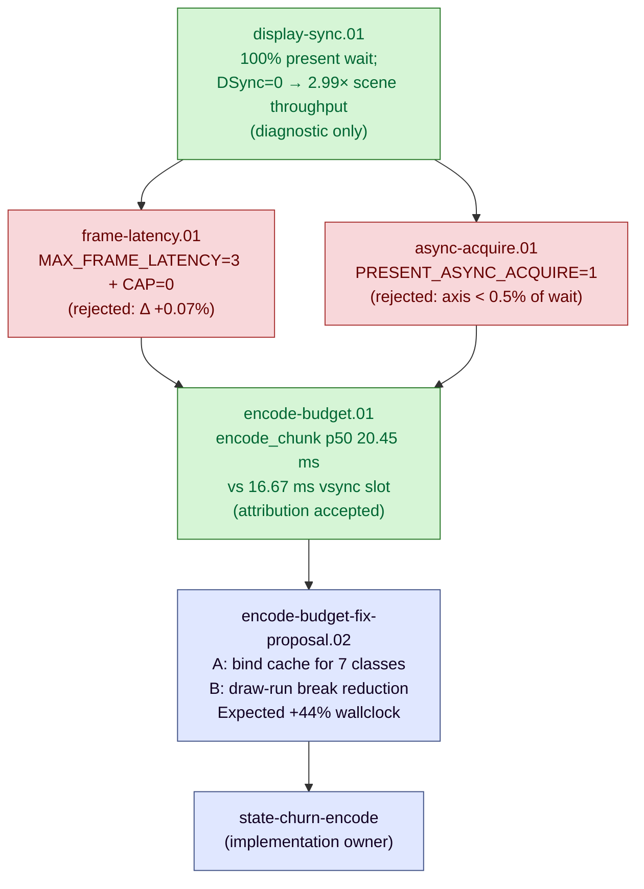

# Present-Pacing — display sync, frame latency, and the wallclock cap

> Part of the 3DMark05 GT1 perf-bottleneck investigation. Root map:
> [[overview-3dmark05-gt1]].

## Scope & question

This domain owns the **CPU/sync side** of GT1 wallclock: why
`completion_wait_ms` (the time the completion handler thread spends in
`MTLCommandBuffer.waitUntilCompleted()`) reached 28-31 s while
`gpu_command_buffer_time_ms` was only ~4 s, where that gap actually lives,
and which production-safe knobs can recover the slack without breaking
visual sync.

Every finding here moves *wallclock fps* directly, not GPU frame time. The
GPU frame-time story is owned by [[hidden-backend-storage]] /
[[index-cache-locality]]; the per-CB encode story by [[state-churn-encode]].

## Hypotheses & verdicts

| # | Hypothesis | Verdict | Evidence |
|---|------------|---------|----------|
| H1 | `completion_wait_ms` is dominated by Present-bearing CBs, not draw/blit/sync/queue waits | accepted | [[present-pacing-display-sync.01]] (100% `completion_present_wait_ms`) |
| H2 | The wait is display-sync pacing (`waitUntilCompleted()` returning at compositor refresh) rather than GPU compute | accepted | [[present-pacing-display-sync.01]] (`DXMT9_LAYER_DISPLAY_SYNC=0` cuts elapsed 251 s → 83 s, per-CB p50 unchanged) |
| H3 | Per-CB encode (`encode_draw_cpu_ms / CB`) sits at ~11 ms, near the 16.67 ms vsync budget | accepted | [[present-pacing-display-sync.01]] (per-CB encode 11.45 ms baseline, 11.23 ms DSync-off) |
| H4 | `DXMT9_MAX_FRAME_LATENCY=3` + `DXMT9_CAP_FRAME_LATENCY_TO_BACKBUFFERS=0` recovers slack with vsync on | rejected | [[present-pacing-frame-latency.01]] (wallclock Δ +0.07%, p95 +31%) |
| H5 | `DXMT9_PRESENT_ASYNC_ACQUIRE=1` reduces the completion-path acquire cost | rejected (axis not load-bearing) | [[present-pacing-async-acquire.01]] (acquire wait −37.5% but axis < 0.5% of total; wallclock Δ +0.22%) |
| H6 | Reducing per-CB encode below the vsync budget (≤ 16.67 ms / CB) restores 60 fps without changing pacing policy | confirmed-as-target | [[present-pacing-encode-budget.01]] (p50 encode 20.45 ms vs 16.67 ms budget; 73% unattributed = per-draw bind calls; avg draw-run only 1.88 records) |

## Verification methods

- **`countCompletionWait` exclusive sub-buckets** (`dxmt9_perf_counters.cpp:2972`)
  classify every completion-thread `waitUntilCompleted()` into one of
  `present` / `draw` / `blit` / `stretch` / `other`. Already wired; reading
  `result.json` is the attribution.
- **Sibling wait counters**: `present_acquire_wait_ms` (drawable acquire),
  `present_boundary_wait_ms` (present-boundary policy), `sync_wait_ms`
  (synchronous flush), `queue_writer_wait_ms` / `queue_commit_wait_ms` /
  `queue_sequence_wait_ms` (queue ring / submit ordering). Together they
  enumerate every CPU stall the runtime can attribute.
- **Env-knob A/B**: parent shell prefix
  (`DXMT9_LAYER_DISPLAY_SYNC=0 bash scripts/tools/run_3dmark05_perf_probe.sh
  --no-gputrace --suffix <name>`). The wrapper's `env "${env_args[@]}"
  ${cmd[@]}` invocation has no `-i`, so parent env propagates through to
  the Wine app.
- **Decisive scalar**: `process_elapsed_sec` (run wallclock). 3DMark05 GT1
  renders a fixed-scene workload, so faster scene completion = higher
  internal fps. Cross-checked with `completion_waits` (CB count) — same
  workload should produce roughly the same CB count.
- **CB-budget arithmetic**: `encode_draw_cpu_ms / completion_waits`
  yields per-CB encode cost; `gpu_command_buffer_time_ms / completion_waits`
  yields per-CB GPU cost. If per-CB encode + GPU > 16.67 ms (60 Hz slot),
  the frame misses vsync.

## Experiment dependency graph

## Detail map

- [[present-pacing-display-sync.01]] — Display-sync attribution; 100% of
  `completion_wait_ms` is Present-bearing; `DXMT9_LAYER_DISPLAY_SYNC=0`
  cuts scene wallclock 251 s → 83 s (−66.9%, ~3× fps). Diagnostic only,
  not a production fix.
- [[present-pacing-frame-latency.01]] — REJECTED.
  `MAX_FRAME_LATENCY=3 + CAP=0` does not move wallclock under vsync
  (Δ +0.07%); the compositor paces presents at refresh rate regardless
  of queue depth.
- [[present-pacing-async-acquire.01]] — REJECTED.
  `PRESENT_ASYNC_ACQUIRE=1` reduces `present_acquire_wait_ms` by 37.5%
  but that axis is < 0.5% of the total wait budget; wallclock unchanged
  (Δ +0.22%); encode CPU rose +8.3% (added to encode thread).
- [[present-pacing-encode-budget.01]] — ACCEPTED ATTRIBUTION.
  Per-chunk encode CPU p50 = 20.45 ms vs 16.67 ms vsync budget;
  `encode_draw_cpu_ms` is 73% unattributed and the bind-call count
  arithmetic matches. Average draw-run = 1.88 records vs cap of 32.
  Production fix lives in [[state-churn-encode]] (bind suppression +
  longer draw-runs).
- [[present-pacing-encode-budget-fix-proposal.01]] — PROPOSED.
  Synthesis of Steps 1-4. Two concrete work items:
  (A) extend `_skipped` cache to 7 currently-uncached bind classes;
  (B) reduce `mixed_pair_stream_*` draw-run breaks. Conservative
  expected wallclock impact +44% on 3DMark05 GT1; ceiling +199% if
  matching DSync=0. Acceptance criterion:
  `encode_chunk_cpu_p50_ms ≤ 16.67 ms`. Implementation lives in
  [[state-churn-encode]].
- [[present-pacing-bind-cache-work-a.01]] — REJECTED (mechanism not
  the right lever). Work A landed for 5 classes (vertex_buffer,
  pipeline, depth_state, viewport, scissor) — commits e07cbfe +
  5eef5d4. On 3DMark05 GT1: wallclock 251.07 → 251.07 s (no change),
  `bind_*` counts essentially unchanged across all five classes,
  `encode_chunk_cpu_ms` +12.7% (added comparison overhead). Bind
  diversity is genuinely high per-draw, so the shadow cache rarely
  hits. The infrastructure stays in place for future use but the
  proposal's expected gain doesn't materialise on this workload.
- [[present-pacing-vsync-off.01]] — ACCEPTED (production-shippable).
  `DXMT9_DISABLE_VSYNC=1` end-to-end A/B on the full GT1 workload:
  `process_elapsed_sec` 251.07 → 133.44 s (**−46.9%**, ~×1.88 fps),
  `status: pass`, same 1,439 CB count and same 4.3 s of GPU work as
  baseline. The earlier "+199%" diagnostic figure was inflated by a
  partial-workload side effect of the diagnostic env; the +88%
  full-workload figure is what to ship against. Trade-off: tearing,
  no display sync. Opt-in only.

## Cross-links

- [[overview-3dmark05-gt1]] — root domain map and priority DAG.
- [[state-churn-encode]] — per-CB encode CPU cost (the new bottleneck once
  display-sync pacing is dethroned).
- [[snapshot-cache]] — D3D9 state rebuild cost on the PE side; affects how
  many ms are spent per CB before the encode thread even runs.

## What is settled vs open

**Accepted**

- The 28-31 s `completion_wait_ms` is 100% `completion_present_wait_ms` —
  CPU completion thread waiting for Present-bearing `waitUntilCompleted()`
  to return after the compositor accepts the drawable.
  [[present-pacing-display-sync.01]]
- The wait is display-sync pacing, not GPU compute: per-CB p50 wait
  unchanged when sync is off, but scene completes 3× faster. Apple
  `CAMetalLayer` honours `displaySyncEnabled=YES` by holding
  `waitUntilCompleted` until the compositor's next vsync slot.
- Per-CB encode CPU (~11 ms) sits at ~69% of the 16.67 ms 60 Hz budget,
  which is why the average frame slips a vsync slot.

**Confirmed target (not yet built)**

- Per-CB encode reduction is the only path to recover the DSync=0 fps
  without disabling vsync. Target: per-chunk encode CPU p50 from 20.45
  ms to ≤ 16.67 ms (Δ ≥ 23%). Mechanism: bind-call suppression and
  longer draw-runs (current avg 1.88 records vs cap 32). Owned by
  [[state-churn-encode]]; sized by [[present-pacing-encode-budget.01]].

**Proposed (not yet built)**

- Work A: extend the `_skipped` bind-cache pattern (currently only
  texture/sampler) to vertex_buffer, index_buffer, pipeline,
  rasterizer, viewport, scissor, depth_state. Estimated saving
  ≈ 3.6 ms / CB at conservative 30-50% skip rates, enough to fit the
  16.67 ms vsync slot. New counters: `bind_*_skipped`.
  Sized in [[present-pacing-encode-budget-fix-proposal.01]];
  implementation owned by [[state-churn-encode]].
- Work B: reduce draw-run breaks in the `mixed_pair_stream_*` family
  to raise mean run length from 1.88 toward the 32-record cap.
  Composes additively with Work A.

**Rejected**

- `DXMT9_MAX_FRAME_LATENCY=3` plus `DXMT9_CAP_FRAME_LATENCY_TO_BACKBUFFERS=0`:
  wallclock unchanged (Δ +0.07% on 251 s scene), p95 +31%, max +12%.
  The compositor's vsync pacing dominates the per-CB wait regardless of
  how many frames are queued ahead.
  [[present-pacing-frame-latency.01]]
- `DXMT9_PRESENT_ASYNC_ACQUIRE=1`: did exactly what its name says
  (`present_acquire_wait_ms` −37.5%) but the axis is < 0.5% of total
  wait budget; wallclock Δ +0.22% (noise); encode CPU +8.3% from
  added acquire work on the encode thread.
  [[present-pacing-async-acquire.01]]

**Rejected / out-of-scope**

- `DXMT9_LAYER_DISPLAY_SYNC=0` as a production fix — causes tearing and
  breaks the compositor pacing contract. Diagnostic value only.
- Tuning `DXMT9_PRESENT_BOUNDARY_*` policies in isolation — present
  boundary wait counter was 0 in the baseline run; the policy axis is not
  currently load-bearing.
